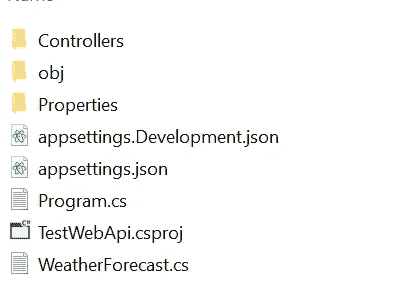
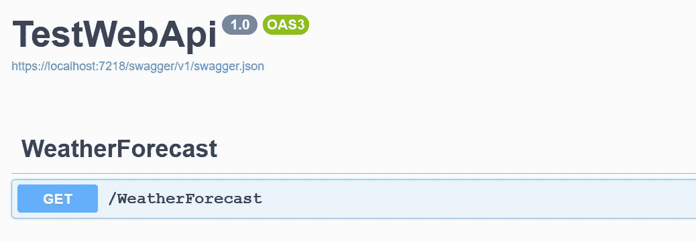
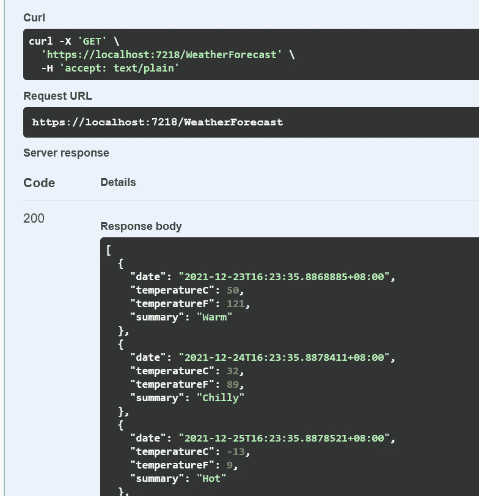
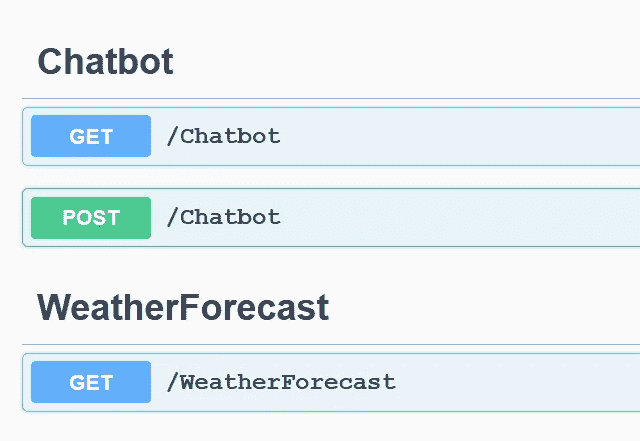
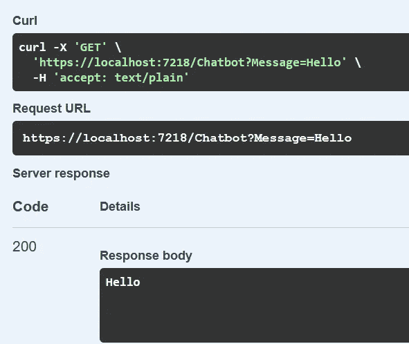
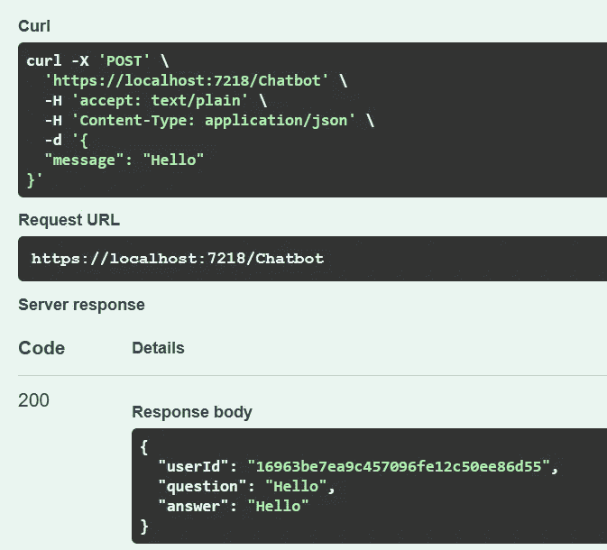

# 用 ASP.NET 核心构建 REST API

> 原文：<https://betterprogramming.pub/building-rest-api-with-asp-net-core-3cd144d222d8>

## 通过模型-视图-控制器获取和发布端点


由[在](https://unsplash.com/@clemhlrdt?utm_source=unsplash&utm_medium=referral&utm_content=creditCopyText) [Unsplash](https://unsplash.com/s/photos/programming?utm_source=unsplash&utm_medium=referral&utm_content=creditCopyText) 上拍摄的克莱门特·赫拉尔多

我已经介绍了很多关于基于 Python 编程语言构建 RESTful APIs 和微服务的教程。在本文中，让我们深入探讨如何使用 C#创建自己的最小 web API。

C#编程语言的一个主要优势是它可以很好地与使用模型-视图-控制器架构的 ASP.NET 核心一起工作。该框架提供了构建快速、安全、跨平台和基于云的应用程序的能力。

确保你有。NET SDK 安装在您的机器上。转至以下链接，根据您的操作系统下载安装程序:

```
[https://dotnet.microsoft.com/en-us/download](https://dotnet.microsoft.com/en-us/download)
```

完成后，在您的终端上运行以下命令，验证您已经成功安装了它:

```
dotnet --version
```

本教程基于以下内容。网络版:

```
6.0.100
```

默认情况下，它与 web API 包一起提供。验证如下:

```
dotnet new --list
```

您应该会在命令提示符下看到以下输出:

```
...
ASP.NET Core Empty                            web                  [C#],F#     Web/Empty
ASP.NET Core gRPC Service                     grpc                 [C#]        Web/gRPC
ASP.NET Core Web API                          webapi               [C#],F#     Web/WebAPI
ASP.NET Core Web App                          webapp,razor         [C#]        Web/MVC/Razor Pages
ASP.NET Core Web App (Model-View-Controller)  mvc                  [C#],F#     Web/MVC
ASP.NET Core with Angular                     angular              [C#]        Web/MVC/SPA
...
```

此外，您可以通过`add package`命令安装额外的依赖项:

```
dotnet add package <package_name>
```

同样，运行以下命令删除现有包:

```
dotnet remove package <package_name>
```

在您的工作目录中运行以下命令:

```
dotnet new webapi -o TestWebApi
```

它将搭建一个名为`TestWebApi`的新 web API 项目:

```
The template "ASP.NET Core Web API" was created successfully.Processing post-creation actions...
Running 'dotnet restore' on C:\Users\user\Documents\TestWebApi\TestWebApi.csproj...
  Determining projects to restore...
  Restored C:\Users\user\Documents\TestWebApi\TestWebApi.csproj (in 387 ms).
Restore succeeded.
```

执行时，将生成以下文件夹和文件:



作者图片

这些是你项目的基本支柱。让我们通过将当前工作目录更改为`TestWebApi`文件夹来测试一下:

```
cd TestWebApi
```

然后，按如下方式运行它:

```
dotnet run
```

您应该会看到以下输出:

```
Building...
info: Microsoft.Hosting.Lifetime[14]
      Now listening on: [https://localhost:7218](https://localhost:7218)
info: Microsoft.Hosting.Lifetime[14]
      Now listening on: [http://localhost:5273](http://localhost:5273)
info: Microsoft.Hosting.Lifetime[0]
      Application started. Press Ctrl+C to shut down.
info: Microsoft.Hosting.Lifetime[0]
      Hosting environment: Development
info: Microsoft.Hosting.Lifetime[0]
      Content root path: C:\Users\user\Documents\TestWebApi\
```

它将在以下目录中构建可执行文件:

```
TestWebApi\bin\Debug\net6.0\
```

转到您的浏览器，运行以下 URL:

```
https://localhost:7218/WeatherForecast
```

接受风险，因为应用程序是在没有签名证书的情况下提供的。您应该获得以下原始数据:

```
[{"date":"2021-12-23T16:04:04.8265229+08:00","temperatureC":11,"temperatureF":51,"summary":"Mild"},{"date":"2021-12-24T16:04:04.8265289+08:00","temperatureC":14,"temperatureF":57,"summary":"Mild"},{"date":"2021-12-25T16:04:04.8265294+08:00","temperatureC":42,"temperatureF":107,"summary":"Balmy"},{"date":"2021-12-26T16:04:04.8265299+08:00","temperatureC":43,"temperatureF":109,"summary":"Warm"},{"date":"2021-12-27T16:04:04.8265302+08:00","temperatureC":21,"temperatureF":69,"summary":"Freezing"}]
```

在您的终端上执行 Ctrl-C 来停止服务，并使用`watch`选项再次运行该命令:

```
dotnet watch run
```

它会自动在您的浏览器上打开 Swagger UI:



作者图片

Swagger UI 非常有用，因为它允许您直接使用交互文档测试 API:



作者图片

停止服务，继续下一节，了解如何向应用程序添加新控制器的更多信息。

# EchoBot API

为了保持简洁，我们将使用以下端点构建一个 echo bot:

*   接受字符串的 GET API 返回相同的字符串
*   接受 JSON 输入并返回 JSON 输出的 POST API

让我们在您的工作目录中创建一个名为`Chatbot.cs`的新文件，并在其中添加以下代码:

```
namespace TestWebApi;

public class ResponseModel
{
    public string? UserId { get; set; }
    public string? Question { get; set; }
    public string? Answer { get; set; }
}public class RequestModel
{
    public string Message { get; set; } = null!;
}

public static class Utils
{
    public static string generateID()
    {
        return Guid.NewGuid().ToString("N");
    }
}
```

它包含以下类别:

*   `ResponseModel`—JSON 输出的模式
*   `RequestModel`—JSON 输入的模式
*   `Utils` —用于生成唯一 ID 的实用程序类

接下来，打开`Controllers`文件夹，创建一个名为`ChatbotController.cs`的新文件。每个控制器代表一个单独的路由(包括 GET、POST 等)。)供你申请。在内部实现以下代码:

通过修改以下代码，您可以轻松设置自己的自定义路由名称:

```
[ApiController]
[Route("[controller]")]
...
```

`[controller]`根据文件名减去控制器来表示控制器的名称。在这种情况下，它会将路线显示为`Chatbot`，可通过以下方式访问:

```
https://localhost:7218/Chatbot
```

假设您更喜欢将其公开为:

```
https://localhost:7218/api
```

只需修改代码，如下所示:

```
[ApiController]
[Route("api")]
...
```

## 获取 API

对于 GET API 实现，只需创建一个新函数并用`[HttpGet]`标记它。您通过`[FromQuery]`将其设置为接受查询参数，如下所示:

```
[HttpGet]
public string Get([FromQuery] string Message)
{
    return Message;
}
```

因为我们正在构建 echobot 端点，所以只需将返回类型设置为`string`并直接返回`Message`变量。

## 发布 API

另一方面，您应该使用`[FromBody]`来从请求体获取数据:

```
[HttpPost]
public ResponseModel Post([FromBody] RequestModel item)
```

对于 JSON 输入和输出，您需要将它们预定义为类。看看我们之前在`Chatbot.cs`中定义的以下类。

```
public class ResponseModel
{
    public string? UserId { get; set; }
    public string? Question { get; set; }
    public string? Answer { get; set; }
}

public class RequestModel
{
    public string Message { get; set; } = null!;
}
```

随后，如下实现您的后 echobot 端点:

```
[HttpPost]
public ResponseModel Post([FromBody] RequestModel item)
{
    return new ResponseModel { UserId=Utils.generateID(), Question = item.Message, Answer = item.Message };
}
```

它利用`generateID`函数并实例化一个新的`ResponseModel`对象，然后将其作为 JSON 输出返回给用户。

保存文件并运行以下命令来启动您的应用程序:

```
dotnet watch run
```

您应该会看到以下 Swagger 用户界面:



作者图片

# 试验

打开`GET /Chatbot`手风琴并点击`Try it out`按钮。然后，在`Message`输入框中输入您的文本。完成后，点击`Execute`按钮测试您的 GET API。输出如下所示:



作者图片

同样，对接收 JSON 输入的 POST /Chatbot 重复相同的步骤:

```
{
  "message": "Hello"
}
```

您应该会看到以下用户界面:



作者图片

# 部署

注意，每次运行时，您的应用程序都是在`Debug`文件夹中构建的。您可以通过以下命令执行发布构建:

```
dotnet build -c release
```

它将在`Release`文件夹中生成相同的可执行文件和文件，而不包括任何不必要的调试文件。您可以直接运行`TestWebApi.exe`来启动服务。

此外，您可以通过命令行调用`TestWebApi.dll`。以这种方式运行服务还有额外的好处，因为您可以指定额外的选项。例如，您可以在端口 8000 运行服务，如下所示:

```
dotnet TestWebApi.dll --urls [http://0.0.0.0:80](http://0.0.0.0:80)00
```

# 结论

让我们回顾一下你今天所学的内容。

*   本文首先简要解释了。NET 核心 WebApi 及其安装过程。
*   然后，它介绍了搭建一个初始项目，以及将它作为 web 服务运行的命令。
*   随后，它强调了如何向现有项目添加自定义端点。它提供了用作 echobot 的 GET 和 POST 端点的示例。
*   最后，它解释了如何通过可执行文件或 dll 来执行发布版本并直接运行它。

感谢你阅读这篇文章。祝你有美好的一天！

# 参考

1.  [教程:用 ASP.NET 核心创建一个 web API](https://docs.microsoft.com/en-us/aspnet/core/tutorials/first-web-api?view=aspnetcore-6.0&tabs=visual-studio-code)