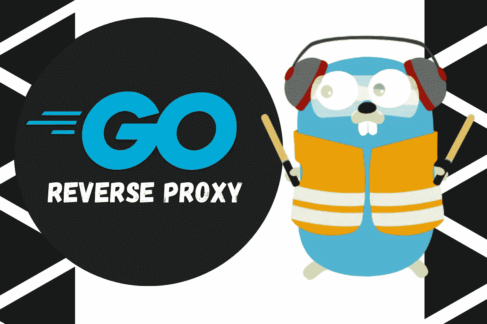
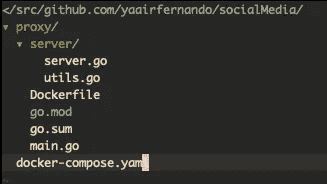
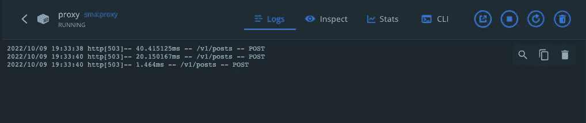

# 构建反向代理(gRPC-网关)

> 原文：<https://betterprogramming.pub/building-reverse-proxy-grpc-gateway-621696b29b0>

## 带协议缓冲区的 gRPC API



由作者组合的图像|右图像由 [traefik](https://hub.docker.com/_/traefik) ，左图像由 [Go](https://go.dev/src/net/http/httputil/reverseproxy.go)

在上一篇文章中，我们为一个社交媒体应用程序构建了 API 设计。我们使用协议缓冲区为一篇文章编写了五个 REST 端点的定义以及每个端点的 HTTP 注释，我们还使用 [grpc-gateway](https://github.com/grpc-ecosystem/grpc-gateway) 插件生成了实现反向代理的代码。

在本文中，我们将继续构建 API，下一步是实现反向代理。

如果你错过了上一篇文章，我建议你按以下顺序阅读:

1.  [使用协议缓冲区和 gRPC 进行 API 设计](/go-api-design-with-protocol-buffers-and-grpc-991838e4852b)
2.  构建反向代理(gRPC-网关)
3.  [Go API —数据库连接](https://yairfernando.medium.com/go-api-database-connection-d47e463cea37)

我们将使用 docker 和 docker-compose，所以我建议首先安装 [docker](https://docs.docker.com/desktop/install/mac-install/) 和 [docker-compose](https://docs.docker.com/compose/install/#install-compose) ，并确保您能够运行容器。

导航到您的`GOPATH`，如果您不知道您的 go 路径目录，您可以运行`echo $GOPATH`，这将打印出正确的路径。在那里创建`src/github/com/yaairfernando`文件夹结构，用你的 GitHub 句柄替换最后一个目录。在那里，创建以下项目结构:

```
mkdir socialMedia
cd socialMedia
touch docker-compose.yaml
```

好了，让我们从定义 docker-compose yaml 文件开始。

从上面的 yaml 文件中，我们定义了`proxy`服务，从这个服务的配置中，我们可以看到容器名是`proxy`，将要使用的映像是`sma:proxy`，如果 docker 映像不存在，它将从`./proxy`文件夹中构建它，我们还将传递一个 GitHub 访问令牌作为参数，这只有在您为上一篇文章中的 API 设计创建了私有 repo 时才是必要的。

如果是这样，您需要向 docker 映像传递一个 GitHub 访问令牌，以便能够从 docker 文件访问私有存储库。

我们还指定了一个命令和两个要运行的环境变量:一个用于指定服务器将要运行的 rest 端口，一个 grpc URL 指向代理将要代理请求的服务。

我们还指定该服务将公开的端口是`9094`，在内部将是`8081`。

现在让我们创建一个代理文件夹和`main.go`文件:

```
mkdir proxy
cd proxy
touch main.go
```

在代理文件夹中，我们将运行这个命令来创建一个 go 模块

```
go mod init github.com/yaairfernando/proxy
```

这将在代理文件夹下创建一个`go.mod`文件。

```
module github.com/yaairfernando/proxygo 1.18
```

`main.go`文件是这样的:

主要功能只是通过`grpcURL`、`restPort`初始化一个新的服务器，调用服务器实例上的 start 方法。

让我们看看服务器文件是什么样子的。创建服务器文件夹和一个`server.go`文件。

```
mkdir server
cd server
touch server.go
```

这个服务器文件包含了为`Posts`资源注册处理程序、添加一个简单的记录器、创建一个 HTTP 服务器和监听指定端口的所有逻辑。

*   在第 36 行，我们创建了一个新的服务器 mux
*   在第 38 行，我们用一个简单的记录器包装了服务器
*   在第 40 行，我们注册了所有的处理程序。在我们的例子中，目前我们只有一个用于`Posts`资源的
*   最后，在第 45–49 行，我们创建了一个 HTTP 服务器，传递处理程序并开始监听

正如您所看到的，这个文件中没有定义一些帮助函数。我将它们添加到一个`utils`文件中。

好了，现在让我们创建`Dockerfile`:

我不会深入这个 docker 文件在做什么，但本质上它使用一个 Golang 映像作为构建器，设置一些 go 环境变量，设置工作目录，并复制`go.mod`文件。之后，它下载所有的依赖项，复制其余的文件，最后设置入口点。

这是包含所有使用的包的`go.mod`文件。

这是项目的最终文件夹结构:



我们差不多完成了。现在，让我们通过在代理文件夹中运行以下命令来下载我们需要的 go 包:

```
go mod download
go mod tidy
```

如您所见，对于`sma`包，我们指定我们想要来自该包的版本`v0.1.0`，但是当我们构建 API 设计时，我们没有创建任何版本。就这么办吧。

## 生成 Git 标签

回到您拥有`sma`项目的地方，让我们创建一个标签:

```
git tag v0.1.0
```

并将其推送到存储库:

```
git push origin v0.1.0
```

现在，回到`proxy`文件夹，运行这个命令来下载那个版本的`sma`包:

```
go get github.com/yaairfernando/sma@v0.1.0
```

上面的命令将下载指定版本的`sma`包。

在我们构建服务之前，最后一件事是添加一个带有 GitHub 访问令牌的`.env`文件，以防您对 API 设计的回购是私有的。

```
GITHUB_ACCESS_TOKEN=your_gihub_access_token
```

# 构建 Docker 服务

我们现在可以通过在根文件夹中运行以下命令来构建代理服务:

```
docker-compose up --build -d proxy
```

当运行这个命令时，你会得到一些错误，告诉你下载一些我们在`go.mod`文件中指定的包。运行`go mod download package_path`下载软件包即可。并重新运行 docker-compose 命令。

构建完成后，我们应该能够看到容器正在运行。向`[http://localhost:9094/v1/posts](http://localhost:9094/v1/posts)`发送 POST 请求还不行，但是我们可以看到日志。



代理运行

这就是本文的全部内容。我们已经实现了反向代理。在下一篇文章中，我们将继续构建 API。

敬请期待，感谢您的阅读！