# 如何用 OAuth 2、OpenId 和 React 构建一个安全的登录流

> 原文：<https://betterprogramming.pub/building-secure-login-flow-with-oauth-2-openid-in-react-apps-ce6e8e29630a>

## 让你的应用有一个最好的起点，一个安全的起点


乔恩·摩尔在 Unsplash[上的照片](https://unsplash.com/s/photos/security?utm_source=unsplash&utm_medium=referral&utm_content=creditCopyText)

您是否知道，大约 80%的数据泄露都是由于错误的密码选择(如“密码”)造成的？你知道超过 2300 万人使用密码“123456”吗？

在这个数字时代，个人数据非常重要，大多数国家都制定了严格的法律，作为开发者，我们有责任保护我们的网关，这一点非常重要。

或者，换句话说，我们构建的应用程序充当了访问或操纵敏感数据的渠道。作为前端开发人员，我们构建界面来创造愉快的用户体验，使读取和操作数据库中存储的数据变得容易。

因此，在任何 web 应用程序中，根据权限识别正确的人并对界面部分进行正确的访问是至关重要的。

# 动机

互联网上有许多分散的信息，可用于了解 [OAuth](https://oauth.net/) 、什么是 [OpenID](https://openid.net/) connect，以及如何在我们现代的水疗应用基础设施中使用它们。

我发现的大部分指南都完全依赖于相应的客户端库。例如，使用 JS SDK 进行 [Microsoft Azure](https://azure.microsoft.com/en-us/) 登录会增加 71KB( 18KB gzipped)的包大小。

其他库也是如此，比如脸书 SDK JS 和谷歌的`gapi`。

当我们被要求在我们的 web 应用程序中添加 Google 或 FB 登录按钮时，在寻找解决方案时，我们倾向于找到一个框架兼容的包装器来为我们实现这一奇迹，甚至不需要费心去理解该库在内部做什么。

我们只是简单地寻找如何快速集成它的指南或教程，而不考虑选择一种策略的安全影响。例如，我们检索访问令牌，并在不知情或有意的情况下获得对用户个人信息的访问。

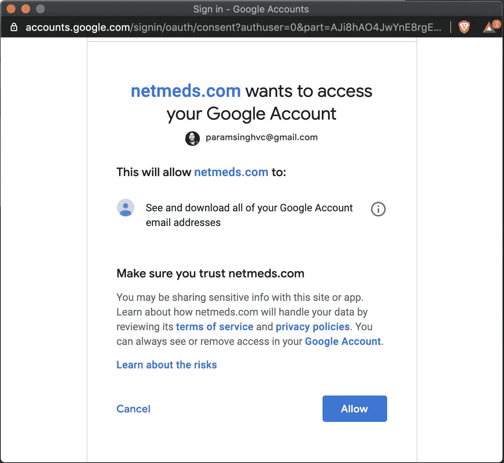

OAuth 中的同意屏幕要求所有联系人同意

看到这个，[医药配送 app net meds](https://www.netmeds.com/)请求访问用户所有邮箱联系人的权限，为了什么？而且，可悲的是，容易上当受骗的人甚至不会在匆忙登录订购药品的应用程序时注意到这些事情！

以上案例是在用户端。在开发人员方面，我们都倾向于获取访问令牌，即使我们只需要识别用户信息，如电子邮件 ID 和基本配置文件信息，然后我们将访问令牌存储在 localstorage 中，并在每个请求的请求标头中发送它。

在客户端存储中存储访问令牌容易受到脚本注入攻击。

我相信你可能在开发时遇到过这样的情况，你要求你的同事与你分享他们的访问令牌来登录应用程序。

任何拥有您的访问令牌的人都可以冒充您并代表您执行操作，这实际上违反了信息安全的 [CIA 三元模型](https://whatis.techtarget.com/definition/Confidentiality-integrity-and-availability-CIA)的 *C(保密性)*原则，该原则规定只有正确的人才能访问资源，任何人都不能冒充任何其他用户。

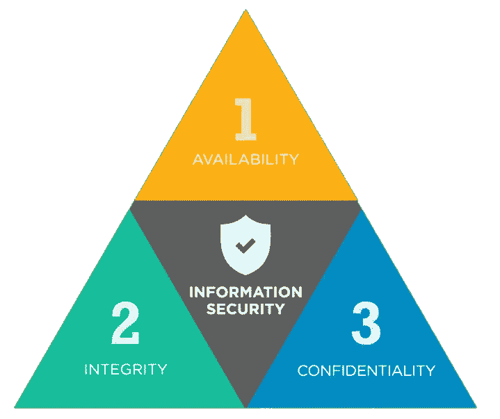

中情局三合会安全模式

# 议程

我们将讨论:

*   身份验证与授权。
*   OAuth 2.0 及其流程。
*   在具有弹出和重定向 UX 的 React 应用中使用 OpenID 实现授权代码授权流。
*   使用 [Koa](https://koajs.com/) 在 Node.js 服务器上实现 OAuth 流。
*   [WebAuthn](https://webauthn.io/) 。

在整个讨论中，我们不会使用任何第三方库来完全理解这些概念。

# 身份验证与授权

*认证* 意味着我们只想识别试图登录应用程序的用户。这是一种识别用户的方式，以确保他们是他们所声称的人。

一个简单的例子是用户名/密码。天真的假设是所有用户名和密码都是唯一的。如果一个人有这些东西，就可以自称是某个人。

如今，我们有两个或多个身份认证系统，它们有点烦人，但是对保护你的身份非常重要。

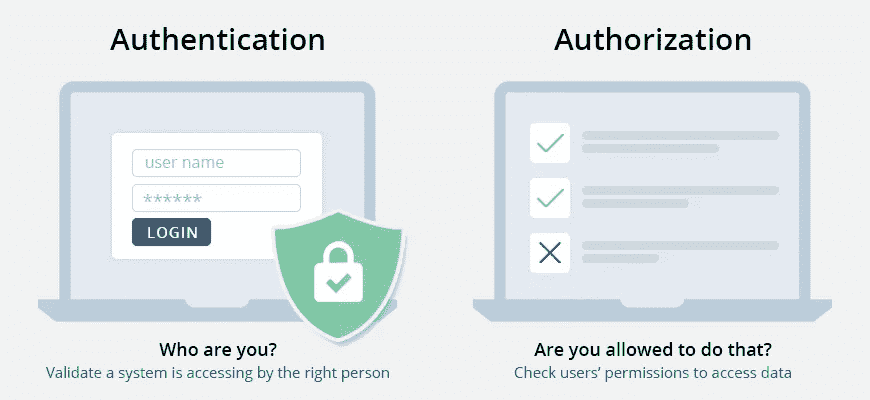

*另一方面，授权*是一种“授权”登录用户访问受保护资源的方式。授权过程通常在认证之后。

一个例子是 API 键，通过它可以访问开发人员的 REST API。或者，简单地用一个 Google 访问令牌来访问 Google 资源，比如 Google Drive。

一旦你在认证过程中获得了令牌，任何拥有它的人都可以访问你的 Google Drive，直到它过期。

授权的一个很好的类比是电影票，尤其是在过去。

任何有票的人都可以进入电影院。人们可以把它卖给其他人，因为在这里购买它的人的身份并不重要。

同样，音乐会门票或通行证可以很容易地卖给其他人，因为它们只用于检查进入场地的授权。

另一方面，认证就像向警察出示你的驾驶执照来确认你的身份，即你实际上就是你所声称的那个人。

警察将通过检查你的信息来核实你的身份，如生物特征和你的照片，如果他们怀疑这些事情，他们可以提问。

同样，当通过 Google OAuth 登录时，Google 是机场外的警察，它试图通过检查您的用户名和密码以及 MFA(多因素身份验证)等其他因素来识别您的身份。

当你用上述方法证明你的身份时，cop 会给你一个“访问令牌”，比如说，一个进入机场的虚拟通行证，以访问各种机场资源。

# OAuth 2.0 和 OpenID

这两者相辅相成。OpenID 是用于认证的协议，而 OAuth 是用于授权的协议。

*   OpenID 是一个开放的标准和分散的认证协议，由 OpenID 基金会控制。
*   OAuth 是访问授权的开放标准。
*   [OpenID Connect (OIDC)](https://openid.net/connect/) 结合了 OpenID 和 OAuth 的特性，即它既做认证又做授权。

OIDC 使用简单的 JSON Web 令牌(JWT)，您可以使用符合 OAuth 2.0 规范的流获得它。OAuth 与 OIDC 直接相关，因为 OIDC 是建立在 OAuth 2.0 之上的认证层。

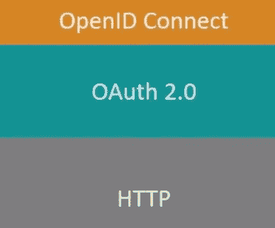

Google 和其他提供商实现了 OpenID 和 OAuth 规范。因此，我们可以同时对用户进行身份验证和授权。

例如，如果你选择使用谷歌账户登录 [Auth0](https://auth0.com/) ，那么你使用的是 OIDC。

一旦您成功通过 Google 认证并授权 Auth0 访问您的信息，Google 将向 Auth0 发回有关用户和所执行认证的信息。

该信息在 JSON Web 令牌(JWT)中返回。您将收到一个访问令牌，如果需要，还会收到一个 ID 令牌。

# OAuth 2.0 流程

使用 OIDC 实现认证和授权有各种流程。下面是两个主要的例子:

## 1.隐式授权流

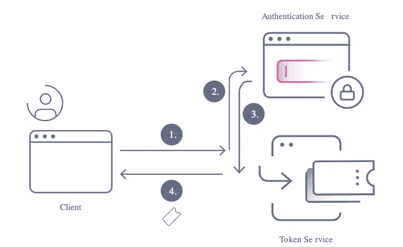

这是最简单的流程。它可以总结为以下步骤:

1.  用户从您的 web 应用程序中点击“使用 FB 登录”按钮。用户要么被提示一个对话框，要么被重定向到 FB 的登录屏幕。
2.  认证服务提供者(在这种情况下是 FB)接受用户输入，如用户名、密码或 MFA 等。
3.  在用户被成功识别之后，授权服务提供者发出一个`id_token`或`access_token`。
4.  FB 使用查询参数中的令牌集或 URL 中的哈希片段将用户重定向回您的应用程序。
5.  该应用程序从 URL 获取令牌，或者解码 JWT `id_token`以获取用户 ID，或者使用访问令牌通过脸书的[图形 API](https://developers.facebook.com/docs/graph-api/) 获取更多用户信息。

以 Google 为例，来自客户端的请求 URL 如下所示:

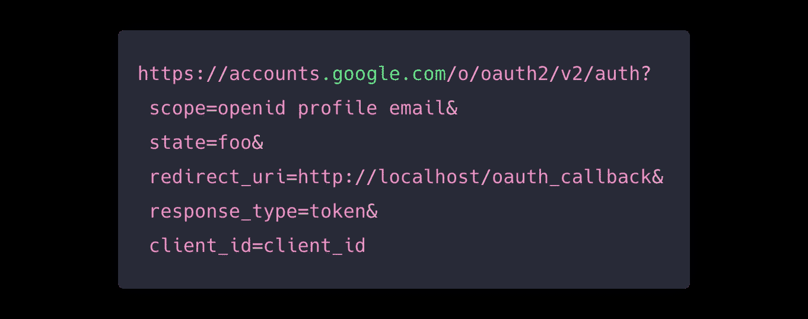

这是一个`GET`调用，这个 URL 需要直接在浏览器中打开(而不是通过 AJAX，因为谷歌不支持 CORS)。

URL 可以在另一个窗口中一起打开，并通过`postmessage`与一个打开窗口进行通信，也可以在加载应用程序的同一个窗口中打开，这都取决于您想要遵循的用户体验。

这里的`scope` 参数告诉我们同意需要用户做哪些事情。例如:要管理所有 Google 日历事件，可以添加[*【https://www.googleapis.com/auth/calendar】*](https://www.googleapis.com/auth/calendar)*作为该范围的值。*

*`redirect_uri` : 由于我们将把我们的应用程序让给谷歌，谷歌或任何 OAuth 提供商需要知道在用户登录并证明他们的身份后重定向回哪里。*

*因此，给出一个有效的`redirect_uri`对于捕获作为查询参数或散列片段附加在同一个`redirect_uri`中的标记是必要的。*

*`response_type` 必须是`token`来表示我们想直接从`redirect_uri`中获取访问令牌。这与授权码授予流程形成对比，后者涉及更多步骤。*

*`client_id` 是你在谷歌开发者[控制台](https://console.developers.google.com/)为你的应用注册后得到的 ID。*

*这个流程很适合*无服务器***spa。这有点不太安全，因为我们在客户端公开了访问令牌，这可能会被各种手段攻击。***

## ***2.授权码授权流***

***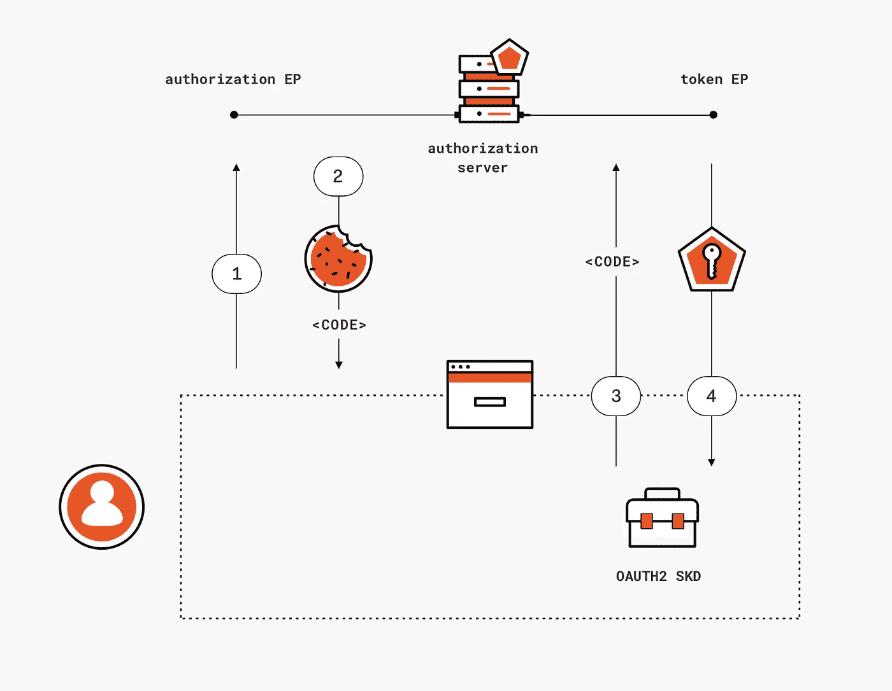***

***在这里，以同样的方式，用户点击登录按钮，Google 验证用户，最后在`redirect_uri`中发送一个`code` ，与我们之前看到的隐式授权流中的`token` 形成对比。***

***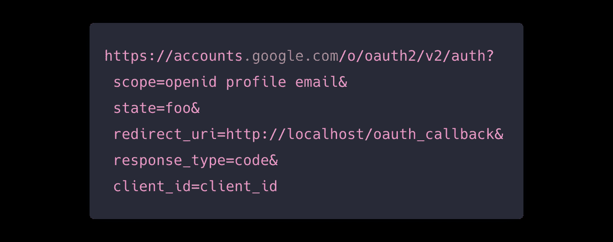***

***从 URL 中检索到代码后，在服务器端将其交换为访问令牌。您不能在客户端直接进行 POST AJAX 调用，因为这会导致 CORS 错误。***

***相反，对服务器进行代理调用，服务器将在内部进行交换调用以获取访问令牌。***

***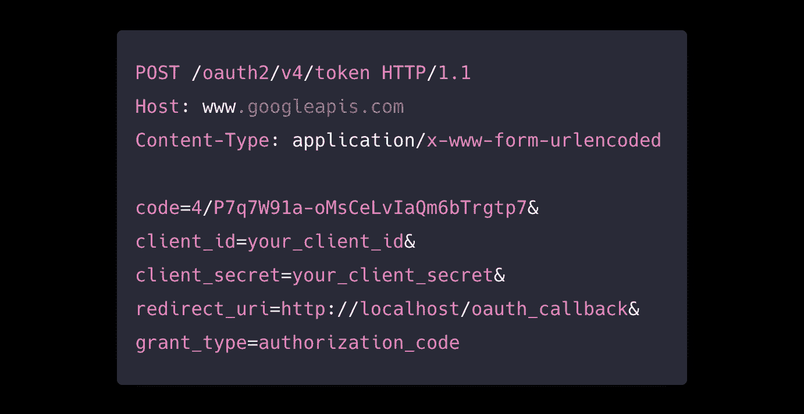***

***这种方法更安全，因为被窃取的代码不会有任何问题，因为它是访问用户资源的重要访问令牌。***

***此外，为了进行交换调用以获得访问令牌，需要在 API 调用有效负载中发送`client_secret`密钥，该密钥安全地保存在服务器端。***

***因此，这是将 OAuth 安全集成到您的应用程序中的推荐方法。***

# ***实施授权码授予流程-前端***

***首先，我们需要为`redirect_uri` 创建路由处理程序，并将其注册到 OAuth 提供者，例如 Google、FB 或 Twitter 的开发控制台上。应用程序或路线组件如下所示:***

***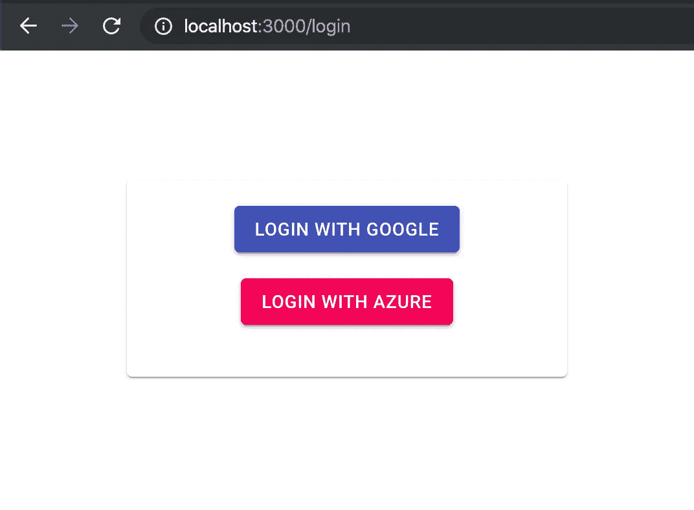***

***登录路线用户界面***

***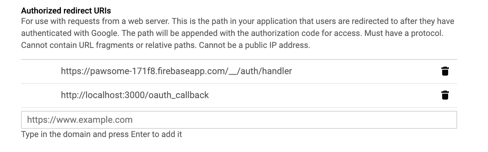***

***向 Google 注册应用程序时提供重定向 UI***

***注册重定向 URI 很重要，因为否则，注册过程会出错`Invalid Redirect URI`。出于开发目的，添加本地主机 URL。***

## ***重定向 UX***

***这里，我们正在进行一个 AJAX 调用，只是为了获取 auth URL 以获取授权代码，最终，就像步骤 1 中一样。***

***我们可以在这里马上构造它，这样做是为了隐藏配置密钥和其他细节，比如客户端的秘密。此外，将构造 URL 的责任委托给服务器端也是一个好主意。***

***当从服务器以纯文本的形式收到成功的响应时，它被解析并作为 URL 分配给当前窗口。这是正常且容易的重定向流程。***

******

***从该 URL 成功登录后，Google 将重定向到通过`code` 参数传递的`redirect_uri`，该参数在 URL 的查询参数中传递，如下所示。***

```
***[http://localhost:3000/oauth_callback?
**state**=google&
**code**=4/sgHS6bYbqptNXQm3q5hEm3zDPv4pD7WxWuiH2um3&
**scope**=email profile openid&
**authuser**=0&
**session_state**=a69a895ce6443dc3eee7a14197edb0b8b3d81007..a755&
**prompt**=consent](http://localhost:3000/oauth_callback?state=google&code=4%2FsgHS6bYbqptNXQm3q5hEm3zDPv4pD7WxWuiH2um3-OW1LnLZL7uR4y2kV6RoOK5M4PgkA-7PoVvCszkc1OCt31k&scope=email+profile+openid+https%3A%2F%2Fwww.googleapis.com%2Fauth%2Fuserinfo.profile+https%3A%2F%2Fwww.googleapis.com%2Fauth%2Fuserinfo.email&authuser=0&session_state=a69a895ce6443dc3eee7a14197edb0b8b3d81007..a755&prompt=consent#)***
```

***注意`state` 参数被传递并被重定向以恢复应用程序流。***

***如果您想在登录后恢复应用程序的状态，这是很有用的，因为当 OAuth 屏幕打开时，整个应用程序都会卸载，您可能需要将用户重定向到他们试图登录的正确的受保护 URL。***

***这是一个用例，在我们的例子中，我们有多个 OAuth 提供者，如 Google 和 Azure，我们需要在重定向后知道这些代码属于谁，属于哪个提供者，这样我们就可以调用适当的令牌交换调用。***

***这是`oauth_callback`处理程序组件的样子:***

***在这里，当应用程序在 Google 上认证后登陆到`/oauth_callback` URL 时，组件挂载`useEffect`钩子被触发，我们获取代码和状态来对我们的服务器进行`GET`调用，服务器将把它转发给服务器端的实际 Google 请求。您也可以在这里选择创建一个`POST`请求。***

***基于重定向后获得的`state`参数，我们将适当的路由参数传递给 API 进行相应的处理。***

***我们讨论的所有事情都可以通过`location.href.assign`来实现，其中我们改变了浏览器上的当前窗口 URL。***

***但是，很有可能，您关心 UX，并且由于以下原因，您不想再次卸载和加载整个应用程序:***

1.  ***卸载整个应用程序意味着您会丢失应用程序状态。比方说，你在一周后打开你的 Mac，试图访问一个 dashboard 应用程序，它识别出你的访问已经过期，而不是完全重定向到 Google，在提示窗口中处理 OAuth 会更好。***
2.  ***考虑到你的应用程序上没有服务人员或延迟加载分块功能，在这种情况下刷新应用程序意义重大。***

## ***弹出 UX***

***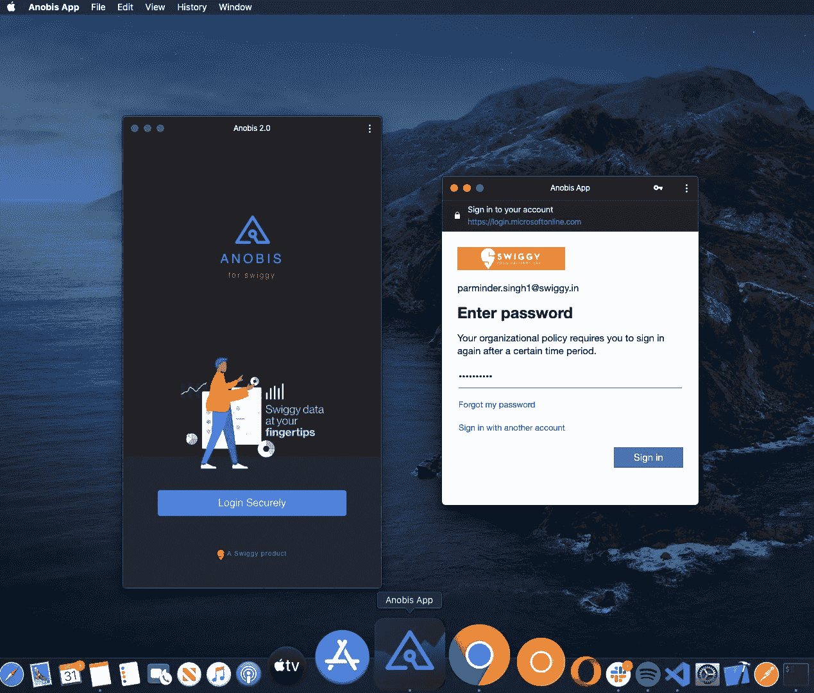***

***OAuth 的弹出插图***

***上面是 Swiggy 的一个项目的弹出 UX 流的例子。是 PWA，在桌面上打开。***

***基本上，我是在检测环境，并决定所需的 UX 类型。对于移动设备，我选择重定向 UX(有一个原因，将进一步讨论)，对于桌面，我选择弹出 UX。***

***这背后的`AuthService`是:***

***这里值得注意的是，我还使用了[凭证管理 API](https://gist.github.com/paramsinghvc/d90d5036fa94a7fd8dd6781bb8bdacc1) 来方便登录。***

***虽然，我相信它对于用户名/密码类的场景更有用，但是对于联邦或 OAuth 场景，您只能存储用户的`emailId`。***

******

***Creds API 提示用户保存密码***

***注意:存储`code`或`access_token`不是一个好主意，因为它们过期了，需要更新。由于冗长的令牌字符串以及多个重复条目，下次登录时情况会更糟。***

***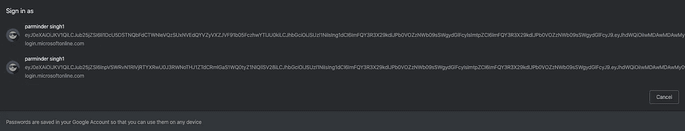***

***长访问令牌破坏用户界面***

***没什么用。理想情况下，您只能存储`emailId`，并将其作为`login_hint`参数传递，只有少数 OAuth 实现(如 Google)支持这个参数。***

***当您的应用程序知道它正在尝试验证哪个用户时，它可以将此参数作为提示提供给验证服务器。传递该提示会取消帐户选择器，或者预先填写登录表单上的电子邮件框，或者选择适当的会话(如果用户使用[多重登录](https://support.google.com/accounts/answer/1721977))。***

***这可以帮助您避免应用程序登录错误的用户帐户时出现的问题。该值可以是电子邮件地址或`sub`字符串，相当于用户的 Google ID。***

***这是你所能做的，通过在账户选择器中提示账户，使用`FederatedCredentials`来减少认证流程。***

## ***邮件后 API***

***回到我们最初关于弹出流的讨论。***

***策略是使用`window.open`从应用程序窗口打开另一个窗口，但是您必须将`code`或`token`返回到应用程序窗口。这只能通过窗口的 [postMessage](https://developer.mozilla.org/en-US/docs/Web/API/Window/postMessage) API 来实现。***

***我将让代码在这里说话。下面是弹出的`postMessage`实现:***

***`processToken` 方法，在 OAuth 回调组件内部调用，将消息或信标发送回打开它的窗口。它检查当前窗口是否是从父窗口打开的，并向包含已处理令牌的父窗口发送 postmessage。***

***此外，我不得不在移动设备上使用重定向流，因为当你把应用程序固定在 Android 上时，`window.opener`会给出空值。***

***一前一后，在父窗口端有一个监听器事件处理器`listenToMessageEvent`，监听这些`postMessages`。***

***传递并检查一个唯一的`type` 参数很重要，因为一个窗口可能会从 Chrome extensions 等各种来源获得大量消息。***

***而且，尽管您会看到`OAuthCallback`组件的一瞥，但最好给它添加最小化的样式，显示一个加载器或一条错误消息以防登录失败。***

***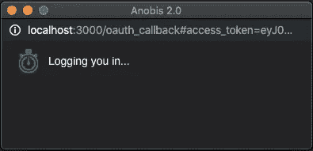***

# ***实施授权码授予流程—后端***

***我已经使用 Koa 建立了一个 Node.js 服务器。我们必须在这里为 auth 创建两个端点。***

***第一个是根据提供者获取授权 URL:***

***这就是 OAuth 服务的核心:***

***OAuth 是一个通用类，其中的各种子类可以扩展并提供配置值。它提供了所有必要的方法，比如获取 Auth URLs、从令牌获取代码以及刷新过期的访问令牌。***

***下面是从授权码获取访问令牌并启动用户会话的另一种方法:***

***作为调用响应接收到的`id_token`是一个应该被验证的 JWT 令牌。这里是谷歌实现[的例子](https://github.com/googleapis/google-auth-library-nodejs/blob/master/src/crypto/node/crypto.ts)。***

***我们通过将用户会话与从访问令牌获得的电子邮件 ID 进行映射来启动用户会话。我们将用户的信息存储在数据库中，或者用新的访问令牌和刷新令牌更新现有的用户信息，等等。***

***通过对照用户的 DB 检查请求中 cookie 头中的会话值，可以为任何受保护的路由提供服务。***

***如果会话 cookie 头不存在或与 DB 条目不匹配，它可以发送 401 头，通知用户未登录或访问令牌已被篡改。***

***可以创建一个中间件来更好地实现这一点。***

***仅此而已！没有人能那么容易实现 OAuth！***

# ***网络认证的未来***

***在结束之前，我不想不讨论[网站认证](https://webauthn.io/)。***

***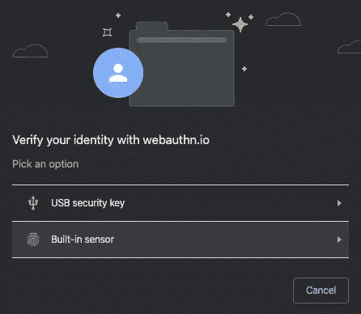******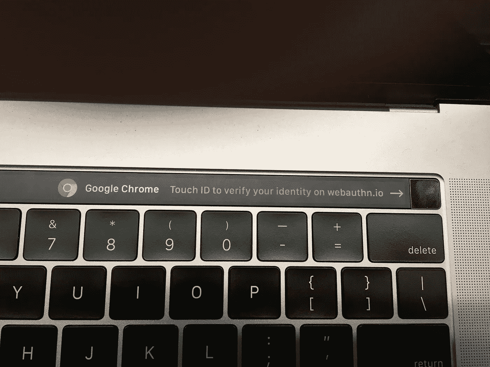******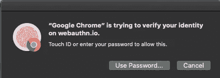*********

***这使得认证变得更加容易。就像苹果已经在做的那样。WebAuthn 是一种将指纹登录的优点带到 web 上的方式，但遗憾的是，并不是所有的浏览器都支持。***

***IOS 还没有拥抱它，甚至在最新的 iOS 13 中也没有，截至目前。另外，跨设备登录是个问题。YubiKey 是一个解决方案，它非常适合需要高度安全性的公司内部仪表盘。***

***WebAuthn 的整个基本原理是基于这样一个事实，即密码是一个长散列，不会被窃取或忘记，它驻留在硬件上。***

***这与今天的用户名/密码被盗的情况形成对比，因此，我们必须依赖 MFA(多因素身份认证),这给登录增加了越来越多的摩擦。指纹是证明你身份的一个很好的方法，因为从生物学上来说，它对每个人来说都是独一无二的。***

***我们可以通过检测正在打开的浏览器上的支持来逐步将它添加到我们的应用程序中，同时在尚不支持它的浏览器上提供优雅的降级。***

***毕竟，我们正在构建*渐进式* *网络应用* (PWAs)，对吗？但遗憾的是，它对单个设备工作得很好，多设备支持并不那么直接。***

***[](https://github.com/w3c/webauthn/issues/151) [## 阐明用户如何从多个设备进行身份验证问题#151 w3c/webauthn

### 当前的规范草案没有试图解决不同用户的认证问题…

github.com](https://github.com/w3c/webauthn/issues/151) 

但是值得投入精力。希望今后支持会有所改善。*** 

# ***摘要***

***我们讨论了 OAuth 相对于目前流行的传统用户名/密码方法的优势，以及如何使用暴力破解愚蠢的密码来轻易破坏帐户。***

***在这个数字化时代，数据比什么都重要，保护数据至关重要。除了用户名/密码方法之外，联合登录是一种方法，或者说是一种很好的方法。***

***或者，MFA 对保护资源也很重要。我们讨论了 OAuth 如何工作的流程，React 应用程序中 Auth 代码流的实现，以及不使用任何第三方库的后端用户和 auth 管理。***

***最后，我们谈到了使用 WebAuthn 登录的未来前景。***

***代码库可以在 [GitHub](https://github.com/paramsinghvc/koa-react-spa/tree/auth) 上找到。***

***谢谢你。建议任何想法，如果我错过了一些，使更安全的应用程序。***

# ***参考***

***[](https://stackoverflow.com/a/51529795/2312848) [## OpenID 和 OAuth 有什么区别？

### 感谢贡献一个堆栈溢出的答案！请务必回答问题。提供详细信息并分享…

stackoverflow.com](https://stackoverflow.com/a/51529795/2312848) [](https://github.com/paramsinghvc/koa-react-spa/tree/auth) [## paramsinghvc/koa-react-spa

### 这个项目是用 Create React App 引导的。在项目目录中，您可以运行:在…中运行应用程序

github.com](https://github.com/paramsinghvc/koa-react-spa/tree/auth) [](https://github.com/googleapis/google-auth-library-nodejs) [## 谷歌 API/谷歌授权库节点

### 这是 Google 官方支持的 node.js 客户端库，用于使用 OAuth 2.0 授权和认证…

github.com](https://github.com/googleapis/google-auth-library-nodejs)***