# 在 Ruby on Rails 中构建自连接和三元连接

> 原文：<https://betterprogramming.pub/building-self-joins-and-triple-joins-in-ruby-on-rails-455701bf3fa7>

## 创建 Ruby on Rails 应用程序的分步指导，该应用程序实现了自连接和三连接关系


信用:[马特·费格森](https://www.reddit.com/r/batman/comments/4nsig4/matt_fergusons_dark_knight_trilogy_wallpaper/)

本文是“代码:关系数据库基础知识” *，*的延续，它涵盖了一对多、多对多和多对多的自连接关系。

第一篇文章更具概念性和描述性，而本文旨在逐步指导如何创建一个 Ruby on Rails 应用程序，该应用程序先实现自连接，然后实现三连接关系。

在本文中，我们将创建一个电影比较应用程序的后端。最后，我们应该能够创建两部电影之间的比较(即一部比另一部好)，然后将该比较与单个用户相关联。

这样做，我们将能够跟踪哪些用户更喜欢哪些电影。

本系列文章的第 3 部分是本文中我们在后端创建的所有内容的前端演示。

# 目录

*   创建一个 Rails 应用。
*   创建模型和迁移。**
*   定义模型关系并进行测试。**

part 3([*Ruby on Rails 中的电影对比网站*](https://medium.com/@jdprince555/movie-comparison-website-in-ruby-on-rails-4632f2e1dee2) ):

*   路线、控制器动作、视图。
*   用于创建三联连接比较实例的表单。

* * —模型、关系和数据库迁移是整个系列文章中最重要的三个部分。它们共同构成了我们自加入和三加入关系背后的力量。专注于此。

这里是与本系列文章相关的 Github。

如果你有兴趣了解这些概念最终是如何应用的，请访问这个电影推荐网站:

网站(加载 [Heroku](https://www.heroku.com/) 需要几秒钟): [MyMDb](https://my-m-db.herokuapp.com/)

让我们开始吧。

# 创建一个 Rails 应用

我假设你已经安装了 Ruby 和 Rails。

首先，让我们从终端创建一个新的 Rails 应用程序。导航到要存储新项目的目录。对我来说:

`$ cd Desktop/Dev/`

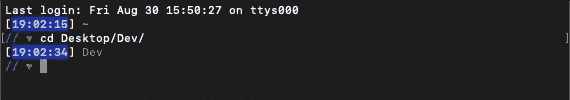

从命令行生成一个具有相关名称的新 Rails 应用程序:

`$ rails new movieComparisonApp`

在新创建的目录中导航:

`$ cd movieComparisonApp/`

当您在首选文本编辑器中打开新应用程序时，预计会看到以下文件:

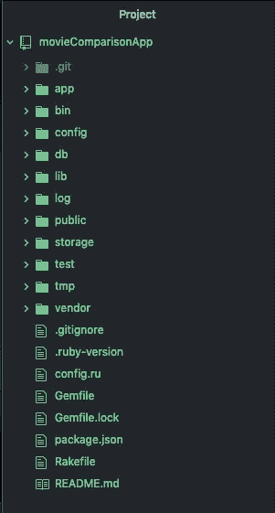

我们将工作在:`app` (模型)**`db`*(数据库，种子)*。****

# **创建模型和迁移****

**使用适当的数据库表列为电影创建模型:**

**`$ rails g model Movie title year:integer`**

**注意:我将全程使用[Rails 发电机](https://medium.com/@josephdlawson21/using-the-generate-command-in-rails-9c738380f2d9)。**

**应该已经创建了此表迁移:**

**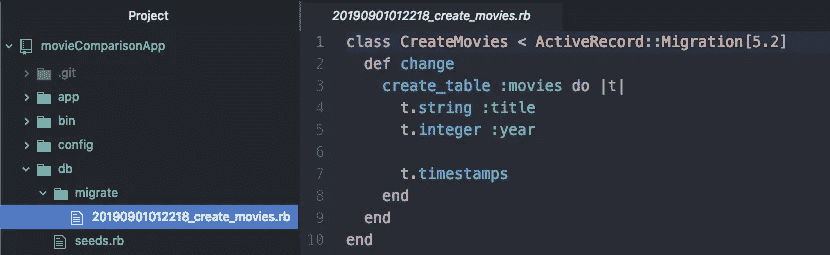**

**(为了清楚起见，当我们在控制台中工作时，我将删除`t.timestamps`。**

**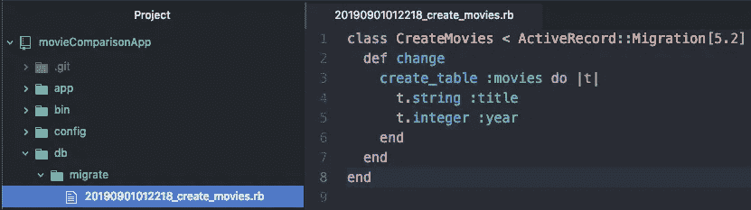**

**在`app/models/movie.rb`应该也创造了一个电影模型:**

**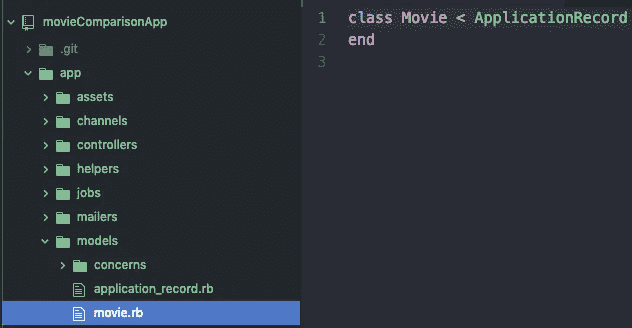**

**创建比较模型:**

**`$ rails g model Comparison`**

**自动生成的表迁移:**

**注意:还没有定义列。我们马上就做。**

**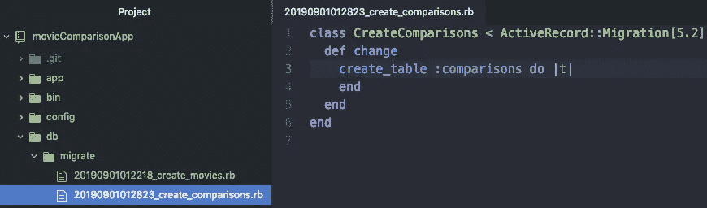**

**`app/models/comparison.rb`中自动生成的对比模型:**

**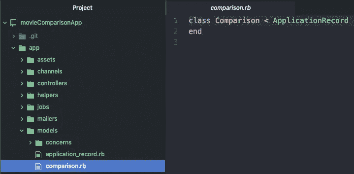**

# **定义模型关系并测试****

**在定义我们的关系之前，让我们写出我们希望数据库中的表最终是什么样子:**

**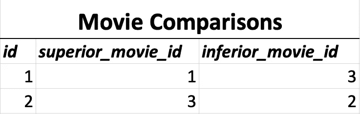**

**我们希望电影 3“低于”电影 1，而“高于”电影 2。**

**该表遵循具有多个连接表的典型结构(参见[第 1 部分](https://medium.com/@jdprince555/the-coddfather-relational-database-fundamentals-533b96f87651)中基于脸书结构的两个具有多个连接表示例)。**

**第一列定义了连接的每个唯一实例(即比较)。第二和第三列包含与其他表中的 id 相对应的数字。那些“其他表”通过该表连接*。***

**我们这个案例的独特之处在于，既没有名为“劣质电影”的表格，也没有名为“优质电影”的表格。只有一张桌子:“电影”。**

**那么，我们的工作就是让我们的数据库相信，事实上有两个表。如果我们能做到这一点，我们就成功地创建了自联接。**

**让我们现在就在比较模型中这样做。**

**提醒:模型控制着进出我们数据库的数据流。数据库中的每个表都需要一个相应的模型。**

**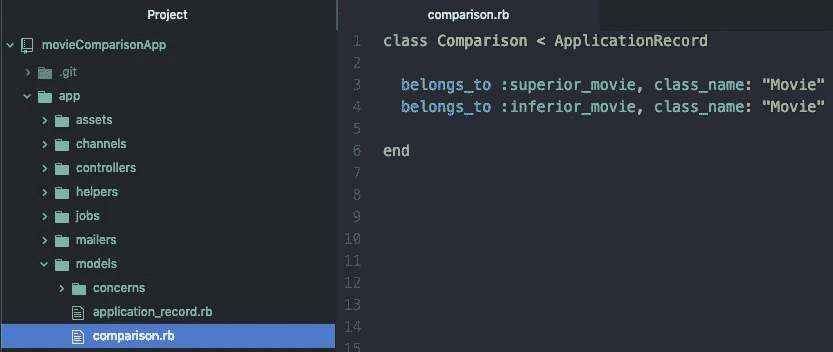**

**`belongs_to`语句的简单英语翻译:**

1.  **您创建的每个新比较都包含一个来自“高级电影”表的 ID。注意:“优秀的电影”其实都只是“电影”。**
2.  **您创建的每个新比较都包含一个来自“劣质电影”表的 ID。注意了:“劣质电影”其实都只是“电影”。**

**这两个*属于*的关系合在一起告诉 Rails，每一部*对比*创造的必然会有*一部单一的劣质电影* **和** *一部单一的优质电影*。**

**这种一对一(电影到比较到电影)的关系使得单个次等电影可以通过比较的“桥梁”看到其附属的高级电影，反之亦然。**

**现在，我们需要创建列来放置那些“劣质电影”和“优质电影”id。**

**导航到用于比较的表迁移`db/migrate/#######_create_comparisons.rb`并插入这两行(每一行相当于数据库中的一个“列”):**

**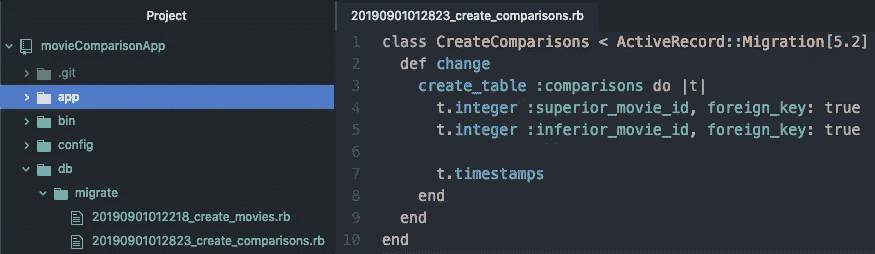**

**`foreign key: true`意味着 Rails 会一直将`superior_movie_id`和`inferior_movie_id`列中的整数与一个现有表中的 ID 关联起来。我们已经通过我们的归属语句(`class_name: “Movie”`)告诉 Rails *模型中的哪个表*。**

**声明了这两个外键，我们的两个`belongs_to`关系(一个是从对比到“优片”，一个是从对比到“劣片”)就固化了。我们的连接表已经创建好了，我们可以在终端中测试它的功能。**

**首先，迁移表并创建种子文件:**

**`$ rails db:migrate`**

**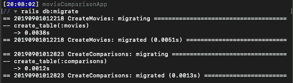**

**您的`schema.rb`文件现在应该看起来像这样:**

**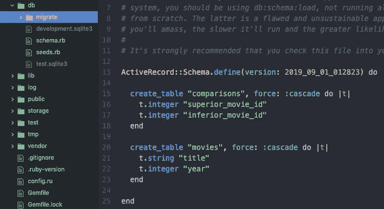**

**既然数据库已经存在，我们就能够创建新的电影和比较，并在比较中检索劣质和优质的电影对象。**

**通过在`db/seeds.rb`中创建一个包含示例数据的种子文件来测试这些事实:**

**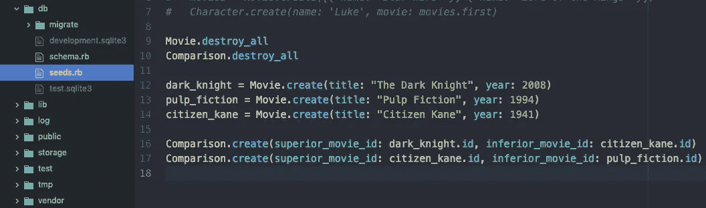**

**注意:`Movie.destroy_all`和`Comparison.destroy_all`是很好的做法。您不希望意外地用相同的信息重新播种您的数据库。通过销毁所有以前的实例，我们确保我们从零开始。**

*   **为数据库设定种子:**

**`$ rails db:seed`**

*   **打开 Rails 控制台:**

**`$ rails c`**

*   **查看所有创建的电影和比较:**

**`Comparison.all`和`Movie.all`**

**对于这两者，您都应该得到一个对象数组作为回报。**

*   **检索第一个比较:**

**`firstComparison = Comparison.first`**

*   **期望看到返回的对象:**

```
**=> #<Comparison id: 1, **superior_movie_id: 1**, **inferior_movie_id: 3**>**
```

*   **测试以查看该比较是否正确地找到了其相关的劣质和优质电影。**

```
**firstComparison**.inferior_movie** => #<**Movie** **id: 3**, title: "Citizen Kane", year: 1941>firstComparison**.superior_movie** => #<**Movie** **id: 1**, title: "The Dark Knight", year: 2008>**
```

**如果你得到类似的回应，干得好。您已经创建了一个有效的连接表。**

**然而，我们的目标是看到“比较之桥”。也就是说，*从一部特定的电影*中，我们希望能够看到所有被宣布为优秀和/或低劣的电影。**

**这还不起作用:**

```
**firstMovie = Movie.first => #<Movie id: 1, title: "The Dark Knight", year: 2008>firstMovie**.inferior_movies****NoMethodError (undefined method `inferior_movies'** for #<Movie id: 1, title: "The Dark Knight", year: 2008>)firstMovie**.superior_movies****NoMethodError (undefined method `superior_movies'** for #<Movie id: 1, title: "The Dark Knight", year: 2008>)**
```

**对于这两种情况，我们都会收到一个`undefined method`错误。现在让我们在电影模型中定义这些方法及其助手方法。**

**一、助手法:**

**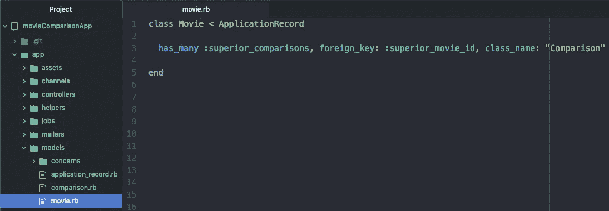**

**翻译:每部创作的电影在对照表的`superior_movie_id`栏中出现*多次*。**

**让我们称这些比较为*高级比较，*因为我们在看所有的比较，在这些比较中，一部电影被认为是“高级的”**

**在控制台中对此进行测试:**

```
**firstMovie = Movie**.**first(first**.id => 1**)firstMovie**.superior_comparisons**=> #<ActiveRecord::Associations::CollectionProxy [#<**Comparison** id: 1, **superior_movie_id: 1**, inferior_movie_id: 3>]>**
```

**`firstMovie.superior_comparisons`返回一个比较集合，其中第一部电影的 ID 出现在`superior_movie_id`列中。**

**那很好，但不是我们想要的。我们想看所有比《T4》差的电影。好在所有比`firstMovie`差的电影都已经包含在我们刚刚测试的`superior_comparisons` 方法中了:**

```
**firstMovie**.superior_comparisons**=> #<ActiveRecord::Associations::CollectionProxy [#<Comparison id: 1, superior_movie_id: 1, **inferior_movie_id: 3**>]>**
```

**因此，我们可以通过*`superior_comparisons`方法访问所有`inferior_movies` :***

**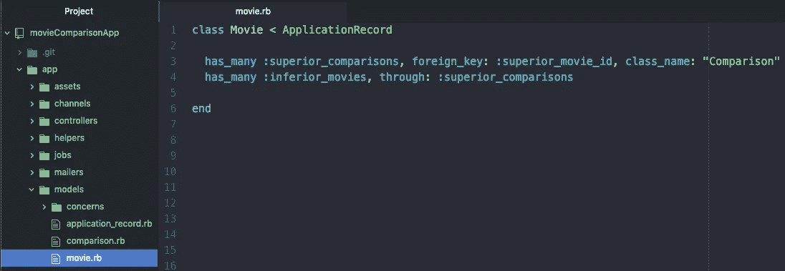**

**重申一下:Rails 将通过*遍历*高级比较列表，找到并收集 ID 出现在`inferior_movie_id`列中的所有电影对象。**

**让我们在控制台中看看它的运行情况:**

**`$ rails c`**

```
**firstMovie = Movie.first => #<Movie id: 1, title: "The Dark Knight", year: 2008>firstMovie**.superior_comparisons** => #<ActiveRecord::Associations::CollectionProxy [#<Comparison id: 1, superior_movie_id: 1, **inferior_movie_id: 3**>]>**firstMovie.inferior_movies**=> #<ActiveRecord::Associations::CollectionProxy [#<**Movie** **id: 3**, title: "Citizen Kane", year: 1941>]>**
```

**不错！`firstMovie.inferior_movies`从`inferior_movie_id`列返回电影。**

**为了抓取所有优秀的电影，我们只需添加前两种方法的反转:**

**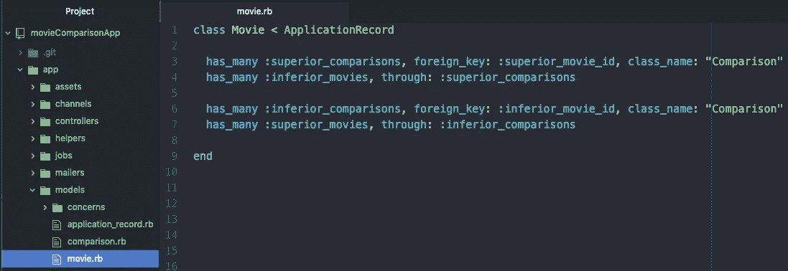**

**注意:你可以随意命名`:superior_comparisons`(和`inferior_comparisons`)。就叫它 x 吧，它仍然有效。“X”仍然被定义为“那些在`superior_movie_id`列中包含我的 ID 的比较实例。”**

**此时，我们应该可以对一个电影对象调用`.superior_movies` 和`.inferior_movies` 并接收一组电影(更好和更差)作为回报。**

**在控制台中对此进行测试:**

```
**Comparison.first => #<Comparison id: 1, **superior_movie_id: 1**, **inferior_movie_id: 3**>darkKnight = Movie.first => #<**Movie id: 1**, title: "The Dark Knight">darkKnight.**inferior_movies**=> #<ActiveRecord::Associations::CollectionProxy [#<**Movie id: 3**, title: "Citizen Kane", year: 1941>]>citizenKane = Movie.third => #<**Movie id: 3**, title: "Citizen Kane", year: 1941>citizenKane**.superior_movies** => #<ActiveRecord::Associations::CollectionProxy [#<**Movie id: 1**, title: "The Dark Knight", year: 2008>]>**
```

**自加入关系现在已经完全建立。尝试使用铲方法创建新的比较:**

```
**Comparison.count **=> 2**pulpFiction = Movie.second=> #<Movie id: 2, title: "Pulp Fiction", year: 1994>pulpFiction**.superior_movies.count** **=> 1**pulpFiction**.superior_movies << darkKnight**=> #<ActiveRecord::Associations::CollectionProxy [#<Movie id: 3, title: "Citizen Kane", year: 1941>, #<Movie id: 1, title: "The Dark Knight", year: 2008>]>pulpFiction.**superior_movies.count****=> 2**Comparison.count **=> 3****
```

**如果您看到了类似的结果，那么您已经成功地创建了一个比较自连接表！**

**让我们把它提高一个档次，用三重连接让用户参与进来。**

# **三重连接**

**每个比较应该包含来自两部电影(一部“高级”，一部“低级”)和一个用户的唯一 ID。因此，我们的对照表的最终目标应该是这样的:**

**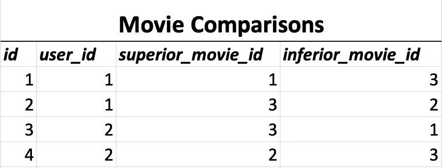**

**此表显示了两个持相反意见的用户。**

**用户 1 创建了我们一直在使用的相同层次结构(电影 1 优于 3，3 优于 2)。用户 2 有相反的意见:他们认为电影 1 不如电影 3，电影 3 不如电影 2。**

**警告:为了继续进行新的表设置，我们需要*回滚我们的数据库*以在比较表中添加另一列。目前，我们有`id`、`superior_movie_id`和`inferior_movie id`。必须加上`user_id`。**

**`$ rails db:rollback`**

**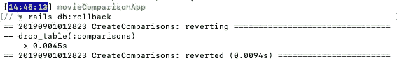**

**改变比较迁移:**

**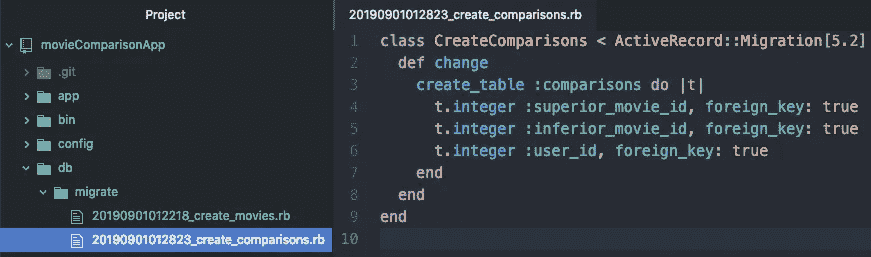**

**现在，在数据库迁移中创建一个带有名称属性(即数据库中的一列)的用户模型:**

**`$ rails g model User name`**

**删除时间戳后，我们只剩下:**

**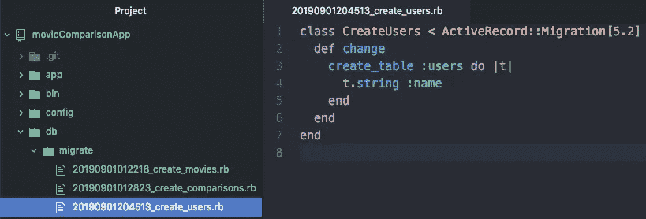**

**还应该创建了一个`User`模型:**

**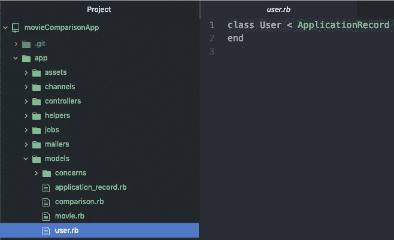**

**我们的目标是能够从每个`User`创建*多个*比较。每一个对比必然会包含一个劣等和优等的电影。**

**然后，我们应该能够看到某个特定用户认为优秀的所有电影以及该用户认为低劣的所有电影。**

**我们需要在`User`模型中包含所有这些信息。让我们从第一个也是最简单的开始:**

**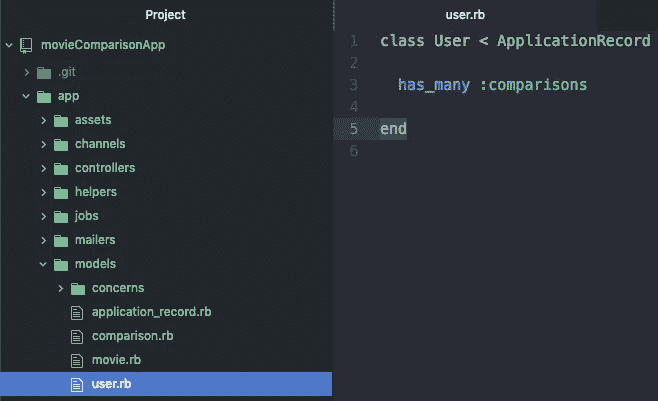**

**上面的`has_many`只是简单的说明了一个用户(以他们的`User_id`为代表)可以出现在*的多个*单独比较中。**

**声明了这个关系之后，我们就可以访问方法`.comparisons`，该方法将检索用户出现的所有比较的列表*。***

**接下来的两种关系现在是可能的:**

**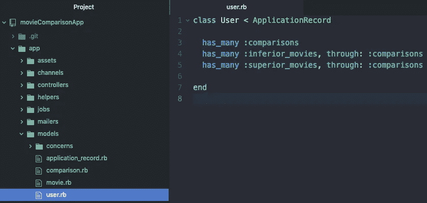**

**然后，Rails 将获取由第一行中定义的`.comparisons`方法创建的比较列表，并能够检索出现在`inferior_movie_id`列中的所有电影(方法:`.inferior_movies`)，以及出现在`superior_movie_id`列中的所有电影(方法:。上级 _ 电影 *s* )。**

**我们现在可以测试新的关系了。让我们用我们创建的初始表图中的信息更新种子文件:**

**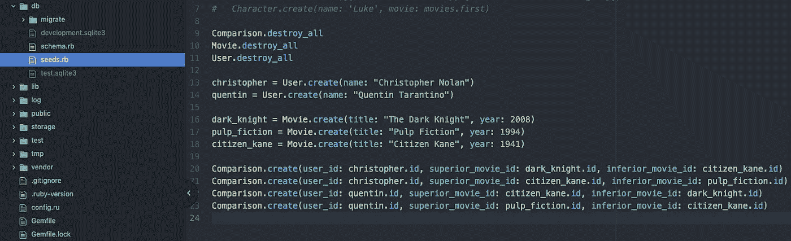**

**我喜欢我的数据库尽可能的干净。为了避免 id 混淆，我将重新设置所有内容:**

**`$ rails db:reset`**

**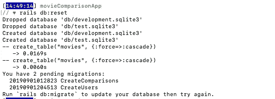**

**重新迁移:**

**`$ rails db:migrate`**

**重新播种:**

**`$ rails db:seed`**

**在控制台中检查我们的关系:**

```
**chris = User.first=> #<**User id: 1**, name: "Christopher Nolan">chris**.comparisons** => #<ActiveRecord::Associations::CollectionProxy [#<Comparison id: 1, **superior_movie_id: 1**, inferior_movie_id: 3, **user_id: 1**>, #<Comparison id: 2, **superior_movie_id: 3**, inferior_movie_id: 2, **user_id: 1**>]>chris.comparisons.count => 2 chris**.superior_movies** => #<ActiveRecord::Associations::CollectionProxy [#<**Movie id: 1**, title: "The Dark Knight", year: 2008>, #<**Movie id: 3**, title: "Citizen Kane", year: 1941>]>chris.inferior_movies => #<ActiveRecord::Associations::CollectionProxy [#<Movie id: 3, title: "Citizen Kane", year: 1941>, #<Movie id: 2, title: "Pulp Fiction", year: 1994>]>**
```

**非常好。你已经成功地实现了三联最重要的一环。我们的目标是能够从一个特定的用户那里获得劣质和优质的电影。我们现在可以做到这一点。**

**为了更好更谨慎的学习，让我们创建三重连接的另外两边。我们应该能够将刚刚学到的原理应用到电影中。**

**从一部电影中，我们应该能够接触到该电影的“粉丝”(即把该电影放在`superior_movie_id`栏中的用户)，以及那些“憎恨者”。**

**为此，用这两种关系更新电影模型:**

**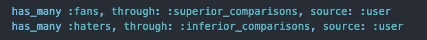**

**翻译:当你在一部电影上调用“fans”方法时，Rails 将通过遍历*之前定义的高级比较列表，找到并收集所有 ID 出现在`user_id`列中的`User`对象(来源:`user`)。***

**完整的电影模型视图:**

**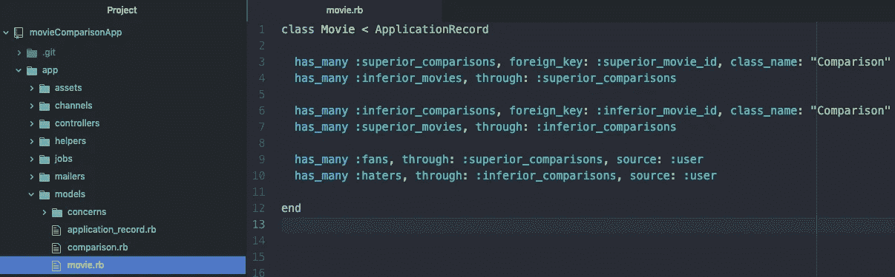**

**此时，如果您尝试执行这些方法中的任何一个(`.fans`或`.haters`，您将会得到这个错误:**

```
**Movie.first.fans ActiveRecord::HasManyThroughSourceAssociationNotFoundError **(Could not find the source association(s) :user in model Comparison.** Try 'has_many :fans, :through => :superior_comparisons, :source => <name>'. Is it one of superior_movie or inferior_movie?)**
```

**`ActiveRecord`找不到`Comparison`和`User`之间的关联。很幸运，那是我们的*最后一个*关联*和*方法创建的。而且很简单。让我们现在就开始吧:**

**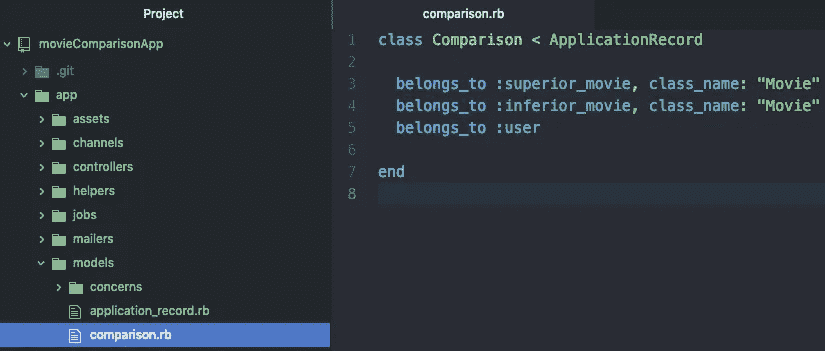**

**我们知道这意味着什么。每当我们创建一个比较时，它必须不仅有一个来自`inferior_movie`和`superior_movie`表的 ID，还有一个来自`User`表的 ID(通过`user_id`列)。**

**在控制台中对此进行测试:**

```
**firstMovie = Movie.first => #<Movie id: 1, title: "The Dark Knight", year: 2008>------------firstMovie**.superior_comparisons** => #<ActiveRecord::Associations::CollectionProxy [#<Comparison id: 1, superior_movie_id: 1, inferior_movie_id: 3, **user_id: 1**>]>firstMovie**.fans** => #<ActiveRecord::Associations::CollectionProxy [#<**User id: 1**, name: "Christopher Nolan">]>-------------firstMovie**.inferior_comparisons**=> #<ActiveRecord::Associations::CollectionProxy [#<Comparison id: 3, superior_movie_id: 3, inferior_movie_id: 1, **user_id: 2**>]>firstMovie**.haters** => #<ActiveRecord::Associations::CollectionProxy [#<**User id: 2**, name: "Quentin Tarantino">]>**
```

# **胜利！**

**注意:使用这种三重连接，当您创建一个新的`Comparison` ( `user_id`、`inferior_movie_id`和`superior_movie_id`)时，`ActiveRecord`需要所有三个 id。**

**因此，创建新比较实例的`<<`铲方法不再有效。如果我们想创建新的实例，我们需要明确。我们将在第 3 部分讨论这个问题。**

# **概述**

**我们创建了一个 Rails 应用程序，定义了正确的模型、迁移和关系，然后植入数据库来测试我们的工作。**

**在下一篇文章中，我们将获取这些数据并将其显示在浏览器中。然后，我们将定义允许我们轻松地为特定用户创建新比较的操作。**

**对于所有的兴奋和更多: [*电影比较网站在 Ruby on Rails*](https://medium.com/@jdprince555/movie-comparison-website-in-ruby-on-rails-4632f2e1dee2) *。***

**如果你想下载我们到目前为止所做的工作，请访问 [GitHub repo](https://github.com/SwanHub/exampleMovieComparisonApp) 。**

# **结论**

**如果你在这里下车，感谢阅读！请务必访问下面的网站，获取利用这种三重连接关系的电影推荐网站的工作示例。**

**(Heroku 加载页面可能需要 10 秒钟，但一旦网站加载完毕，你就可以轻松导航了)。**

**[MyMDb](http://my-m-db.herokuapp.com)**

**为你干杯，泰德·科德。**

**快乐编码，**

**杰克逊**