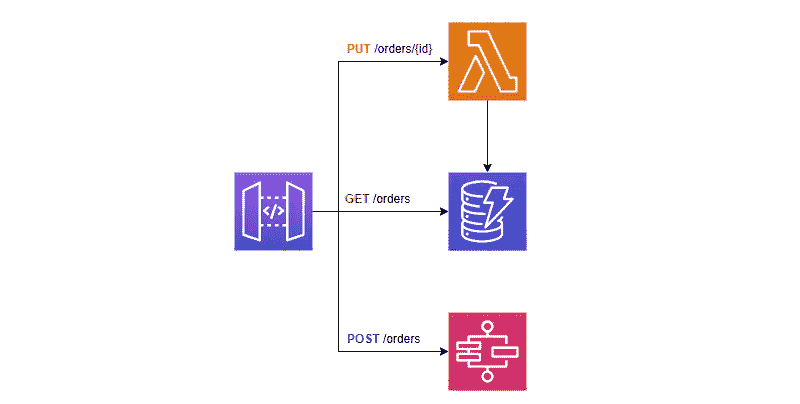
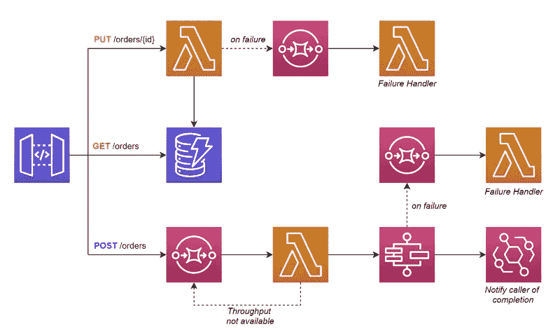

# 构建可完美扩展的无服务器应用程序

> 原文：<https://betterprogramming.pub/building-serverless-applications-that-scale-the-perfect-amount-ca6f75ae94a5>

## 设计合适的规模是一项巨大的建筑任务。在无服务器的情况下，一部分是为你处理的，但是一部分是你自己处理的

图片由 [Pixabay](https://pixabay.com/?utm_source=link-attribution&amp;utm_medium=referral&amp;utm_campaign=image&amp;utm_content=2180330) 的[凯文·施耐德](https://pixabay.com/users/kschneider2991-4936815/?utm_source=link-attribution&amp;utm_medium=referral&amp;utm_campaign=image&amp;utm_content=2180330)拍摄

当人们向你推销无服务器时，你会听到的一个好处是*“它为你处理扩展，你永远不用担心它。”*

伙计，我希望那是真的。

不是的。

事实是，你的云供应商*会为你处理扩展事件。也很好。它的处理无需您的任何干预，并且几乎可以扩展到任何级别([假设您已经增加了服务配额](https://docs.aws.amazon.com/servicequotas/latest/userguide/request-quota-increase.html))。*

不真实的是你不必为此担心的事实。在设计无服务器应用程序时，你必须考虑规模。

在设计应用程序时，您需要大致了解请求进入的程度。是每秒 1 个请求吗？10?1,000?100,000?

对于每个数量级，您需要考虑如何处理系统中增加的负载。规模不仅仅指 API 网关处理流量的方式。这是您的数据库、后端进程和 API 处理流量的方式。如果这些组件中的一个或多个不能像其他组件一样扩展到容量，您将遇到瓶颈并降低应用程序性能。

今天，我们将讨论基于预期的规模(为了安全起见，还要额外增加一点)来构建您的应用程序的不同方法。

*免责声明—各种秤级别没有行业标准名称或定义。我将使用的名称是编造的，并不打算反映软件的质量或意义。*

# 小规模(每秒 1-999 个请求)

当在小范围内操作一个系统时，你是幸运的。您可以在没有太多特殊设计考虑的情况下构建。从理论上来说，*事情应该只是工作*。这并不意味着将您看到的第一个示例项目交付使用([无论如何，您都不应该在生产中使用 POCs](/4-reasons-you-should-never-use-proof-of-concepts-in-production-ca54432e52b9))。

但这确实意味着在大多数情况下，你可以设计你的应用程序来遵循无服务器架构的标准模式。

在小范围内，基本的无服务器构建模块是您最好的朋友，将带您走得更远。但是无论你计划什么样的规模，你都必须记住[检查你将消费的服务的服务配额](/solutions-architect-tips-how-to-design-around-serverless-service-limits-15e12b5c4235)。考虑以下小规模 API 的模式。

*小规模 API 结构*

对于此体系结构，您关心的服务配额是:

*   Lambda 函数并发执行—默认为 1，000
*   DynamoDB 的容量单位大小
*   标准工作流状态机的开始执行限制—默认情况下，某些区域为每秒 1，300 次，其他区域为每秒 800 次

此架构使用的服务还有其他服务配额，但在这个规模上，我们不会达到这些配额。

如果我们达到了规模的顶端和/或我们的平均 Lambda 函数执行时间超过一秒，那么请求增加并发执行的服务配额将是一个很好的练习。如果您的平均执行时间非常短，大约在*<200 毫秒*左右，那么您可能也是清白的。

> *如果您开始经常达到服务配额的 70–80 %,您应该请求增加。*

对于 DynamoDB，您有几个选择。您可以[提供容量](https://docs.aws.amazon.com/amazondynamodb/latest/developerguide/HowItWorks.ReadWriteCapacityMode.html#HowItWorks.ProvisionedThroughput.Manual)，为您的服务设置每秒的读写次数，或者您可以使用[按需](https://docs.aws.amazon.com/amazondynamodb/latest/developerguide/HowItWorks.ReadWriteCapacityMode.html#HowItWorks.OnDemand)模式，如果您有可变或未知的工作负载，该模式可以为您扩展。

如果您使用按需容量，就不必担心扩展问题。DynamoDB 将为您自动缩放。但是，如果您正在使用调配的容量，您需要确保您已经了解了您真正需要的吞吐量。

对于 Step 函数，您需要注意通过 API 启动的标准工作流的数量。您可以启动的标准工作流的默认数量为每秒 1300 个，在`us-east-1`、`us-west-1`和`eu-west-1`中还有 500 个突发。如果您的应用程序在该地区之外运行，那么默认情况下，您被限制为 800。

注意，这个服务配额是针对*开始新的执行*。在受到限制之前，您可以同时运行多达 100 万个执行。但是在这种规模下，我们可能不用担心这个。

# 中等规模(每秒 1，000–9，999 个请求)

下一级规模肯定需要一些设计考虑。如果您期望每秒 1K 10K 请求的持续负载，您需要考虑相当大的容错能力。在这种规模下，如果 99.9%的请求成功，这意味着每天会有 86，400 到 864，000 次失败。因此，容错和冗余在这个级别的规模中占有特殊的位置。

虽然你应该[总是为重试](/3-ways-to-retry-failures-in-your-serverless-application-84b5102f620)而设计，但当你谈论规模时，这变得尤其重要。管理这种规模的重试和容错对于人类来说很快就变成了一项不可能完成的任务，因此自动化流程是您成功的关键。

让我们看看当我们转移到中等规模时，我们的架构图是如何更新的。

*中等规模的 API 结构*

架构略有改动。我们仍然有连接到 Lambda 和 DynamoDB 的端点，但我们不再直接连接到 Step 函数。相反，我们在它前面放了一个 SQS 队列作为缓冲。这无意中使端点异步。

Lambda 函数从队列中取出批次，验证阶跃函数吞吐量可用，然后开始执行。如果它不可用，它将把它放回队列中，以便后退并重试。

当状态机完成时，它触发一个 EventBridge 事件来通知调用者操作已经完成。

对于这种体系结构和规模级别，您应该关心的服务配额是:

*   Lambda 函数并发执行——您*必须*请求增加处理量
*   EventBridge PutEvents 限制—在某些地区默认为每秒 10K，但在其他地区则低至每秒 600

根据文档中的[，Lambda 函数的并发性可以增加到数万个，所以我们在这里讨论，我们不必担心我们在 SQS 和阶跃函数之间添加的额外的“Lambda 函数胶”。](https://docs.aws.amazon.com/lambda/latest/dg/gettingstarted-limits.html)

随着这个设计中 Lambda 函数的新涌入，我们需要在较低优先级的函数上实现[保留并发](https://docs.aws.amazon.com/lambda/latest/dg/configuration-concurrency.html)。保留并发占你的帐户中 Lambda 函数总并发的一部分，并将其专用于该函数。该功能只允许放大到您设置的值。这可以防止低优先级函数不必要地占用您的所有并发性。使用保留并发仍然允许函数在不使用时扩展到 0。

在保留并发的另一面，[提供的并发](https://docs.aws.amazon.com/lambda/latest/dg/provisioned-concurrency.html)保持 N 个功能容器热，因此您不必等待冷启动时间。这对于尽可能缩短响应时间尤为重要。

这也是谈论 [DynamoDB 单表设计](https://www.alexdebrie.com/posts/dynamodb-single-table/)以及您的数据模型在这种规模下如何特别重要的好时机。在单表设计中，所有的数据实体都存在于同一个表中，并通过不同的分区键在逻辑上分隔开来。这允许在您的服务中以最小的延迟快速方便地访问数据。

但是 DynamoDB 的每个分区有 3000 个读容量单位(RCU)和 1000 个写容量单位(WCU)的限制。

如果您的数据模型没有平均分配请求，您将创建一个[热分区](https://docs.aws.amazon.com/amazondynamodb/latest/developerguide/bp-partition-key-uniform-load.html)并抑制您的数据库调用。在中等规模或更大规模的情况下，数据的保存方式对可伸缩性至关重要。因此，一定要设计数据模型，使*支持简单的* [*写分片*](https://docs.aws.amazon.com/amazondynamodb/latest/developerguide/bp-partition-key-sharding.html) ，这样你的数据分区就多样化了。

当我们达到第二级规模时，需要考虑很多问题。但是，当我们达到最终的规模水平时，还有更多的因素需要考虑。

# 大规模(每秒 10，000 多个请求)

[Justin Pirtle](https://twitter.com/justinpirtle) 在 AWS re:Invent 2021 上发表了关于[为超大规模](https://www.youtube.com/watch?v=GNUSdekIaMw)构建无服务器应用的演讲。在视频中，他谈到了大规模应用的最佳实践。最重要的因素？缓存、批处理和排队。

考虑到这些因素，让我们看看我们的架构是如何从小规模模型变化而来的。

*大规模 API 结构*

有了这样的架构，我们非常依赖于[异步处理](/and-the-2022-word-of-the-year-for-programmers-is-3605dc1bd698)。因为几乎所有的 API 调用都会导致排队，这意味着大多数调用将依赖后台批处理。API 网关[直接连接到 SQS](https://serverlessland.com/patterns/apigw-sqs) ，这导致一个 Lambda 函数拉取成批的请求进行处理。

当处理完成时，它触发一个事件来通知调用者处理已经完成。或者，您可以遵循[作业模型方法](/build-better-serverless-apis-by-going-storage-first-597784f8f399)让调用者自己查询状态更新。

如果在处理批处理中的一个或多个项目时出现错误，您可以在事件源映射上设置[二等分 BatchOnFunctionError](https://docs.aws.amazon.com/AWSCloudFormation/latest/UserGuide/aws-resource-lambda-eventsourcemapping.html#cfn-lambda-eventsourcemapping-bisectbatchonfunctionerror) 属性，以拆分批处理并重试。这可以让你获得尽可能多的成功项目。

我们还在表前面引入了 [DynamoDB 加速器(DAX)](https://aws.amazon.com/dynamodb/dax/) 作为缓存。这有助于将 rcu 保持在我们的桌面上，并为缓存命中提供微秒级的延迟。

之前级别中的所有服务配额仍然适用于该级别，此外还有一些额外的服务配额:

*   每秒 API 网关请求数—默认为每个地区所有 API 的每秒 10K 数
*   阶跃函数标准工作流状态转换—在某些地区为每秒 5K，在其他地区为每秒 800

在大范围内，您的架构问题也开始变得更高。由于有如此多的服务配额必须管理和增加，因此将您的微服务分离到它们自己的 AWS 帐户中是一个好主意。将服务隔离到它们自己的帐户将防止不必要的资源争用。您将有更多的客户需要管理，但是您的服务配额变得更容易达到。

API Gateway 对其每秒可以消耗的请求数有一个软限制服务配额。默认为 10，000，这个限制是您的帐户在特定地区的所有 REST、HTTP 和 WebSocket APIs 的总和。这就是为什么将您的服务和 API 隔离到它们自己的帐户是好的。*这个限制必须大幅度提高*。

在所有标准执行工作流中，Step 函数有一个有趣的服务限制，即每秒 5，000 次状态转换。因此，如果您同时运行 5，000 多个标准工作流，如果每个工作流每秒转换一种状态，您将会受到限制。

如果可以，将执行切换到[快速工作流](https://docs.aws.amazon.com/step-functions/latest/dg/concepts-standard-vs-express.html)。它们适用于高容量的事件处理工作负载，规模比标准工作流高几个数量级。快速工作流没有状态转换限制。

如果您不能更改工作流类型，那么您必须在状态机的每个状态下显式捕获并重试限制异常。

显然，一个扩展到如此规模的应用程序将会花费大量的资金来运行。这意味着你应该抓住一切机会[优化你的应用程序的性能](/quick-optimizations-you-should-make-to-your-serverless-applications-9cc73ec464b9)。

如果可能的话，直接连接服务，而不是使用 Lambda。切换您的功能以使用 [arm64 架构](https://aws.amazon.com/blogs/aws/aws-lambda-functions-powered-by-aws-graviton2-processor-run-your-functions-on-arm-and-get-up-to-34-better-price-performance/)。尽可能批处理您的 SDK 调用。

这些零零碎碎的东西很快累积起来，为你每月的账单省下一大笔钱。

# 结论

数字很重要。

您的应用程序获得的流量直接影响您如何设计架构。为你不久的将来的规模而设计，而不是为你 10 年后的规模而设计。

无服务器不是银弹。仅仅通过在 Lambda 函数中编写我们的业务逻辑并不能解决我们所有的问题。

> *无服务器服务*可以*扩展并不意味着它们*也会*扩展。*

作为一名解决方案架构师，您的工作是确保您的应用程序的所有部分都能够一起伸缩。您不希望接收组件的规模明显高于处理组件。这将建立一个不断增长的请求积压，你将永远无法消费。*找到平衡*。

注意你的服务极限。为重试设计您的应用程序。自动化一切。像鹰一样看着它。无论规模如何，您都需要掌握您的应用程序，并准确了解它在任何时间点的运行情况。这将有助于您进行相应的调整(如有必要)，并构建既能提高性能又能降低成本的优化。

当你觉得你已经构建了一个可扩展到你预期数量的应用程序时，[对它进行一次负载测试](/how-to-load-test-your-apps-for-free-by-going-serverless-66524d904d09)。确保它做它应该做的事。

祝你好运。为高规模设计应用程序是一项有趣而独特的挑战。在某些情况下，基础设施和业务逻辑同样重要。

编码快乐！