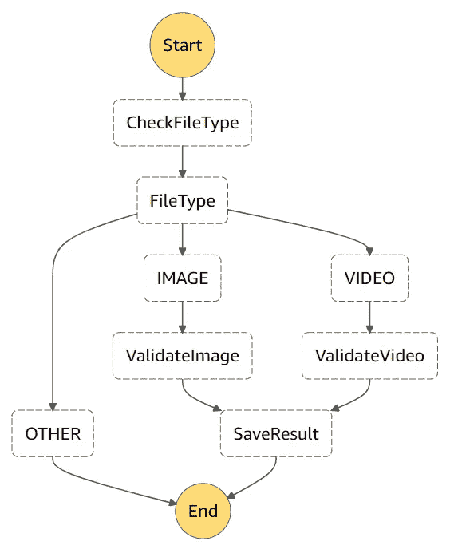

# 用 AWS 构建无服务器内容审核系统

> 原文：<https://betterprogramming.pub/building-serverless-content-moderation-app-with-aws-7907fbed513>

## 在 15 分钟或更短时间内使您的应用更加安全

泰勒·维克在 [Unsplash](https://unsplash.com/photos/40XgDxBfYXM?utm_source=unsplash&utm_medium=referral&utm_content=creditCopyText) 上的照片

核实我们的用户上传的是什么样的内容是至关重要的。我们不希望有任何类型的色情或暴力作为我们网站上的第一件事。幸运的是，如果我们用 AWS 构建我们的应用程序，我们可以使用一整套人工智能服务来标记和验证所有类型的内容。让我们看看如何使用 AWS 的构建模块，通过几个简单的步骤自动验证来自用户的图像和视频。

我们将使用以下服务:

*   *用于存储内容*
*   *[λ](https://aws.amazon.com/lambda/)用于计算*
*   *[用于编排 Lambdas 的步骤功能](https://aws.amazon.com/step-functions/)*
*   *[亚马逊内容审核认证](https://aws.amazon.com/rekognition/)*
*   *[用于部署的无服务器应用模型](https://aws.amazon.com/serverless/sam/)*
*   *[DynamoDB](https://aws.amazon.com/dynamodb/) 用于存储结果*

*无服务器方法最酷的特性是，处理一个请求和一百万个请求花费的时间差不多。我们的应用程序将自动扩展，我们将只为使用的资源付费。我们将为大量用户做好准备，并能够为他们提供同样的速度和质量。*

*我们的用户可以上传图像和视频到我们的应用程序，存储在 S3 桶。我们希望他们尽快得到处理。上传一个新文件到一个存储桶会创建一个我们可以订阅的新事件。我们可以在上传完成后立即运行 Lambda 函数。*

*我们可以直接在 SAM 模板中或通过 AWS 控制台定义触发器*

*在实际应用程序中，还会有一些系统验证上传到 bucket 的内容。我们肯定需要验证像大小和内容类型这样的参数。现在，为了简单起见，我们将只关注内容审核部分。*

*Lambda 是一个小型计算单元，仅在需要时调用。它可以从 API 调用，也可以由其他服务的事件触发。我们已经让我们的第一个 Lambda 函数在新文件出现或在内容目录中更新时运行。这是存储图像和视频的地方。第一个 Lamdba 的工作将非常简单——它将只启动 step 函数，该函数将负责几个步骤中的审核过程。AWS Step 函数是一个状态机，根据每个步骤的结果，可以触发适当的行为。*

*我们使用环境变量来传递已用资源的 ARN。环境变量可以直接在 SAM 模板中定义，这将使我们的应用程序更加灵活。像资源的 ARN 或存储桶和数据库的名称这样的参数可能会改变，如果这些参数被硬编码到应用程序中，就很难跟踪它们。*

*温和内容. py*

*我们提取了将要使用的信息(bucket 的名称和上传的文件),并将其传递给 step 函数。我们希望能够调节图像和视频。这两者需要以稍微不同的方式来处理。视频审核更耗时，需要不同的方法。*

*我们需要做的第一件事是检测文件的类型。在这种情况下，我们想要支持的图像是。巴新和。视频用 jpg 和. mp4。图像将被传递到一个自定义的 Lambda 函数，该函数将通过一个 API 调用从 Amazon Rekognition 获取审核标签。分析视频要耗时得多，并且会触发内容审核并在 SQS 队列上等待结果。之后，我们将在数据库中存储文件标签。让我们看看我们能多快做到。*

*我们将从定义阶跃函数流开始。这可以用一个 JSON 文件来完成。*

**

*我们的状态机图*

*SAM 模板中的状态机定义*

*检测 MIME 类型是一项非常简单的工作。我们所要做的就是使用上传文件的名称和`mimetypes`库。*

*checkFileType.py*

*根据检测到的 MIME，我们有三种可能的路径:图像、视频或其他。如果一个文件既不是图像也不是视频，我们将结束我们的状态机为失败。*

*我们将通过 Boto3 访问 AWS 服务。由 AWS 维护的是 python SDK，它提供了非常简单的 API 和很好的文档。我们希望只使用置信度超过 75%的声音标签。我们不希望我们的应用程序中有任何暴力和性内容，所以我们将它们标记为不安全。可用标签的完整列表可以在[这里](https://docs.aws.amazon.com/rekognition/latest/dg/moderation.html)找到。*

*在我们的 Lambdas 中使用外部 AWS 服务时，我们必须记住设置适当的权限。一切都可以在 SAM 中直接定义。yaml 模板。完整的源代码可以在下面的[库](https://github.com/jkapuscik2/serverless-content-moderation)中找到。*

*验证图像. py*

*验证. py*

*通过一个简单的 API 调用，我们已经调整了我们的形象，并且可以进一步传递结果。分析一个视频更棘手。我们将从初始化作业开始，并提供一个接收消息的 SNS 主题。SQS 队列订阅了该主题，因此我们可以使用给定的`jobId`来监听传入的消息。视频审核可能需要一些时间，具体取决于其大小和长度。它还可以有比图像多得多的标签，因此数据有可能被分页。在收集结果时，我们必须牢记这一点。*

*我们有关于上传内容的数据，所以是时候将它们保存在一些持久存储中了。DynamoDB 看起来很适合这项工作。*

*我们的网站现在没有滥用内容，所以我们的用户和他们的孩子可以放心地浏览它。本例中使用的每个服务都符合 AWS 免费层的条件，所以除非您有很多活跃用户，否则一切都是免费的。*

*在真实的应用程序中，我们还会保存审核过程中的错误信息，但这只是一个简短的展示。*

# *问题和故障排除*

*一切事情一旦做起来，看起来都很顺利，但是在开发过程中可能会出现很多问题。我们遇到了 Lambda 调用的无限循环，并以几万个不必要的调用结束。原因是 S3 事件直接触发了 Lambda 中的一个错误。我们启动了 Step 函数，想返回 JSON 响应。响应格式不正确，导致了错误。AWS 将该 Lambda 视为失败，并应用了[自动返回策略](https://docs.aws.amazon.com/lambda/latest/dg/retries-on-errors.html)。*

*花时间看看 CloudWatch 日志，看看你的 Lambdas 表现如何，总是值得的。*

# *源代码*

*完整的源代码可在以下存储库中找到:*

* [## jkapuscik 2/无服务器-内容-审核

### 此时您不能执行该操作。您已使用另一个标签页或窗口登录。您已在另一个选项卡中注销，或者…

github.com](https://github.com/jkapuscik2/serverless-content-moderation)*