# 使用 Akka 集群分片构建分片应用

> 原文：<https://betterprogramming.pub/building-sharded-application-using-akka-cluster-sharding-ce2f34e54115>

## OpenAPI 工具+Spring+Bazel+Akka+Cassandra+Kubernetes


照片由 [**C 达斯汀**](https://unsplash.com/@dianamia) 在 [Unsplash](https://unsplash.com/photos/91AQt9p4Mo8)

到目前为止，分片作为一个概念主要用于数据库环境中。但是在本文中，我想让我们探讨用这种范式设计应用层的含义。

今天，我将尝试捕捉构建一个分片应用程序所需要的一些本质，所以不会讨论理论或基本的设计细节。因此，要了解应用层的分片是什么样子，请浏览这篇文章。

我将从 API 优先设计开始，并通过使用一些基础设施服务提供商部署应用程序的最后阶段来讲述我的方法。对于当今使用的任何技术，我既不是老手，也不自称是专家，所以对我说的一切要持保留态度。本文旨在从创建到运行时维护的各种技术的角度，为编写分片微服务提供一个起点或基本框架。

作为一个例子，我们将构建一个键值缓存服务，它使用 Akka 集群分片对应用程序级存储进行分片。

这是我们正在构建的图形表示:

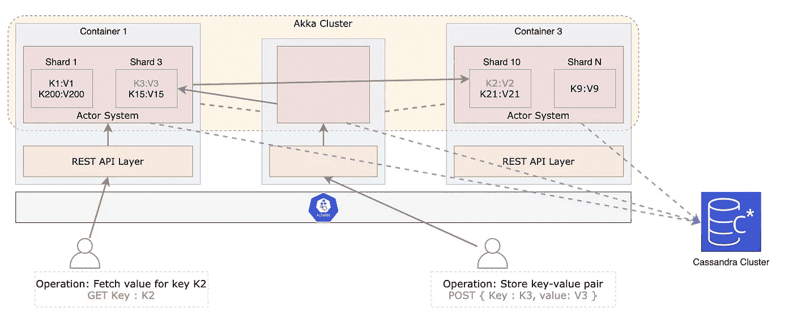

让我们来看看各个阶段的时间顺序，以及开发这样一个微服务并在以后部署它需要做些什么:

1.  API 层设计，通过消费 OAS 3.0，使用 OpenAPI 代码生成器生成 Spring 控制器代码
2.  通过 Bazel 构建和执行我们的应用程序。
3.  应用层设计:我们将使用 Akka 集群分片合并我们的业务逻辑(即 KV 缓存逻辑)，其中我们将利用 Cassandra 作为后备存储。
4.  使用 Docker 实现应用程序的容器化。
5.  通过数字海洋在 K8s 集群上部署所述容器。

通过 Git 片段的使用，我将介绍我设计架构和开发应用程序代码的思维过程。为了避免这成为一个多部分的系列，我将在本文中链接许多参考资料。他们会解释技术堆栈的必要部分，而不需要我去浏览它们。

作为这篇文章和代码的作者，由于我自己狭隘的观点，我可能会跳过一些必要的解释或步骤。因此，如果有些东西没有意义或感觉不完整，请在评论区伸出手，这样文章可以迭代改进。如果我能提供至少一个有价值的见解，我将认为这是一个成功。我希望你找到你正在寻找的东西。尽情享受吧！

# 先决条件

在我们进入问题的关键之前，非常需要熟悉上面提到的堆栈:

1.OpenAPI 规范，即 OAS 3.0，是一个语言不可知的 API 定义文档，它可以描述由服务公开的 HTTP APIs 的风格。代码生成器可以使用该规范来生成黄金标准的客户端绑定和服务器存根，从而将开发人员的生产力提高到更高的水平。下面的博客提供了对 OAS 及其相关工具的深刻见解。

 [## 什么是 OpenAPI？OpenAPI 规范(OAS)简介

### OpenAPI 继续发展并维持着一个充满活力、相互联系的 API 经济。在这里，我们定义 OpenAPI 到底是什么…

blog.apideck.com](https://blog.apideck.com/introduction-to-openapi-specification) 

在所有围绕 OpenAPI 规范构建的工具中，对我们来说最重要的是 OpenAPI 生成器。该工具使用 OpenAPI 规范文件来生成 SDK、服务器存根或支持 20 多种编程语言的文档。OpenAPI generator 会帮助我们为自己设计的 API 生成 spring 服务器存根，我们要做的就是用 OpenAPI 定义来描述它们。

[](https://github.com/OpenAPITools/openapi-generator) [## GitHub—open api tools/open API-Generator:open API Generator 允许生成 API 客户端…

### OpenAPI 生成器允许生成 API 客户端库(SDK 生成)、服务器存根、文档和…

github.com](https://github.com/OpenAPITools/openapi-generator) 

2.Akka 是一个帮助创建高性能分布式应用程序的工具包，其核心是受 Actor 系统的影响并遵循 Actor 系统的范式。对于不熟悉演员概念的读者，我建议他们看看下面的博客:

[](https://www.brianstorti.com/the-actor-model/) [## 10 分钟后的演员模特

### 我们的 CPU 并没有变得更快。现在的情况是，我们已经拥有了多个内核。如果我们想拿…

www.brianstorti.com](https://www.brianstorti.com/the-actor-model/) 

要理解为什么 Akka 框架如此适合设计可伸缩的、有弹性的并发系统，请参考以下内容:

[](https://doc.akka.io/docs/akka/current/typed/guide/actors-intro.html) [## 参与者模型如何满足现代分布式系统的需求

### 如前一主题所述，常见的编程实践并不能很好地满足要求苛刻的现代…

doc.akka.io](https://doc.akka.io/docs/akka/current/typed/guide/actors-intro.html) 

Akka 提供了内置的库来支持集群中多个实例上的分片角色机制。所以我们只需要担心使用 actor 系统范式设计我们的业务逻辑。查看 Akka 文档时，请注意以下几点:

1.  [演员介绍](https://doc.akka.io/docs/akka/current/typed/actors.html)
2.  [使用事件源的参与者状态的持久性](https://doc.akka.io/docs/akka/current/typed/persistence.html)
3.  [聚集在阿卡](https://doc.akka.io/docs/akka/current/typed/cluster.html)

3.阿帕奇卡桑德拉。选择 Cassandra 的最好理由是通过 Akka 分片库提供的插件，通过 Cassandra 使事件源成为一个持久的范例。

这也是一个明智的选择，因为 Cassandra 可以水平扩展，同时保持效率和速度高于一切，这使它成为为分片服务编写持久化层的绝佳选择，我们可以在事件发生时不断编写状态变化事件。

[](https://www.freecodecamp.org/news/the-apache-cassandra-beginner-tutorial/) [## Apache Cassandra 初学者教程

### 如今有很多数据存储选择。您必须在托管或非托管、关系型或…

www.freecodecamp.org](https://www.freecodecamp.org/news/the-apache-cassandra-beginner-tutorial/) 

这是我为我们正在构建的键值缓存服务创建的 git 存储库:

[](https://github.com/VamshikShetty/akka-cluster-sharding-kv-service) [## GitHub-VamshikShetty/akka-集群-分片-kv-服务

### 此时您不能执行该操作。您已使用另一个标签页或窗口登录。您已在另一个选项卡中注销，或者…

github.com](https://github.com/VamshikShetty/akka-cluster-sharding-kv-service) 

# 1.使用 OpenAPI 生成器和 OAS 3.0 生成 Spring 代码

我们的应用程序的目标是存储键-值对，这至少需要两组操作，即存储键-值对和根据提供的键获取值。

以下要点展示了 kv 缓存服务所需的完整 OAS。有两个操作是不言自明的，即 POST 方法带有一个存储数据的请求体，该请求体通过确认数据是否被存储来响应。GET 方法使用反映键的查询参数，如果键-值对不存在，则返回值或 null。

随着 OAS 文件的消耗，OpenAPI 生成器也需要生成器配置来生成 spring 服务器存根。我们的生成器配置只利用了最少的必需属性来生成合适的 spring 代码:

要更好地理解 OpenAPI 生成器配置，请参考以下内容:

 [## OpenAPI 生成器从 OpenAPI 2.0/3.x 文档生成客户端、服务器和文档

### 以下发电机可用:

openapi-generator.tech](https://openapi-generator.tech/docs/generators) 

接下来，我们将使用 OpenAPI 规范和生成器配置文件来生成我们的 spring 代码。下面是 shell 脚本，它使用 OpenAPI 代码生成器的 docker 映像来生成所需的 spring 服务器存根([使用参考](https://github.com/OpenAPITools/openapi-generator#16---docker))。

> **注意**:上面提到的脚本从一个名为 spec 的文件夹中选择我们的 OAS 和代码生成器配置文件。

在我们执行了上面的 shell 文件之后，我们当前的工作目录应该看起来像这样:

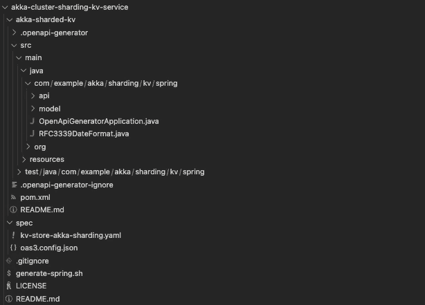

目前，我们在`akka-sharded-kv`文件夹中看到的一切都是生成的代码。在我们使用 Akka 在生成的代码旁边添加业务逻辑之前，让我们开始使用 Bazel 作为构建工具。

# 2.我们项目的市场化

使用 Bazel 构建这个项目并执行产生的 java 二进制文件是个人的选择。我建议读者阅读 Bazel，但是他们可以很容易地使用其他构建自动化工具，比如 gradle、maven 等。

**注意:**眼尖的读者可能已经注意到`pom.xml`是和 spring 代码一起生成的。我们可以构建和部署应用程序，但我们不会使用它，而是用 Bazel 需要的东西来替换它。

对于不熟悉使用 Bazel 进行 Java 项目的读者，可以参考以下内容:

 [## Bazel 教程:构建一个 Java 项目

### 本教程涵盖了用 Bazel 构建 Java 应用程序的基础知识。您将设置您的工作区并构建一个…

巴泽尔. build](https://bazel.build/start/java) 

正如上面的教程所解释的，我们必须创建 [BUILD](https://github.com/VamshikShetty/akka-cluster-sharding-kv-service/blob/main/akka-sharded-kv/BUILD) 和 [WORKSPACE](https://github.com/VamshikShetty/akka-cluster-sharding-kv-service/blob/main/akka-sharded-kv/WORKSPACE) Bazel 文件。这些文件将驻留在`akka-sharded-kv`目录中。另外，记得删除通过 OpenAPI 代码生成器生成的`pom.xml`,因为不再需要它了。

一旦我们引入了构建和工作空间文件，我们就可以运行以下 Bazel 命令了:

```
# Run cmds from root of service directory
cd akka-sharded-kv# Bazel cmd to build our application
bazel build //:kv-akka-sharded# Bazel cmd to execute and start spring boot application
bazel run //:kv-akka-sharded
```

这里有一些材料试图为 Bazel 提供一个案例，因为本文并不打算这样做。

# 3.使用 Akka 构建分片的键值缓存逻辑

我们只写了四样东西，即 OpenAPI 规范、生成器配置、Bazel 构建和工作空间文件。而 spring 代码是通过 OpenAPI 代码生成器自动生成的。这或多或少涵盖了在我们的服务中设计和创建我们的 API 层。现在是时候添加以分片方式缓存键值对的业务逻辑了。

我希望你已经熟悉了一个演员的生命周期，以及在 Akka 演员系统中创建一个演员并与之互动的过程。如果没有，请浏览以下材料:

参与者还应该能够将消息或它们的状态或者两者都保存到通用存储系统中。Akka 通过两种方法提供持久性，即[事件源](https://doc.akka.io/docs/akka/current/typed/persistence.html)和[持久状态](https://doc.akka.io/docs/akka/current/typed/durable-state/persistence.html)。对于我们的键值缓存服务，我们将使用事件源范式来存储参与者的状态。

向前看，我们必须理解分片的含义，并将其与演员在演员系统中的行为相结合。幸运的是，Akka 集群提供了一种跨多个角色系统实例共享角色的机制。以下参考文献总结了 Akka 如何为我们实现这一机制，因此我们可以专注于业务逻辑:

1.  [Akka 中演员系统的集群分片概念](https://doc.akka.io/docs/akka/current/typed/cluster-sharding-concepts.html)
2.  [如何使用 Akka 实现集群分片](https://doc.akka.io/docs/akka/current/typed/cluster-sharding.html)

## 设计键值管理器实体

现在我们已经熟悉了 Akka 集群分片，让我们利用它来编写我们的业务逻辑。现在问问你自己:如果你有一些键值对，你想在应用程序层使用 Actors 来存储和缓存，你会怎么做？

也许，每个键-值对可以由单个参与者持有，对单个参与者的切分是对跨实例切分单个键-值对的反映。但是为每个新的键-值对创建一个单独的 actor 感觉有点过头了。此外，删除一个键值对需要我们从系统中删除持久化的 actor。

好了，转到下一个设计，我们可以创建一个键值管理器角色/实体，它基于一些内在的标识符来存储键值对组。为了创建键值管理器实体，我们可以利用键的前缀作为基于预定义长度提取的实体 id。这可能是这样的:

```
Predefined prefix length is 5kv pair 1 : { "hello-word" : "some-value-1" }
kv pair 2 : { "hello-you"  : "some-value-2" }
kv pair 3 : { "alerts-sys" : "some-value-3" }Here, key-value manager entity ID is prefix of key of defined length i.e. Using prefix length of 5 entity Id for pair 1 & 2 is “hello” and for 3rd pair its “alert”
```

这里有一个小问题，如果键比我们的前缀长度短怎么办。因此，为了解决这个问题，我们要么添加填充，要么从键的哈希前缀中派生实体 id。后一种方法看起来像这样:

```
Predefined prefix length is 5kv pair 1 : { "key-458997"  : "value-1" }
kv pair 2 : { "key-100"     : "value-2" }
kv pair 3 : { "key-1548533" : "value-3" }sha256 hash of "key-458997" :
ac100d31fa61174af78a25216ab2f70db52f3ef0473913561de20a6e6755c597
Entity Id to store this key-value in : ac100sha256 hash of "key-100" :
47bae8fa70a586fc7d275abc2e480472b7a052518931839d3e5e05c499476563
Entity Id to store this key-value in : 47baesha256 hash of "key-1548533" :
ac100894689f09fa054b3e92f4d09514c89a8add7d5c30969bd57abb3645a815
Entity Id to store this key-value in : ac100So now Kv manager entity with Id ac100 will store pair 1 & 3, whereas entity with Id 47bae will store 2nd pair
```

> **重要**:记住一个 actor/entity 的 Id 是用来计算这个 actor 会坐在哪个 shard 里面的。默认情况下，碎片标识符是实体标识符的`*hashCode*`的绝对值，以碎片总数为模。
> 参考:s [硬分配](https://doc.akka.io/docs/akka/current/typed/cluster-sharding.html#shard-allocation)

假设读者已经熟悉了在 Akka 集群中编写 actor/entity 的基础知识，我们将定义一个键值管理器实体，它维护一个持久化多个键值对的状态。该实体接受两个命令:

`StoreValueCmd`:这个命令包含一个键值对，需要持久化到`KvManagerEntity`状态的 hashmap 中，这个 hashmap 是在`KVState` Java 类中定义的。

在接收到这个命令时，实体首先持久化`StoreValueEvent`，然后通过向 hashmap 添加键值对来改变内部状态。

`FetchValueCmd`:该命令从`KvManagerEntity`的`KVState`中取出所提供密钥的值。如果键不存在，那么它返回 null。

**注意**:我们正在扩展 event sourced with enforced replies 类来设计我们的 actor/entity。因此，kv 管理器实体必须总是响应接收到的命令。

参考:[Akka 演员的强制回复](https://doc.akka.io/docs/akka/current/typed/persistence.html#replies)

让我们定义一个 spring 服务，它将代表 REST 层与驻留在 actor 系统中的键值管理器实体进行交互，以存储和获取键值对。请注意这三个重要的函数定义:

1.  `kvManagerEntityId`:从键的散列中生成实体 ID 的函数。
2.  `putKeyValue`和`getValue`:通过发送命令与 Akka 集群中的键值管理实体进行交互的功能，即`StoreValueCmd`和`FetchValueCmd`。

只需要几个实用程序类，创建一个 actor 系统并为我们的 actor 系统初始化分片区域。

让我们将所有的 Akka 逻辑捆绑在我们生成的 spring 代码旁边的`com.example.akka.sharding.kv.actor`包中。这将产生类似于以下内容的目录结构:

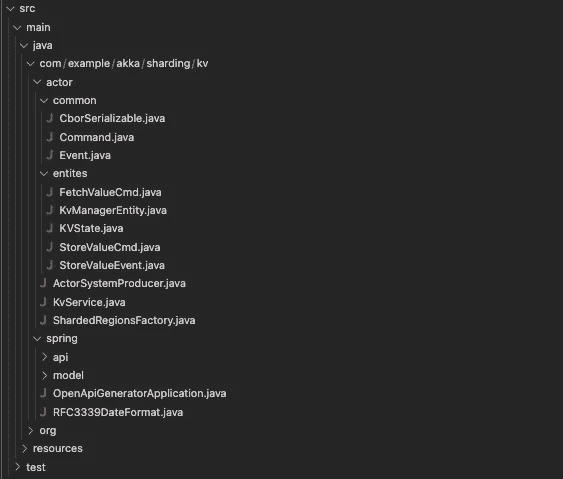

我们需要更新我们生成的 spring 代码，也就是我们的 REST 层，开始通过 spring 键值服务与我们的 actor 系统进行交互。

生成的 API 控制器继承了定义 REST 路由的 API 类。首先，我们必须定义一些这些路由可以调用的抽象函数。而利用`KvService`的逻辑需要放在生成的控制器内部:

1.  更新 spring 生成的 API 类以包含抽象逻辑函数，当检测到有效的 API 请求时需要调用这些函数:

2.更新 spring 生成的控制器类，以提供与键值服务层交互的能力。代码如下:

## 3.1.启动 Akka 集群的配置

3.1.1.Akka 中的序列化配置
Akka actors 需要通过 JVM 或实例互相发送消息来实现这种能力。这些信息需要序列化。下面的配置定义了要使用的序列化程序，并在我们的实现中将它绑定到一个公共的基本接口。

参考: [Akka 序列化文档](https://doc.akka.io/docs/akka/current/serialization.html)

将以下配置作为`serialization.conf`存储在资源中。稍后，这将与其他几个 Akka 配置文件拼接在一起。

```
akka.actor {
  serializers {
      jackson-cbor = "akka.serialization.jackson.JacksonCborSerializer"
  }
  serialization-bindings {
    "com.example.akka.sharding.kv.actor.common.CborSerializable" = jackson-cbor
  }
}
```

3.1.2。用于分片的集群配置

集群中的 Akka 应用程序需要一个最低配置，我们必须通过设置`akka.actor.provider`属性来表明它的实例属于集群。有关更详细的理解，请参考[集群配置](https://doc.akka.io/docs/akka/current/typed/cluster.html#cluster-api-extension)。

```
akka {
  actor {
    provider = "cluster"
  }remote.artery {
    canonical {
      port = 2551
    }
  }cluster {
    app-version = 0.0.1 # Seed nodes are NOT needed for K8s deployment.
    # seed-nodes = ["akka://kv-inmem-actor-system@127.0.0.1:2551"]
    .
    .
```

当我们开始利用分片时，可能需要在集群配置中添加一些配置参数，以便分片能够像[集群分片配置](https://doc.akka.io/docs/akka/current/typed/cluster-sharding.html#shard-allocation)中提到的那样工作。看起来是这样的:

```
 .
    .
    sharding {
      number-of-shards = 1000remember-entities = off
      remember-entities-store = eventsourcedpassivation {
        default-idle-strategy {
          idle-entity.timeout = 10 minutes
        }
      }
    }
  }
}
```

**注意**:将该配置保存为`cluster.conf`。

**3.1.3。K8s 的 Akka 管理和集群引导发现配置**

以下一组配置从 K8s 的角度来看是相当重要的。在这里，我们执行以下操作:

1.  [使用默认实现设置路径以提供健康检查](https://doc.akka.io/docs/akka-management/current/healthchecks.html)
2.  Set discovery method 查找 K8s 副本集中的其他节点，`kubernetes-api`机制查询 Kubernetes API 服务器，查找带有给定标签的 pod。请参考 [Akka 集群引导](https://doc.akka.io/docs/akka-management/current/bootstrap/index.html)以更好地理解发现应用实例而不是设置种子节点的替代方法，因为该机制在 K8s 部署中无效。
3.  定义 Akka 管理的联系端口
    参考: [Akka 管理基本配置](https://doc.akka.io/docs/akka-management/current/akka-management.html#basic-configuration)

```
akka.management {
  http {
    port = 8552
  }

  health-checks {
    readiness-path = "akka-management/health-checks/ready"
    liveness-path = "akka-management/health-checks/alive"
  }cluster.bootstrap {
    contact-point-discovery {
      discovery-method = kubernetes-api
    }
  }
}
```

我们需要定义`pod-label-selector`和一个服务发现机制，集群代码需要使用该机制来检测其他实例。以下配置仅用于 K8s 部署。关于如何创建 k8s 资源以及如何在配置中引用它们的高级概述，请参考[使用 Kubernetes API 机制的引导程序](https://doc.akka.io/docs/akka-management/current/bootstrap/kubernetes-api.html)。

```
akka.discovery {
   kubernetes-api {
     pod-label-selector = "app.kv.akka=%s"
     class = akka.discovery.kubernetes.KubernetesApiServiceDiscovery
   }
}
```

**注意:**将此配置存储为`discovery.conf`。

## 3.2.配置以便 Akka 集群可以与 Cassandra 交互

如前所述，我们将使用事件源范式来持久化我们的键值管理器实体。这种形式的持久性需要 Akka 来维护日志和快照。当收到的消息导致某个参与者的状态发生变化时，Akka 不会更新或存储该参与者的状态，而是存储导致所述变化的事件。

Akka 中的持久性配置
几个存储插件作为 Akka 生态系统的库提供。[持久性插件](https://doc.akka.io/docs/akka/current/persistence-plugins.html)文档提供了所有可用插件的概述以及它们在 Akka 应用程序中的使用说明。

关于 Cassandra 与 Akka 的集成，请参考以下文档:

1.  [概述和项目依赖性](https://doc.akka.io/docs/akka-persistence-cassandra/current/overview.html)
2.  为[日志](https://doc.akka.io/docs/akka-persistence-cassandra/current/journal.html)和[快照](https://doc.akka.io/docs/akka-persistence-cassandra/current/snapshots.html)设置存储事件所需的键空间和表
3.  [配置](https://doc.akka.io/docs/akka-persistence-cassandra/current/configuration.html)包含 Akka w.r.t Cassandra 使用的默认设置，并描述如何设置存储接触点和 data tax-Java 驱动程序，以与 Cassandra 的实例通信。

以下是我们服务的`Persistence.conf`设置:

```
clustering {
  cassandra {
    contactpoint = ${?CASSANDRA_CONTACT_POINT}
  }
}datastax-java-driver {
  advanced.reconnect-on-init = true
  basic.contact-points = [${clustering.cassandra.contactpoint}]
  basic.load-balancing-policy.local-datacenter = "datacenter1"
}akka {
  persistence {
    journal {
      plugin = "akka.persistence.cassandra.journal"
      auto-start-journals = ["akka.persistence.cassandra.journal"]
    }snapshot-store {
      plugin = "akka.persistence.cassandra.snapshot"
    }cassandra  {
      journal {
        class = "akka.persistence.cassandra.journal.CassandraJournal"
        keyspace = "akka"
      }

      snapshot {
        keyspace = "akka_snapshot"
      }
    }
  }
}
```

## 3.3.将所有配置拼接成一个

一旦我们创建了`cluster.conf`、`serialization.conf`、`persistence.conf`和`discovery.conf`，我们将把所有这些配置放在一个名为`application.conf`的文件中，这个文件是 Akka 应用程序在启动时使用的默认配置文件。请注意，我们还将包括其他配置，例如与登录到此文件相关的配置:

```
include "cluster"
include "serialization"
include "persistence"
include "discovery"akka {
  loglevel = "DEBUG"# This is useful when you are uncertain of what configuration is used.
  log-config-on-start = offstdout-loglevel = "DEBUG"loggers = ["akka.event.slf4j.Slf4jLogger"]
  logging-filter = "akka.event.slf4j.Slf4jLoggingFilter"log-dead-letters = on
  log-dead-letters-during-shutdown = on
}
```

# 4.我们项目的集装箱化

我需要在我们的容器中安装 Bazel，并构建我们的 Akka 应用程序作为映像创建的一部分，这样当我们部署容器时，入口点或 cmd 可以直接启动应用程序。

我使用下面的 [Dockerfile](https://hub.docker.com/r/insready/bazel/dockerfile) 作为如何获取和安装 Bazel 的参考:

```
FROM openjdk:8RUN echo "deb [arch=amd64] [http://storage.googleapis.com/bazel-apt](http://storage.googleapis.com/bazel-apt) stable jdk1.8" | tee /etc/apt/sources.list.d/bazel.list \ && curl [https://bazel.build/bazel-release.pub.gpg](https://bazel.build/bazel-release.pub.gpg) | apt-key add -RUN apt-get update \
  && apt-get install -y bazel \
  && rm -rf /var/lib/apt/lists/*
```

一旦 Bazel 安装完毕，复制 Bazel 构建文件和应用程序源代码来构建我们的 Akka 分片服务。构建我们的应用程序是我们创建映像的重要一步，因为它需要初始化 Bazel 缓存服务器，解决依赖性并存储所有需要的 jar。如果现在不这样做，我们将在容器启动运行应用程序时结束执行。这将增加我们的应用程序在实际 K8s 部署期间的启动时间。

```
WORKDIR /akka-sharded-kvCOPY BUILD BUILD
COPY WORKSPACE WORKSPACE
COPY src ./src# Build now to avoid time penalty later
RUN bazel build //:kv-akka-shardedCMD bazel run //:kv-akka-sharded
```

这些都是构建我们的 docker 文件和生成所需的容器映像所需要的。

# 5.让它在数字海洋上与 K8s 一起工作

我们将选择 DigitalOcean 作为我们的基础设施提供商来部署我们的 Akka 缓存服务。在部署我们的应用程序之前，我们需要有一个 Cassandra 集群或一个实例，以便我们的键值管理器实体可以被持久化。

运行生产级 Cassandra 集群本身是一个由多个部分组成的博客系列，但是为了让我们的应用程序正常工作，我们将在 K8s 集群中部署一个临时 Cassandra 实例。

在 Kubernetes 上部署/运行 Cassandra 集群的参考:

请注意，存在一个名为 K8ssandra 的东西，它是运行在 Kubernetes 上的 Cassandra 的云原生发行版。许多优秀的教程可以帮助您部署生产级 Cassandra 集群。

点击此处了解更多信息:

[](https://k8ssandra.io/) [## K8ssandra

### “New Relic 非常支持标准化社区支持的工具来操作和管理 Cassandra…

k8ssandra.io](https://k8ssandra.io/) 

关于在 K8s 上运行 Cassandra 时遇到的挑战的精彩阅读:

[](https://blog.palark.com/running-cassandra-in-kubernetes-challenges-and-solutions/) [## 在 Kubernetes 中运行 Cassandra:挑战与解决方案

### 我们经常与 Apache Cassandra 打交道，并且需要将它作为基于 Kubernetes 的基础设施的一部分来操作…

blog.palark.com](https://blog.palark.com/running-cassandra-in-kubernetes-challenges-and-solutions/) 

无论如何，让我们完成 Cassandra 部署，这样我们就可以回到我们的应用程序了。

## 5.1.设置 K8s 集群和容器存储库

首先，我们需要在 DigitalOcean 中拥有一个 K8s 集群来部署我们的 Cassandra 实例和 Akka 集群实例。这里有一个快速入门指南:

[](https://docs.digitalocean.com/products/kubernetes/quickstart/) [## Kubernetes 快速入门|数字海洋文档

### DigitalOcean Kubernetes (DOKS)是一个托管的 Kubernetes 服务，让您部署 Kubernetes 集群，而无需…

docs.digitalocean.com](https://docs.digitalocean.com/products/kubernetes/quickstart/) 

**5.1.1。通过本地终端**连接到 K8s 集群

我们将在配置集群后下载`kubeconfig`,并通过参考我们的集群配置来执行 kubectl 命令。

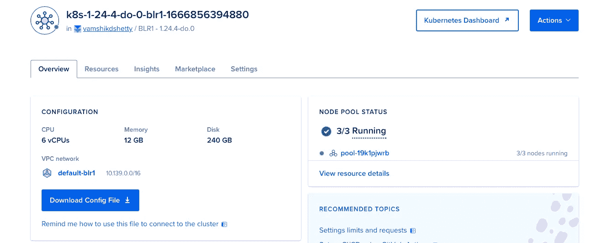

我们试着去取几个 K8s 资源吧。看起来是这样的:

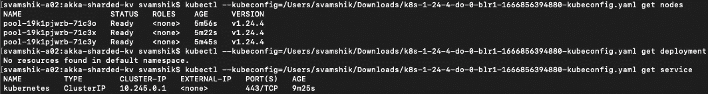

现在我们已经准备好使用 K8s 资源配置文件部署实例了。

**5.1.2。创建一个容器库来上传我们的容器映像**

[](https://docs.digitalocean.com/products/container-registry/quickstart/) [## 集装箱注册快速入门|数字海洋文档

### 数字海洋集装箱注册(DOCR)是一个私人码头图像注册，具有额外的工具支持…

docs.digitalocean.com](https://docs.digitalocean.com/products/container-registry/quickstart/) 

一旦创建了容器注册表。现在，我们需要创建一个 API 令牌，然后登录到注册表，这样我们就可以将本地映像上传到我们的私有存储库中。下面是如何做到这一点:

[](https://docs.digitalocean.com/products/container-registry/how-to/use-registry-docker-kubernetes/) [## 如何通过 Docker 和 Kubernetes | DigitalOcean 使用您的私人 DigitalOcean 容器注册表…

### 数字海洋集装箱注册(DOCR)是一个私人码头图像注册，具有额外的工具支持…

docs.digitalocean.com](https://docs.digitalocean.com/products/container-registry/how-to/use-registry-docker-kubernetes/) 

上述步骤应该会产生类似于以下内容的结果:

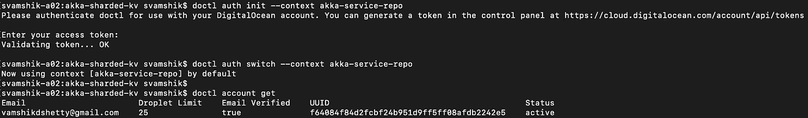

## 5.2.K8s deploy Cassandra 部署和服务

我们将部署一个 Cassandra 3.11 映像，并用所需的表来配置它，以便于我们的应用程序工作。在这种情况下，有两个文件非常重要:

1.  `create_keyspace_tables.cql`:这个 Cassandra 查询文件包含一个键空间和表定义的列表，从 Akka 持久性的角度来看，这是至关重要的。这些表需要在 Cassandra 实例联机后创建。
2.  `cassandra-initdb-script.sh`:即使容器启动并准备好了，Cassandra 实例也需要一些时间才能上线，所以我们有必要在尝试创建存在于`create_keyspace_tables.cql`文件中的定义之前等待。这个脚本会等到`cqlsh`命令可以执行一个有意义的任务时，才会尝试创建所需的表。

下面是 K8s 资源配置文件:

1.  `ConfigMap` configuration 负责创建初始化器脚本和 cql 定义的文件，由 K8s 部署资源配置使用。
2.  `Deployment`配置拉一个稳定的 Cassandra 映像，公开容器端口，并执行 Cassandra 初始化器脚本，作为启动后生命周期钩子的一部分。
3.  `Service`配置在部署配置中公开的所有端口上公开 Cassandra 实例，使用元数据标签`cassandr-db-service-backend`作为服务名。

> **注意:**初始化 cassandra 实例的另一种方法是通过对其中的 keyspace 和表定义进行编码来创建一个定制的容器映像。你可以在这里找到这种方法的例子[。](https://gist.github.com/derlin/0d4c98f7787140805793d6268dae8440)

使用以下命令一次性部署 Cassandra 的配置映射、部署和服务:

```
# Go to akka-sharded-kv and execute following 
kubectl --kubeconfig=<Path to kube config yaml> apply -f K8s/cassandra
```

这将导致 K8s 资源的创建，如下所示:

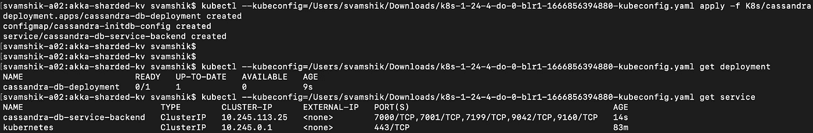

## 5.3.K8s 部署 Akka 集群分片应用部署和服务

在部署 Akka 应用程序之前，我们需要构建我们的 Akka 容器映像，并将其上传到我们创建的私有存储库中，以便我们的 K8s 集群可以访问该映像。

# 建立我们的形象

```
# Go to akka-sharded-kv directory and execute following cmd :docker build --tag kv-akka-sharded .
```

当我们建立我们的图像时，我们会给它贴上`kv-akka-sharded`标签，这样就可以更容易地把它推送到我们的私有存储库中，这个存储库利用了上述标签。

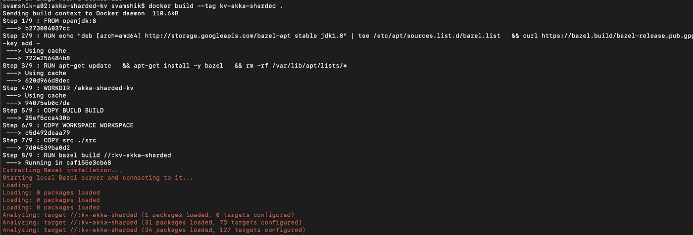

**将图像推送到我们的容器存储库的步骤**

使用`docker tag`命令用全限定目标路径标记您的映像，然后使用全限定路径推送:

```
docker tag kv-akka-sharded:latest registry.digitalocean.com/akka-kv-service-repo/kv-akka-shardeddocker push registry.digitalocean.com/akka-kv-service-repo/kv-akka-sharded
```

最后，图像应该在我们的私有存储库中可见，如下所示:

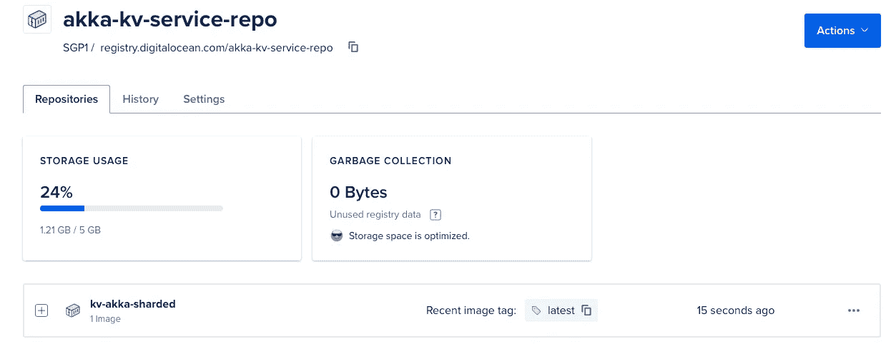

现在来说说 Akka 集群 K8s 资源配置文件。

在`Deployment`配置中，可以注意到 K8s 正在从之前创建的 digital ocean 的私有 repo 中提取键值缓存 Akka 应用程序的容器映像。之后，我们在之前在`discovery.conf`文件中提到的路径上设置健康检查探测器。最后，我们声明两个环境参数:

1.  `CASSANDRA_CONTACT_POINT`:将指向之前在第 5.2 节中部署的 Cassandra 集群服务
2.  `AKKA_CLUSTER_BOOTSTRAP_SERVICE_NAME`:指向传递给 pod-label-selector 以匹配 Akka pods 的部署的元数据标签。这在 kubernetes-api 发现机制中非常有用。

在`Service`配置中，我们的应用程序被定义为负载平衡器，因此导致公共 IP 的可用性，并将我们的应用程序暴露给外部流量。

使用`Role`和`RoleBinding`配置，我们让默认名称空间中的 pod 能够与 K8s API 服务器对话，并获取集群中运行的 pod 列表。这是 Akka 实例在 K8s 集群等动态设置中如何发现彼此的核心方式。

类似于我们如何部署 Cassandra 实例，我们可以为我们的 Akka 应用程序部署 K8s 资源:

```
# Go to akka-sharded-kv and execute following 
kubectl --kubeconfig=<Path to kube config yaml> apply -f K8s/kv-akka-sharded
```

这将导致为我们的应用程序创建 K8s 对象:

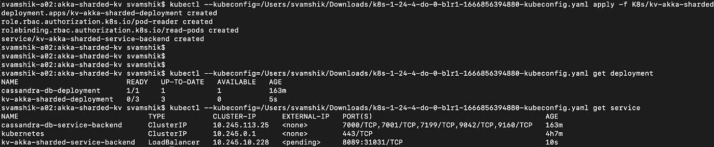

等到`kv-akka-sharded-service-backend`服务获得分配的外部 IP:

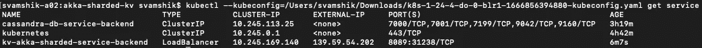

# 与我们的 Akka 应用程序交互

下面是与我们的应用程序交互所需的 curl 命令:

```
# To store key-value pair :Request :curl --location --request POST '[http://139.59.54.202:8089/db/kv/put'](http://139.59.54.202:8089/db/kv/put') \
--header 'Content-Type: application/json' \
--data-raw '{
 "key" : "key-3",
 "value" : "value-4"
}'Response :{"stored":true}--------------------------------------------# To fetch value using provide key :Request :curl --location --request GET '[http://139.59.54.202:8089/db/kv/get?key=key-3'](http://139.59.54.202:8089/db/kv/get?key=key-3')Response :{"value":"value-4"}
```

为了验证托管碎片的键值管理器实体是在我们应用程序的不同实例中创建的，我们可以在发送多个请求后检查 pod 日志:

获取窗格列表:

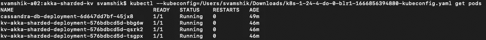

现在使用带有 force 选项的 kubectl logs 命令来跟踪创建碎片的位置:

```
kubectl --kubeconfig=<Path to kube config yaml> logs <POD NAME> -f
```

为我们的应用程序、部署的每个 pod 打开终端，并执行上面的命令。您应该会看到类似于以下内容的日志:

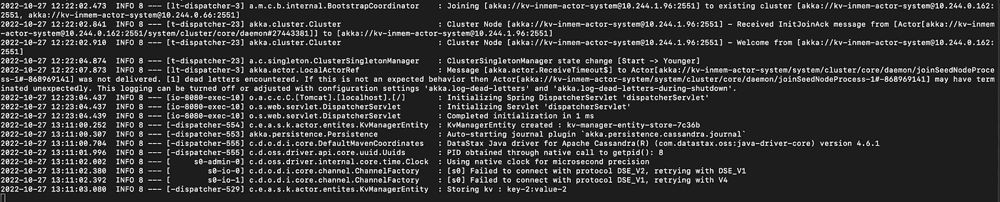

差不多就是这样。我希望你喜欢它。感谢您阅读本文！

```
**Want to Connect?**You can find me on [LinkedIn](https://www.linkedin.com/in/vamshik-shetty/).
```