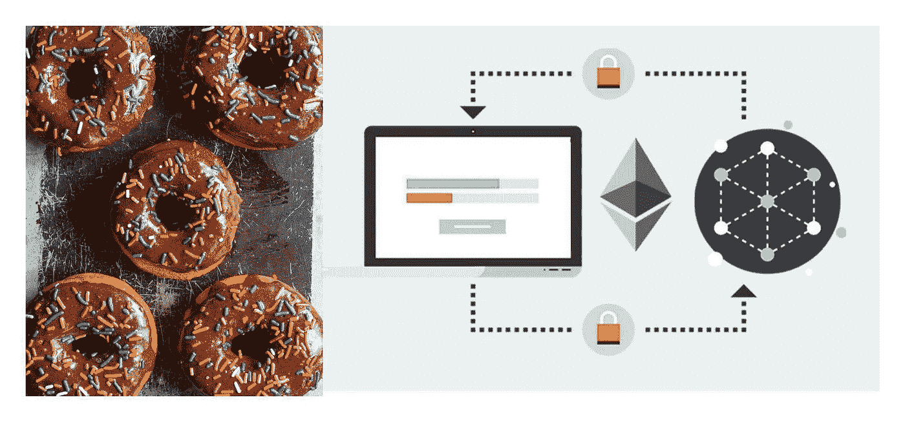
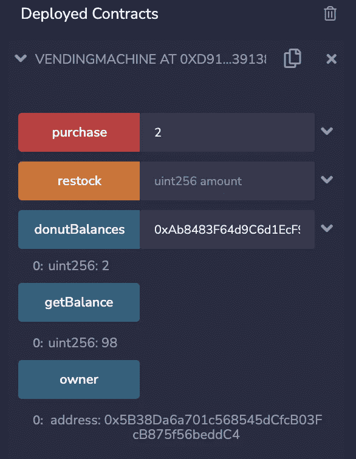
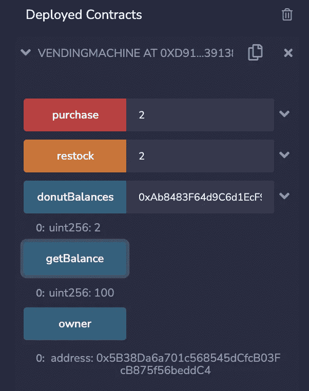

# 为甜甜圈自动售货机建立智能合同

> 原文：<https://betterprogramming.pub/building-smart-contract-for-a-vending-machine-b1e901f61757>

## 混合+稳固+智能合约

甜甜圈自动售货机智能合同，图片由作者编辑

自动售货机是一个有趣的事情，从坚实的基础开始。因此，我们将在 Solidity 中编写一个代码，它将帮助我们为甜甜圈自动售货机建立一个智能合同！

让我们从 Remix 开始，这是一个关于坚固性语言的 IDE。它用于为区块链编写智能合同。就 ERC-20 令牌的实现编码而言，六个基本编码函数是:

1.  `getBalance`
2.  `purchase`
3.  `restock`

## **混音**

Remix IDE 允许为类似以太坊的区块链开发、部署和管理智能合约。也可以作为学习平台。

它非常用户友好，有助于初学者了解部署合同所需的所有基本知识。

首先，我们开始在 File Explorers 选项卡中创建一个名为`vending_machine.sol`的文件。

# **代码**

Solidity 0.6.8 引入了 SPDX 许可证标识符，因此开发人员可以指定合同使用的许可证。SPDX 许可证标识符应添加到合同文件的顶部。以下标识符应添加到您的合同顶部:

我们现在需要编写我们将要使用的 solidity 版本:

下一步是创建合同。在 Solidity 中，我们通过键入关键字`contract`后跟合同名称来编写智能合同。让我们从命名我们的合同销售机开始。所以，写下:

我们将在花括号中写下进一步的代码，因为所有的函数和变量都是它的一部分。接下来，我们定义将成为合同一部分的变量，即:

1.  `address public owner;`
2.  `mapping(address => uint) public donutBalances;`

这里，address 指的是所有者的钱包地址，而 mapping 指的是一个关键字，我们可以将一种类型的变量映射到另一种类型的变量。

因此，`donutBalances`是一个映射，其中甜甜圈的数量将与地址相关联。接下来，我们继续创建一个构造函数，当在以太坊区块链上进行部署时，将自动执行该构造函数。

第一个函数的创建是`getBalance()`。它用于获取自动售货机中剩余的甜甜圈的余额。

`donutBalances[address(this)]`代表与当前以太坊账户相关的甜甜圈余额。

下一个函数称为`restock()`。它只限于所有者，因此，关键字以`require`的形式出现。

当所有者输入要增加的金额时,`donutBalances`得到更新。

最后一个功能是购买功能，它实际上帮助人们或顾客购买甜甜圈。

我们输入的一个甜甜圈的价格是 0.5 ETH。因此，`msg.value`应该等于该数量乘以 0.5 ETH。

此外，自动售货机应该有客户输入的甜甜圈数量。当这两个要求都满足时，该地址的余额将被扣除该金额。

此外，`msg.sender`的`donutBalances`将根据购买的甜甜圈数量进行更新。

最后，代码完成。现在我们开始编译它。Remix 会自动编译代码，并显示是否有错误。然后，我们继续部署代码。

确保我们处于“部署和运行事务”选项卡中。那么要选择的环境就是 Javascript VM。合同应该是我们的自动售货机合同。

现在部署它，您将获得如下部署的契约。此外，现在每当客户购买了甜甜圈，调用函数时会更新`donutBalances`。

当购买被按下时，自动售货机的甜甜圈余额减少

现在，当我们从所有者的帐户调用 restock 函数时，`getBalance`再次更新为 100！

当所有者增加 2 个甜甜圈时，getBalance 更新为 100

自动售货机准备好了，我们的智能合约也准备好了。

如果您有任何问题，可以参考 GitHub 链接:

 [## GitHub-Namyagupta/vending _ machine:一个自动售货机合约

### 此时您不能执行该操作。您已使用另一个标签页或窗口登录。您已在另一个选项卡中注销，或者…

github.com](https://github.com/Namyagupta/vending_machine)