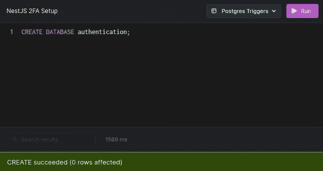
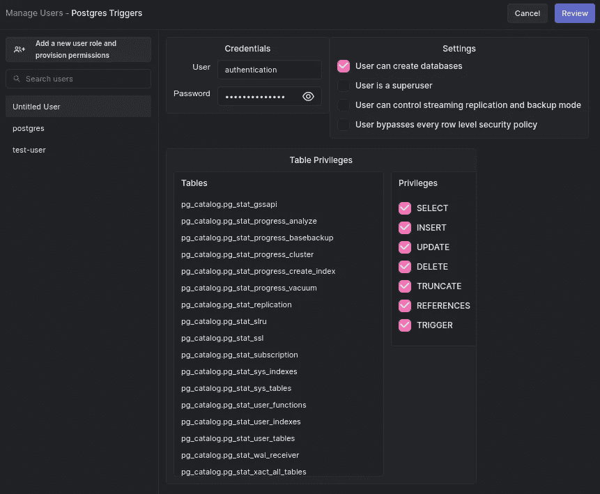
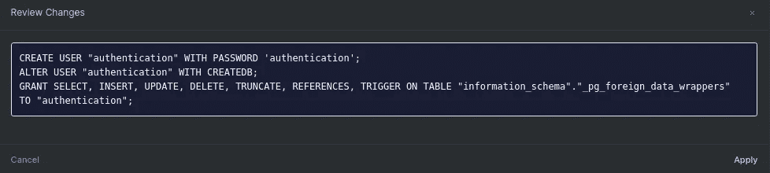
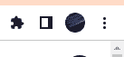
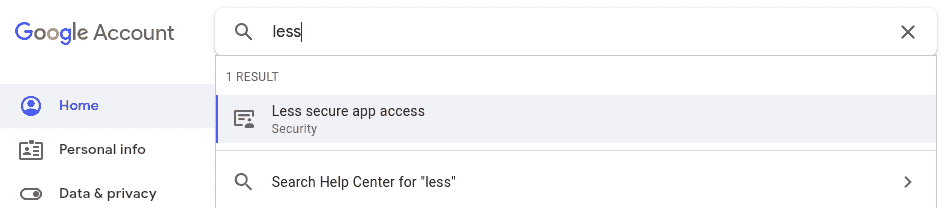
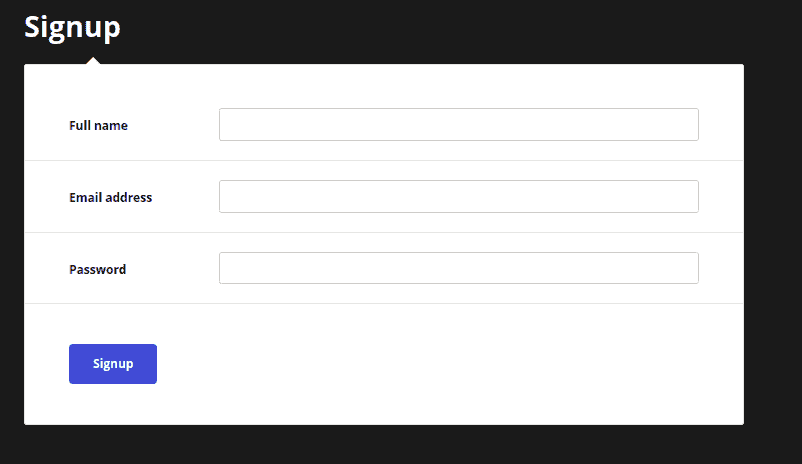

# 用 NestJS 和 Postgres 构建双因素认证

> 原文：<https://betterprogramming.pub/building-two-factor-authentication-with-nestjs-and-postgres-b5e49c7b4a79>

## 保护您的公司免受网络犯罪的侵害


近年来，针对公共和私营实体的网络犯罪和敌对行动变得越来越普遍。这种风险的增加解释了为什么许多软件公司为他们的客户账户增加了额外的安全层。

2FA 是一个额外的安全层，它确认试图进入一个在线帐户的人就是他们所说的那个人。必须首先输入用户的用户名和密码。然后，他们将被要求提供更多的细节，然后才被授予访问权限。这种方法将保护受损帐户免受欺诈活动的侵害。即使黑客发现了用户的密码，他们也无法登录到该帐户，因为他们缺少第二因素身份验证( [2FA](https://authy.com/what-is-2fa/) )代码。

本教程将教你如何在一个 [NestJS](https://nestjs.com/) 应用程序中实现 2FA 认证。随时从 Github 获取[代码。我们开始吧！](https://github.com/Claradev32/Nest2faAuthentication)

# 先决条件

本教程是一个实践演示。要继续操作，请确保您安装了以下软件:

*   Nodejs 是我们应用程序的运行时环境。
*   Postgres 数据库 —我们将用户的记录保存在 Postgres 数据库中。
*   [Arctype](https://arctype.com/) —我们将使用 Postgres GUI 来帮助用户验证。

# 创建嵌套应用程序

让我们首先为我们的项目创建一个 NestJS 应用程序。在此之前，我们将使用以下命令安装 Nest CLI:

```
npm i -g @nestjs/cli
```

然后，用下面的命令创建一个嵌套应用程序。

```
nest new authenticationCreating a new Nest application.
```

继续下一步之前，请等待安装完成。

# 安装依赖项

现在，让我们安装这个项目的依赖项。我们将使用下面的命令从开发依赖项开始:

```
npm i -D @types/bcrypt @types/nodemailer
```

然后我们将添加我们的其他依赖项。

```
npm i bcrypt  @nestjs/jwt @nestjs-modules/mailer nodemailer hbs @nestjs/typeorm typeorm pg
```

这将需要一点时间来安装，所以等待它完成。完成后，就该为我们的应用程序建立数据库了。

# 设置 Postgres 数据库

至此，我们已经安装了这个项目所需的所有依赖项。现在让我们继续设置我们的 Postgres 数据库。我们将使用 TypeORM Postgres 对象关系映射器将我们的应用程序连接到 Postgres 数据库。运行以下命令来设置 Postgres 数据库:



```
sudo su - postgres
psql
create database  authentication
```



```
create user authentication with encrypted password authentication
grant all privileges on database authentication to authentication
```

接下来，打开`/src/app.module.ts`文件，导入`TypeOrmModule` **、**并使用`forRoot` 方法连接到数据库，代码片段如下:

在上面的代码片段中，注意我们传入了`User`实体，但是还没有创建它。不要担心——我们将在后续部分创建这个实体。另外，请注意，我们使用了`forFeature()`方法来定义在当前范围内注册了哪个存储库，这让`TypeORM`知道了`User` 实体。

现在，让我们创建`User`实体来定义数据库中的模型。

# 创建用户实体

此时，我们的应用程序连接到了 Postgres 数据库。现在我们将创建一个`User`实体来表示我们将存储在数据库中的用户数据。首先，在`src`文件夹中创建一个`app.entity.ts`文件，并添加下面的代码片段:

在上面的代码片段中，我们通过定义一个`User`类创建了一个实体。我们通过使用`Column`、`PrimaryGeneratedColumn`和`DateCreatedColumn`装饰器定义`User`实体的属性来实现这一点。`PrimaryGeneratedColumn`装饰器将使用`[UUID](https://www.npmjs.com/package/uuid)`模块为用户生成随机 id。我们将`unique`属性添加到我们的电子邮件`Column`中，以确保没有用户使用同一个电子邮件注册两次。最后，默认情况下，当创建一个记录时，`DateCreatedColumn`装饰器会添加一个日期。

接下来，打开 `app.module.ts`文件并导入 `User`实体。该导入解决了显示在`app.module.ts`文件上的错误。

```
import { User } from './app.entity'
```

我们的`User`实体设置好了。现在，让我们创建控制器来处理用户的请求。

# 创建应用服务

至此，我们的用户实体设置完毕。现在，让我们通过设置路线处理函数来设置我们的应用程序服务。打开`app.service.ts`文件和所需的模块。

```
import { Injectable, HttpException, HttpStatus } from "@nestjs/common";
import { User } from "./app.entity"
import { InjectRepository } from '@nestjs/typeorm';
import { Repository } from 'typeorm'
import * as bcrypt from 'bcrypt';
import { JwtService } from '@nestjs/jwt';
import { MailerService } from '@nestjs-modules/mailer';
```

在上面的代码片段中，我们导入了几个重要元素:

*   `@Injectable`装饰器，它使我们的 `appService`类可以被嵌套 IoC 容器管理
*   `HttpException`，它让我们创建自定义错误
*   `HttpStatus`，发送自定义状态码
*   `User`实体(如上所述)
*   和`InjectRepository`，它将我们的`User`实体注入到`appService`类中。

此外，我们还导入了`bcrypt`、 `JwtService`和`MailerService`，我们将在本节稍后的应用程序模块中对其进行配置。

此外，我们创建一个全局`code`变量来存储注册后发送给用户的随机验证码。我们生成一个随机代码并将其赋给 code 变量，然后创建`sendConfirmationEmail`和`sendConfirmedEmail`方法来向注册用户发送确认和验证电子邮件。

接下来，我们创建`signup`方法来处理用户的注册。我们使用下面的代码片段来实现这一点。

我们的`signup`方法是一个异步函数，它在创建帐户时返回`true`。我们使用 bcrypt `genSalt()`方法生成一个 salt 值，并使用`hash`方法散列用户的密码。然后，我们存储用户密码的散列版本，并使用`userRepository` insert 方法创建一个新对象。接下来，我们调用`signin`方法，这是一个异步函数，通过下面的代码片段返回 JWT 令牌或 HTTP 异常:

我们的`signin`方法使用用户的电子邮件地址来检查他们的记录是否存在于我们的数据库中。如果找到了用户，我们使用 bcrypt `compare`方法检查用户的密码是否与数据库中存储的散列密码相匹配。然后生成并向用户发送一个 JWT 令牌。如果没有匹配查询的记录，我们将返回相应的错误消息。

接下来，我们将创建一个`verify` 方法，这是一个异步函数，当用户被验证时，它返回 true 或 error。

在我们的 verify 方法中，我们使用请求体中的代码在数据库中查询用户。如果没有用户匹配搜索，我们返回一个 HTTP 异常。否则，我们将用户的`isVerified`属性更新为`true`，并将`authConfirmToken`重置为未定义，使其为空。

让我们打开`app.module.ts`文件并配置 JwtService 和 MailerService。首先，导入`JwtModule`、`MailerModule`、`ConfigModule`和`HandlebarsAdapter`，我们将使用它们来配置我们的电子邮件模板。`ConfigModule` 将使我们能够加载我们的环境变量，如 JWT 秘密，它将在本节稍后创建。

```
import { ConfigModule} from '@nestjs/config';
import { JwtModule } from '@nestjs/jwt';
import { MailerModule } from '@nestjs-modules/mailer';
import { join } from 'path';
import { HandlebarsAdapter } from '@nestjs-modules/mailer/dist/adapters/handlebars.adapter';
…
```

在项目根目录下创建一个`.env`文件来存储你的 JWT 秘密。您可以使用内置的加密模块生成一个。

```
require('crypto').randomBytes(64).toString('hex')
```

并将生成的秘密存储在您创建的`.env`文件中。

```
JWT_SECRET = [your secret goes here]
```

# 设置邮件模块

现在，将下面的代码片段附加到 app module imports 数组中，以加载环境变量。我们还将配置`JwtModule`、`MailerModule`和`HandlebarsAdapter`。

# 创建应用控制器

至此，我们的 app 服务设置完毕。现在让我们设置应用程序控制器来处理传入的请求。打开`app.controller.ts`文件，导入所需模块。

```
import { Controller, Get, Post, Render, Res, Body, HttpStatus, Req, Param } from '@nestjs/common';
import { AppService } from './app.service';
import { User } from './app.entity';
import { JwtService } from '@nestjs/jwt
```

然后我们将使用`@Controller`方法来定义我们的应用程序控制器。首先，我们将使用构造函数方法创建一个`AppController` 类。我们为我们的`appService` 类和`JwtService`类创建了两个私有参数。

然后我们创建我们的`Root` 和`VerifyEmail` 路由，它们将使用`@Get`装饰器监听一个`Get` 请求，并呈现索引和验证模板，这将在本节稍后使用`@Render`装饰器进行设置。

```
@Get()
 @Render('index')
 root() { }

 @Get('/verify')
 @Render('verify')
 VerifyEmail() { }
```

接下来，我们创建了`Signup` 路由，它将监听到达`/signup`端点的 Post 请求。`Signup` 控制器从用户的表单中获取输入，并将其与我们创建的用户实体进行匹配。然后它等待`appService` 注册方法的结果，该方法将用户对象作为参数。

```
@Post('/signup')
 async Signup(@Body() user: User) {
   return  await this.appService.signup(user);
 }
```

接下来，我们创建了`Signin` 路由，它将监听到达`/signin`端点的 Post 请求。`Signin` 控制器从用户的表单中获取输入，并将其与我们创建的用户实体进行匹配。然后等待`appService` `signin`方法的结果，该方法也将用户对象 form object 作为参数。

```
@Post('/signin')
 async Signup(@Body() user: User) {
  return await this.appService.signin(user);
 }
…
```

然后，我们创建一个`Verify` 路由，并等待来自`appService` `verifyAccount`方法的结果，该方法将用户确认码作为参数。

```
@Post('/verify')
 async Verify(@Body() body) {
   return await this.appService.verifyAccount(body.code)
 }
…
```

最后，打开`main.ts`文件，删除样板代码，并在下面添加以下代码片段，以设置我们的[模板引擎](https://www.educative.io/edpresso/what-are-template-engines)和静态文件定向器，从而在我们的应用程序中启用[服务器端呈现](https://www.educative.io/edpresso/what-is-server-side-rendering)。

# 创建电子邮件模板

配置好视图引擎和静态文件后，让我们开始创建模板。首先，在项目根目录下创建一个`views`文件夹，在`views` 文件夹下创建一个`email-templates`文件夹。在视图文件夹中创建一个`index.hbs`和一个`verify.hbs`文件。然后在 email-templates 文件夹中创建一个`confirm.hbs`和`confirmed.hbs`文件。打开`view/index.hbs`文件并添加下面的代码片段:

打开`verify.hbs`文件，添加下面的代码片段:

将下面的代码片段添加到`email-templates` / `confirm.hbs`文件中:

```
<p>Hey {{ fullname }},</p>
<p>Verify your email with code below</p>
<p>Your verification code is: {{code}}</p>

<p>If you did not request this email you can safely ignore it.</p>
```

并将下面的代码片段保存到`email-templates` / `confirmed.hbs`文件中。

```
<p>Hey {{ fullname }},</p>
<p>Your account for {{email}} has been confirmed!</p>

<p>If you did not request this email you can safely ignore it.</p>
```

接下来，在项目根目录中为我们的静态文件创建一个`public`文件夹，然后在其中创建一个`js`文件夹。在其中，用下面的代码片段创建一个`index.js`文件:

上面的代码片段向我们的`/signup`和`/verify`端点发出 post 请求，以注册并确认用户的电子邮件。

最后，从这个项目的 [Github](https://github.com/Claradev32/Nest2faAuthentication/tree/master/public) 资源库中获取其他静态文件，并将它们添加到 public 文件夹中。

# 启用谷歌 LSAA

随着我们的电子邮件模板设置，我们应该能够发送电子邮件给我们的用户。在本教程中，我们将使用 Gmail 发送电子邮件。因此，我们需要配置我们的 Gmail 帐户，以允许不太安全的应用程序访问电子邮件。按照以下步骤在您的 Gmail 帐户上启用 LSAA。

1.  打开 Chrome。单击浏览器右上角的个人资料图标。



1.  点击**管理您的谷歌账户。**
2.  在搜索框中输入 **less** ，点击 **less secure app access。**



1.  切换输入框上的**允许不太安全的应用**:以启用它。


现在，让我们运行应用程序并对其进行测试。

# 测试应用程序

至此，我们的应用程序已经准备好了。让我们来测试一下。在您的终端中，更改目录，使您位于 authentication 文件夹中，并使用下面的命令运行服务器。

```
#Change directory
cd authentication 

#Start the server
npm run start:dev
```

然后转到`[http://localhost:3001/](http://localhost:3001/)`查看索引页面。您应该会看到如下所示的结果:



填写字段并注册。你会被要求验证你的帐户。检查您的电子邮件中的确认码。验证验证页面上的代码。


成功！根据需要，我们有一个可用的 2FA 应用程序。

卡住了？有什么问题吗？如果需要，本教程的代码可以在 Github 上找到。

# 结论

通过构建一个演示项目，我们已经了解了如何在 NestJS 应用程序中实现 2FA 认证。我们从介绍 2FA 身份验证概念开始，并学习了如何创建一个将它们付诸实践的 NestJS 应用程序。

现在您已经获得了您所寻求的知识，那么您将如何增加下一个 NestJS 项目的安全性呢？或许，你可以从[官网](https://docs.nestjs.com/)了解更多关于 Nest 的信息，并把事情做得更进一步。