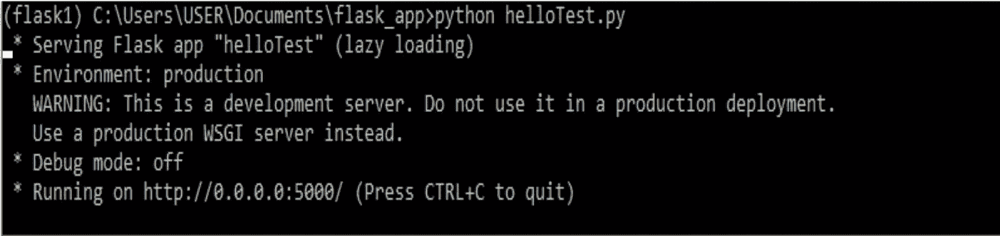
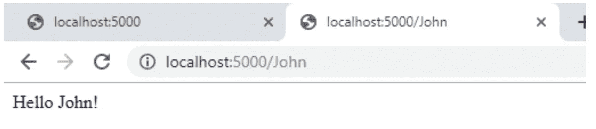
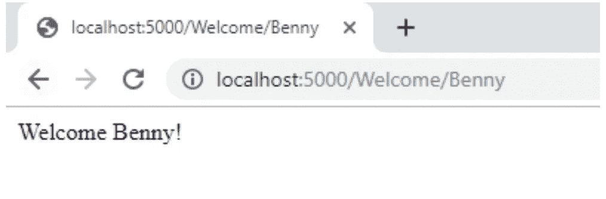
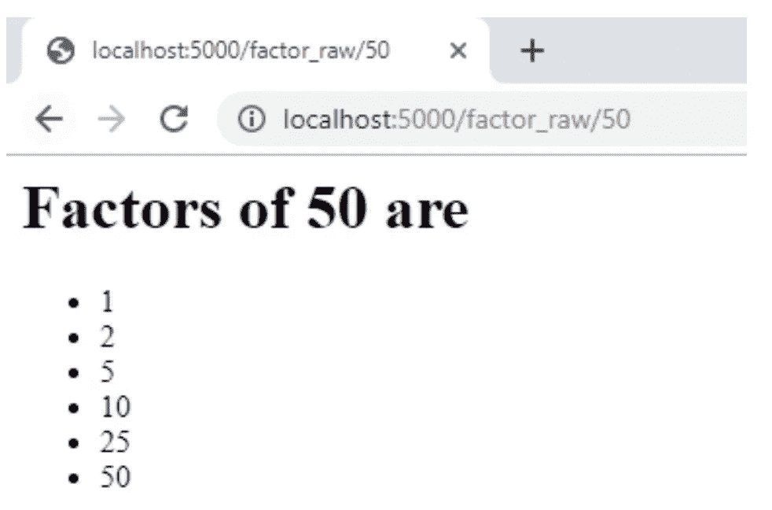

# 用 Flask 构建你的第一个网站——第 1 部分

> 原文：<https://betterprogramming.pub/building-your-first-website-with-flask-part-1-903a8b44e806>

## Hello World and beyond


Flask 是 Python 可用的众多 web 框架之一。它被认为是一个*微框架*，基于一次做一件事，并把它做好。

正如其[文档](http://flask.pocoo.org/docs/0.12/foreword/#what-does-micro-mean)中所描述的，微框架中的*微*意味着 Flask 旨在保持其轻量级的简单性。Flask 的真正强大之处在于它的灵活性。

Flask 使用其可扩展的 web 框架，支持使用各种 web 开发库和工具灵活开发 web 应用程序。这使得更有经验的开发人员可以自由地对他们熟悉的库和数据库进行即插即用。

[与 Django](https://www.coriers.com/python-backends-flask-vs-django/) 等其他网络框架不同，你不会被框架强迫使用的东西所束缚。相反，您可以转向自己熟悉的技术组件。

在这篇文章中，我们将深入开发你的第一个 Flask 网页。

我们将创建:

*   你的第一个烧瓶程序:你好，世界！
*   如何用 Flask 在你的网站中获取用户输入？
*   使用 HTML 修改网页。

# 创建你的第一个烧瓶程序:你好，世界！

为了快速入门，我们将创建经典的“Hello World”网页。这个程序还将帮助您检查您是否正确安装了 Flask。

这是相当惊人的，但你好世界！*Flask 中的程序有七行代码长。这七行代码足以创建一个简单的网页。*

*那么，我们开始吧。*

*代码一旦全部写出来，看起来会像这样:*

*回顾一下重要的线路，让我们讨论一下每条线路的功能。*

## *第 4 行*

```
*app = Flask(__name__)*
```

*这一行创建了一个新的`app`，我们需要它来运行流程。它还处理网站所需的各种任务。`__name__`是自动定义的 Python 变量，制作 Flask apps 需要。*

## *第 6 行*

```
*@app.route(“/”) # at the endpoint /*
```

*上面的语法被称为“修饰”。在 Flask 中，添加在函数描述顶部的行将其转换为“route”。我们稍后将更详细地讨论这意味着什么。*

## *第 7–8 行*

```
*def hello(): # call method hello
   return “Hello World!”*
```

*这几行定义了一个接受零参数并返回 Hello World 的函数！字符串。*

## *第 9–10 行*

```
*if __name__ == “__main__”: # on running python app.py
   app.run() # run the flask app*
```

*第 9 行是 Python 中的一个`if`命令，意思是“只有执行了整个代码才运行”。*

*另一个 Python 变量`__name__`保持如上所述。`app.run()`主要运行第 3 行中的变量，也在本地主机上运行。*

# *运营网站*

*一旦你完成了代码的开发，你可以通过在命令行上运行它来测试它。您可以根据您的文件名运行该命令。*

*例如，如果您的文件名是`helloTest.py`，您可以通过键入:*

```
*python helloTest.py.*
```

**

*这将启动你的“服务器”并启动你的网站。你可以通过进入`[http://0.0.0.0:5000/](http://0.0.0.0:5000/)`或者仅仅是`localhost:5000`看到这个页面。*

*网页上的输出将如下所示:*

**

*恭喜你。您已经完成了您的第一个网页。*

# *定义路线*

*在开始构建应用程序时，理解路线(第 6 行)的要求非常重要。您可以建立新的路由(如下例所示)来代表您网站的不同 URL。*

*在继续讨论如何向代码传递输入之前，让我们首先讨论如何添加新的路由。*

*在下面的代码中，您会注意到我们用`app.route(“/John”)`添加了一个新函数。这就增加了一个可以位于`localhost:5000/John`的新端点。*

*试着运行它，看看会发生什么。*

*您的网页应该是这样的:*

**

# *如何用 Flask 传递动态信息*

*您现在已经创建了 Hello World！烧瓶上的页面。您已经成功地完成了重要的一步—创建静态网站页面。*

*但是在创建了静态页面之后，接下来呢？*

*下一阶段是获取动态数据(最终，我们将把它转化为用户输入)。在这种情况下，这将使路由接受参数，这样您就可以拥有一个更加动态的网站。*

*我们在这里考虑的用户输入是接受各种名称。为了实现这一点，使用下面的变量定义路线:*

*对于上面的代码，`<name>`充当 URL 路由的占位符。这仅仅意味着添加到 URL 中的任何名字都将被自动放入`Welcome name`函数中。*

*这里有一种方法可以用来将这个新概念与旧的 Hello World 文件结合起来:*

*使用新路线，在浏览器中输入`localhost:5000/Welcome/Benny`将导致:*

**

*   *浏览器要求服务器(在这个场景中是您的计算机)对输入的 URL 做出适当的响应。*
*   *服务器识别 URL 旁边的请求。*
*   *服务器用相应的函数来响应。*
*   *服务器调用并提供正确的变量和输出。(函数`Welcome_name()`，用值`Benny`代替`name`变量)*
*   *服务器继续并显示“欢迎本尼！”字符串，这是来自`Welcome_name(“Benny”)`的正确输出。*

*现在，您正在向您的站点传递动态信息。*

# *使用 HTML*

*如果你做到了这一点，一切看起来都很好！你已经学会了如何使用 Python 函数来创建网站界面。*

*现在，为了提高网站页面的整体吸引力，HTML 被采用了。*

*关于 HTML 需要注意的一个重要细节是，它可以作为一种标记语言，允许对所选网站页面进行特定的修改(就外观而言)。*

# *在 Flask 中开始使用 HTML*

*首先，让我们用 HTML 为因子 5 制作一个页面。代码看起来类似于下面的内容。*

```
*<h1>The factors of 5 are:</h1>
<ul><li>1</li><li>5</li></ul>*
```

*这个例子很简单，但是它将帮助你理解如何用 Flask 操作 HTML。*

*使用 HTML 的下一步是如何将静态数据处理成动态数据。使页面返回任意数量的因子是可行的。*

*通过使用函数，我们可以创建接受数字并提供输出的 HTML 字符串。下面提供了必要的代码。*

*通过运行这段代码，我们得到了一个输出，它生成了 HTML 中选定数字的因子。但是我们都同意；这不太容易理解。*

*嗯，有一个更好的方法，它是用 HTML 模板完成的。*

*所以，在下面的例子中，我们提供了 50 的变量，从而得到 50 的因子。*

**

# *概括起来*

*Flask 是一个伟大的，简单的框架，可以帮助你创建一个网站。这个介绍让你了解了 Hello World！程序转变为接受用户输入的更动态的网页。*

*作为一个流行的 web 框架，Flask 还允许集成大量其他库、数据库等。有许多功能和大量的扩展可用。*

*我们将在第 2 部分讨论使用 HTML 模板和进度跟踪的方法，所以准备好并继续练习吧！*

*我们希望你喜欢这篇文章，并期待听到你的经历！*