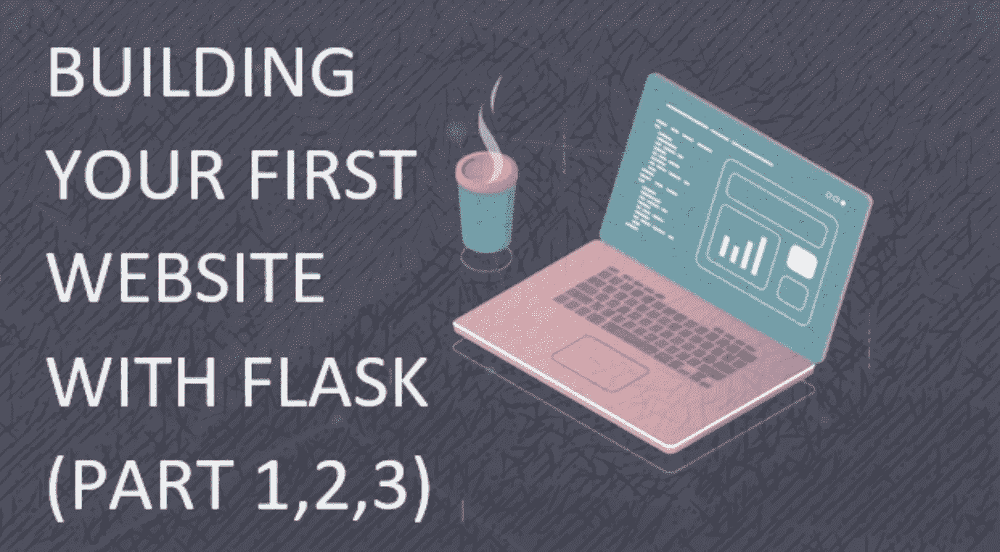
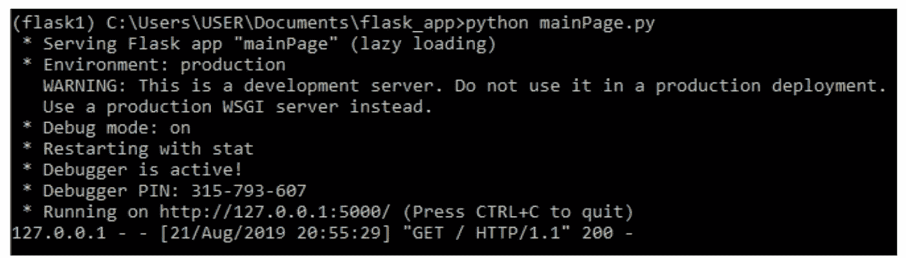
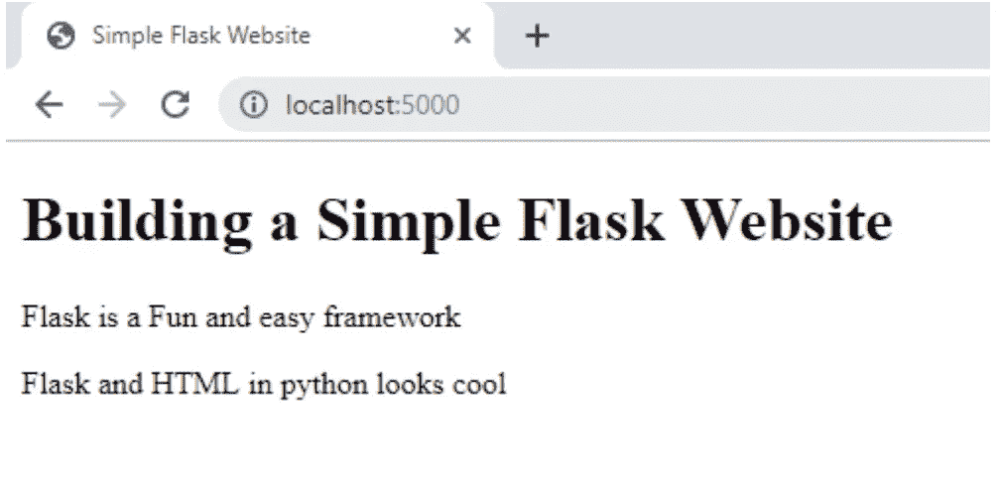
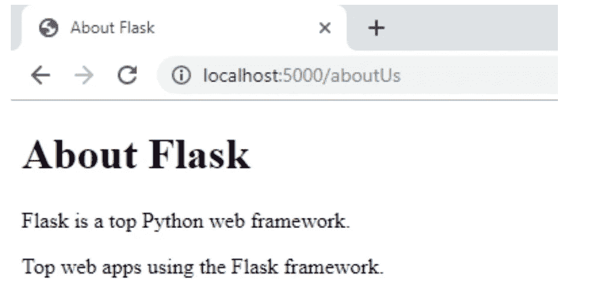
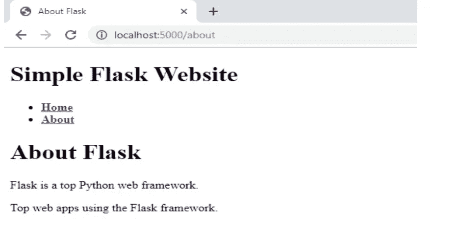
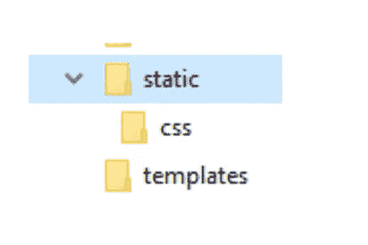
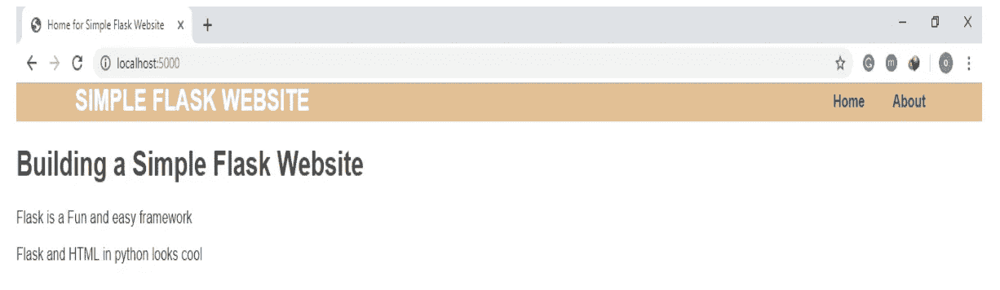

# 用 Flask 构建你的第一个网站——第 2 部分

> 原文：<https://betterprogramming.pub/building-your-first-website-with-flask-part-2-6324721be2ae>

## HTML 模板、页面链接和 CSS



我们最近写了一篇介绍使用 Flask 开发你的第一个网站的文章。在本系列的第一部分，我们提供了创建第一个 Flask 程序的指南:“Hello World！”，并获得外部输入到您的网站。

接下来，这个系列的第二部分将指导我们使用 HTML 模板来改善你的网站外观。

它包括:

*   使用 HTML 模板。
*   向我们简单的 Flask 网站添加 CSS

# 使用 HTML 模板

网站模板是一个预先构建的网站，由 HTML 页面组成，这些页面可能还包含集成的图像、文本内容以及 JavaScript 和字体样式的支持文件。网站模板和网页模板都是一个意思。

对于 HTML 模板，它们是使用 HTML(或 XHTML)构建的，通常由 CSS 和 JavaScript 代码组成。为了随时创建 HTML 网页，Flask 支持使用 [Jinja2](http://jinja.pocoo.org/docs/2.10/) 的 HTML 模板。

Jinja2 允许您在 HTML 页面中干净地添加循环和变量。它使用了新的语法，但是一旦你理解了它，就很容易使用。

对于本系列，让我们在 Flask 中创建新的 HTML 模板。

首先，我们需要创建一个新的 HTML 文件，姑且称之为`home.html` *。*

需要注意的重要一点是，Flask 框架在一个名为`templates` *的特殊文件夹中搜索 HTML 文件。你需要创建一个`templates`文件夹，并将所有的 HTML 文件保存在里面。*

下面是让您入门的代码。

下一步是对我们在第 1 部分中创建的`mainPage.py` 进行修改，以允许我们查看上面创建的`home.html`。比如在 Python 代码中嵌入 HTML 文件。

值得注意的是，有两个新的变化:

## **1 号线**

从 Flask 框架*中导入一个名为`render_template()` 的方法。*

方法`render_template()`在 templates 文件夹中搜索高亮显示的模板(HTML 文件)。找到指定的模板后，它会呈现模板。可以进一步了解`[render_templates()](http://flask.pocoo.org/docs/0.12/quickstart/#rendering-templates)` [功能](http://flask.pocoo.org/docs/0.12/quickstart/#rendering-templates)。

## **第六行**

对 return 进行了修改，现在返回`render_template(“home.html”)` *。*return 的这一更改将允许查看链接的 HTML 文件。

要执行程序，请在命令提示符下快速运行代码:

```
python mainPage.py
```



并在您的本地浏览器中输入`[http://localhost:5000/](http://localhost:5000/)`来查看更改。



# 添加更多 HTML 页面

更进一步，我们可以在我们简单的 Flask 网站上添加更多的 HTML 页面。

让我们创建一个*关于我们的* 页面，从创建`aboutUs.html` *开始。***`aboutUs.html`也应该创建在`templates` 文件夹里面。**

**现在，我们可以将以下代码行添加到文件中:**

**创建完`aboutUs.html` *，*之后，让我们对`mainPage.py`进行更新，如下图所示。**

**既然您已经创建了两个 HTML 页面，我们可以将它们链接在一起。**

****

# **通过导航菜单链接所有页面**

**就像一个普通的网站，有链接连接其他网页使导航变得容易。为了连接所有的页面，我们可以创建一个导航菜单来连接它们。Flask 的使用使得导航菜单过程的创建更加容易。**

**首先，让我们创建一个名为`template.html` *、* 的模板作为父模板。创建的另外两个模板(子模板)将从这个模板继承它们的代码。**

**创建完`template.html` *，*，**，**后添加下面几行代码:**

**`url_for()` 功能介绍。它接受函数名作为参数。可以进一步了解`[url_for()](http://flask.pocoo.org/docs/0.12/quickstart/#url-building)` [功能](http://flask.pocoo.org/docs/0.12/quickstart/#url-building)。**

**用`about.html` 和`home.html` *替换带花括号的两行。* 这些添加允许子页面(`about.html`和`home.html`)与父页面(`template.html`)链接。它还限制了导航菜单代码的复制。**

**让我们创建`about.html`，如下所示:**

**接下来是创建一个 Python 脚本来合并这两个页面。在这种情况下，我们使用下面的代码创建了`main.py`:**

**要执行程序，请在命令提示符下快速运行`main.py`代码，并在本地浏览器中输入`[http://localhost:5000](http://localhost:5000)`来查看更改。**

**单击“关于”链接会将您带到“关于”页面，或者您可以使用本地浏览器中的`[http://localhost:5000/about](http://localhost:5000/about)`来浏览以查看更改。**

****

# **向我们的网站添加 CSS**

**为了给我们的网站添加一些风格，让我们试着给我们的网站添加一些 CSS。另外，需要注意的重要一点是，类似于为所有 HTML 模板创建`templates`文件夹，我们还需要为所有 CSS 文件创建另一个名为`static` 的文件夹。**

**`static` 文件夹主要用于存储 CSS、JavaScript 和图像文件，以及其他重要文档。**

**这个原因使得创建`CSS`文件夹来存储所有 CSS 样式表**变得至关重要，所以，你必须在`static` 文件夹中创建`CSS` 文件夹。创建文件夹后，您的项目文件夹应该类似于下面的内容。****

********

****继续将我们的 HTML 文件与 CSS 链接，我们使用一个`template.css`文件和已经存在的`template.html`文件向 CSS 文件夹添加一些代码，因为它将所有其他页面链接在一起。****

****对于`template.css`文件，请添加以下代码并保存在 CSS 文件夹中。****

****添加到父页面的新代码也将对所有子页面有效。现在，让我们用这些新代码行更新父页面:****

****要执行程序，请在命令提示符下快速运行`main.py`代码，并在您的本地浏览器中输入`[http://localhost:5000/about](http://localhost:5000/about)`来查看更改。****

********

# ****结论****

****在我们简单的 Flask 网站中使用 HTML 模板和 CSS 进行设计和导航是一个简单的步骤。****

****服务器渲染 HTML，传递正确的变量，并将所需的 HTML 返回给浏览器，这样您就一定会走上构建网站的正确道路。****

****通过更多的练习，您可以探索 Jinja 模板下可用的其他格式和输入类型。现在，让我们简单地关注第 3 部分中的下一个任务。我们将讨论表单和会话跟踪。****