# 用 Flask 构建你的第一个网站——第 3 部分

> 原文：<https://betterprogramming.pub/building-your-first-website-with-flask-part-3-99df7d589078>

## 跟踪会话和表单

欢迎来到我们的第三部分，来建立你的第一个 Flask 网站。我们已经意识到我们可能会在这之后开发更多的部分——所以不要担心，期待第 4 和第 5 部分吧！我们已经意识到，我们也想包括插入和提取数据库，以及把一个适当的网站与我们所学的一切！

在这里阅读第 1 和第 2 部分:

 [## 用 Flask 构建你的第一个网站——第 1 部分

### Hello World and beyond

medium.com](https://medium.com/better-programming/building-your-first-website-with-flask-part-1-903a8b44e806)  [## 用 Flask 构建你的第一个网站——第 2 部分

### HTML 模板、页面链接和 CSS

medium.com](https://medium.com/better-programming/building-your-first-website-with-flask-part-2-6324721be2ae) 

在这篇文章中，我们将着眼于改善用户与简单 Flask 网站交互的两个重要方面。我们将涵盖:

会话跟踪

使用表单在 Flask 中发布信息

# 会话跟踪

本系列的前两部分集中在基础上:创建基本网页和 HTML 模板。让我们开始做一些更有趣的事情。

如果你想制作一个包含经常性用户输入的页面，你需要以某种方式跟踪每个用户的状态。这将允许数据在用户在 web 应用程序上的整个会话过程中被存储。存储的数据作为*【记忆】*保存之前发生的任何事情。

为了跟踪之前的数据，使用*“session”*提供了链接到特定用户最近会话的临时存储。与 cookies 不同，“会话”数据存储在服务器上。会话是用户登录到服务器和注销之间的时间间隔。

在 Flask 中，客户端数据的*【session】作为 cookie 存储在浏览器上。Flask 的一个非常有用的特性是可以导入会话。它使用 session 对象的过程类似于链接到每个网站用户的字典。此外，会话对象可以存储与用户相关的数据，这些数据即使在浏览器崩溃或页面刷新后仍然存在。*

*以下是所需的设置:*

*在 Python 脚本之上，导入会话。此外，在创建应用程序的过程中，您应该在注释(#)后增加两行:*

*注意:在实际应用中(比如你想让你的网站上线)，建议使用一个不为所有人所知的密钥——会话数据可能包含用户的私人信息，通过 cookie 的访问将利用用户会话的所有数据。这些信息落入坏人之手可能不会有好结果。*

*在这种情况下，创建简单的 Flask 网站，使用上面的内容就可以了。所以，*千万不要*用它来存储敏感数据。如果你想了解更多关于*【秘钥】*在烧瓶中的用法，这里有[的详细描述。](https://stackoverflow.com/questions/34902378/where-do-i-get-a-secret-key-for-flask/34903502)*

# *使用会话对象执行类似 Python 字典的操作*

*接下来，您可以让会话对象像 python 中的字典一样执行。这个特性是 Flask 的另一个优点，因为它的功能类似于常规的 [Python 字典](https://docs.python.org/3/tutorial/datastructures.html)。*

*下面是一个例子，它的特点是每次页面被重新加载(在这个例子中，是主页)时，计数达到 15。它会删除自己，并在 15 次计数后重新开始:*

*以下是执行代码后的输出:*

*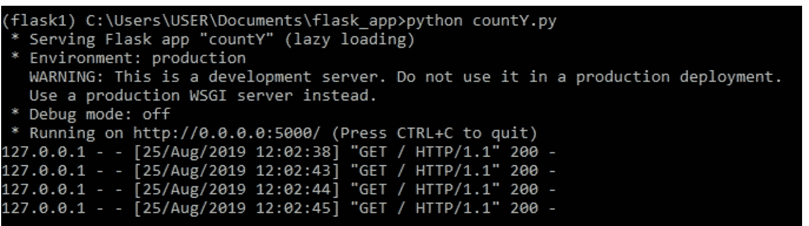*

*紧接着，在浏览器中输入 localhost:5000。*

*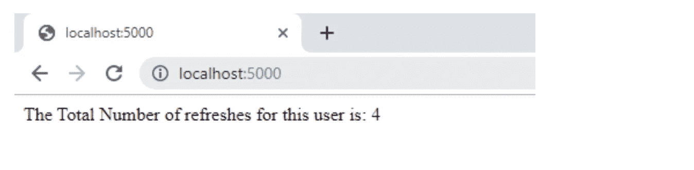*

*要在你的浏览器上看到这个，进入开发者工具(例如，Chrome:进入更多工具中的开发者工具)并选择*“应用程序窗口”**

*然后选择*“cookie”*，这将显示您的*“会话”*数据，这些数据保存在您的浏览器 cookie 中，但已加密。使用之前创建的*“密钥”*打开加密。*

*服务器处理 cookie 并使用密钥解密它。它还可以修改和读取 cookies 中的信息。使用 Flask 的独特方法，一个用户的会话不会影响任何其他用户。*

*您可以通过使用匿名窗口测试 URL 来进一步确认:*

*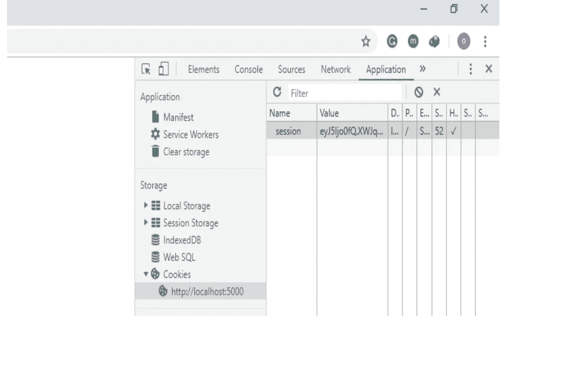*

# *使用 Session 统计每个页码的结果*

*下面是使用会话的 web 应用程序的另一个实例。这一次，我们使用 session 对 route 收到的每个页码的结果进行计数。*

*一旦在命令提示符下执行了代码，*

*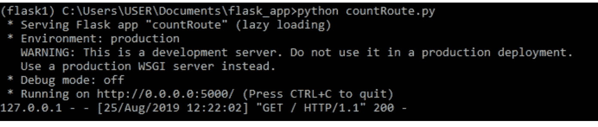*

*您的第一个输出将是:*

*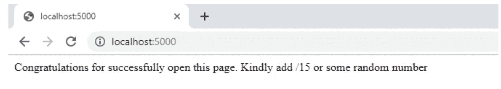*

*在浏览器中输入 localhost:5000/15，并不断刷新页面。*

*你会注意到产量增加了 15。*

*改变 URL 末尾的数字会看到它增加了那个数量。*

*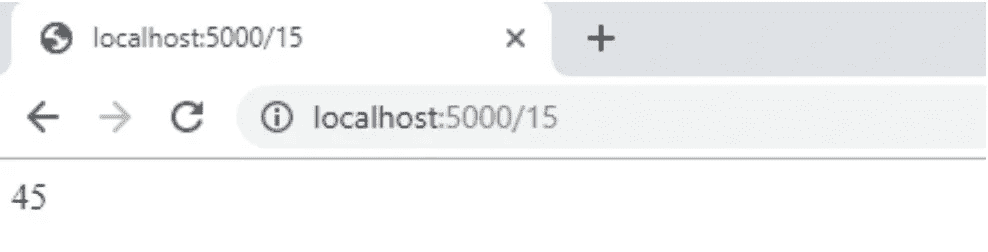*

*这两个例子都可以让你在用户浏览你的站点时跟踪他们。*

*然而，手动将数据输入到 url 中并不是我们向网站传递数据的方式！相反，我们应该使用表单。*

# *使用表单在 Flask 中发布信息*

*为了在 Flask 中处理 web 表单，Flask 提供了一个名为 [Flask-WTF 扩展](http://wtforms.simplecodes.com/docs/0.6/fields.html#basic-fields)的扩展。这个扩展很好地与 Flask 集成在一起。Flask 生态系统具有更多的扩展，这些扩展是 Flask 解决各种问题的能力的重要组成部分。Flask 扩展是使用 Python 中的常规 pip 安装的。首先，让我们安装 Flask-WTF:*

*`pip install flask-wtf`*

# *用户登录表单*

*Flask-WTF 扩展使用 Python 类表示 web 表单。form-class 将表单字段定义为类变量。让我们从创建一个名为“*appforms . py”*的新 python 脚本开始，它将允许我们设置一个用户登录表单:*

*   *要求用户提供用户名和密码。*
*   *包括*“记住我”*复选框，以及*
*   **“登录”按钮。**

*Flask-WTF 的所有符号都在 *flask_wtf 下。*上述代码中需要注意的其他事项包括:*

*   *FlaskForm 基类是从 *flask_wtf* 导入的。*
*   *四个类用于表示各种字段类型(全部从 *WTForms* 包中导入)*
*   *为单个字段创建对象，作为 *LoginForm* 类中的类变量。*
*   *描述或标签作为第一个参数添加到每个字段中。*

*应用于某些字段的可选验证器参数为它们提供了验证行为。*data required**validator*检查提交字段是否为空。还有更多可用的验证器类型。*

# *表单模板*

*下一步是将表单添加到 HTML 模板中，这将有助于高效地定义来自 *appforms.py* 的字段。将它们呈现为 HTML 会使任务相对简单。下面，我们来创建两个模板，一个基础模板和一个登录模板，分别叫做【Formlogin.html】的*和*的 Formlogin.html:***

*这是 Formbase.html 的代码:*

*对于第二个模板，我们通过模板继承重用了 FormBase.html 的*模板。模板继承是 jinja2 的另一个优秀特性。extends 语句有助于完成应用程序的这一部分。**

*   *这个*Formlogin.html*模板期望一个从 *LoginForm* 类实例化的表单对象作为参数给出，您可以看到它被引用为 form。*
*   **novalidate* 属性不对表单域进行验证。使用 *novalidate* 是完全可选的，但是设置它是有用的，因为它允许服务器端测试验证。*

*此时，您可以运行代码 *python appforms.py* ，并通过在地址栏中键入[http://localhost:5000/log in](http://localhost:5000/login)在浏览器上查看应用程序运行时的表单。*

**

# *接收表单数据并增强字段验证*

*运行代码后，按提交按钮会导致一个*“方法不允许”*错误。*

*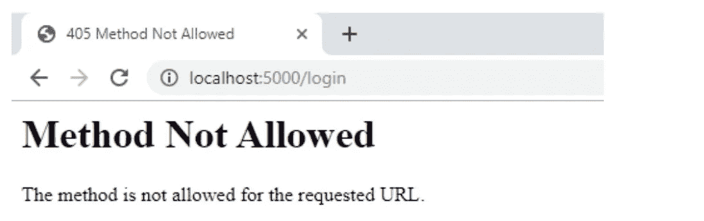*

*该错误是因为作为登录视图函数的 *"appforms.py"* 可以显示表单，但是它还没有逻辑来处理提交的数据。将字段验证器附加到表单字段可以避免无效数据被确认。该应用程序处理无效数据的方法是重新加载表单页面，以允许用户输入正确的数据。*

*如果您试图将无效数据提交到表单中，您会注意到类似的验证机制。下一个任务试图通过添加指示验证失败的错误消息来增强用户体验。表单验证器已经产生了这些描述性的错误消息，所以缺少的部分是添加一些逻辑模板来帮助显示它们。下面是登录模板 *(main.py)* ，在用户名和密码字段中添加了字段验证消息:*

*这个版本在 route decorator 中使用了一个方法参数。它只是告诉 Flask 函数接受 GET 和 POST 请求，仅取代默认的 GET 请求。*

*   **form . validate _ on _ submit()*方法完成所有的表单处理工作。每当用户按下 submit 按钮时，这个函数收集所有附加的数据并运行 validators 字段。如果正确，它将返回 True，表示数据是有效的，可以被处理。*

*下面提供了对上述代码模板的额外更新(*formhelpers.html*和*index.html)**

*formhelpers.hmtl*

*运行这段代码并转到 localhost，看起来会像这样:*

*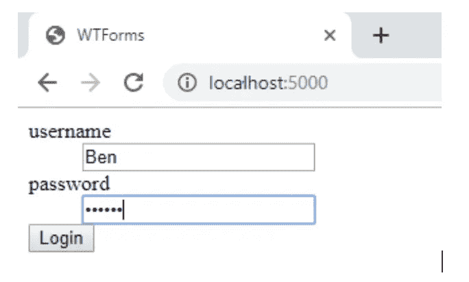*

*提交后:*

*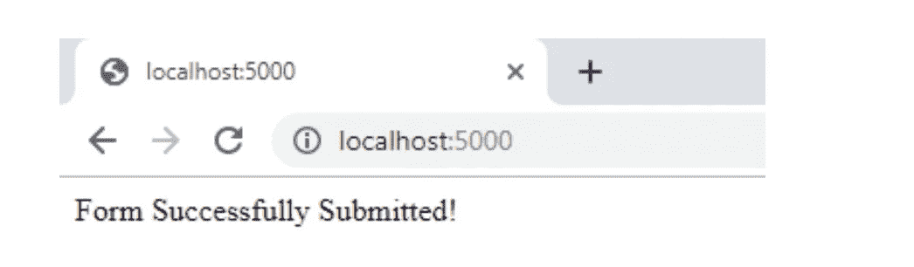*

*一般规则是，任何附加的字段验证器都会在 *<字段名称>的形式下添加错误消息。*错误。运行代码而不提交任何字段的数据会返回一条简单的错误消息。*

*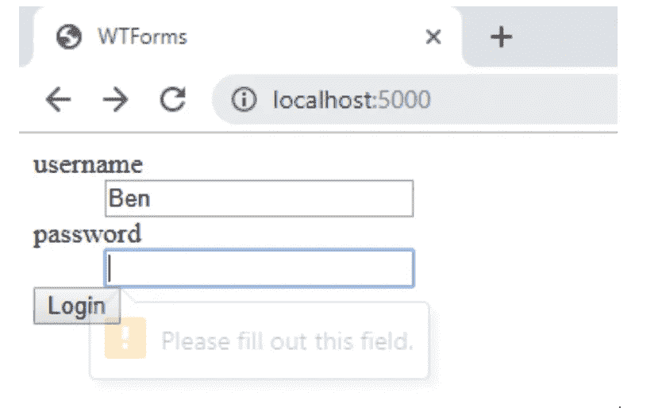*

*代码提供了另一个运行应用程序和查看表单如何工作的绝佳时机。请确保您尝试提交用户名或密码的空表单字段，以便了解 DataRequired 验证程序如何中止提交过程。*

# *创建带有单个字段的简单表单*

*使用 WTForms 和一个表单验证模块，让我们创建一个包含单个字段的简单表单。该任务需要一个包含单个请求姓名字段的表单。首先，让我们创建一个新文件*“single input . py”*并添加以下代码:*

*创建完 python 脚本后，我们创建一个模板 *"form.html"* 保存在 *"templates"* 目录下:*

*form.html 代码*

*使用`python SingleInp.py`在命令提示符下运行代码，并在浏览器中输入[http://127 . 0 . 0 . 1:5000](http://127.0.0.1:5000)/form。*

*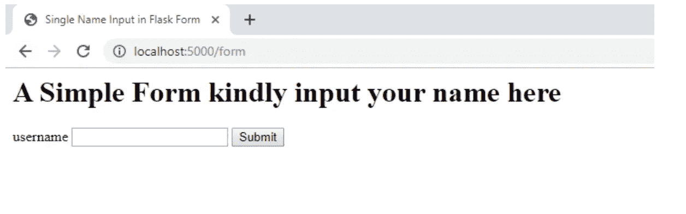*

*如果您输入 Ben 作为用户名并提交，输出将是:*

*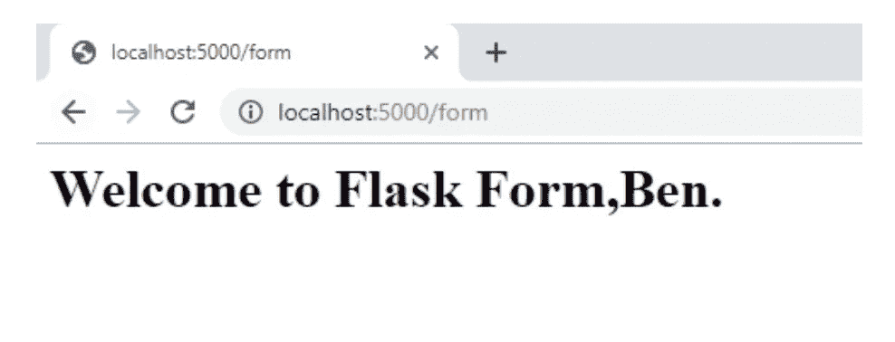*

*输入姓名后，页面会发送包含您姓名的欢迎消息。*

# *结论*

*跟踪用户取得的进展和 Flask 中表单的使用非常有用。使用正确的扩展，你的 Flask 网站体验会变得更好。通过更多的实践，您可以探索 Flask 下可用的其他验证方法、扩展和模板技术。现在，让我们保持简单，专注于下一个任务。像添加 Flask 表单这样的简单模块，可以使你的网站更加健壮，并提供更好的用户体验。*