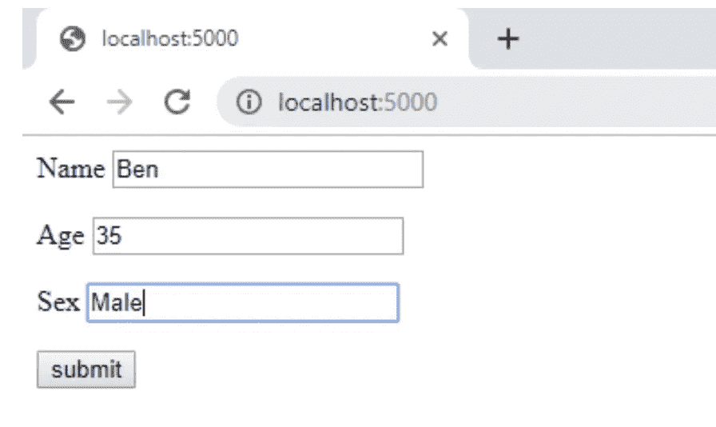
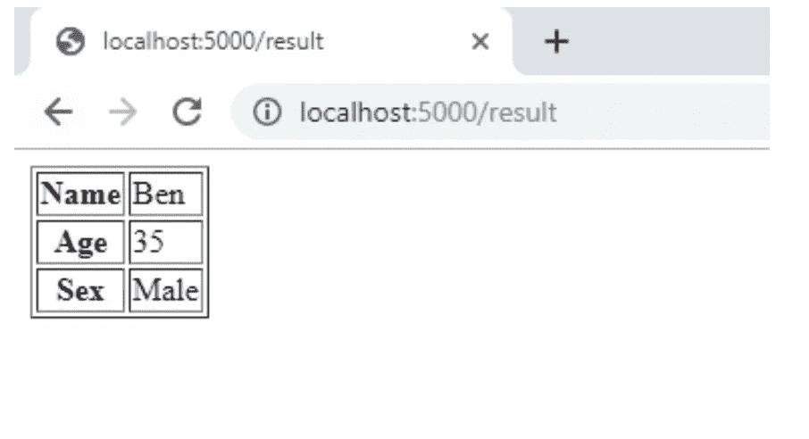
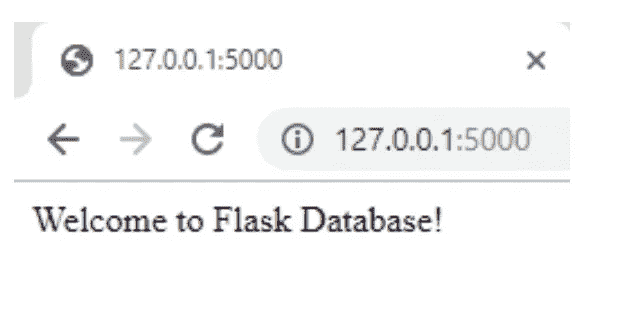

# 用 Flask 构建你的第一个网站:第 4 部分

> 原文：<https://betterprogramming.pub/building-your-first-website-with-flask-part-5-e389fff0c8ec>

## 用 Flask 创建表单和数据库

哈尔·盖特伍德在 [Unsplash](https://unsplash.com/s/photos/websites?utm_source=unsplash&utm_medium=referral&utm_content=creditCopyText) 上拍摄的照片

我们的团队最近写了几篇关于使用 Flask 开发网站的文章。

*   [第一部分——Hello World 及以后](https://medium.com/better-programming/building-your-first-website-with-flask-part-1-903a8b44e806)
*   [第 2 部分— HTML 模板和 CSS](https://medium.com/better-programming/building-your-first-website-with-flask-part-2-6324721be2ae)
*   [第 3 部分——跟踪会议和表格简介](https://medium.com/better-programming/building-your-first-website-with-flask-part-3-99df7d589078)

在本系列的第 4 部分中，我们将介绍如何创建一个数据库来处理各种数据。创建之后，Flask 中数据库管理可用的一组特性也会得到考虑。因此，对于第四部分，我们计划从我们的简单网站实现以下内容:

从表单中插入数据

整合数据库

处理基本用户配置文件

# 从表单中插入数据

使用 Flask，可以将表单数据发送到模板。接收到的表单数据将触发一个功能，该功能将收集到的数据转发到一个模板，以便在选定的网页上呈现。

在下面的例子中，我们将使用主页，它可以在`**‘/’**` URL 找到。这将呈现一个带有表单的 web 页面(`user.html`)。用户填写的数据被发布到`‘/result’` URL。`results()`函数触发结果 URL 上的输出。该函数还使用字典样式(dictionary 对象)收集出现在`request.form`中的表单数据，并将其发送到`result.html`进行呈现。

该模板将表单数据动态呈现在 HTML 表格中。下面是`FormTable.py` *的代码。*

下面给出的是`users.html`的 HTML 脚本。

提交表单后，它将调用结果 HTML 页面。模板代码(`result.html`)如下所示:

运行 Python 脚本，在浏览器中输入 URL[http://localhost:5000/](http://localhost:5000/)。

转到表单的输出如下所示(减去我们输入的内容):

当点击提交按钮时，表单数据以 HTML 表格的形式呈现在`result.html`上。

# 整合数据库

如果你还记得，在我们对 [Flask 和 Django](https://www.coriers.com/python-backends-flask-vs-django/) 的比较中，Flask 是 Python 中的一个微型网络框架。这个定义意味着它没有对象关系映射器(ORM)(而 Django 有)。

因此，如果您希望合并一个交互式数据库，那么您需要额外安装一个扩展。SQLAlchemy 已经成为一种流行的安装选择。在 Flask 中，加法 SQLAlchemy 的现成扩展称为 [Flask-SQLAlchemy](http://flask-sqlalchemy.pocoo.org/) 。

# 安装烧瓶-SQLAlchem

Flask-SQLAlchemy 的安装需要在为 Flask 创建的活动虚拟环境中使用 pip。要安装扩展，请在 Python 中的 Flask 活动环境中输入以下内容:

`pip install flask-sqlalchemy`

Flask-SQLAlchemy 安装成功后，接下来需要安装的是 MySQL。这种安装可以通过以下方式实现:

`pip install mysql`

在成功安装 Flask-SQLAlchemy 和其他依赖项之后，是时候创建我们的交互式数据库了。

# 创建数据库

使用 SQLAlchemy 创建数据库非常简单。SQLAlchemy 支持几种处理数据库的方法。一种常见的方法是使用声明性语法，它允许您创建用于数据库建模的类。

所以对于我们简单的 Flask 教程，我们将使用 SQLite 作为后端。可以使用其他后端解决方案，如 MySQL 或 Postgres。首先，我们将了解如何创建:

通过正常的 SQLAlchemy 的数据库文件

使用不同 Flask-SQLAlchemy 语法的单独脚本

所以让我们从将代码放入一个名为`db_create.py`的文件开始。

代码的早期部分可能看起来很相似，因为我们要求 Python 导入 SQLAlchemy 和其他必要的扩展来使代码的不同部分工作。

随后，代码尝试创建 SQLAlchemy 的 engine 对象，这实质上是将 Python 连接到所选的数据库。此外，我们连接 SQLite 并创建一个数据库文件来代替在内存中创建数据库。

此外，创建的基类是为了服务于声明类定义的创建。这个类定义定义了数据库表。例如，我们可能想要定义一个名为`user`的类，它被附加到一个用户表。

还要注意，表的命名是通过 `**__tablename__**` 类属性完成的。使用我们需要的数据类型来设置表列的创建。

您可以阅读更多相关内容，并从精心编写的[文档](http://docs.sqlalchemy.org/en/latest/orm/extensions/declarative/basic_use.html)中获得深入的细节。在运行上面的代码时，在输出终端得到一个错误。现在让我们在烧瓶中完成所有这些工作。

# 使用 Flask-SQLAlchemy 创建数据库

在使用 Flask-SQLAlchemy 时，我们首先需要创建一个简单的应用程序脚本。让我们把这个应用脚本叫做`apps.py`。现在让我们将下面的代码添加到 Python 文件中并保存它。

另外，一个简单的秘诀是同时建立一个数据库对象，这允许将 SQLAlchemy 集成到 Flask 中。

下一步是创建 Flask app 对象，并为 SQLAlchemy 数据库文件提供一个位置。创建一个`models.py`文件可以做到这一点。这将包含以下代码:

Flask-SQLAlchemy 不需要普通 SQLAlchemy 要求的所有导入。我们只需要在应用程序脚本中创建数据库(db)对象。从那里，我们使用原始的 SQLAlchemy 代码将`db`添加到所有的类中。

同样，预定义的`db.Model`也作为基类。为了帮助初始化数据库，我们创建了`db_setup.py` *。*

上面的代码将使用在模型脚本中创建的表初始化数据库。为了可视化初始化，让我们对我们的`test.py`脚本做一些补充:

这里我们只导入我们的 app 对象和`init_db`函数。现在让我们在终端中运行代码，使用如下代码:

`python test.py`

运行这段代码时，您可以访问下面的链接，看看页面是什么样子的:

[http://127.0.0.1:5000/](http://127.0.0.1:5000/)

# 结论

我们已经使用一个表单和一个包含空数据库的 web 应用程序成功创建了一个简单的数据库条目。

为 web 应用程序创建的数据库还不能接受任何输入，但它提供了数据库使用的介绍。

在下一部分中，我们将把数据库与 Flask 前端集成起来，这样您就可以开始创建新用户了。