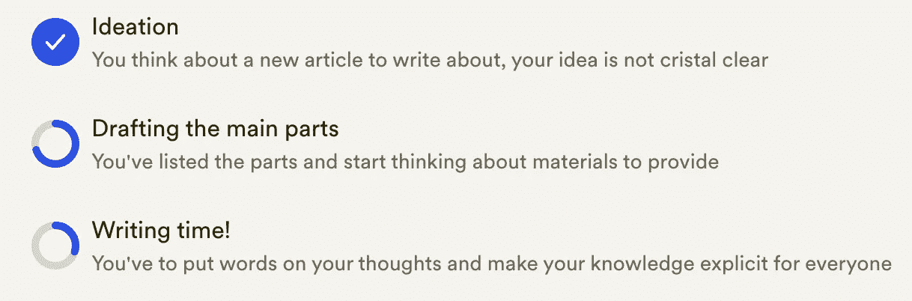
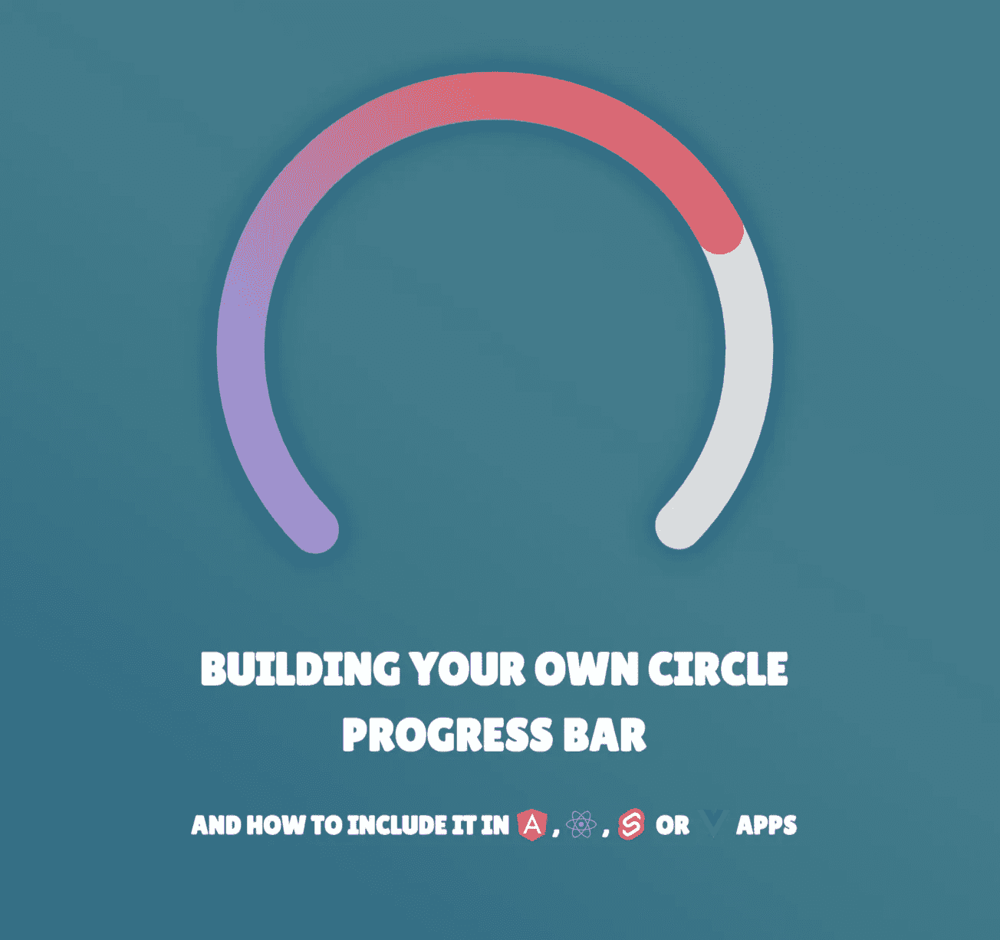
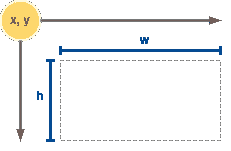

# 构建自己的 JavaScript Circle 进度条

> 原文：<https://betterprogramming.pub/building-your-own-javascript-circle-progress-bar-ae6299e86bc7>

## 以及如何将其包含在 Angular、React、Svelte 或 Vue 应用中



圆形进度条示例(来源:作者)

最近，我被要求创建圆形进度条。首先，它是关于跟踪新设计实现的进度。然后，关于创建一个指示完成列表状态的空的新组件。

我不想给懒惰一个机会，自己去尝试。我已经知道了只使用 CSS 的技巧，我想试一试。

[](https://developer.mozilla.org/en-US/docs/Web/CSS/gradient/conic-gradient) [## conic-gradient() - CSS:级联样式表| MDN

### 函数的作用是:创建一个由渐变和颜色过渡组成的图像

developer.mozilla.org](https://developer.mozilla.org/en-US/docs/Web/CSS/gradient/conic-gradient) 

我的目标也是摆脱第三方库的使用，这可能会增加输出包的大小，并使选项更具限制性。

因此，在这篇文章中，你将学习如何以两种不同的方式实现一个圆形进度条:

1.  第一种方法将使用带有`conic-gradient`函数的纯 CSS，
2.  第二个将利用 SVG 和 CSS。

在最后一部分，您将看到如何使用 JavaScript 框架在项目中集成这样的图表:Angular、React、Svelte 和 Vue 3。



(来源:作者)

# `conic-gradient` 道

让我们从圆锥梯度选项开始，这里只需要基本的 CSS 知识。

## 这个概念

为了只用 CSS 构建一个圆形进度条，我们将使用`[conic-gradient](https://developer.mozilla.org/en-US/docs/Web/CSS/gradient/conic-gradient)` [函数](https://developer.mozilla.org/en-US/docs/Web/CSS/gradient/conic-gradient)。如果你不熟悉 CSS 中的渐变，你可以在下面看到一个快速的比较:

CSS 渐变函数比较

当渐变描绘整个容器时，我们需要使用 3 种不同的渐变:

1.  一个用于已完成部分
2.  一个用于剩余部分
3.  一个用来遮盖“圆盘”的中心

## 实施

一个`radial-gradient`将被应用到内部部分:它允许为栏(进度部分)添加一些透明度，并为“洞”使用背景色。

外侧部分(进度和剩余条)由特定角度的`conic-gradient`组成。

纯 CSS 中的圆形进度条

当我们处理角度时，我们必须将进度值(在`0`和`1`之间)转换成角度(在`0`和`360`之间)。要做到这一点，很基础的数学:`360 * progress`。

```
// For a progress of 30%, then 0.3
angle = 360deg * 0.3 = **120deg**
```

## 利弊

这个选项的第一个好处是简单。你只需要掌握 CSS 函数并调整旋转角度(如果你打算使用颜色渐变)。将进度值转换为角度的公式非常简单。谈到浏览器兼容性，圆锥渐变得到了很好的支持，除了来自 IE(更多信息[这里](https://developer.mozilla.org/en-US/docs/Web/CSS/gradient/conic-gradient#browser_compatibility))。

另一方面，也有不好的一面:定制图表的选项有限。例如，我们不能改变它的形状。此外，也许是最重要的，洞的背景颜色是显式指定的，这不是很方便。

# SVG 方法

第一种选择是小菜一碟，但限制性太强。得益于它的众多特性，SVG 提供了许多属性，使我们能够定制圆形进度条的呈现。

## 这个概念

再说一次，这是两个重叠的圆圈。然而，这里我们可以管理 SVG 特有的两个属性:`stroke-width`和`stroke-dashoffset`。

第一个非常明确，指定了条的宽度。同时，`stroke-dashoffset` 定义了一条在`0`和`100`之间的圆弧。

> 此外，您可以通过应用`stroke-linecap: rounded`使条的边框变圆。

## 实施

在深入研究代码之前，先了解一些关于 SVG 的基础知识。

SVG 标记使用一个`[viewBox](https://developer.mozilla.org/en-US/docs/Web/SVG/Attribute/viewBox)` [属性](https://developer.mozilla.org/en-US/docs/Web/SVG/Attribute/viewBox)来保存内容。您必须定义其原点和尺寸。它遵循`x y w h`语义:



XYWH 语义(来源:作者)

这意味着根据你将要使用的笔画宽度，原点和尺寸需要再次调整。

然后，进度条的起点与*通常的起点不匹配。*需要用`transform: rotate(-90deg)`旋转。

使用 SVG 和 CSS 绘制圆形进度条

必须注意几个要素:

*   `stroke`定义了`<circle>`的颜色
*   `[stroke-dasharray](https://developer.mozilla.org/en-US/docs/Web/SVG/Attribute/stroke-dasharray)`属性指定用于描绘形状轮廓的图案(这里我们想要 100%)

同样，必须应用一个公式将小数百分比转换为笔画 dashoffset 的正确进度值:

```
// For a progress of 70%, then 0.7
stroke-dashoffset = 100 - (0.7 * 100) = **30**
```

## 进一步使用 SVG 方法…

SVG 提供了许多可能性，您的想象力是您唯一的限制。

可能你是为了英雄形象上的半圆进度条才跳进这篇文章的。下面的代码笔演示了如何处理线性渐变，形状渲染，阴影和笔画 dash-array。

在 SVG 中创建一个半圆形进度条

## 优点和缺点

优点数不胜数。首先，SVG 选项为您定制组件提供了很大的灵活性。

当它处理响应和浏览器兼容性支持时，这是最好的方法，你可以用[can use](https://caniuse.com/svg)来看。

然而，这种可定制性是有代价的:时间和精力。有时候，你需要一个很难开发的特性。在这种情况下，使用第三方库是一个很好的选择，与依赖性和供应商的规模相当。

由于所有这些原因，我总是提倡减少需求和最容易实现的解决方案。

现在是时候把这个圆形进度条片段变成一个具体的相关组件了。让我们看看如何将它集成到项目中。

# 如何将其融入到你的项目中？

在这一点上，你的应用程序呈现了一个别致的全新的圆形进度条，但它不是非常动态的…你需要“注入”真实的数据，而不仅仅是一些静态值。

## 有角的

基本上，将动态值插入圆形进度条最方便的方法是使用 CSS 变量。

[Angular framework](https://angular.io/) 允许我们使用组件的原生元素来这样做，如下所示:

## 反应

使用样式化组件，用 [React](https://reactjs.org/docs/getting-started.html) 实现 CircleProgressBar 组件非常容易。

另一种选择是使用 CSS 变量。为此，我让您深入阅读 Josh W. Comeau 的文章:

[](https://www.joshwcomeau.com/css/css-variables-for-react-devs/) [## React Devs 的 CSS 变量

### CSS 变量真的很酷，而且在反应方面非常强大！本教程展示了我们如何能够…

www.joshwcomeau.com](https://www.joshwcomeau.com/css/css-variables-for-react-devs/) 

## 苗条的

当它有了[苗条的](https://svelte.dev/)时，令人印象深刻的是一点点代码可以产生更多。再次强调，CSS 变量是关键:

你可以在下面找到相关的游乐场:

[](https://svelte.dev/repl/f1437286b08d4890b9207180868ee37e?version=3.46.4) [## 圆形进度条* REPL *苗条

### 控制论增强的网络应用

苗条的人](https://svelte.dev/repl/f1437286b08d4890b9207180868ee37e?version=3.46.4) 

## Vue 3

[Vue](https://vuejs.org/guide/introduction.html) 版本将再次使用 CSS 自定义属性。我们将用`v-bind`将一个动态值绑定到一个 CSS 属性，如这里的所述。

# 结束思想…

正如你可能已经看到的，创建自己的圆形进度条并不复杂，只需要一点 CSS 和(可选的)SVG。当然，这些解决方案不会满足您的所有需求；但是你现在可以考虑自己做了。

作为工程师，重要的是我们要考虑所有的选择并后退一步:增加一个依赖关系是否相关？或者可能用例非常具体，易于实现…

事实上，CSS 和 SVG 提供了很多可能性，因此，circle 进度条只是众多例子中的一个。

## 资源和参考

[](https://developer.mozilla.org/en-US/docs/Web/CSS/gradient/conic-gradient) [## conic-gradient() - CSS:级联样式表| MDN

### 函数的作用是:创建一个由渐变和颜色过渡组成的图像

developer.mozilla.org](https://developer.mozilla.org/en-US/docs/Web/CSS/gradient/conic-gradient) [](https://developer.mozilla.org/en-US/docs/Web/CSS/Using_CSS_custom_properties) [## 使用 CSS 自定义属性(变量)- CSS:级联样式表| MDN

### 自定义属性(有时称为 CSS 变量或级联变量)是由 CSS 作者定义的实体…

developer.mozilla.org](https://developer.mozilla.org/en-US/docs/Web/CSS/Using_CSS_custom_properties)