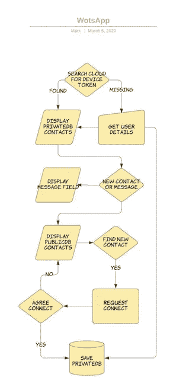
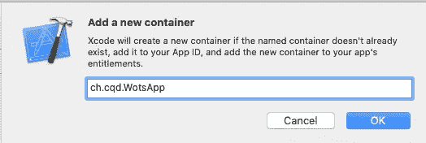
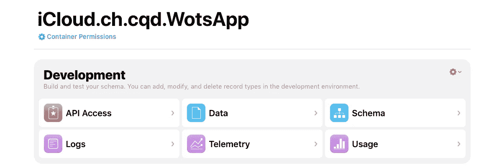
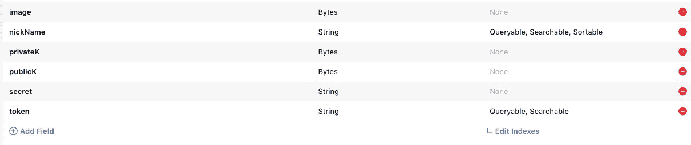

# 构建您自己的 WotsApp——第 3 部分

> 原文：<https://betterprogramming.pub/building-your-own-wotsapp-part-3-924ba3f6c569>

## 使用 SwiftUI、Combine、通知、CloudKit 和加密技术

马克斯·兰格洛特在 [Unsplash](https://unsplash.com/?utm_source=unsplash&utm_medium=referral&utm_content=creditCopyText) 上的照片。

我应该以免责声明开始这篇文章:它是基于 iOS 13、Swift 5 和 Xcode 11.x 的。如果你正在阅读这篇文章，而那些数字看起来过时了，请预先警告。

我还应该提醒你，通知——主要是远程通知——涉及苹果的基础设施，这意味着你需要一个苹果开发者账户才能使用它们。当然，你也需要一个来使用 CloudKit。

最后，这是一个系列。你不会在 20 分钟内建立你自己的 WotsApp。至少要十章。在接下来的两章中，我们将开始构建我们的 CloudKit 代码，并再次使用 SwiftUI 重新设计接口。后者比前者更接近我们的最终目标。我们将再次从头开始构建 UI。

# 第五章

好的，这里有一个显示工作流程的草图。在接下来的两章中，我们将仔细检查完成大约一半图表所需的代码。

这就是我们希望建立的:WotsApp 消息应用。这不是一份合同，只是一个有望帮助我们实现目标的计划。让我们来看看代码。现在是做一些 CloudKit 工作的时候了。单击项目的目标，将 CloudKit 添加到功能中。勾选 CloudKit 的复选框并创建一个新容器。使用项目的包标识符来命名它。

完成后，您需要穿过并登录到 CloudKit 桌面。注意:这似乎会改变每一个 WWDC，所以如果你的观点和我的不一样，那一定是 2020 年夏天了。

转到您的新容器，并在右侧选择 Schema:

让我们通过创建一个可以在公共和私人数据库中使用的通用记录来简化事情。选择新容器并添加新记录类型。我们将称之为`directory`。添加您在此快照中看到的字段。保存后，返回并添加索引。

我们希望在这里创建六个字段。我们不会在公共数据库中使用它们全部——只是一个选择——但是我们会在私有副本中使用它们全部。回到 Xcode。

创建一个新文件并调用`Storage`。我首先在其中为我的 CloudKit 数据库中的数据的本地副本定义一个本地数据结构。不要忘记您需要导入 CloudKit 并组合框架。

我们还需要声明一些组合结构，它们被称为`passthroughsubjects`。他们有点像代表，除了更好。

在我们处理可怕的 CloudKit 代码之前，有几个词:为 CloudKit 编码可能是一个挑战，因为它涉及到延迟，这是程序员不习惯的。通常，您期望即时执行和结果，但在 CloudKit 中不是这样。CloudKit 也很有趣，因为它有一些您需要考虑的限制。大多数不会在短期内影响我们的应用程序，但如果事情发生，可能会影响我们的应用程序。

在设计和编码时，你需要记住一些限制。其中包括，如果你使用公共数据库，如果你使用了太多的空间，你将被收取费用。配额是可以的，随着用户数量的增加而增加，但要记住这一点。您还需要注意您在私有数据库中使用的空间。如果你用你的应用数据填充他们的 iCloud，你的用户不会太高兴。更糟糕的是，你所有的时间都被浪费了。如果苹果认为你对 CloudKit 过于漫不经心，它会直接拒绝你的应用。其他限制包括你在短时间内可以提出的请求数量，尽管这肯定不会影响我们。

尽管如此，您可能很早就遇到了一个限制:一次请求中可以下载的记录数量。这个限制很小，每个请求大约 100 条记录。考虑到我们将在这里存储令牌/基本用户详细信息的主目录，这是一个值得思考的问题。当然，您可以围绕它进行编码，尽管我在这里没有这样做。

好了，够了。回到代码。我们将从给定一个令牌来搜索公共和私有数据库的一些例程开始。注意:我把它放在主界面上的一个 tap 后面，因为获取令牌需要一两秒钟，我需要争取时间。

这段代码值得注意的一点是需要在主线程上执行`passthroughsubjects`。否则，您的项目可能无法编译。更糟糕的是，它可能会崩溃。

接下来，我们需要一个例程来为我们的目录获取私有和公共数据库中的所有记录。请记住，每次呼叫可以取回号码是有限制的。当然，你需要 100 台设备来破解/测试我们的 WotsApp 应用，但是……你明白了。

接下来，几个例程将我们的令牌保存到私有和公共数据库。实际上，大部分代码都是模板代码，这里的闭包中只有一点值得注意——信号量的使用。

信号量将我们的两个保存例程集合在一起，然后在它们都完成时发送给我`passthroughsubjects`。信号量将保证`wait()`和`signal()`中的代码被独占执行。这段代码只是计算已完成进程的数量，在我们的例子中需要两个。

我怀疑我们将需要更多的代码，但让我们继续我们的 SwiftUI 界面。

# 第六章

我敢肯定，这些 CloudKit 代码足够你用一辈子了。让我们试着做一些 SwiftUI。我已经把第三章和第四章的内容一笔勾销了。

我现在有五个部门。第一个设置我们的环境，创建不同的对象，并设置一组固定的图标供用户选择。你可以用任何你喜欢的图片。保持小规模。因为我们最终会将它们保存在公共云空间中，所以考虑一下费用吧。

这里最值得注意的是，我们的`nouvelleUsers`是一个`ObservableObject`。这是一种告诉 SwiftUI 的方式，如果该结构中的数据发生变化，它需要重新绘制其接口——该结构可能会在其他地方更新。

下一节声明了十几个真正意义上的变量:我们可以在其中改变值的框。这是 SwiftUI 所需要的声明，因为视图是一个结构并且是不可变的。状态变量和我刚才提到的可观测变量有着相同的效果。改变它们，它发出了一个信号，表明它可能需要重画自己。

下一节定义了当你启动应用程序时会发生什么。它决定这是否是一个新的案件。假设它不是新设备，它会用正确的密钥设置我们的加密环境。

它和其他 SwiftUI 部分中的`onReceive`指令显示了我们的`passThroughSubject`的另一半，我们的组合框架委托方法。程序执行由我们已经定义的存储类方法和 SwiftUI 代码中的这些闭包之间发送的消息控制。

这段代码的大部分都很普通，最后有一个小的变通方法，在我将下载到本地 CloudKit 副本的数据复制到显示副本时，延迟显示 pickerview。

下一部分是新用户要走的路。它显示了一个带有几个文本字段和一个图标的表单。这是我们定义新的加密密钥并将所有内容保存到云中的地方。我们的信号量在后台使用，以确保在显示警报之前私有和公共数据库都得到更新。

最后，最后一部分是现有用户的路径。它显示了一个 pickerview，显示了应用程序已知的用户，实际上，在我写这篇文章时，一个消息窗口没有连接到任何东西。只是作秀而已。

# 结论

现在你知道了。很抱歉我之前不能/没有要求你做任何测试。此时，您应该能够运行代码了——当您看到初始屏幕时运行一次，然后再次看到第二个屏幕，第三次在第二个设备上运行以进行最终测试。

我将暂时结束这一章。正如我所说的，我们已经完成了我在文章开头勾勒的计划的一半。请继续阅读。