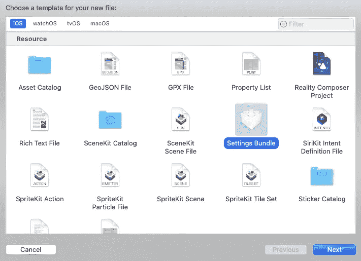
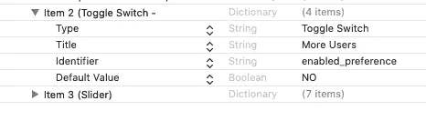

# 构建您自己的 WotsApp —第 5 部分

> 原文：<https://betterprogramming.pub/building-your-own-wotsapp-part-5-d4747e453a00>

## 使用 SwiftUI、Combine、通知、CloudKit 和加密技术


照片由[马拉·普鲁西克](https://unsplash.com/@soppeldunk?utm_source=unsplash&utm_medium=referral&utm_content=creditCopyText)在 [Unsplash](https://unsplash.com/s/photos/tall-buildings?utm_source=unsplash&utm_medium=referral&utm_content=creditCopyText) 上拍摄。

我应该以免责声明开始这篇文章:它是基于 iOS 13、Swift 5 和 Xcode 11.x 的。如果你正在阅读这篇文章，而那些数字看起来过时了，请预先警告。

我还应该提醒你，通知——主要是远程通知——涉及苹果的基础设施，这意味着你需要一个苹果开发者账户才能使用它们。当然，你也需要一个来使用 CloudKit。

最后，这是一个系列。你不会在 20 分钟内建立自己的 WotsApp。它用了十章。这是最后两个，把我讲过的所有内容都集中到了一起。也就是说，你会在第 10 章的开头注意到一个长长的待办事项列表。我完了，但我没有。如果你想要更多的这个系列，请留下评论。

# 第九章

在前两章中，我们开始实现消息传递方之间的对话。有很多不同的片段。所以我想最好是把 SwiftUI 部分移到它自己的章节里。我们开始行动吧。编辑`ContentView.swift`并创建更多变量:

将这段代码添加到`Text`(“WotsApp”)指令中。请注意，我必须在这里使警告通用化，因为 SwiftUI 似乎不支持标记到同一个元素的多个`.alerts`。

我们在这里也使用了新的`PassthroughSubject`。请确保您也将此添加到您的`ContentView.swift`文件的顶部:

```
let alertPublisher = PassthroughSubject<(String, String), Never>()
```

现在将`enable`字段标记到`TextField`对象上，这样如果请求被拒绝或推迟，我们就可以禁用发送消息的请求。

最后，添加对我们在上一章中放置的新的`cloud.authRequest`方法的调用。将它贴在拾取轮上。

你应该可以再测试一次！去吧。请注意，要获得请求的选项，您需要下拉通知。你应该能够接受、推迟和拒绝通知……如果你同意，还可以互相发送加密短信。

好了，我们开始了。但是我们还没有完全按照预想的那样实施协议。您还记得，当且仅当您知道共享秘密(一个你们都知道的秘密)时，我们希望用户请求允许将您添加到他的私有数据库中。为此，我们需要一个带有文本字段的警告弹出窗口。这在过去是微不足道的，但在 SwiftUI 中还没有。

这里有一个解决方案。我并不是说这是*的*解决方案。这仅仅是一个解决方案。首先，我们需要存储这个秘密，这样我们的`appDelegate`就可以很容易地访问它。点击此处查看新代码:

显然，我们需要在第一时间把秘密写出来。这是您在`contentView.swift`中看到的完整标签:

其次，我们需要更换我们的出版商。姑且称之为`popUpPublisher`。当我们在那里的时候，我们应该增加另一个出版商。我们称这个为`cestBonPublisher`。其目的是如果给出的密码是正确的，则释放消息传递字段。

```
let popUpPublisher = PassthroughSubject<String, Never>()
let cestBonPublisher = PassthroughSubject<Void, Never>()
```

第三，我们需要响应代码中的`PopUpPublisher`。将下面的代码标记为`Picker View`:

最后但同样重要的是，我们需要`popUp`的代码。将此添加到您的`ContentView.swift`的底部:

哦，在我忘记之前，你显然需要抓住`cestBonPublisher`。该代码将需要与您已经定义的警报一起进行标记。我展示了完整的代码块，包括我们之前放入的警告:

你可以再做一次测试。它应该挑战你，把代码显示在交易中。如果输入错误，它会警告您，您将无法发送消息。正确输入，你不会得到任何警告，你可以发送消息。

当然，这和我说的不太一样，但是很接近了。我将让读者删除弹出窗口中的代码。

# 第十章

我们的最后一章——或许不是。随着项目的推进，我们留下了一些遗留问题。以下是一些开放项目的列表(您可能还能想到更多):

*   我们设置了认证握手，它工作了，但是它不能保存您的决定，每次都强制一个授权消息。
*   我们很方便地忽略了如果有两个同名的用户会发生什么。
*   就这一点而言，没有对您输入的任何字段进行检查，这是非常糟糕的做法。至少，我们需要限制用户名/消息的长度——最好是字符集。
*   我不应该承认，但我们在一些地方使用了幻数。这不是好的编码实践。我们不应该使用任何。
*   我们忽略了这样一个事实，如果您有大约 100 个或更多的用户，那么您只能得到最初搜索返回的一个子集。你必须一次又一次地递归搜索才能得到它们，这是 CloudKit 的一个特性。
*   在这个问题上，我们确实需要一个更具伸缩性的解决方案来选择要通知的用户。滚动一个 100 的列表将会是一个束缚。想象一下 1000。
*   在同一个领域，我们真的需要能够创建我们自己的用户组。拥有一个全球目录在现实世界中是不可行的。
*   还是在 CloudKit 这个话题上，没有删除用户的手段。这是糟糕的家务管理。
*   我们假设设备登录到 iCloud，CloudKit 才能工作。如果没有，就会失败。我们需要用一个明确的信息来解决这个问题。
*   事实上，我们几乎在所有地方都跳过了错误报告。我们需要研究这个问题——特别是对于 CloudKit 和`RemoteNotification`。
*   我们建立了一种让多个用户使用一台设备的方法，但是我们没有完成这项功能。您应该还记得，我们使用 CloudKit dashboard 直接编辑我们的数据库。我们需要一个真正的解决方案。
*   当同一设备上有多个用户时，它仍会将他们列为源设备上的通知目标。如果你给他们发信息，那就失败了。另外，这毫无意义。
*   显然，您的设备需要连接到网络。否则，应用程序将会失败。我们也需要用一个明确的信息来解决这个问题。
*   最后，我认为所有的信息应用程序都可以让你发送照片或语音信息。我们应该做同样的事情，并研究这种增强。

如你所见，继续编码有很大的潜力。我没有按照任何特定的顺序排列这些。如果提交到苹果应用商店，一些开放点甚至可能导致你的应用被拒绝。精神食粮。

让我们完成我们开始的选项—每个设备多个用户。我们需要的只是一个简单的管理界面。对我们来说幸运的是，已经有一个以设置包的形式存在的。我们还将修复上面列表中倒数第二个提到的无意义问题。

选择“文件”、“新建文件”,然后在“资源”下选择设置包。



现在将所有项目留在那里以供参考，尽管我们只打算使用开关。展开切换项目并更改标题。



现在将这段代码添加到`appDelegate.swift`文件中:

当然，这仅仅是读取和设置我们的开关的值。我们需要做的是改变读取私有云数据库的方法的行为。在我们的`Cloud.swift`中，我们这样做:

好吧，虽然有点笨拙，但它的工作方式是这样的:当你想在同一台设备上添加第二个用户时，你需要在启动应用程序之前打开“更多用户”开关。它将读取您想要更多用户(在同一设备上)的事实，并给你添加用户的菜单。当我们在`Cloud.swift`文件中时，我还想阻止具有相同令牌 ID 的用户出现。这是一个完整的方法，在末尾添加了一些新代码。这是为了防止在同一设备上注册的用户成为通知的潜在目标，这显然是无稽之谈。

你可以继续再测试一次。您应该能够使用设备向同一设备添加多个用户。让我们看看另一项未完成的工作来结束本章:保存授权对话。

当我们获得与某人交谈的许可时，我们需要将`auth`值保存在我们的私有数据库中。为了实现更改，我需要在我的`Cloud.swift`文件中再创建一些方法。当然，我需要在`ContentView.swift`中的正确时间给他们打电话。先说`Cloud.swift`:

此字段在目录数据库的本地私有副本中按名称查找记录，如果找到，则更新该记录。你需要在这里调用它——这里是发布者，如果你得到正确的密码，弹出窗口就会触发它。

```
.onReceive(cestBonPublisher, perform: { (_) in
self.disableText = false
cloud.updateRex()
})
```

测试这个比我们到目前为止所做的更具挑战性。因为你需要两个真实的设备登录到不同的 AppleIDs。在你的 WotsApp 应用程序中与用户设置它们，并尝试发送通知、授予权限，然后从头再做一遍。第二次运行时，假设您同意了，它应该已经保存了您的初始协议，您将不会再次弹出下拉通知。

# 结论

这就把我带到了这个系列的结尾。如果你一直在关注并想了解更多，请在下面留言。有一大堆待办事项。我下一步应该处理什么？