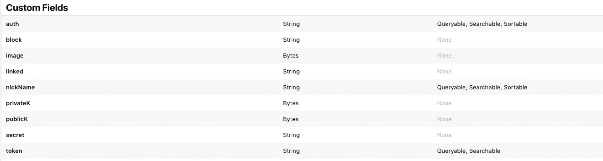

# 构建您自己的 WotsApp —第 6 部分

> 原文：<https://betterprogramming.pub/building-your-own-wotsapp-part-6-99453e93fa99>

## 使用 SwiftUI、Combine、通知、CloudKit 和加密技术


照片由[尼尔·库珀](https://unsplash.com/@neilcooper?utm_source=unsplash&utm_medium=referral&utm_content=creditCopyText)在 [Unsplash](https://unsplash.com/s/photos/high-rise-building-night?utm_source=unsplash&utm_medium=referral&utm_content=creditCopyText) 拍摄。

我应该以免责声明开始这篇文章:它是基于 iOS 13、Swift 5 和 Xcode 11.x 的。如果你正在阅读这篇文章，而那些数字看起来过时了，请预先警告。

我还应该提醒你，通知——主要是远程通知——涉及苹果的基础设施，这意味着你需要一个苹果开发者账户才能使用它们。当然，你也需要一个来使用 CloudKit。

这个系列最近结束了…只是我突然意识到我有点虚伪。我一开始提到了未完成的通知教程，最后写了一个巨大的待办事项列表。

因此，我想我最好通过覆盖大部分(如果不是全部的话)的开放点来完成事情。当然，我也发现了一些 bug，下面我将一一介绍。我确实试着多写了两章，但我认为我们需要 13 章，这很合适。许多事情在第 13 章结束。

# 破产重组保护

首先，一些速赢。苹果在 WWDC2019 上推出了一个名为 Network 的新框架，在它的内部，有一种检查网络连通性的方法。定义一个新类，将其命名为`Connect`，并在其中添加以下代码:

我们可以在这里使用一个`passthruSubject`，但是因为结果几乎是即时的，所以让我们使用一个变量。我定义的`Connect`类是一个单例类，我在其中包含了指向回调的变量，这样你就可以将其功能扩展到类本身之外。我们的应用程序不需要它，但我还是把它留了下来。

现在转到`Storage.swift`文件。将此方法添加到它:

这会检查您是否已连接到 iCloud，并返回一条状态信息。显然，您需要在应用程序的开头添加这两项检查:

我们继续。很多待办事项似乎都在 CloudKit 中。

那个目录问题怎么样了？我编写了一个递归版本的代码来读取公共目录，所以它读取、读取并继续读取，直到获得所有记录。它可以完成这项工作，但它有两个主要缺点，我可以马上想到:

*   你的设备可能会内存不足，或者因为太快使用太多内存而被 iOS 杀死。
*   抓取操作可能需要很长时间，以至于它会让你的应用程序看起来像是被冻结了——然后它会被用户杀死。

拥有一个可能导致死亡的方法是不理想的。下面是有问题的代码:

我们需要更有选择性。让我们通过使用`NSPredicate`字符串比较操作符变得更聪明。有五种:`BEGINSWITH`、`CONTAINS`、`ENDSWITH`、`LIKE`和`MATCHES`。让我们重新组合最后一个方法，加入一个更智能的谓词:

注意:我在注释中添加了代码，以帮助我在对上述内容进行测试后清理数据库。

我们可以将它与界面上的滑块结合起来，给你一个类似标签的搜索，这样你可以移动滑块，它会搜索所有以字母 *X* 开头的名字。编辑`ContentView.swift`并将此代码标记到 pickerview 上，以实现新的 cloudKit 目录搜索:

为了测试这个，我们需要 100 多台设备——不可否认这是一个很高的要求。让我们用一些虚拟账户来妥协。使用此代码创建一个测试集:

把所有东西都编好，放好，去做吧。显然，您只需要调用假帐户方法一次。将它添加到接口上的一个`.appear`标记中，编译、运行，然后将其注释掉。

我承认这有点像 ZX81，但没关系。在您确信一切正常后，返回到目录搜索的 V4，取消调用这里显示的`delete records`方法的代码行的注释。运行它并清理您的测试帐户:

仍然在 CloudKit 上，我们需要一种方式来通知我们想要删除用户。让我们在图像上长按。我们还需要一个确认协议，所以让我们使用一个带有是/否的警告弹出窗口。从您的`Cloud.swift`文件中的这些新方法开始:

显然，我们也需要一种搜索要删除的记录的方法:

添加了功能后，您现在需要向您的`ContentView.swift`添加一些新变量，并向图像视图添加一些手势:

好的，如果你剪切并粘贴了所有的代码，你应该准备好再次测试。删除数据库中的所有条目，然后创建一个新用户。检查 CloudKit 仪表板以确保它们在那里。然后长按图像将其删除。删除后，再次检查您的 CloudKit 仪表板，以确保它正常工作！

正当我以为我要赢的时候，我女儿又提出了几个问题:

*   你没有办法永远挡住你的老闺蜜(BFF)，她已经成了你新的有史以来最大的敌人(WEE)。
*   如果你不想无意中与他们交谈，能够完全隐藏姓名是件好事。
*   图标上不断有徽章，有点烦！

最后一点属于前一章。我想我最终需要解决这个问题。现在，我们将在 CloudKit 中解决另外两个问题。

但是在我们尝试解决这些问题之前，先说一下 CloudKit 错误。此时，我们向用户报告所有原始的错误。他们中的大多数要么永远不会开火，要么很少开火。在他们身上花太多时间几乎没有意义(但不要在你把应用提交给苹果的时候这么说)。我可以通过查看`CKError.h`直接从源代码中获得一个错误列表，尽管使用这样的 case 语句几乎同样容易获得一个错误列表。在撰写本文时，CloudKit 中有 34 个错误。

显然，这些错误中有许多与特定的调用和设置密切相关。有几个是通用的。例如，我们可能会在任何对 CloudKit 的调用中看到`networkFailure`或`networkUnavailable`。一个更具体的错误示例可能是`quotaExceeded`，例如，当您试图将数据保存到云中时。在非常罕见的情况下，你甚至可能会得到一个`internalError`，这是苹果公司表示出了问题，但我不知道是什么问题的方式。我承认从这些中恢复真的超出了本文的范围。我承认我失败了。

# 第十二章

我们还没有完成 CloudKit，但是我认为我们已经完成了大部分的快速成功。这是我们剩下的:

*   我需要阻止我的好朋友，他背叛了我。
*   把我的账号也藏起来，这样我就没有机会被邀请加入我的小团体了。
*   弄清楚如果有两个同名的用户，如何知道谁是谁。
*   建立一个私人群组，这样我就可以只与一组选定的朋友聊天。
*   看在上帝的份上，做一些输入检查。

还有五期。让我们试着解决它们。

已经授权你的 BFF 发送通知给你，我们需要一个不同的方法来阻止他们，如果他们攻击你。让我们在发送的每条消息上添加一个下拉菜单，这样如果用户感到不舒服，你就可以阻止他。

一个很好的复习方法:编辑你的`appDelegate`，向下滚动到`registerCategories`，添加一个新的。为了更好地衡量，我包括了整个方法。注意末尾的新行。请确保在此处更改类别:

在同一个文件中向上移动一点，并向`didReceive` `userNotificationsCenter`方法添加一个新动作:

点击 content extensions 中的`info.plist`，使用第二个`NSExtension`将您添加的新类别添加到代码中:

现在编辑您的`RemoteNotifications.swift`并更改保存的消息，使它现在属于新的类别，并在其中包含最重要的`content-available`标签。它现在应该是这样的:

好的，你应该可以再测试一次。编译所有的东西，如果你还没有添加一些用户，授权他们互相发送消息。完成后，发送消息并检查下拉菜单。应该有一个选项来阻止它们。这是所做工作的四分之一。

希望这对你也有用。现在编辑您的`storage.swift`文件。我们需要添加一个方法并调整另一个方法。找到`searchNReturn`并将这个新版本安装到位。确保您更改了在`ContentView.swift`中的调用，以反映附加参数。您需要将`return`作为原始调用中的一个动作:

现在移动到文件的底部，添加一个新的更新方法，您刚刚在新的`searchNReturn`中引用了这个方法:

返回到`appDelegate`，在 block 动作下添加对新方法的第二次调用。它现在应该看起来像这样。注意这次第二个参数是`block`:

编辑`RemoteNotification`并将令牌添加到消息中:

最后，登录 CloudKit 并向您的目录记录模式添加一个新字段。叫它`block`。此时，模式应该如下所示:



现在你可以再次奔跑了。在两个不同的设备上重新编译应用程序，并尝试从一个设备向另一个设备发送消息。一旦你得到了授权握手排序，发送一个消息，然后尝试阻止它。完成后，登录 CloudKit 并检查是否更新了正确的记录！这是工作的一半。

停下停下停下。我在这里发现了一个 bug。我忘记了，在前面的章节中似乎添加了保存 authorize 方法的最终代码。您在`Storage.swift`文件中寻找的行就是这一行。你的会有点不同。改变它。您还需要更改`shortProtocol`的声明:

```
DispatchQueue.main.async { self!.shortProtocol.send() }
```

除此之外，您需要在`ContentView.swift`文件中添加一些代码来捕获消息:

```
.onReceive(cloud.shortProtocol) { ( _ ) in
self.disableText = false
}
```

一旦完成，就应该承认授权。

很好，回到 cloud kit——我们最喜欢的主题。但是等等，我们需要慢一点。我们使用的通知扩展运行的时间非常少，当它们运行时，试图在 CloudKit 上查找记录是不可行的。我们需要一个不同的计划。我们可以使用`userDefaults`来保存被阻止的设备。再次编辑`Storage.swift`并将该代码添加到`updateRex3`方法中。我们希望将设备 ID 保存到一个阻塞设备的数组中，并编写一些方法来检查令牌是否被阻塞。

现在，我们可以在我们的`appDelegate`中用这种方法检查设备是否在阻止列表中，尽管它只会在我们在前台运行应用程序时阻止通知到达。这恐怕是 iOS 13 的一个局限吧…

要阻止通知在后台出现，我们需要从源头上阻止它们。我们需要首先阻止通知的发送。为此，我们可以使用另一种无声通知。编辑`RemoteNotifications.swift`并将这个新方法添加到其中:

然后回到`appDelegate`，找到我们的块动作，编辑它，并把这个方法添加到混合中。我已经发布了动作中的所有代码，以便您可以看到大图:

现在转到`didReceiveRemoteNotification`方法，并将这个动作添加到其中:

```
if request == "block" {
cloud.saveBlockedTokenToSharedmemory(token2B: device!)
}
```

最后，您需要引用`Storage.swift`文件中的`tokenIsBlocked`方法，以确保目录列表例程正在使用它:

我还重新编码了`Storage.swift`文件中的初始私有/公共目录列表方法，以使用这个新方法:

现在已经完成了所有这些，您可以再次编译、运行和测试它。当你得到一个消息，它应该给你选择拉下来，阻止用户。但是要注意:一旦被封锁，它们将永远无法恢复——至少我们现在是这样。加载目录时，还会跳过被阻止的用户。这项工作已经完成了四分之三。如何解封曾经被封的用户是 4/4 的课题，我还没想出解决方案。也许在第 13 章。

我不知道你怎么样，但我的头在旋转。我想我们需要在下一章之前休息一下。