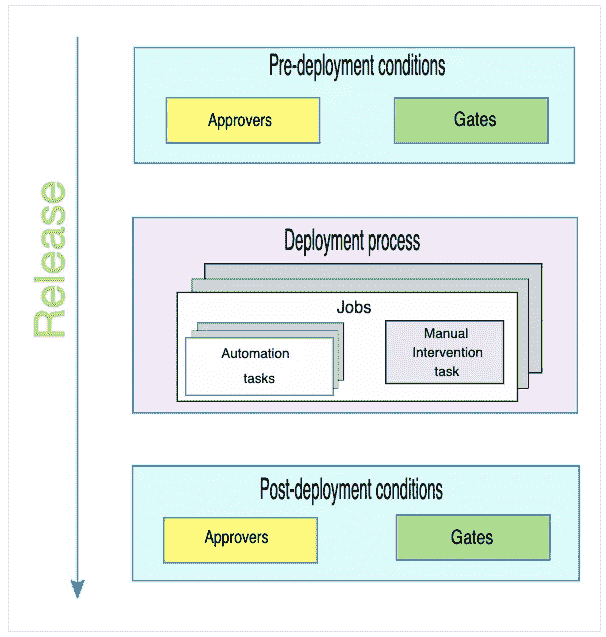
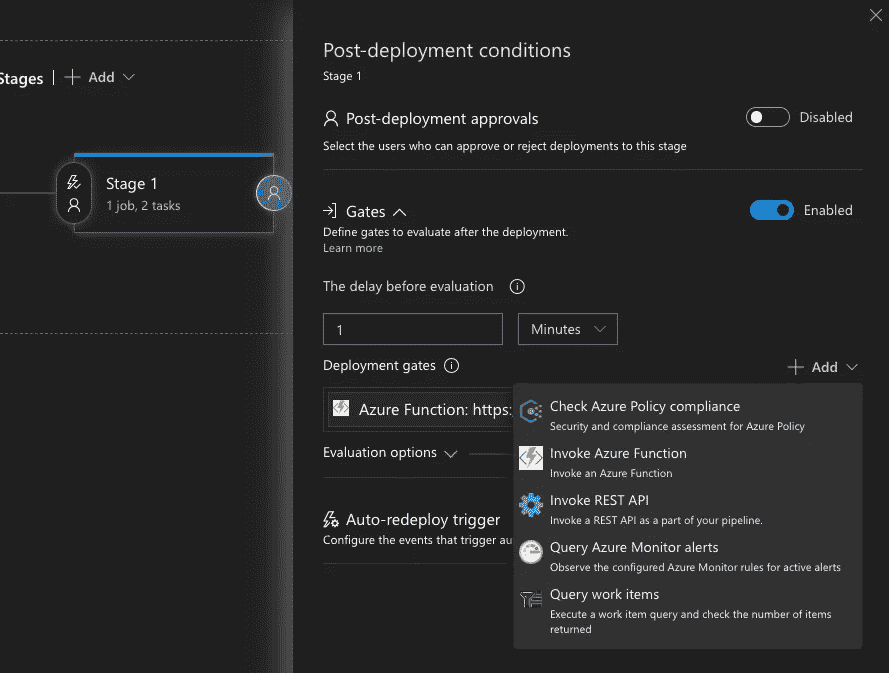
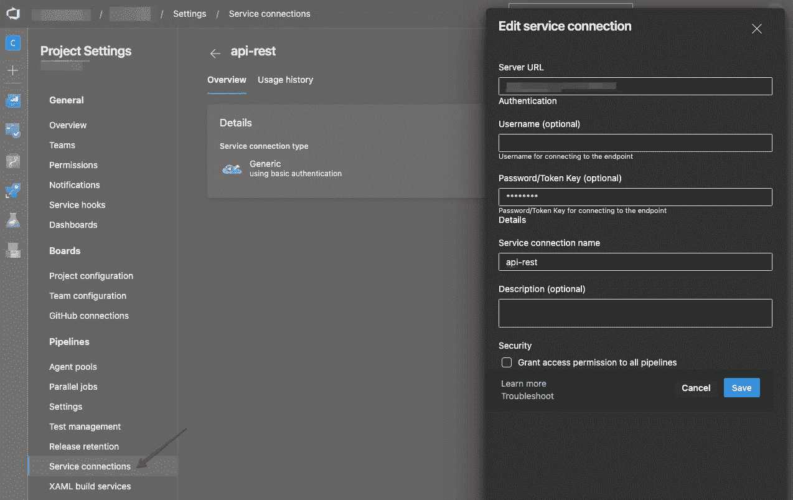
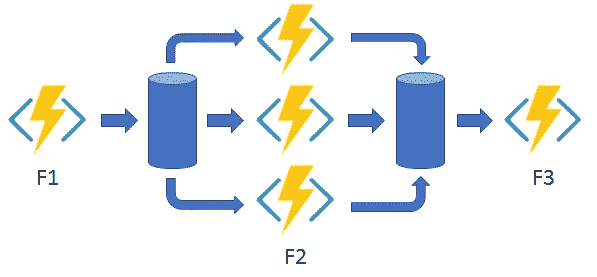
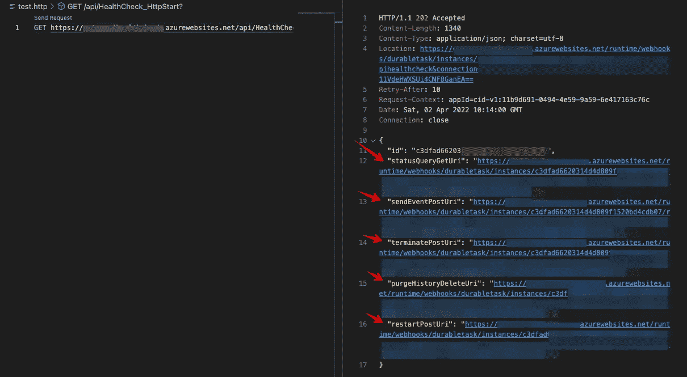
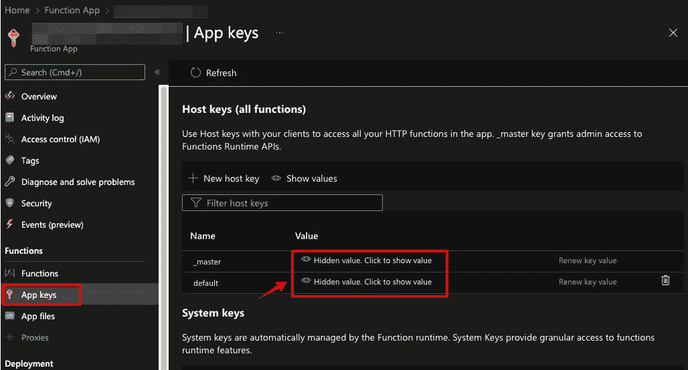
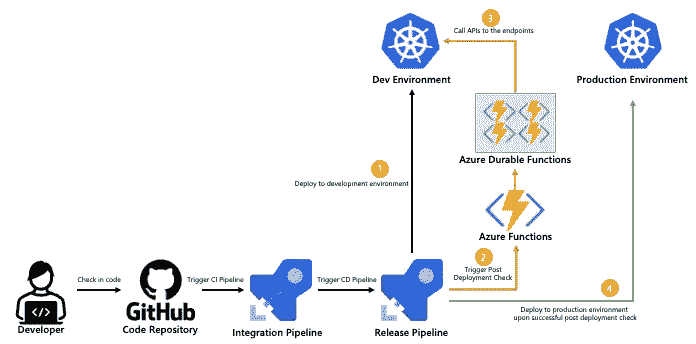

# 生产前批量测试 APIs 具有 Azure 持久功能的 Azure DevOps 发布门户

> 原文：<https://betterprogramming.pub/bulk-test-apis-before-production-azure-devops-release-gate-with-azure-durable-functions-f0a02ee04e34>

## 批量验证 API，仅在自动验证后将应用程序发布到生产环境中


米哈伊尔·费申科在 [Unsplash](https://unsplash.com?utm_source=medium&utm_medium=referral) 上拍摄的照片

Azure DevOps 中的发布管道允许开发人员跨多个阶段部署应用程序。发布管道类似于 DevOps 工程师定义自动化任务和工作的方式，如构建过程、单元测试、集成测试等。

除了任务之外，我们还可以在包进入后续阶段之前定义部署前条件检查和部署后条件检查。下图直观地说明了流程。



来源:[https://docs . Microsoft . com/en-us/azure/devo PS/pipelines/release/approvals/？view=azure-devops](https://docs.microsoft.com/en-us/azure/devops/pipelines/release/approvals/?view=azure-devops)

在这些条件下，我们可以定义人工干预，这需要选定成员的批准，或者定义关口，这有几个自动化任务，我们可以在发布部署之前执行这些任务来检查条件。

本文将重点讨论释放门。无论是检查合规性，还是验证应用程序功能或就绪性，发布关口都可以确保额外的检查层，这有助于减少部署后的问题。

## 情节

作为自动化测试阶段的一部分，开发人员通常会在管道中包含自动化单元测试和集成测试。就功能测试而言，有自动化方法和让测试人员执行测试的混合。一个相当常见的功能测试是执行 REST API 调用，以确保服务按预期工作。

除了为系统调用 API 之外，它还可能涉及调用外部 API，例如，检查外部端点的状态、符合性检查等。

在释放门下面有几个选项，如下图所示。



检查 Azure 策略合规性是常用的，因为这允许客户在符合组织标准的环境中部署工作负载。我们还可以通过通用连接或 Azure 函数调用 API。最后，查询 Azure Monitor 警报和工作项对于确保新环境的发布遵循某些标准也是至关重要的。你可以在这里获得更多关于发布门的细节:[https://docs . Microsoft . com/en-us/azure/devo PS/pipelines/release/approvals/gates？view=azure-devops](https://docs.microsoft.com/en-us/azure/devops/pipelines/release/approvals/gates?view=azure-devops)

为 REST API 定义一个通用连接很简单。我们可以在项目设置中创建一个服务连接，并定义服务器 URL 和认证细节。



> **这适用于几个 API。我们可以逐一定义。20 个、30 个或更多 API 怎么样？**

你可能想知道为什么我们不在管道内做呢？是的，我们可以将此活动包括在管道中。这里的一个主要区别是，通过定义结果的条件，再加上人工干预，可以确定部署是否可以进行到下一个阶段或环境。

回到服务连接。如图所示，实际上我们需要一个接一个地定义端点，如果我们调用 10 个以上的端点，这是不可行的。接下来的问题将是，有没有一种方法来编排所有的 API 调用并聚集响应，作为一个发布门？

## 解决方法

Azure Functions 是众所周知的“功能即服务”的无服务器计算，通常用于微服务工作负载。通常是无国籍的，短命的。另一方面，除了 Azure 功能的好处之外，Azure 持久功能旨在处理有状态作业。最值得一提的是，Azure Durable Functions 擅长充当协调器，以并行或按定义的顺序执行任务。针对不同的用例，Azure 持久功能有很多应用模式，这里记录:[https://docs . Microsoft . com/en-us/Azure/Azure-Functions/Durable/Durable-Functions-overview？tabs=csharp](https://docs.microsoft.com/en-us/azure/azure-functions/durable/durable-functions-overview?tabs=csharp)

在这种情况下，我们可以对这个用例使用扇出/扇入模式。这个想法很简单。我们调用 orchestrator，然后 orchestrator 将调用 REST APIs 列表，最后聚合结果并作为输出返回。



让我们详细看看这是如何工作的。

## Azure 持久功能 Orchestrator

我将从模板开始。使用 VS 代码或 Visual Studio，我可以选择 Azure Functions 模板，在这种情况下，我选择了**持久功能编排**作为起点。将生成以下模板。

它将生成 3 个函数，分别是“`DurableFunctionsOrchestration`”、“`DurableFunctionsOrchestration_Hello`”和“`DurableFunctionsOrchestration_HttpStart`”。让我们从底层去了解他们。

“`DurableFunctionsOrchestration_HttpStart`”被定义为工作流的入口点，充当持久客户端。如第 27 行所示，它使用了 HTTP 触发器。它的意思是，它将接受 HTTP GET 或 HTTP Post，并启动编排流。当然，根据不同的用例，我们还定义了其他触发器，比如定时器触发器、Azure 服务总线触发器等等。下面是可用绑定的列表，您可以为触发器使用受支持的绑定。

[](https://docs.microsoft.com/en-us/azure/azure-functions/functions-triggers-bindings?tabs=csharp) [## Azure 函数中的触发器和绑定

### 学习使用触发器和绑定将 Azure 功能连接到在线事件和基于云的服务。

docs.microsoft.com](https://docs.microsoft.com/en-us/azure/azure-functions/functions-triggers-bindings?tabs=csharp) 

在这个例子中，我将坚持使用 HTTP 触发器。它很容易调用，这个 HTTP 触发器将以 HTTP 响应的形式返回编排细节，比如编排状态、输出等，这在本例中是需要的。

让我们转到“T4”。顾名思义，这个函数编排活动。我可以定义活动是如何编排的，比如以异步模式运行，或者根据前一个活动的输出以串行方式运行。在上面的例子中，从第 10 行到第 12 行，它简单地触发了串行活动，这是一个函数链接。这是我们设计上述六种模式之一的地方。

从"`DurableFunctionsOrchestration`"开始的目标活动被称为"`DurableFunctionsOrchestration_Hello` *"，*以一个字符串作为输入。这是所有重物搬运的地方。

回到我们的场景。想法是创建一个函数，其目的是发出多个 API 调用来验证状态和输出，并将结果返回给 Azure Pipeline release gate。

现在我们有了 Azure 持久功能的概念，让我们看看如何在这个场景中实现它。我将从活动开始，执行所有繁重任务的功能。

我把它命名为`HealthCheck_Executor`。出于演示的目的，我简单地对我的后端 API 做了一个回显，验证了返回的消息与我的输入相同。我做的唯一附加动作是构造一个名为`APICheckObject`的对象，来捕获 API 名称及其状态。请记住，我希望在稍后汇总所有结果，因此做 1 或 0 是一个简单的方法，同时，我可以识别哪个 API 没有按预期运行。

接下来，让我们来看看管弦乐队。要解决的第一个问题是，我应该使用什么样的模式？函数链和扇出/扇入似乎是一个可行的选择。

如果 API 是按顺序测试的，我会选择函数链接，例如，第二个 API 依赖于第一个 API 的输出。在我的例子中，所有的 API 都是相互独立的，因此我选择扇出/扇入，以并行化所有的执行，从而缩短执行时间。

然后，我将返回一个对象列表，作为整个过程的输出。

拼图的最后一块是调用这个持久函数的方法。我将坚持使用 HTTP 触发器，但是我还需要一样东西。如果我直接调用这个持久函数，它会返回几个 URL，主要是让我们查看状态或者终止任务。Azure Pipeline release gate 将无法使用输出。



为了解决这个问题，我可以简单地使用 HTTP trigger 创建另一个 Azure 函数来调用这个持久的函数，同时在 Azure DevOps 中聚合验证的输出。

完整的源代码可以在 GitHub 上找到。

[](https://github.com/guangying94/Azure_Durable_Functions_API_Checker) [## GitHub-guangying 94/Azure _ Durable _ Functions _ API _ Checker:使用 Azure 持久函数的示例…

### 这个样本库是 Azure 持久功能的一个实现，用于批量检查 API，并返回状态…

github.com](https://github.com/guangying94/Azure_Durable_Functions_API_Checker) 

## Azure 管道发布门验证

让我们看看上面 Azure 函数的输出。我有总成功调用，以及相应的 API 名称及其状态。

```
{
   "totalSuccess":3,
   "details":[
                {"apiName":"test1","apiStatus":1},
                {"apiName":"test2","apiStatus":1},  
                {"apiName":"test3","apiStatus":1}
             ]
}
```

在 Azure Pipeline 中，让我们转到发布管道并修改我们的发布门。为了将 Azure 功能添加到 release gate 中，我们可以选择预部署或后部署。就我而言，我会选择后期部署。添加 Azure 功能很简单。只需点击左上角“Gates”下的“+ Add”，放入 Azure Functions URL 和 Azure Functions Key。如果你不知道在哪里检索密钥，它在 Azure Portal 内部。



我刚才展示了 API 响应，现在我可以定义这个部署后检查的成功标准了。我将检查成功调用的总数，如果成功调用在我的参数范围内，则检查通过。您可以在文档中获得关于定义条件的其他方式的更多详细信息。

[](https://docs.microsoft.com/en-us/azure/devops/pipelines/process/conditions?view=azure-devops&tabs=yaml) [## 条件-天蓝色管道

### 您可以指定每个阶段、作业或步骤运行的条件。默认情况下，作业或阶段会运行，如果它…

docs.microsoft.com](https://docs.microsoft.com/en-us/azure/devops/pipelines/process/conditions?view=azure-devops&tabs=yaml) 

这是我的释放门的样子。


要验证它，只需创建一个发布并检查日志。您会注意到，该条件以 5 分钟为间隔被检查了两次。您可以在上面的部署门页面中定义参数。


下图显示了整个流程。



这样，现在您可以批量验证 API，并且只在自动验证之后将应用程序发布到生产环境中！