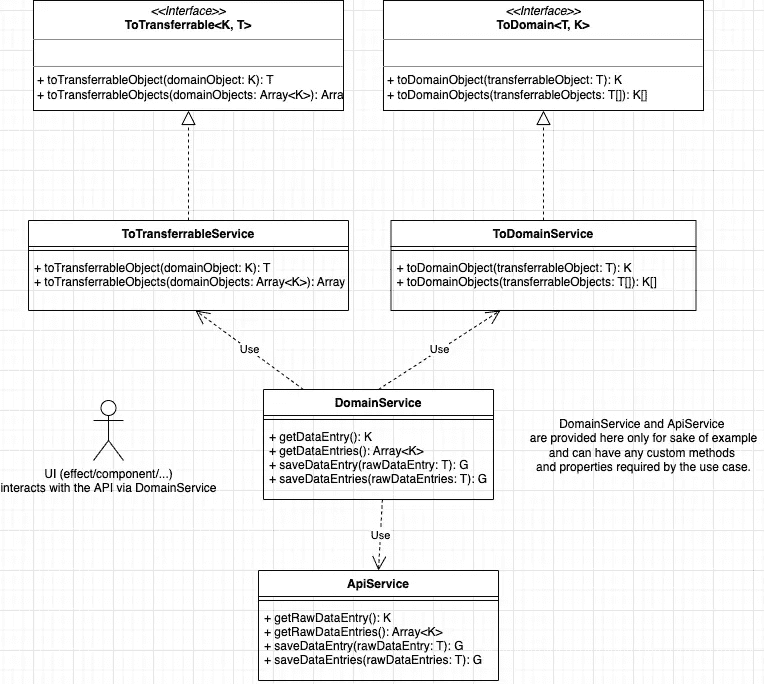

# 面向角度应用的防弹 API 集成

> 原文：<https://betterprogramming.pub/bullet-proof-api-integration-architecture-for-angular-applications-3d00582c7156>

## 使用适配器模式的角度特定方式

由 [Unsplash](https://unsplash.com?utm_source=medium&utm_medium=referral) 上的[网帖](https://unsplash.com/@screenpost?utm_source=medium&utm_medium=referral)拍摄

无论你何时创建应用程序 UI——总有一天你会面临将它与 API 集成的需求。但是，如果你的 API 伙伴对合同进行了突破性的修改，会发生什么呢——它不应该导致你改变 UI 上的整个模型，对吗？

或者当您的开发管道是并行的，并且您确定 API 在最后期限之前不会出现，并且您无法事先就具体的合同达成一致时？

当然，您可以使用 build BFF，但是如果您不能创建一个呢？这是适配器模式的亮点。

# 背景

> 适配器模式将一个接口(对象的属性和方法)转换成另一个接口。适配器允许编程组件协同工作，否则由于接口不匹配而无法协同工作— [源](https://www.dofactory.com/javascript/design-patterns/adapter)

然而，在本文中，我不想引用定义，而是提供一个在现实世界中使用它的具体的角度特定的方法。

# 细节

这里有 6 个主要元素:2 个描述转换的通用接口和 4 个获取数据并确保所有转换安全的服务。所有这些虽然看起来很麻烦，但是提供了必要的抽象和可测试性(是的，这里的测试非常简单)。

# 让我们得到代码

我将在这里先睹为快，组件和模块取决于具体情况。

首先，让我们创建基本的通用接口:

现在—让我们创建域和可转移接口以及它们各自的实现:

制造变形金刚:

最后—使用全部内容(下面的`ApiService`和`DomainService`仅用于演示目的，大部分是虚构的业务):

完整的源代码可以在 [repl.it](https://replit.com/@PavelBelikov/BulletProofApiIntegration) 上找到。

感谢您的阅读，舞池见！

 [## BulletProofApiIntegration

### 在我的加密货币上为智能合约制作的类似 repls 工作进展中的编程语言…

replit.com](https://replit.com/@PavelBelikov/BulletProofApiIntegration)