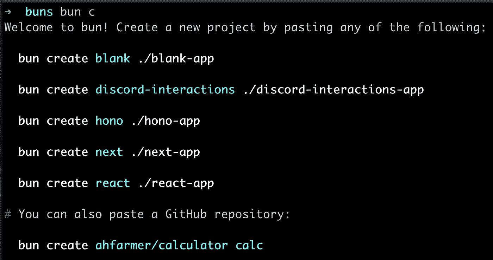
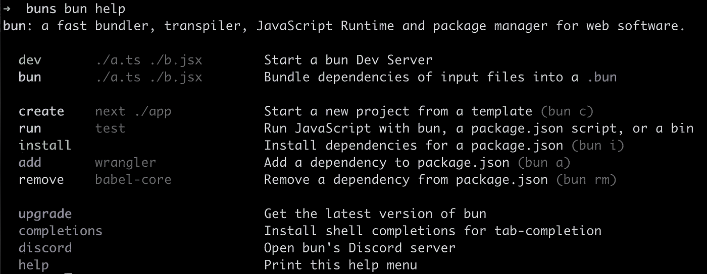
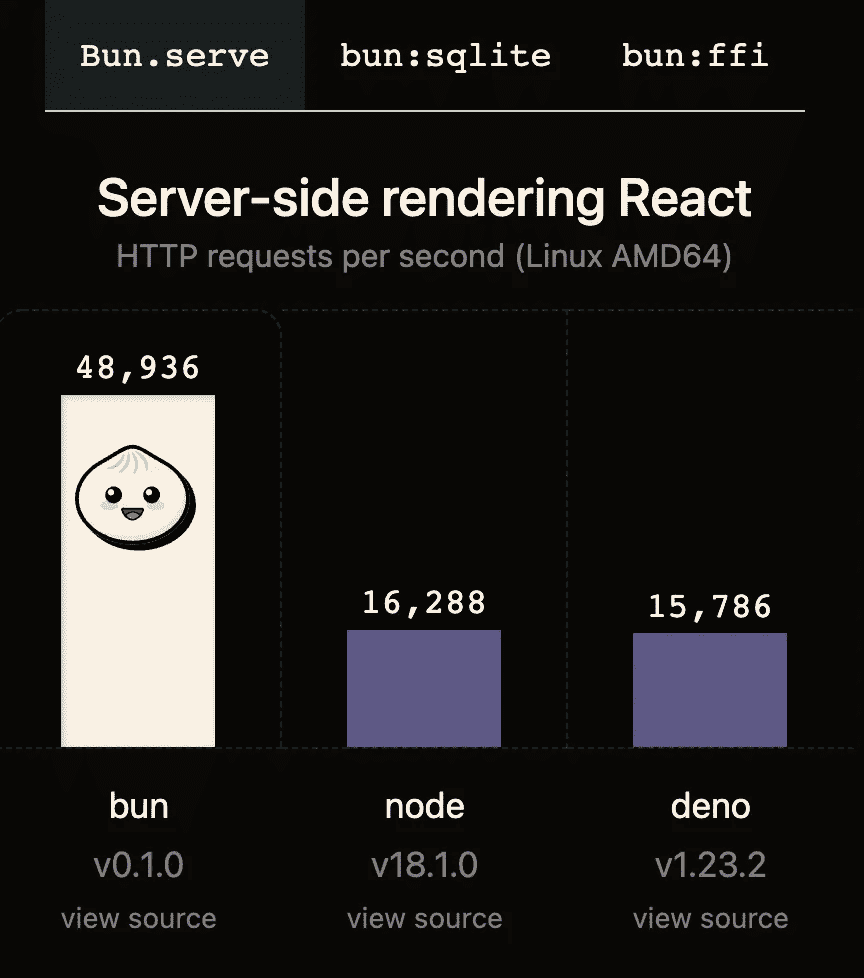
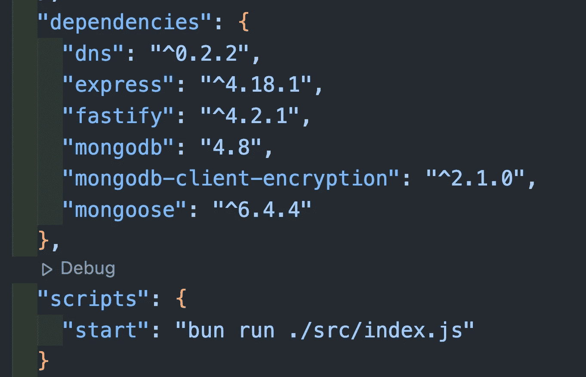
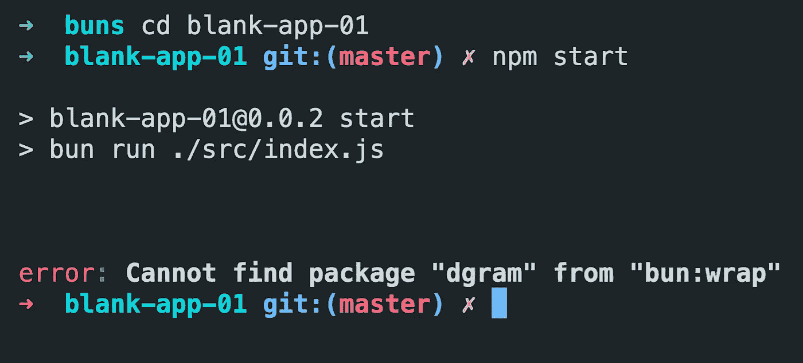
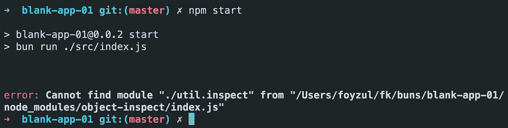
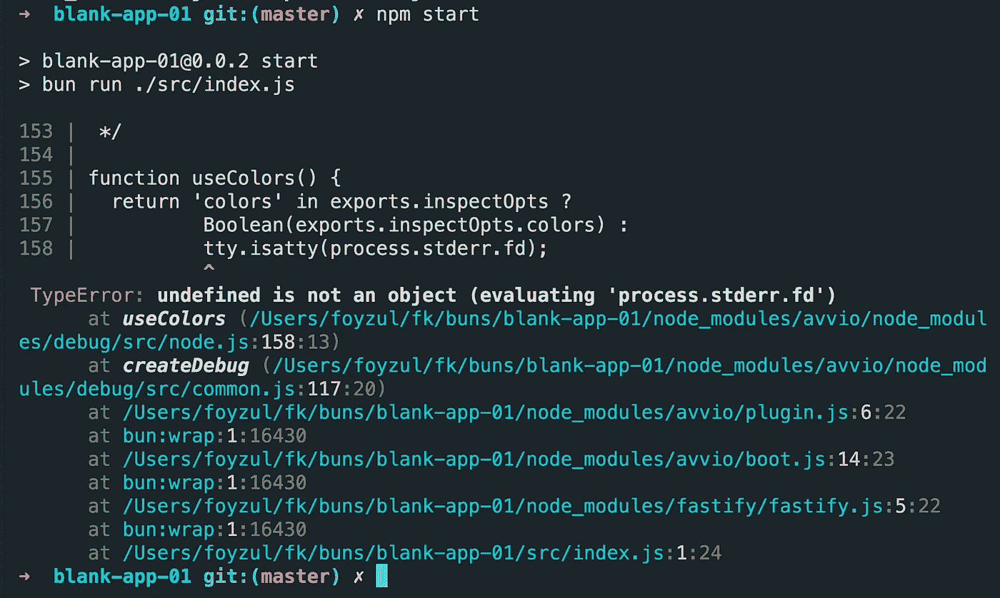

# 我对 Bun 的看法:JavaScript 小镇的新成员

> 原文：<https://betterprogramming.pub/bun-new-kid-in-the-javascript-town-a0c6d77c7bb8>

## 它能解决当前 JavaScript 生态系统中的问题吗？



当 Node.js 在 2009 年首次亮相时，每个人都对它提供的可能性感到兴奋。我必须说 Node 信守了承诺。

我们现在有了一个基于节点的宇宙级生态系统，从服务器运行时到客户端工具链。

甚至 node 的最初创造者[瑞安·达尔](https://en.wikipedia.org/wiki/Ryan_Dahl)也试图在他的 [Deno](https://en.wikipedia.org/wiki/Deno_(software)) 中建造比 node 更好的东西。但是在它第一次发布 4 年后，我们还没有(即将？)看到围绕它的一些值得注意的势头(是的，有一个全新的 Deno fresh 框架)。

我认为其他运行时无法颠覆 node 地位的主要原因是，如今 Node.js 不仅仅是一个 JavaScript 运行时。相反，它与几乎所有基于 JavaScript 的框架和工具链紧密耦合。

让我解释一下我的意思和我们目前在 JavaScript 生态系统中的问题。

如今，Node.js 服务器端应用程序或 SPA 客户端应用程序集成了捆绑、传输和任务运行程序。这些到底是什么？

# 集束

JavaScript 不能编译成二进制。所以在一个实际的项目中，可能会有几百个或者更多的文件，这些文件需要作为 JavaScript 文件部署到服务器或者提供给浏览器。

问题是:这些文件有空格，换行符等。并且单个文件的大小可能是不必要的大(我说的是千字节)。

更重要的是，如果我们向浏览器提供单独的 JS 文件，那么浏览器将单独获取每个文件，这将花费大量的时间来加载所有需要的文件。

请记住，根据浏览器的不同，他们最多可以从服务器上同时加载 6-10 个文件。想象一下，如果我们有 300 个独立的文件，那么浏览器需要启动文件获取调用 50 次(至少)来加载所有的文件，然后就可以开始执行了。

是啊，我知道，这将是压倒性的。

我们都知道 JavaScript 运行时(或浏览器引擎)在代码中不需要那么多额外的空间。因此，我们需要优化不同类型的解决方案。如果我们把所有的文件合并成一个大文件，然后缩小它们，那将是一个巨大的收获。

bundler 是一个软件/包，它将开发代码/文件转换成缩小和合并(捆绑)的输出文件。大多数情况下，这些输出文件都有唯一的名称，因此浏览器永远不会面临缓存问题，并且总是可以提供新文件。

在我们当前的 JavaScript 生态系统中，我们有多个捆绑器(Webpack、Rollup、Vite、Esbuild 等。)还有更多定期来。

因此，作为一名开发人员，我们经常困惑于选择哪一个，更重要的是如何将捆绑器与项目集成。对每个项目来说，这都是一个艰难的决定。

# 运输文件

对类型安全的需求在项目中总是非常重要的。

一些语言试图用额外的时间来解决这个问题，在执行之前从其他语言转换到 JavaScript。

这个过程被称为传输。同样，在 JavaScript 生态系统中，我们有多种选择来传输文件。

Babel、TypeScript、CoffeeScript 等都是 transpiler 的例子，为一个新项目选择它们总是一个艰难的决定。

# 任务运行程序

现代 JavaScript 服务器端和客户端项目中的另一部分是任务运行器。

任务运行器是一种操作源文件或运行命令并执行各种任务的工具，包括但不限于缩小、编译、单元测试、林挺等。重复性的任务。同样，我们有多种选择，特别是咕噜声和吞咽声。

# 维护一个大项目的问题

JavaScript 领域的变化速度非常快。当一个包变得过时/不被维护或者有破坏性的改变，这将导致不必要的维护开销，这将成为一场噩梦。我发现的主要原因是包之间的脱节。

例如，假设包 A 引入了一个新的重大变更，并使用了包 B 的最新版本。但是在我们的项目中，无论什么原因，我们都需要升级包 A，但是如果包 B 被升级，那么它将破坏我们生产中的软件。因此，开发团队需要在升级中分配额外的时间(记住时间等于金钱)，而不是专注于业务需求。这是一个常见的场景，我希望我们都能理解。

Bun 试图在一个完整的包中解决这些开销，这是现代 JavaScript 项目所需要的。


# Bun:一个有着远大前程的小镇新人

引自 [https://bun.sh](https://bun.sh) 网站:

> 捆绑、传输、安装和运行 JavaScript 和 TypeScript 项目—全部在 Bun 中完成。Bun 是一个新的 JavaScript 运行时，内置了本机 bundler、transpiler、task runner 和 npm 客户端。

所以，如果我理解正确的话，通过使用 Bun，我们不必担心我在本文前面提到的问题。但是 Bun 有什么特别的呢？

再次引用`bun.sh`网站:

> Bun 是像 Node 或 Deno 一样的现代 JavaScript 运行时。它是从零开始构建的，专注于三个主要方面:
> 
> -快速开始(它考虑到了优势)。
> 
> -新的性能水平(扩展 JavaScriptCore，引擎)。
> 
> -成为一个伟大和完整的工具(捆绑，运输，包装经理)。

bun 目前的状态还是挺有希望的。

如果我们的项目没有那么复杂，并且没有使用很多外部节点库，那么 bun 运行时应该会自动代替节点运行时工作——特别是在微服务架构中，那里的项目更小并且相互独立。

或者对于客户端项目(React、Next 等。)，我相信我们可以直接把它放进去，也可以不做太多改动就把 bun 整合进去。

该网站的另一段引文:

> Bun 被设计成一个**替代物**，用于你当前的 JavaScript &类型脚本应用或脚本——在你的本地计算机、服务器或边缘设备上。Bun 原生实现了数百个 Node.js 和 Web APIs，包括约 90%的 [Node-API](https://nodejs.org/api/n-api.html) 函数(原生模块)、fs、path、Buffer 等等。
> 
> Bun 的目标是在浏览器之外运行世界上大多数的 JavaScript，为您未来的基础设施带来性能和复杂性的增强，并通过更好、更简单的工具提高开发人员的生产力。

其余的功能和解释可以在网站上看到 [https://bun.sh](https://bun.sh)

# 我的实验和想法

Bun 在两个方面打造自己的品牌。

第一个是一个`All-in-one solution`:



我自己终端的截图

第二个是`Faster JavaScript runtime than Node and Deno`:



截图来自 [https://bun.sh](https://bun.sh/)

然而，在现实世界中，有更多的方面比快，因为少数网站需要每秒连续数百个请求。所以，为了让它为大规模改编做好准备，Bun 需要更多的特性。

# 成熟的服务器框架

即使在第一个版本发布 10 多年后，ExpressJS 仍然是 Node.js 生态系统中使用最多的服务器框架。

超快和低内存占用并不是真实项目中使用的唯一标准。所以，如果 Bun 不支持 ExpressJS(或者 Fastify)的话，未来我们可能看不到足够的用法。

至少我不会建议在现实世界的项目中使用任何闪亮的新框架。我自己(在写这篇文章的时候)检查和测试过，Fastify 和 ExpressJS 还不被 Bun 支持。希望很快听到好消息。

# 数据库驱动程序

Bun 网站显示了使用 Sqlite 数据库进行的比较。但在现实世界中，我们看到 Postgres、MongoDB 等。与其他 RDBMS 和 NoSQL 数据库一起在 Node.js 生态系统中占据主导地位。每个数据库都有自己的 Node.js 驱动程序，因此开发人员不需要担心将数据库集成到项目中。

以下是我的实验和误差。

# 安装包没问题

我可以毫无问题地使用`bun add *package_name*`，并且可以安装`express`、`fastify`和`mongodb`包。



package.json

## 带有 Bun 代码的 MongoDB:

```
const db = require(“mongodb”);
console.log(db)
```

下面是我们得到的错误:

```
error: Cannot find package "dgram" from "bun:wrap"
```



`error: Cannot find package "dgram" from "bun:wrap"`

## 带 Bun 代码的 ExpressJS

```
const express = require('express');
console.log(express)
```

错误:

```
error: Cannot find module “./util.inspect” from “/Users/foyzul/fk/buns/blank-app-01/node_modules/object-inspect/index.js”
```



## 用 Bun 代码 Fastify:

```
const fastify = require('fastify');
console.log(fastify);
```

错误:

```
TypeError: undefined is not an object (evaluating 'process.stderr.fd')
```



在下一篇文章中，我将向您展示我对当前 bun 模板的探索，并分享我的心得。感谢阅读。