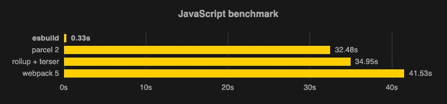
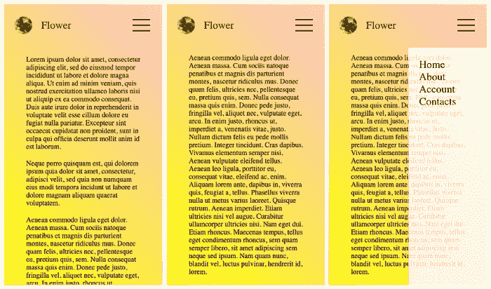
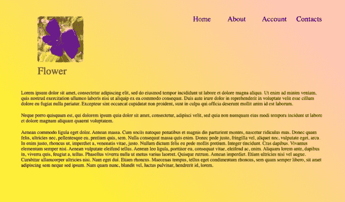
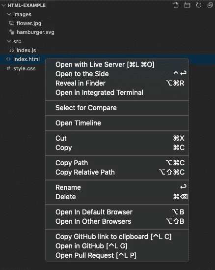
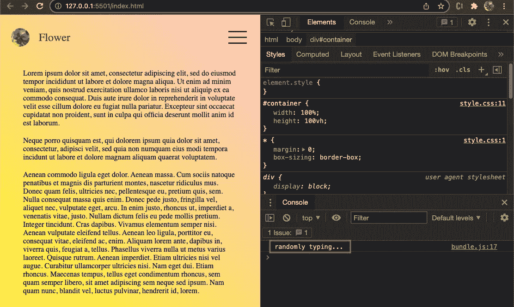
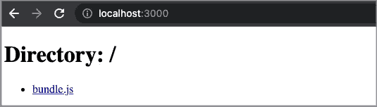
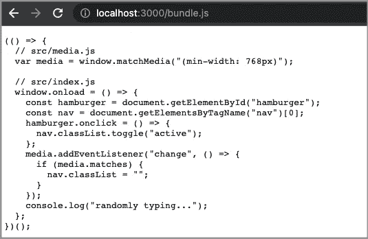

# 使用 Esbuild 捆绑一个 JavaScript 项目

> 原文：<https://betterprogramming.pub/bundle-up-a-javascript-project-using-esbuild-b2c824ba0d39>

## esbuild 简介——一个速度极快的 JavaScript/CSS 捆绑器和迷你器


[布莱尔杨](https://unsplash.com/@blairyang?utm_source=medium&utm_medium=referral)在 [Unsplash](https://unsplash.com?utm_source=medium&utm_medium=referral) 上拍照

esbuild 是一个速度极快的 JavaScript/CSS 捆绑器和迷你器。它创建于 2016 年 6 月，在 GitHub 上有 3 万颗星，每周从 npm 注册表[下载 210 万次。](https://www.npmjs.com/package/esbuild)

`esbuild`被写入 [Go](https://go.dev/) 并编译成本机代码。Go 是从核心为并行而设计的，esbuild 内部的算法经过精心设计，尽可能使所有可用的 CPU 核心完全饱和。esbuild 中的所有内容都是从头开始编写的，内存使用效率很高。这些都有助于 esbuild 的高性能。

`esbuild`是挑战当前标准构建工具的新人，如 [webpack](https://webpack.js.org/) 、 [rollup](https://rollupjs.org/guide/en/) 等。以下基准测试表明，esbuild 比其他捆绑器快得多:



图片来自[https://github . com/evanw/es build/blob/master/images/benchmark . SVG](https://github.com/evanw/esbuild/blob/master/images/benchmark.svg)

以下是比较捆扎机受欢迎程度的 npm 趋势:


作者图片

`esbuild`仍然是一个 1.0 之前的软件，还没有功能完整。它已经驱动了 [Snowpack](https://github.com/snowpackjs/snowpack) 、 [Vite](https://github.com/vitejs/vite) 、 [SvelteKit](https://github.com/sveltejs/kit) 、 [Remix Run](https://remix.run/) 等等。它有可能重塑 bundler 世界。

让我们详细了解一下如何使用`esbuild`。

# 一个 HTML 项目

我们使用为[汇总文章](/bundle-up-a-javascript-project-using-rollup-2f80205f5f5c)创建的项目。这是一个用于响应菜单的小型 HTML 项目。当该应用程序在移动设备上运行时，它会在各种情况下显示以下屏幕。



作者图片

左侧屏幕是起始页。由于内容比显示区域长，我们需要向下滚动来查看剩余的内容(中间的屏幕)。当点击右上角的汉堡菜单时，会显示一个垂直菜单(右侧屏幕)。

当应用程序以最小宽度`768px`出现在桌面上时，它会显示一个水平菜单:



作者图片

源代码位于这个 [GitHub 仓库](https://github.com/JenniferFuBook/html-example)，下面是文件夹结构。

```
$ ls -R
images     index.html style.css./images:
flower.jpg    hamburger.svg./src:
index.js
```

这是一个典型的 HTML 项目，带有一个包含一些图片、一个样式表和 JavaScript 代码的`index.html`。

第 7 行是到`style.css`的链接。

第 8 行包含 JavaScript 代码。

14 号线是 JPG 之花。

第 17 行是汉堡 [SVG](https://medium.com/better-programming/create-react-app-and-svgs-70970ac715f2) ，显示在一个窄屏幕上。

该项目可以通过 [VSCode](https://medium.com/better-programming/10-useful-plugins-for-visual-studio-code-6ab62c0b14ee) 的实时服务器启动。



作者图片

# 设置 esbuild bundler

首先，我们将克隆项目:

```
git clone [https://github.com/JenniferFuBook/html-example.git](https://github.com/JenniferFuBook/html-example.git)
```

使用 npm 管理此项目:

在下面生成的`package.json`中，添加一个`build`脚本(第 7 行)。此外，创建一个`[devDependencies](https://medium.com/better-programming/package-jsons-dependencies-in-depth-a1f0637a3129)`部分(第 21–23 行)来下载`esbuild`进行开发。

下面是`src/index.js`:

执行`npm run build`生成包输出`dist/bundle.js`。

`dist/bundle.js`是`iife`格式，这是一个在浏览器中运行的自执行函数。`iife`是默认格式。

构建命令也可以作为 CLI 执行:

```
npx esbuild src/index.js --bundle --outfile=dist/bundle.js
```

它相当于:

```
npx esbuild src/index.js --bundle --outfile=dist/bundle.js --format=iife
```

除了`iife`之外，`esbuild`还支持`cjs`和`esm`。

`cjs`格式旨在在[节点](/3-major-features-of-node-js-17-4bee7135df02)中运行。它由以下命令生成:

```
npx esbuild src/index.js --bundle --outfile=dist/bundle.js --format=cjs
```

`[esm](/what-might-be-coming-in-npm-9-6985cf2678a6)`格式从 ES2015 开始可用，可用于浏览器和节点。它由以下命令生成:

```
 npx esbuild src/index.js --bundle --outfile=dist/bundle.js --format=esm
```

对于这个简单的例子，生成的`dist/bundle.js`对于`cjs`和`esm`格式是相同的。

`index.html`可以修改为指向生成的`dist/bundle.js`。

```
<script src="dist/bundle.js"></script>
```

# 使用 esbuild 捆绑多个文件

将本文与使用 Rollup 捆绑一个 JavaScript 项目的[进行比较，我们没有启动`index.html`的脚本`start`。](/bundle-up-a-javascript-project-using-rollup-2f80205f5f5c)

正如我们已经提到的，`esbuild`仍然是一个 1.0 之前的软件，还没有功能完整。在即将到来的路线图中，使用 html 作为捆绑的起点是一个潜在的未来特性。

对于这个小的 HTML 项目，它不需要捆绑器也能工作。我们已经看到了`esbuild`的局限性——`esbuild`仍然依赖于一个 web 服务器(比如 VSCode 的 live 服务器，或者`http`服务器)来启动`index.html`。另外，`src/index.js`和生成的`dist/bundle.js`看起来也差不多。

那么，我们为什么需要`esbuild`？

当项目变得复杂时，会有更多的代码行。对于代码模块化，我们应该把它们放到多个 JavaScript/CSS 文件中。

将`src/index.js`分解成两个文件，`src/media.js`和`src/index.js`。

`src/media.js`包含了`media`的定义。

`media`的这个定义是由`src/index.js`导入的。

使用 VSCode 的 live 服务器启动`index.html`。汉堡菜单不再响应点击，检测控制台显示以下错误:

```
Uncaught SyntaxError: Cannot use import statement outside a module
```

如果我们在第 1 行注释掉 import 语句，它会显示另一个错误:

```
Uncaught ReferenceError: media is not defined
    at window.onload (index.js:10:3)
```

为了解决这个问题，我们需要一个捆绑器将小块 JavaScript 代码与样式表和图像一起编译。这个更大更复杂的文件变成了一个库或应用程序。

执行`npm run build`、`esbuild`将`src/media.js`和`src/index.js`捆绑成一个文件`dist/index.js`。

将`index.html`指向`dist/index.js`可以让这个应用程序工作。

# 使用 esbuild 观看实时重新加载文件

在当今的开发环境中，当文件发生变化时，使用实时重载来刷新应用程序是很常见的。我们可以用`esbuild`实时重装文件吗？

是的，我们可以。

在`package.json`中，我们添加了`start`脚本，其中设置了`watch`标志。当文件改变时，它重新运行`esbuild`。

`start`脚本可以简化为:

```
"start": "npm run build -- --watch"
```

执行`npm start`，控制台消息显示进程处于监视模式。

确保`index.html`指向生成的`dist/bundle.js`。

```
<script src="dist/bundle.js"></script>
```

启动 VSCode 的实时服务器。在`src/index.js`里面，我们加一行`console.log('randomly typing…')`。保存后，我们可以看到消息是实时更新的。



作者图片

# 使用 esbuild 提供实时重新加载文件

除了`watch`之外，我们还可以使用`serve`来实时重新加载文件。它通过一个 web 服务器提供代码，该服务器会根据每个请求进行重建。

在`package.json`中，我们修改了`start`脚本，其中 serve 端口被设置为`3000`。web 服务器负责根据每个请求重新构建代码。

`start`脚本也可以简化为:

```
"start": "npm run build -- --serve=3000"
```

执行`npm start`，控制台消息显示`http://127.0.0.1:3000`有代码送达。

连接到`http://127.0.0.1:3000`或`http://localhost:3000`。



作者图片

它显示了托管`bundle.js`的目录。放下文件，我们可以查看`bundle.js`的内容。



作者图片

修改`index.html`以指向托管的`bundle.js`。

```
<script src="http://localhost:3000/bundle.js"></script>
```

启动 VS 代码的活动服务器。

在`src/index.js`里面，我们加一行`console.log('randomly typing…')`。保存后，我们可以看到消息是实时更新的。

# 使用 esbuild JavaScript

`esbuild`提供了 3 种完成操作的方式——CLI、JavaScript 和 GO。到目前为止，所有的例子都是用 CLI 编写的。

然而，如果有许多选项，使用`esbuild` CLI 可能会变得笨拙。对于更复杂的应用，可以使用`esbuild` JavaScript API 用 JavaScript 编写一个构建脚本。

我们已经在`package.json`中展示了下面的`build`脚本:

```
"build": "esbuild src/index.js --bundle --outfile=dist/bundle.js"
```

`build`脚本可以用 JavaScript 重写:

我们将这个文件命名为`esbuild.config.js`，并通过下面的`package.json`中的`build`脚本调用它:

```
"build": "node esbuild.config.js"
```

同样，我们可以创建`esbuild.config.watch.js`。

它可以被下面的`package.json`中的`start`脚本调用:

```
"start": "node esbuild.config.watch.js"
```

esbuild 中还有其他选项，比如`--sourcemap`用于启用源映射，而`--minify`用于生产构建。所有选项都可以用 JavaScript 编写。

# 结论

我们已经介绍了 esbuild。它还没有达到 1.0.0 版本，仍在积极开发中。它正处于后期测试阶段，为早期用户利用高性能做好了准备。

更多详细信息，请查看[es build 官方网站](https://esbuild.github.io/)。

感谢阅读。我希望这有所帮助。如果你有兴趣，可以看看[我的其他媒体文章](https://jenniferfubook.medium.com/jennifer-fus-web-development-publications-1a887e4454af)。