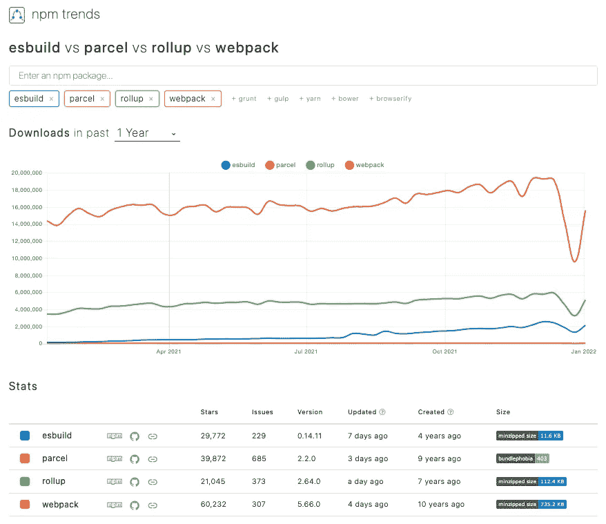
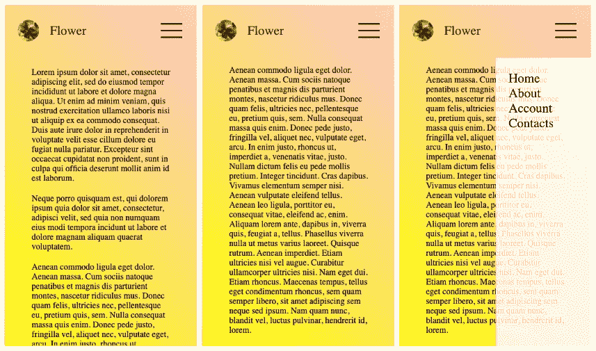
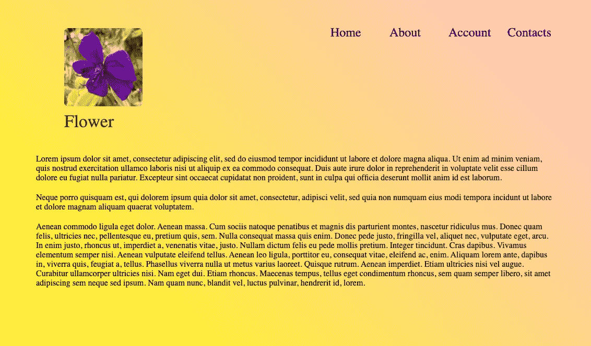

# 使用 Rollup 捆绑一个 JavaScript 项目

> 原文：<https://betterprogramming.pub/bundle-up-a-javascript-project-using-rollup-2f80205f5f5c>

## 从头开始捆绑 JavaScript 项目的分步指南


作者图片

[Rollup](https://rollupjs.org/guide/en/) 是一个 JavaScript 的模块捆绑器，它将小段代码编译成更大更复杂的东西，比如一个库或应用程序。它在 GitHub 上有超过 19，000 颗星，从 npm 注册中心[每周下载超过 300 万次。](https://medium.com/better-programming/the-step-by-step-guide-to-understanding-and-adopting-npm-7-914504f7090f)

以下是市场上主要捆扎机的 npm 趋势:



作者图片

Rollup 是第二受欢迎的捆扎机。传统的观点是对应用程序使用 webpack，对库使用 rollup。今天依然如此。然而，由于 webpack 和 rollup 实现了彼此的功能，这两个捆绑器之间的界限变得模糊了。

与 webpack 类似，Rollup 也很复杂，有一个陡峭的学习曲线。让我们从一个简单的例子开始构建一个汇总项目。

# 一个 HTML 项目

我们已经为响应式菜单创建了一个小的 HTML 项目。当该应用程序在移动设备上运行时，它会在各种情况下显示以下屏幕。



作者图片

左侧屏幕是起始页。由于内容比显示区域长，我们需要向下滚动来查看剩余的内容(中间的屏幕)。当点击右上角的汉堡菜单时，会显示一个垂直菜单(右侧屏幕)。

当应用程序以最小宽度`768px`出现在桌面上时，它会显示一个水平菜单:



作者图片

源代码位于这个 [GitHub 仓库](https://github.com/JenniferFuBook/html-example)，下面是文件夹结构。

```
$ ls -R
images     index.html style.css./images:
flower.jpg    hamburger.svg./src:
index.js
```

这是一个典型的 HTML 项目，带有一个包含一些图片、一个样式表和 JavaScript 代码的`index.html`。

第 7 行是到`style.css`的链接。

第 8 行包含 JavaScript 代码。

14 号线是 JPG 之花。

第 17 行是汉堡 [SVG](https://medium.com/better-programming/create-react-app-and-svgs-70970ac715f2) ，显示在窄屏幕上。

该项目可以通过 [VSCode](https://medium.com/better-programming/10-useful-plugins-for-visual-studio-code-6ab62c0b14ee) 的 live 服务器启动。


作者图片

# 带活荷载的累计

需要一个模块捆绑器来将小块 JavaScript 代码与样式表和图像一起编译成更大更复杂的东西，比如一个库或应用程序。我们使用 Rollup 来捆绑一个 JavaScript 项目。首先是让项目 npm 得到管理。

```
$ npm init -y
Wrote to /Users/fuje/rollup-example/package.json:{
  "name": "rollup-example",
  "version": "1.0.0",
  "description": "",
  "main": "index.js",
  "scripts": {
    "test": "echo \"Error: no test specified\" && exit 1"
  },
  "keywords": [],
  "author": "",
  "license": "ISC"
}
```

在生成的`package.json`中，添加一个脚本(第 7 行)来运行 Rollup 命令。另外，创建一个`[devDependencies](https://medium.com/better-programming/package-jsons-dependencies-in-depth-a1f0637a3129)`部分(第 13-17 行)来下载用于开发的`rollup`和插件包。

在第 7 行，添加了`start`脚本，根据监视模式下的配置启动汇总。

第 14 行是`rollup`套餐。

第 15 行是`[rollup-plugin-livereload](https://github.com/thgh/rollup-plugin-livereload)`插件，它实时重新加载汇总包。

第 16 行是`[rollup-plugin-serve](https://github.com/thgh/rollup-plugin-serve)`插件，它启动一个提供实时重载的开发服务器。

由于`start`脚本基于汇总配置，因此项目需要`rollup.config.js`。

第 5 行指定`input`条目为`src/index.js`。

第 7-14 行配置`rollup-plugin-serve`。

第 8 行设置在浏览器模式下启动。

第 9 行在控制台上启用详细输出。

第 10 行指定文件夹、当前目录和用来提供文件的`dist`。

第 11 行将回退页面设置为`index.html` ( `200`)，而不是错误页面(`404`)。

第 12 行和第 13 行将开发服务器设置为`localhost:3000`。

第 15 行配置`rollup-plugin-livereload`监视文件夹。

第 17-21 行定义了输出对象的位置和格式。

第 18 行指定输出文件为`dist/bundle.js`。

第 19 行指定输出格式为`iife`。这是直接调用的函数表达式(IIFE)格式，在[另一篇文章](/what-are-cjs-amd-umd-esm-system-and-iife-3633a112db62)中有解释。

第 20 行配置了一个单独的 sourcemap 文件，`dist/bundle.js.map,`将被创建。除了布尔值，还可以设置为`inline`。

另外，`sourcemap`可以动态启用。

在`package.json`中，将脚本更改为:

```
"start": "rollup -c -w --environment BUILD:development"
```

那么可以动态设置输出:

```
output: {
  file: 'dist/bundle.js',
  name: 'example',
  format: 'iife',
  sourcemap: process.env.BUILD === 'development',
}
```

基于此汇总配置，将生成`dist/bundle.js`。我们修改`index.html`来包含它:

```
<script src="dist/bundle.js"></script>
```

在项目的根，执行`npm start`。汇总项目已经启动并正在运行。

这是`src/index.js`:

这是生成的`dist/bundle.js`:

第 1 行是活负载脚本。

第 2-20 行定义了生活。

第 21 行是到 sourcemap 的链接。如果`output.sourcemap`设置为`inline`，源地图将成为`dist/bundle.js`的一部分。

# 树摇晃

树抖动是一种代码优化技术。通过分析代码，Rollup 只包含运行库或应用程序所需的源代码。

让我们在`src/index.js`中添加一个函数`printCount`(第 17-21 行):

这反映在生成的`dist/bundle.js`中:

如果我们注释掉`src/index.js`中`printCount`(第 16 行)的用法，生成的`dist/bundle.js`将不包括`printCount`:

摇树是 Rollup 的招牌功能。它使 Rollup 能够创建更小、更快的包。它依赖于 ES2015 模块语法的静态结构，例如`[import](https://medium.com/better-programming/a-handy-guide-to-export-and-import-modules-for-javascript-and-typescript-6cff8e47d554)` [和](https://medium.com/better-programming/a-handy-guide-to-export-and-import-modules-for-javascript-and-typescript-6cff8e47d554) `[export](https://medium.com/better-programming/a-handy-guide-to-export-and-import-modules-for-javascript-and-typescript-6cff8e47d554)`。

# CSS 插件

我们已经在`index.html`中包含了一个样式表。这个包含可以被 Rollup 插件`[rollup-plugin-postcss](https://github.com/egoist/rollup-plugin-postcss)`所取代，它提供了 Rollup 和 PostCSS 之间的无缝集成。

`postcss`和`rollup-plugin-postcss`包需要包含在`package.json`中:

```
"devDependencies": {
  "postcss": "^8.2.4",
  "rollup-plugin-postcss": "^4.0.0",
  ...
}
```

将`rollup-plugin-postcss`配置添加到`rollup.config.js`(第 3 行和第 8 行):

从`index.html`上拆下`style.css`连杆。

```
<link rel="stylesheet" href="style.css" />
```

而是将`style.css`导入到`src/index.js`(第 1 行):

然后我们生成了下面的`dist/bundle.js`:

第 2-30 行定义了一个将样式表注入 HTML 文件的函数。

第 32 行捕获所有样式表内容。

第 33 行调用函数注入样式表。

# 图像插件

我们在`index.html`中包含了两张图片。这个包含可以被 Rollup 插件`[@rollup/plugin-image](https://github.com/rollup/plugins/tree/master/packages/image)`所取代，它提供了在启动时拥有可用图像的便利。

包`@rollup/plugin-image`需要包含在`package.json`中:

```
"devDependencies": {
  @rollup/plugin-image,
  ...
}
```

在`rollup.config.js`中增加`@rollup/plugin-image`配置(第 4 行和第 10 行):

调整图像的`index.html`(10 行和 13 行):

将`flower.jpg`和`hamburger.svg`导入`src/index.js`(第 2 行和第 3 行):

然后我们有了下面生成的`dist/bundle.js`:

35 线是花 JPG，用在 41 线。

第 37 行是 hamburger SVG 文件，在第 43 行使用。

# 更简洁的插件

`[rollup-plugin-terser](https://github.com/TrySound/rollup-plugin-terser)`是一个缩小生成的包的插件。建议缩减生产代码。

`[rollup-plugin-cleaner](https://github.com/saf33r/rollup-plugin-cleaner)`是一个在重建前清理目录的插件。清理目录是个好主意。

为了使用这两个插件，下面的包需要成为`devDependencies`的一部分:

```
"devDependencies": {
  rollup-plugin-cleaner,
  rollup-plugin-terser,
  ...
}
```

那么它们可以用在`rollup.config.js`中:

# 结论

Rollup 是第二流行的 bundler，它特别擅长捆绑库。

我们已经引入了六个插件。最终代码在这个库的[处被捕获。](https://github.com/JenniferFuBook/rollup-example)

有[一长串插件](https://github.com/rollup/plugins)来扩展 Rollup 的功能。此外，你可以尝试创建自己的插件。

到目前为止，Rollup 在我们的项目中运行良好。webpack 和 Rollup 互为竞争对手。希望决斗能在未来给我们带来更多的功能和更高的效率。

感谢阅读。我希望这有所帮助。你可以在这里看到我的其他媒体出版物。