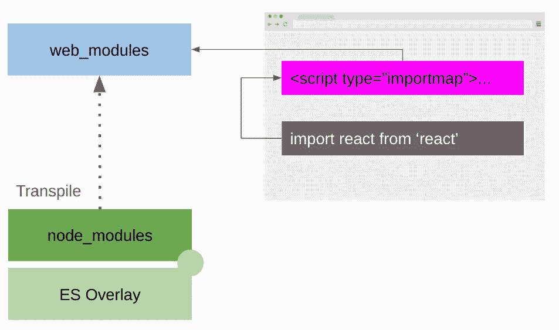
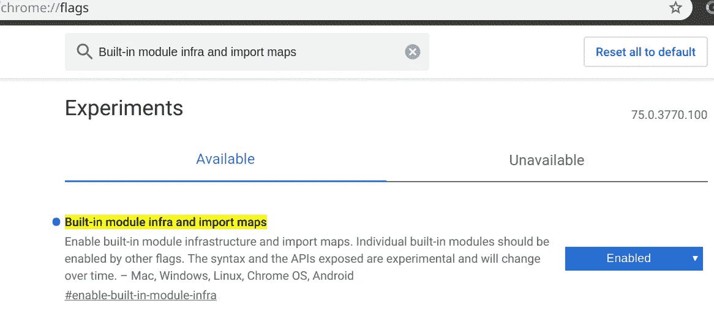
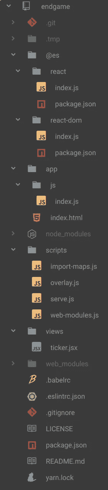

# 前端 JS 开发，无需编译源代码

> 原文：<https://betterprogramming.pub/bye-bye-transpile-3e4413f7f590>

## 使用谷歌浏览器、ES 模块和导入地图


在 [Unsplash](https://unsplash.com/search/photos/source-code?utm_source=unsplash&utm_medium=referral&utm_content=creditCopyText) 上由[法扎德·纳齐菲](https://unsplash.com/@euwars?utm_source=unsplash&utm_medium=referral&utm_content=creditCopyText)拍摄的照片

# 什么是运输？

[trans pilling](https://scotch.io/tutorials/javascript-transpilers-what-they-are-why-we-need-them)是指从一种编程语言翻译一些源代码，并在另一种编程语言(或同一种语言的两种不同方言/版本)中生成等效代码的过程。

在前端浏览器开发中，transpiling 主要用于使用 JS 之外的语言开发应用程序，并将原始代码翻译成 JavaScript(例如 [TypeScript](https://www.typescriptlang.org/) 、 [CoffeeScript](https://coffeescript.org/) 、 [Closure](https://developers.google.com/closure/compiler/) 、Java、 [C#](https://docs.microsoft.com/en-us/dotnet/csharp/programming-guide/) 等)。).

另一个用例是将您的本地 JavaScript 代码从一个版本转换到另一个版本( [ECMAScript 版本](https://en.wikipedia.org/wiki/ECMAScript))，这样您就可以使用浏览器还不支持的特性(或其中的一些)。

# 运输的费用

在开发过程中使用 transpiling 确实很诱人；所有这些功能-全语言和语法糖可供选择！

所有这些都承诺让你在更短的时间内开发出更好的程序，更少的错误。但是这些承诺是真的吗？成本是多少？

JavaScript 是一种臭名昭著的语言，尤其是在构建复杂而庞大的应用程序时。但是 JavaScript 在最近几年有了很大的发展，并且随着每一个新的语言规范的发布而变得越来越好。

浏览器采用新功能的速度比过去更快，你不必等很久就能看到谷歌 Chrome 和其他浏览器支持的重要新功能。

最终，今天的 JavaScript 是一种强大而坚实的语言。

JavaScript 是一种解释型动态语言。相比编译语言，比如 TypeScript、Java、Closure、C#等。，您不必等待编译就能看到您的应用程序正在运行并对其进行调试。

当你开始开发你的新应用程序时，这可以被看作是一个可以忽略的时间，但随着你的应用程序变得越来越大和越来越复杂，这一时间会越来越长。如果你选择 transpile，你就失去了这个优势，而且不仅仅是这个优势。

transpiling 的另一个问题是浏览器运行的代码不是你写的代码。因此，调试和优化性能会变得非常棘手。是的，你有源图，但这不是一回事。

源映射映射代码中的位置，但是它们不映射两个变量名如何相互关联。优化可能会使编译后的源代码与您所编写代码的预期行为不符。

[谷歌 Chrome Inspector](https://developers.google.com/web/tools/chrome-devtools/) 是目前可用的最强大、最高效的软件调试器之一，用源代码地图给它增加不必要的复杂性，而不直接在你写的代码上释放它的力量，这真的是一种耻辱。

在开发过程中使用了许多基于 transpiling 的项目之后，我可以向您保证，在 Inspector 中直接处理原始代码(没有源地图中介或其他翻译)是一种更好的体验。

今天，可以直接在 Google Chrome 中编写、运行和调试你的前端 JavaScript 代码，并且只在生产和交付时进行转换。

所以，你说不通过传输来开发我的前端会更好，但是我该怎么做呢？我如何使用非 ES 就绪依赖项？如果我想进行静态类型检查呢？

让我们看一个使用[React](https://reactjs.org/)/[JSX](https://reactjs.org/docs/introducing-jsx.html)——残局应用的例子。

# 谷歌浏览器中的 ES 模块

今天，Chrome 在理解 JavaScript 代码中的导入/导出方面没有问题。你可以把你的应用拆分成 ES 模块文件，直接在浏览器上运行，没有任何问题。

当您想要使用第三方库时，问题就出现了。

JavaScript 依赖管理事实上的标准来自于 [Node.js](https://nodejs.org/api/modules.html) 中的包管理。

可以使用[纱](https://yarnpkg.com/lang/en/)、 [npm](https://www.npmjs.com/) 等打包实用程序。，要求您的库，并在本地文件夹中提供主题(通常是`node_modules`)。

不幸的是，并非所有可用的软件包都是 ES-ready。大多数包使用 [Node.js](https://nodejs.org/) 模块语法(它们使用“require”而不是“import”)。即使是 es 就绪模块也可能依赖于非 ES 模块。

为了避免这种不便并能够直接使用所有现有的包，我们可以在等价的 es 模块(我们称之为 *web 模块*)中传输我们的依赖关系。

这个 transpiling 只对依赖项(不是我们的源代码)有影响，并且只在我们添加新库时执行一次。

# ES 覆盖

并非所有的依赖关系都可以自动翻译成 es 模块。在某些情况下，我们必须编程如何将 lib 移植到 ES 模块(手动命名导出)。

为此，我们创建中间件包，导入所需的库(任何有效的 Node.js 库)并将其作为 es 导出。

然后，我们使用 [rollup](https://rollupjs.org/guide/en/) 将 ES 中间件依赖项转换成 web 模块，准备在 Chrome 中使用。

为了使这一步变得容易，我们开发了几个实用程序脚本:覆盖和 web 模块(请随意修改它们以满足您的需求)。



由于 HTML 中声明的导入映射，Chrome 从 web_modules 文件夹中加载名为“react”的 ES 模块。创建一个 es 覆盖模块，用于为未准备好 ES 的包建立 web 模式。

请注意，对于已经与 es 兼容的包，ES 覆盖是不必要的。关于已经兼容的软件包列表，请参考 [pika 列表](https://www.pika.dev/)。

# 覆盖脚本

第一个脚本覆盖([脚本源代码](https://github.com/FbN/endgame/blob/master/scripts/overlay.js))用于初始化我们的中间件 ES 模块。

例如，在我们的项目中，我们想要使用 React，所以我们开始使用 Yarn 将它添加到我们的依赖项中:

```
$ yarn add react
$ yarn add react-dom
```

在这一点上，这两个依赖关系在`package.json`中有说明，并且在`node_modules`中本地可用，但是我们还不能在我们的 es 模块中使用它们。

像这样的代码不会工作，因为 React 不是一个 ES 模块，我们没有告诉浏览器在哪里搜索它。

现在，我们要为这两个 lib 做一个叠加。

```
$ yarn run overlay — pkg react
$ yarn run overlay — pkg react-dom
```

该实用程序做两件事:

*   在`@es`文件夹中创建中间件包文件。每个包由一个`package.json`和一个`index.js`组成。这些文件很好(默认情况下，它们从原始 dep 中导出所有内容)，但是在某些情况下，您必须编辑`index.js`并手动指定一个命名的导入/导出。
*   将覆盖的包添加到`“webmodules”`属性下的`package.json`。

每个中间件 ES 模块都由一个`package.json`文件组成，该文件在一个`index.js`文件中声明原始依赖关系，该文件导入/导出所有原始依赖关系名称。

例如:

此表格对大多数包都有效。对于某些包，您可能被迫手动声明要导入/导出的名称。

# Web 模块脚本

既然我们已经声明了 ES 模块，我们希望将它们转换成可用的模块。为此，我们运行一个 web 模块脚本([脚本源代码](https://github.com/FbN/endgame/blob/master/scripts/web-modules.js))。

这个脚本的源代码是 pika/web 项目的一部分。

与 pika 的不同之处在于，我们可以管理每一种依赖，而不仅仅是 ES-ready。

```
$ yarn run web-modules
```

该脚本读取关于需要从`package.json`传输的 web 模块的信息。

然后，使用 [Yarn link functionality](https://yarnpkg.com/lang/en/docs/cli/link/) (如果您愿意，可以很容易地将其更改为使用 npm)使 ES 中间件模块(由覆盖脚本生成)对节点脚本可用，在`node_modules`内部链接它们。

最后，脚本运行 rollup 来传输模块，并将它们输出到`web_modules`文件夹中。

# 告诉 Chrome 在哪里可以找到模块

此时，我们已经准备好在`web_modules`中以正确的 es 模块格式使用我们的依赖项。

但是当我们使用[裸说明符](https://github.com/WICG/import-maps#bare-specifiers)导入时(例如从‘React’导入 React)，Chrome 如何知道从哪里搜索呢？

我们将使用一个新的(仍在试验中的)谷歌 Chrome 功能，名为*导入地图* ⁴.

要启用它，打开谷歌浏览器的标志配置页面(通过输入这个网址:`chrome://flags`)并启用“内置模块基础设施和导入地图”。



使用导入映射，您可以告诉浏览器在哪里可以找到裸导入，在 HTML 中的特殊脚本标记中声明它们。

为了方便起见，我们的`web-modules`脚本自动更新所有 HTML 文件中的 import maps 选项卡。

index.html 进口地图申报样本

# 发球脚本

我们需要一个网络服务器来使所有的文件对 Chrome 可用，并运行我们的应用程序。

我们创建一个`serve`脚本，它使用 [Browsersync](https://www.browsersync.io/) 启动一个本地 web 服务器，并将我们的项目发布到`localhost:3000`。

如果你看看下面的`serve.js`，我们已经将`‘/web_modules’`URL 映射到了我们的`web_modules`文件夹。

# 用 JSX 怎么样

JSX 是一个语法糖，在 JS 文件中编写类似 HTML 的语句，而不是直接调用 React `createElement`函数。使用 JSX 的文件需要传输。

为了使用 JSX 但保持我们项目的主文件不被传输，我们将我们的 JSX 用法隔离到我们称之为`views`的文件。

我们创建一个`views`文件夹，把我们的 JSX 文件放在里面。然后，我们添加一个脚本来传输所有的 JSX 文件，并将输出(有效的 es 模块)放在一个`./tmp`文件夹中。

在 Browsersync 中声明了`.tmp`文件夹，因为它是次根文件夹，所以在主根(app 文件夹)中找不到的路径会在`.tmp`文件夹中搜索。

通过这样做，我们现在可以将经过编译的 JSX 文件导入到主非经过编译的源代码中。

重要的是要明白，只有当我们在 JSX 改变某些东西时，传输才会发生，而且只适用于 JSX 文件。

# 最终项目结构



*   `.tmp`:临时文件夹，未修改。包含传输的 JSX 文件。由 Browsersync 服务器作为辅助根进行搜索。
*   `@es`:包含我们的中间件 es 模块，用于将非 ES 节点模块转换为 ES ready for web。修订的文件夹。由覆盖脚本生成，需要时可以有自定义代码。文件夹内容通过纱线链接(或 npm 链接)链接到`node_modules`文件夹内。
*   `app`:包含应用源文件和资产。所有文件都被修改。该文件夹是 Browsersync 服务器发布的主根目录。这里的所有源文件都不是透明的。
*   `scripts` : Node.js 脚本文件，作为管理项目的实用工具。目录已被修订。
*   `views` : JSX 修改文件。JSX 在这里被传送到`.tmp`文件夹
*   `.babelrc` : [通天塔](https://babeljs.io/)配置文件。包含 JSX 运输的配置。注意，巴别塔仅用于 JSX。

剩下的内容应该是显而易见的。

# 运行示例应用程序:Endgame

很简单:

*   克隆它(Git 克隆:[https://github.com/FbN/endgame.git](https://github.com/FbN/endgame.git)。/endgame)
*   进入克隆的项目(cd 结束游戏)
*   纱线安装
*   纱线运行`web-modules`
*   纱线 JSX
*   纱线服务

# 把它投入生产

本文针对应用程序的开发阶段。但是出版制作呢？

导入地图当前不可用于生产；您必须将项目转换成更受支持的 JavaScript 形式。但是这并不是一件困难的事情。

你可以使用 Babel，和 rollup 或 [webpack](https://webpack.js.org/) 一起，让你的源代码像往常一样传输到目标浏览器功能级别。生产运输不是问题；在开发过程中不断传输文件是个问题。

# 如果我想要静态类型检查呢

信不信由你，让 TypeScript 检查您的原生 JavaScript 源代码并在您的 IDE 中拥有所有 TypeScript 的优势而不放弃原始 JavaScript 是可能的。

我目前正在做这件事，并且我正在计划一个快速的操作方法，很快会涉及到 [JSDoc](https://devdocs.io/jsdoc/) 和 [Atom](https://atom.io/) 集成中的 TypeScript。

# 结论

开发并直接看到你的原始代码在 Chrome 上运行是一种享受。

Chrome Inspector 是一个令人难以置信的调试器，绕过源代码地图使其无与伦比。

优化您的代码，毫无畏惧地放置断点。保存修改后的代码以在浏览器中查看结果，而不需要等待任何额外的构建时间，这是非常好的。

通过正确的设置，您甚至可以用 TypeScript 验证您的代码，并让您的 IDE 完成您的代码，而无需放弃纯 JavaScript。

弊端？您必须为非本地 es 就绪的包创建和维护 ES 覆盖模块，但这实际上只是一件小事。

# 源代码

GitHub 上提供了 endgame 示例项目:

[https://github.com/FbN/endgame](https://github.com/FbN/endgame)

# 引用和链接

[1] Matt Zeunert:源地图是如何工作的？
[https://www . mattzeunert . com/2016/02/14/how-do-source-maps-work . html](https://www.mattzeunert.com/2016/02/14/how-do-source-maps-work.html)

[2] Pika Web 项目
[https://github.com/pikapkg/web](https://github.com/pikapkg/web)

[3]谷歌 Chrome 导入地图状态
[https://chromestatus.com/feature/5315286962012160](https://chromestatus.com/feature/5315286962012160)

[4]谷歌 Chrome 导入地图设计规范
[https://chromestatus.com/feature/5315286962012160](https://docs.google.com/document/d/1vFQzbmxg9ilpg8CT_P8roEYcpTfZ06Q5N4J9-ZQqqZo/edit)