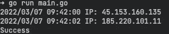

# 通过在 Go 中轮换 IP 地址，绕过基于 IP 地址的速率限制

> 原文：<https://betterprogramming.pub/bypass-ip-address-based-rate-limits-with-rotating-ip-addresses-in-golang-30f19a0d56d7>

## 基于 IP 的速率限制背后的基本概念。然后我们用 Tor 和 SmartProxy 构建一个 Golang HTTP 客户端来绕过它们

旋转 IP 地址

本文介绍了与服务通信时基于 IP 的速率限制背后的基本概念，以及如何规避它。我们将首先在 Golang 中构建一个简单的 [HTTP 客户端](https://www.quora.com/What-is-the-difference-between-HTTP-client-and-HTTP-server)，它将能够在必要时轮换 IP 地址，然后看看如何使用 [Tor](https://www.torproject.org/) 构建我们自己的本地代理池，使用 [SmartProxy](https://smartproxy.com/) 利用商业代理池服务。最后，我们应该知道轮换 IP 地址绕过基于 IP 的速率限制的有效性，以及如何改进它们。

# 基于 IP 地址的速率限制

有许多不同的方法来实现速率限制器。一些网站根据地址所属的 IP 范围阻止访问。例如，网站可能会拒绝访问已知范围的 Tor 节点，甚至是亚马逊网络服务的 IP 地址范围。一般来说，这种方法旨在减少非人类流量，机器人通常会从单个 IP 地址发送比人类用户在同一时期产生的更多的请求。

网站可以很容易地监控流量，并知道有多少请求是从一个特定的 IP 地址。如果请求的数量超过一定限度，网站可以阻止该 IP 地址或要求进行[验证码](https://en.wikipedia.org/wiki/CAPTCHA)测试。

# 绕过基于 IP 地址的速率限制

有许多方法可以解决基于 IP 的速率限制。一种选择是限制你在一个网站上同时抓取的页面数量，甚至可能引入延迟(在达到最初的限制之后)。解决基于 IP 地址的速率限制的最简单方法是改变发送请求的 IP 地址。我们可以通过使用[代理池](https://www.geosurf.com/blog/proxy-pool/)来实现这个功能。如果我们通过修改我们的 [HTTP 传输](https://pkg.go.dev/net/http#Transport)的引用，为每个请求分配另一个代理。我们可以让每个请求看起来都来自不同的用户。

## 突岩

现在是时候讨论如何用 Tor 创建一个[代理池](https://www.geosurf.com/blog/proxy-pool/)了。Tor 是一种覆盖网络协议，它使计算机能够通过一系列代理进行匿名通信。我们将在袜子上使用[流隔离](https://lists.torproject.org/pipermail/tor-dev/2010-December/000680.html)。使用这种方法，您只需要一个 Tor 实例，每个请求可以使用不同的出口节点的不同流，但是需要注意的是，不同的出口节点并不能保证我们有不同的 IP 地址。为了隔离流，我们必须为每个连接创建唯一的`username:password`值。首先，我们创建一个伪随机性源，并创建一个 random int 用于我们的 *Tor SOCKS 字符串*。接下来，我们可以将我们新创建的 *Tor SOCKS 字符串*解析成一个 *URL 结构*。最后，我们可以将我们的 *Tor URL* 传递给`ProxyURL`，后者返回一个将在我们的*传输*中使用的代理函数。

通过流隔离建立 Tor SOCKS 代理连接

使用 *Tor SOCKS* 作为我们的代理，我们需要解决一些问题。Tor 通过 3 个[中继](https://community.torproject.org/relay/)对你的连接进行加密和匿名。您的流量在世界各地的多个节点之间来回传递。这导致了一些瓶颈和网络延迟，它们将一直存在，但是最突出的瓶颈是创建一个 Tor 电路所花费的时间。由于我们使用一个 Tor 实例，并在不同的端口上分离会话，如果我们不跟踪会话，我们可能会耗尽主机上的可用端口。幸运的是，我们不用担心智能代理的这些问题。

# 智能代理

[SmartProxy](https://smartproxy.com/) 让您通过一个 IP 地址访问超过 4000 万个 IP 地址池。就像在 Tor 部分一样，我们可以利用代理池，但是在这种情况下，我们不必创建不同的 IP。我们使用我们的 SmartProxy 凭证连接到将在我们的*传输中使用的代理池。*

智能代理代理功能

我们现在可以通过无限制的连接请求访问整个 4000 万地址池。我发现一个很方便的附加功能是能够根据每个请求在粘性或旋转 IP 之间切换。拥有粘性 IP 可以让我们只在 IP 耗尽(阻塞)时改变 IP，从而释放连接时间。现在让我们在我们的 *HTTP 客户端*中利用这些代理。

# 客户

我们将使用我们创建的新代理函数创建自己的 HTTP 客户端。我们首先创建一个 singleton，以确保我们只创建一个`Transport`一次。

> 注意:为了让客户端重用底层连接，我们只需要在发出新的 HTTP 请求之前完全读取主体并关闭它

我们指定了一个类型为`time.Duration`的`Timeout`字段。当客户端通过 HTTP 打开与服务器的连接时，服务器可能需要一些时间来响应请求。此字段使我们能够指定从服务器获得响应的最长等待时间。函数`NewIP`创建另一个代理函数，并在`Transport`字段中重新分配代理字段。现在，让我们在主函数中将所有内容联系在一起。

# 主要的

在配置和实例化 Tor 客户端之后，我们可以检查请求的 IP 地址。然后我们调用`NewIP`到*旋转*我们客户的 IP 地址并再次检查，瞧！

具有 Tor 的不同 IP

# 结论

用 Tor 或 SmartProxy 实现轮换 IP 地址是一项简单的任务，可以用来成功地绕过基于 IP 的速率限制。这可以大大减少发出请求或抓取网页时的瓶颈。

虽然这个例子中的代码是一种相当幼稚的方法，但是有许多方法可以改进这个例子。要查看该项目的源代码，您可以访问我的 Github Repo。

我希望这能帮助你建立有趣的项目！