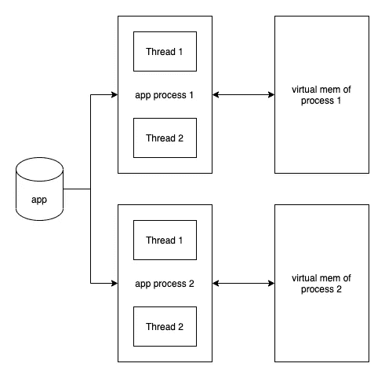
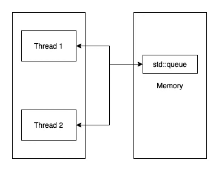
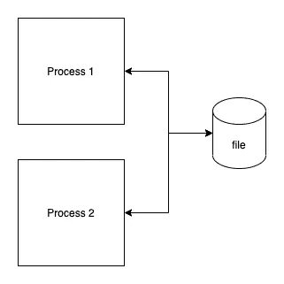
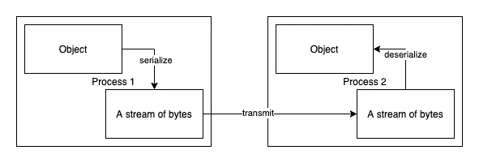

# 更具表现力的进程间消息传递的 C++框架

> 原文：<https://betterprogramming.pub/c-framework-for-inter-process-message-passing-df3789f982bc>

## 编写进程间消息传递框架，提高代码的表现力，使代码更加优雅。


马库斯·斯皮斯克在 [Unsplash](https://unsplash.com?utm_source=medium&utm_medium=referral) 上拍摄的照片

# 进程间通信

## 流程——概述

我们经常在网上读到进程是正在执行的程序，但是等一下，这到底是什么意思呢？对一些人来说，可能不太清楚这意味着什么。维基百科提供了一个更清晰的定义:

> 进程是由一个或多个线程执行的计算机程序的实例。

让我们看一个例子。我们有一个正在开发的名为`app`的可执行文件，所以我们有一个名为`app`的文件，在 Windows 上称为`app.exe`。当我们运行它时，例如，通过从 shell 启动`./app`，我们将运行我们程序的一个实例`app`。我们可以多次执行`./app`，并在我们的操作系统上运行多个`app`实例(多个进程)。

我们的`app`可以有单线程或多线程，这取决于我们如何设计它。



流程的简化说明(图片由作者提供)

在上面的简单图示中，我们可以看到每个进程都被分配了一个单独的虚拟内存空间。`process1`对`process2`的虚拟内存空间一无所知，也无权访问。

另一方面，线程生活在同一个进程中，它们共享相同的虚拟内存空间。我希望这个例子阐明了进程和线程之间的区别。

## 线程间通信与进程间通信

线程可以更容易地通信，因为它们如上所述共享相同的地址空间。我们可以为线程使用一个共享的全局变量，通过适当的同步机制来交换数据/消息。阅读下面我关于线程间消息传递的文章。

[](/writing-framework-for-inter-thread-message-passing-in-c-256b5308a471) [## 用 C++编写线程间消息传递框架

### 一个在线程间传递消息的框架，而不必担心底层线程代码

better 编程. pub](/writing-framework-for-inter-thread-message-passing-in-c-256b5308a471) 

线程使用相同的内存空间进行通信(图片由作者提供)

进程不共享同一个地址空间，所以我们需要另一种机制在进程间交换数据。我们不能使用全局变量，一个过程中的全局变量在另一个过程中不存在。其中一种方法是简单地使用文件。



使用文件进行进程间数据交换(图片由作者提供)

既然已经清楚了为什么我们不能使用线程中使用的相同方法在进程间交换数据，我们可以在下一节看看进程间通信(IPC)的常用方法。

## 用 C++实现 IPC 的不同方法

我们可以使用许多 IPC 机制。其中一些是:

*   文件
*   共用存储器
*   管
*   Unix 域套接字
*   信息排队
*   等等。

有很多 C++库可以用于 IPC，比如 [Boost。进程间](https://www.boost.org/doc/libs/1_78_0/doc/html/interprocess.html)等。本文的重点是创建一个抽象层，隐藏底层 IPC 机制的细节，以便应用程序开发人员可以专注于编写应用程序逻辑。他们可以忘记幕后发生的事情，也不必编写大量样板代码。我们的目标是以下列形式发送消息:

我们可以简单地将对象发送给其他进程。在接收过程中，我们希望这样编写代码:

我们只是在主要使用 lambdas 的地方注册我们的处理程序，就这样。我将在接下来的章节中介绍细节。在本文中，我们使用 [Boost 的消息队列](https://www.boost.org/doc/libs/1_78_0/doc/html/interprocess/synchronization_mechanisms.html#interprocess.synchronization_mechanisms.message_queue)作为底层的 IPC 机制。

# 序列化

## 为什么我们需要序列化我们的对象？

当我们想要在进程之间交换消息时，一件重要的事情是序列化我们的数据。

> 序列化是一个将代码中的数据结构/对象状态转换为一种格式的过程，这种格式可以在同一台机器或不同的机器上存储或传输，并在以后进行重构。

如果我们有一个类的实例——一个对象，我们可能想把它保存到一个文件中，或者把它发送到同一台机器或另一台机器上的另一个进程中。

如前所述，两个进程不共享相同的内存空间，因此我们需要一种机制，在将对象发送给另一个进程之前，将它转换为字节流。

现在，下一个问题是为什么我们不能只发送对象的字节？有可能，但是有很多事情可能会出错。假设我们使用 C++编写了两个程序，如果我们使用不同的编译器构建它们，或者如果对象不是简单的旧对象(PODs)，或者我们在具有不同体系结构的不同机器上构建它们(big vs. little-endian)，等等，仍然可能出错。

对于复杂类型，例如，将指针/引用作为成员并具有虚函数的类型，我们不能简单地转储内存，因为它们包含仅在该进程中有效的地址(指针、虚拟指针)。如果你不熟悉 C++对象模型，你可以阅读下面我的文章，解释 C++如何存储对象。

[](https://towardsdatascience.com/c-basics-understanding-object-model-b8152c8a4bcf) [## C++基础:理解对象模型

towardsdatascience.com](https://towardsdatascience.com/c-basics-understanding-object-model-b8152c8a4bcf) 

将对象从进程 1 发送到进程 2(图片由作者提供)

为了传输我们的数据，我们可以使用上一节中列出的任何 IPC 机制。

## 序列化技术

在为我们的应用程序选择序列化时，我们要考虑很多事情。其中一些是:

*   用户友好性:我们是否希望它是人类可读的
*   编码和解码速度
*   序列化数据的大小
*   语言不可知/特定于语言
*   安全支持等。

我们还可以将序列化分为:

*   基于文本的
*   基于二进制的

基于文本的序列化包括 XML、JSON、YAML 等。，而对于基于二进制的，我们有 CBOR，谷歌协议缓冲区等。

例如，我们可以有一个名为`Coord`的结构，它表示一个三维笛卡尔坐标系。我们有 x，y，和 z。

假设我们选择了 JSON 作为我们的序列化技术，我们可以得到如下的序列化数据。

我们的数据可以作为上面文本的 utf-8 字节流发送。

您可以根据自己的需要选择序列化技术，您是否需要一种得到良好支持的技术，人类可读性是否是一个决定性因素，都将取决于您的应用程序需求。

为了演示 C++中进程间消息传递的框架，我们将在本文中使用 JSON。我使用的库是 nlohmann JSON，你可以在这个 Github [repo](https://github.com/nlohmann/json) 中查看。我假设您了解如何使用该库。但是如果您不知道也不用担心，因为我将在下一节向您展示如何使用它。

# 消息传递框架

既然我们已经决定了使用哪些组件:

*   我们使用 Boost 的消息队列作为 IPC 机制，并且
*   我们使用 JSON 来序列化我们的消息

让我们开始框架的实现。

## 这些信息

假设我们有两条不同的消息要从`Process 1`发送到`Process 2`。他们是`Coord`和`LatLong`。

它们的 JSON 表示如下。

我们采取的第一步是使用选择的库为两个对象编写序列化/反序列化函数模板，命名为`to_json`和`from_json`。

使用这些函数模板，我们可以通过编写以下代码来序列化/反序列化我们的对象。

## 没有框架

有了序列化/反序列化，我们可以添加一个 IPC 机制来交换消息。下面是使用 Boost 的消息队列的两个进程`sender`和`receiver`的实现。

发件人(作者代码)

上面的`sender`代码创建了一个消息队列，并在退出之前发送了两条消息。在发送之前，对象被序列化成 JSON 对象，并通过`dump()`和`c_str()`函数转换成空终止字符串。

在`receiver`端，我们打开创建的消息队列，等待消息到达。消息是字节流，所以首先我们必须将它们转换成 JSON 对象，并调用反序列化函数将 JSON 对象转换成`Coord`和`LatLong`类型。

我们的代码现在按照我们想要的方式工作，但是有很多事情我们可以改进，比如隐藏类中的细节，消除编写样板代码的需要，等等。

## 表达代码

我相信大家都知道，代码被阅读的次数比它被编写的次数多得多，我们都花了很多时间阅读别人或我们自己编写的代码。这就是为什么当我们写代码时，我们必须为其他开发者写，而不是为机器写。

也许这并不适用于所有情况，对于性能关键型软件，我们可能希望优先考虑机器，牺牲可读性，但一般来说，大多数时候我们应该编写代码供他人阅读。

这就是编写表达性代码的目的，清楚地表达代码的意图，而不增加不必要的复杂性。

没有标准的方法来衡量代码的可表达性，这是一个定性的主观的衡量标准。

在我们的例子中，我认为我们可以通过为进程间消息传递编写一个框架来使我们的代码更有表现力。发送和接收消息时真正重要的是`send()`和`handle()`。我们可以对比以下几个版本，决定哪一个对我们更有表现力。

没有框架

带框架

## 有了框架

现在让我们一步一步地实现这个框架。我们没什么需要做的。我们可以重用在下一篇文章中讨论过的`CallbackWrapper`类。

[](/writing-framework-for-inter-thread-message-passing-in-c-256b5308a471) [## 用 C++编写线程间消息传递框架

### 一个在线程间传递消息的框架，而不必担心底层线程代码

better 编程. pub](/writing-framework-for-inter-thread-message-passing-in-c-256b5308a471) 

如果你没看过，建议你看一下了解详情。使用类型擦除技术实现该类，以包装可调用的并提供接口来:

*   检查包装的对象是否可以处理类型
*   转接电话

下一步是实现`Sender`类。这很简单，请看下面的代码。

最后一步是实现`Receiver`类。构建这个类有几个部分，如下所述。

除了包装序列化/反序列化和消息队列，我们还实现了:

*   `Handle()`功能模板，以及
*   调度表

Handle function template 接受一个 callable，获取它的第一个参数的类型，**从中删除引用和 cv 限定符**。然后，它使用该类型来*选择使用哪个函数将 JSON 对象转换成正确的对象*。它还将可调用的存储在一个向量中。

当消息到达时，我们遵循以下步骤:

*   创建一个 JSON 对象
*   使用调度表获得正确的`from_json`功能
*   将 JSON 对象转换为正确的对象
*   通过`callbackWrappers`循环检查应该使用哪个处理程序
*   调用处理程序

有了这个框架，我们只需编写以下代码来发送和接收消息，就可以实现我们在本文开始时提出的目标。

执行时，代码会打印:

```
Coord: 1, 2, 3
LatLong: 1.5, 2.5
```

当然，为了让它正确打印，我们必须实现以下内容。

# 摘要

*   进程间消息传递不同于线程间消息传递，因为进程不共享相同的地址空间
*   因此，我们不能简单地使用全局变量进行进程间通信
*   有许多可用的进程间通信机制，我们可以选择一个适合我们需要的，例如，消息队列
*   在进程之间交换数据需要序列化，因为对象在内存中的存储方式可能会因 CPU 架构、编译器等的不同而不同。
*   作为开发人员，我们的目标不仅是编写有效的代码，还要编写有表现力的代码，因为代码读得比写得多，我们必须清楚地表达我们的意图，并尽量避免增加不必要的复杂性，这会使我们的代码变得混乱
*   本文展示了一种用 C++编写 IPC 框架的方法