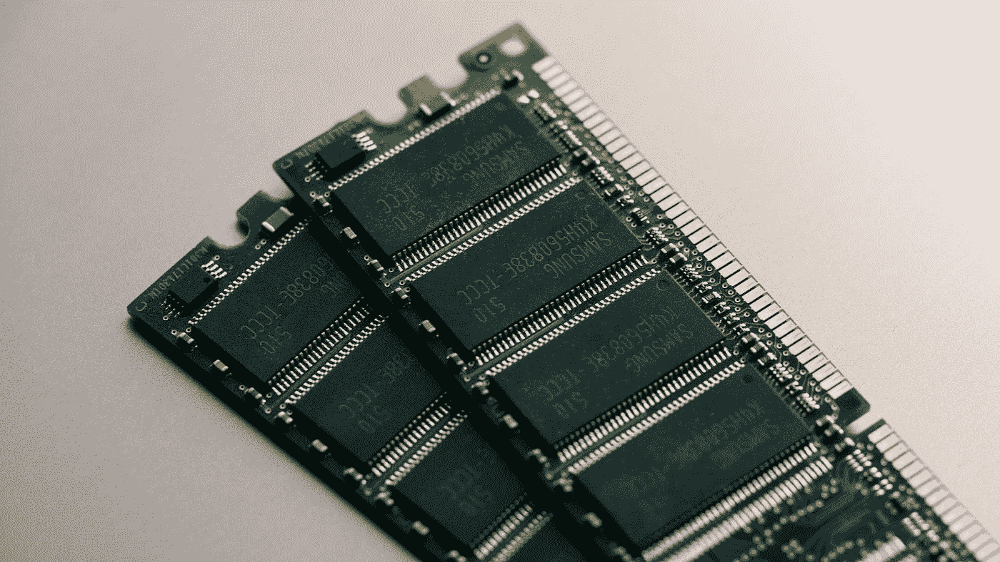
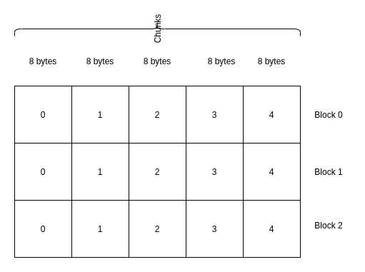

# C++内存池和小对象分配器

> 原文：<https://betterprogramming.pub/c-memory-pool-and-small-object-allocator-8f27671bd9ee>

## 理解在 C++中如何控制小对象的内存分配/释放以避免内存碎片

照片由[哈里森·布罗德本特](https://unsplash.com/@harrisonbroadbent?utm_source=medium&utm_medium=referral)在 [Unsplash](https://unsplash.com?utm_source=medium&utm_medium=referral) 上拍摄

# 概述—我们为什么需要内存池

了解动态内存分配/释放的工作原理有助于我们理解为什么我们的内存会变得支离破碎。

内存碎片指的是*小内存块*在较大内存块之间分配的情况。可以想象，这种情况会导致系统无法分配内存，即使总的来说，我们的可用空间比需要的多。

碎片化的记忆(作者图片)

在上图中，尽管我们总共有 230 MB 的空闲空间，但我们不能分配超过 100 MB 的空间，因为当我们分配内存时，它必须是连续的。

*   另一种方式也是正确的，我们有许多小的未使用的内存块，但这不是一个很大的问题，因为总数可能小到我们可以忽略

请阅读下面的帖子，了解 C++如何分配和释放内存的细节。在不同的抽象层次上发生的事情将在下面的文章中详细讨论:

 [## 用于数据处理的 C++内存分配/释放

### 理解如何管理内存将有助于我们更明智地分配/释放内存。

towardsdatascience.com](https://towardsdatascience.com/c-memory-allocation-deallocation-for-data-processing-1b204fb8a9c) 

## 小对象分配可能会导致碎片

我们绝对不希望在我们的应用程序中出现内存碎片。但是，我们需要注意什么才能避免呢？

最可能的原因是我们的应用程序中频繁的小对象分配。当小物体的寿命比大物体的长时，尤其如此。

> 与其他高级编程语言一样，C++的问题在于我们不太清楚是否在应用程序中为小对象分配内存。

我们肯定会知道，当我们使用带`new`和`delete`运算符的原始指针以及`std::unique_ptr`和`std::shared_ptr`这样的智能指针时，我们是动态分配内存的，但是当我们使用 C++标准库或第三方库提供的其他函数如 Boost、等时，，我们必须阅读文档或有时阅读代码(当然，如果是开源软件)。

一些例子是任何类型的包装器，如`std::any`和`std::function`，它们使用 C++中的类型擦除技术，这必须创建所包含对象的副本，导致动态分配。

如果我们不小心，我们可能会在没有意识到的情况下将应用程序中的内存碎片化。即使是像`std::vector`这样常用的 STL 容器，当用于小规模数据的少量元素时，如果它长时间保持活动状态(即不是函数中的局部变量),也会导致碎片。

关于类型擦除、任何类型等的所有细节。你可以在这篇文章的末尾找到其他的文章来讨论。

我们可以通过使用内存池来缓解这个问题，这将在下面的部分中讨论。我还将展示一个用例，在这个用例中，我们可以将内存池用于任何类型类的小对象优化，比如`std::any`。

# 内存池

内存池是一种内存管理技术，用于分配固定大小的内存，而不是由 C++中的`std::malloc`或`new`操作符提供的可变大小的内存分配。

关于内存碎片，其思想是，内存池允许我们预先分配连续的内存块，并将它们用于小对象，而不是在内存中分配(小对象的)内存。下图说明了不同之处。

可变大小的分配会导致分段(图片由作者提供)

内存池中的固定大小分配可能会改善这种情况(图片由作者提供)

## 它是如何工作的？

内存池的工作原理是将内存分成块，并将块分成块/段。相同大小的对象可以使用一个池。

块和块/段(作者图片)

上图展示了一个 8 字节对象的内存池，其中一个块可以有 5 个块。块 0、块 1 和块 2 可以分开在不同的存储位置。一个块中的块是连续的，你可以把它们看作一个由五个 8 字节数据组成的数组。

您可以编写自己的内存池，也可以使用任何适合您需要的库。对于本文，我们将使用 [Boost 的池](https://theboostcpplibraries.com/boost.pool)。

## 同类型的水池

Boost 的池支持不同的类型，有些提供低级别的控制，有些提供更多的抽象。它还支持我们可以用于 STL 容器的分配器类型。

对于我们这里的例子，我们将使用 Boost 的 Singleton 池，它的生存期是，直到我们的应用程序退出。

当我们实例化单例池时，我们需要指定块的大小。默认情况下，块大小是 32 x 块大小，我们可以通过设置模板参数来改变大小。

当一个块被完全使用时，Singleton 池将会自动增加一个新的块，这意味着块的大小是原来的 64 倍。如果我们不设置可以在模板参数中设置的最大允许大小，它将会一直翻倍。

在下面的例子中，我们有一个名为 Coordinate 的类，我们将频繁地为它分配具有不同生存期的内存。所以我们决定使用默认的、无限制块大小的单例池。

为此，我们可以使用 Boost 的单体池创建一个内存池，如下所示:

空结构`coordinate_pool`是一个标记，由单体池内部使用。

要分配和释放内存，我们可以简单地如下操作:

请注意，上面的代码只分配内存，而不构造对象。由于分配的内存是未初始化的，当您试图访问它时，您会看到一些随机数。要构建对象，我们需要手动完成，例如使用`placement new`。

## 隐藏新建和删除运算符

上面的代码不方便，因为我们需要始终记住写 3 个步骤:

*   分配内存
*   构建我们的对象
*   空闲存储器

为了解决这个问题，我们可以隐藏`new`和`delete`操作符。当你使用`new`操作符来分配内存和构造一个对象时，编译器把它翻译成两个步骤:

*   对全局`::operator new`函数的调用
*   对匹配构造函数的调用

> 所以，当人们说`std::malloc`和 new 的区别在于 new 会在为它分配内存后构造对象时，这并不是魔术。

假设我们有下面的代码。

幕后发生的事情是编译器将第 9 行翻译成:

类似地，当我们调用 delete 操作符时，编译器将其翻译成:

首先通过调用对象的析构函数来销毁对象，然后调用`global ::operator delete`函数来释放内存。那么，这对简化我们的代码有什么帮助呢？

我们可以通过在类中添加同名的静态函数来隐藏全局`new`和`delete`函数。

> 通过这样做，我们可以控制从哪里分配内存。

我们可以如下重写我们的`Coordinate`类:

我们现在可以从上面创建的单体池中分配内存。这些函数不仅在我们手动使用`new`和`delete`操作符时被调用，

而且当我们使用`std::unique_ptr`时也是如此，比如在下面的代码中。

## 各种类型/大小的游泳池

我们可以为不同大小的对象创建多个池。通过这样做，我们可以管理不同大小的对象。例如，对于 1 字节对象、4 字节对象和 12 字节对象，我们可以有 3 个池。

然后，我们可以根据对象的大小选择要分配内存的位置。我们可以在下面关于为`Any`类型优化小对象的章节中看到如何使用这种技术。

## 释放内存

通过使用内存池，我们仍然可以将未使用的内存返回给系统。但是我们不返回未使用的块，而是返回整个块。如果我们有一个完全未使用的块，我们可以通过调用`singleton_coordinate_pool::release_memory()`来释放内存。

# 任何类型的小对象优化

在[关于任何类型的文章](https://debby-nirwan.medium.com/passing-any-type-in-c-like-in-python-to-simplify-our-code-3af72347282d)中，我写道 C++标准鼓励任何类型的实现，以避免小对象的动态内存分配。这是为了避免内存碎片，因为像`std::any`这样的任何类型实现都可以包装任何大小的对象，包括像字节这样的小对象。

解决方案是就地构造小对象。在这种情况下，还有一种方法可以避免内存碎片。我们可以使用我们在前面几节中讨论过的内存池。

我们可以将运算符`new`和`delete`函数添加到我们的`Any`类型实现中，以允许我们从内存池中分配内存，如下面的代码所示。

我们可以创建多个池，并根据所包含对象的大小分配/释放内存。如果大小足够大，在我们的例子中大于 32 字节，我们从堆/自由存储中分配内存。

这里需要注意的一点是，我们有额外的 8 字节数据来存储虚拟指针(`vptr`)，因为我们在`Any`类型中使用了虚函数。

有了这个实现，我们在为小对象分配内存时就不用担心内存碎片了。您可以为您的应用程序调整“小”的大小，这里只是一个例子。

# 关键要点

*   如果我们不小心，我们可能会在用 C++编码时导致内存碎片
*   当使用 C++库时，不清楚我们是否动态分配内存
*   C++没有自动垃圾收集，所以我们需要知道我们在用内存做什么
*   避免碎片的一个可能的方法是使用内存池
*   内存池的工作原理是分配内存块并将它们分成固定大小的块
*   我们可以通过隐藏类中的全局`::operator new`和`::operator delete`函数来提高抽象性
*   这种技术可以在`Any`型包装器中用于小对象优化。

# 有用的链接

 [## C++类型擦除:包装任何类型

### 了解如何用 C++编写类中任何类型的包装器，以提高代码的抽象层次。

towardsdatascience.com](https://towardsdatascience.com/c-type-erasure-wrapping-any-type-7f8511634849)