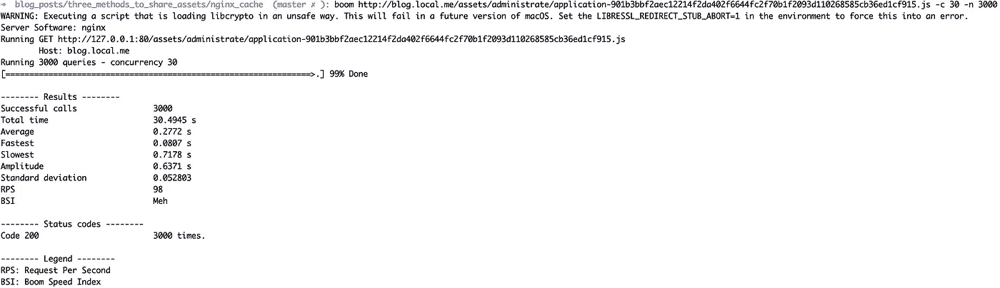

# 使用 Nginx 反向代理缓存和服务 Rails 中的静态资产

> 原文：<https://betterprogramming.pub/cache-and-serve-rails-static-assets-with-nginx-reverse-proxy-dfcd49319547>

## 通过提供和缓存静态内容来提高 Rails web 应用程序的性能和速度


Marc-Olivier Jodoin 在 [Unsplash](https://unsplash.com?utm_source=medium&utm_medium=referral) 上拍摄的照片

在我的[上一篇文章](https://levelup.gitconnected.com/three-methods-to-share-rails-assets-with-nginx-f39c90bb7d68?gi=d5b966651883)中，我介绍了三种不同的方法，用于与反向代理 Nginx 共享 Rails 应用程序的静态内容(这也适用于任何应该提供静态内容的 web 应用程序)。

共享内容的主要原因是为了提高向客户端交付静态内容的性能和速度。然而，使用 Nginx 共享资产并不是影响静态内容交付性能的唯一方法。

在这篇文章中，我将介绍另一种技术，缓存，，它可以帮助提高处理 web 请求的性能，而不需要在 Rails 应用程序和 Nginx 反向代理之间共享资产。

# **什么是缓存？**

缓存是在本地存储响应副本的过程，以加速通信和向最终用户交付内容。响应的副本可以存储在客户端(浏览器)或服务器端。缓存是为静态内容(如图像或样式表)的重复请求提供服务的强大技术。举例来说，在这个案例中，一个客户请求下载一个图像。如果图像不在缓存中，请求将被转发到后端应用程序。但是，如果它在缓存中，请求将从缓存中得到服务，并且请求不会命中后端应用程序。

## **Nginx 缓存如何帮助**

在生产环境中，Rails 应用程序和其他 web 应用程序通常位于反向代理之后，比如 Nginx 或 Apache。反向代理是设计用于服务大量并发请求和保护后端应用程序的应用程序。反向代理将请求转发给后端应用程序，一旦收到响应，它将被转发给客户端。

将每个请求发送到后端应用程序可能会影响后端应用程序的速度和性能。因此，配置反向代理来保存静态文件的本地副本(缓存)并在不涉及后端应用程序的情况下为它们提供服务可以提高应用程序的性能。

# **如何实现 Nginx 缓存**

在开始 Nginx 配置之前，我们必须确保部署的 Rails 应用程序拥有预编译资产的副本，并且被配置为服务静态资产。第一项任务可以通过在应用程序文档中包含以下行来完成。

```
bundle exec rake assets:precompile
```

配置 Rails 应用程序来服务静态资产也是一项简单的任务；我们只需要确保在运行的容器上设置了下面的环境变量。

```
RAILS_SERVE_STATIC_FILES: 'true'
```

"[***ngx _ http _ proxy _ module***](https://nginx.org/en/docs/http/ngx_http_proxy_module.html)***"***是一个 Nginx 内置模块，允许将请求从 Nginx 传递到另一个服务器。在我们的例子中，另一个服务器是 Rails 应用程序。这个模块提供了复杂的配置项目来配置 Nginx 上游服务器的缓存。下面的代码片段显示了一个完整的 Nginx 配置文件，该文件用于缓存 Rails 应用程序的静态内容。

上述配置中首先可以注意到的是指令`proxy_cache_path`。该指令用于设置以下高速缓存配置:

*   缓存文件的位置。缓存数据存储在文件中，`MD5`函数用于命名缓存文件。
*   参数`levels`定义了缓存的层次级别，从 1 到 3；每个级别都接受值 1 或 2。
*   `keys_zone=blog:10m`定义了缓存的名称以及保存关键字和元数据信息的内存空间的大小。
*   `max_size=1g`指定 NGINX 可以用于缓存的最大存储大小。
*   `inactive=60m`指定缓存对象的最大缓存生存期。

`proxy_cache_key`是第二个使用的指令。对于每个缓存的请求，该项需要是唯一的，它将用于生成缓存文件名。

接下来，Nginx 配置定义了两个位置。第一个位置在启用缓存的情况下用于服务静态资产，另一个位置在禁用缓存的情况下用于服务动态内容。

```
location ~ ^/(assets|images|javascripts|stylesheets|swfs|system)/ {
  set $skip_cache 0;
  try_files $uri [@rails](http://twitter.com/rails);
  break;
}location / {
  set $skip_cache 1;
  try_files $uri [@rails](http://twitter.com/rails);
}
```

最后一步是为转发给 Rails 应用程序的请求启用缓存。下面简要描述了归档此任务所需的最重要的配置:

*   `proxy_cache`:定义使用的缓存区。
*   `proxy_cache_valid`:定义 web 响应的缓存时间。
*   `proxy_cache_bypass`:定义不从缓存中提取请求的条件。
*   `proxy_no_cache`:定义响应不保存到缓存的条件。
*   `add_header X-Cache-Stats`:向响应添加一个报头，指定请求是高速缓存命中还是高速缓存未命中。

## **测试和验证缓存配置**

我想测试的第一件事是缓存配置是否按预期工作。为了测试这一点，我多次请求同一个静态文件，并检查响应头`X-Cache-Stats`以检查请求是**命中**还是**未命中。**下图显示了我的请求的结果，它还显示只有第一个请求没有命中**；其他请求是**命中**请求。**

****

**我想测试和衡量的下一件事是有和没有缓存特性的 web 应用程序。为了完成这个任务，我实现了两个 Nginx 服务器，一个有缓存特性，另一个没有。然后，我使用“boom”工具在每台服务器上创建许多并发请求。以下是两种情况的结果:**

****

**无缓存的 Nginx**

****

**带缓存的 Nginx**

**基于以上测试，我们可以说缓存特性帮助 ***将*** 执行所有请求所需的时间减少了五秒。此外，我们看到每秒请求数(RPS)从 83 个增加到 98 个。**

# ****结论****

**使用 Nginx 为后端服务实现缓存有助于提高 web 应用程序的性能，并减少后端服务的负载。Nginx 缓存特性可以用来缓存 Nginx 直接管理的内容，也可以用来缓存任何上游服务器提供的静态内容。**