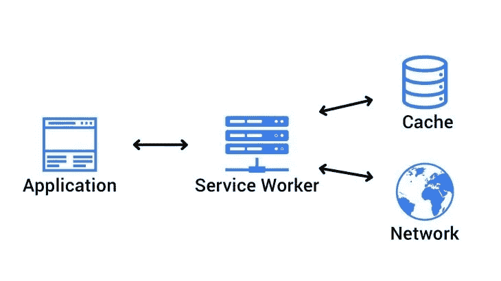
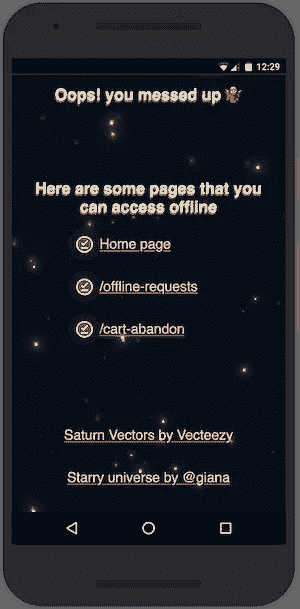

# 使用服务工作者和缓存 API 进行缓存处理

> 原文：<https://betterprogramming.pub/cache-handling-using-service-workers-and-the-cache-api-on-the-web-7c00c478d39b>

## 利用服务人员和强大的缓存 API 在网络上创建快速的类似应用程序的体验

由[展开的插图](https://undraw.co/illustrations)

在这篇文章中，我将包括你可以在网络上利用强大的[缓存 API](https://developer.mozilla.org/en-US/docs/Web/API/Cache) 的各种方法。

缓存 API 允许开发人员轻松控制缓存内存。这个内存不要与浏览器缓存/内存缓存或者 HTTP 缓存混淆。

缓存 API 允许 HTTP [请求](https://developer.mozilla.org/en-US/docs/Web/API/Request)缓存，这在几乎所有*网站上都很有用。*

结合[服务人员](https://developer.mozilla.org/en-US/docs/Web/API/Service_Worker_API)解锁的独特功能，可以在任何网站上提供离线功能。无论是静态网站还是服务器端渲染的应用程序。

然后，让我们继续讨论如何利用缓存 API 和服务工作者在我们的 web 应用程序中实现缓存。

我将在普通 JavaScript 和[工具箱](https://developers.google.com/web/tools/workbox)中展示类似的实现。普通的 JavaScript 会给你更多的清晰度，但是为了避免错误和增加简单性，推荐使用 Workbox。

注意:对于以下部分，我考虑到您熟悉 [JavaScript ES6](https://www.w3schools.com/js/js_es6.asp) 、[服务人员](https://developers.google.com/web/ilt/pwa/introduction-to-service-worker)、[工作箱](https://developers.google.com/web/tools/workbox)和[获取 API](https://developer.mozilla.org/en-US/docs/Web/API/Fetch_API) 。
[服务人员登记](https://developers.google.com/web/fundamentals/primers/service-workers/registration)假定已经到位。

# 预缓存

有时候，当用户一进入你的网页，在用户请求之前，你就想预先缓存一些资源。这可能包括后续用户导航所需的资源或附加文件，以确保脱机功能。

服务工作者可以主动请求资源并将其保存到缓存中。

# 预缓存—普通

一般来说，在预缓存和缓存过程中，版本控制很重要，它可以防止您在开发时以及您的用户出现常见的混淆。我们需要确保资源的任何旧版本都被网络上的最新版本所替换。

如果您愿意，您可以实现自己的版本控制系统，但是，为了简单起见，我不会在本文中深入讨论。

## 删除以前的缓存

相反，我们将清除缓存。在服务工作者的`activate`事件中，如果需要，删除所有以前缓存的文件:

注意:在删除之前，请记住[缓存是在相同来源](https://developers.google.com/web/ilt/pwa/caching-files-with-service-worker#removing_outdated_caches)的页面/路径之间共享的！

## 将文件添加到缓存中

幸运的是，缓存 API 使得向缓存添加文件变得非常容易。在**service worker`install`**事件期间，我们只需要打开预缓存的缓存，使用缓存的`[addAll](https://developer.mozilla.org/en-US/docs/Web/API/Cache/addAll)`功能添加所有文件。****

****上面的例子展示了缓存 API 是多么强大。****

****`[addAll](https://developer.mozilla.org/en-US/docs/Web/API/Cache/addAll)`函数接受一个字符串数组(资源 URL ),并为每个资源创建一个`[Request](https://developer.mozilla.org/en-US/docs/Web/API/Request)`对象。然后，它在将完成的请求保存到设备内存之前获取资源。很棒吧，哈？****

****在这段代码运行之后，用户将下载`precacheFiles`并保存在他们的设备上，甚至不需要首先请求它们。当用户离线时,`offline.html`文件将可用并显示，因此预缓存该文件很重要。****

# ****预缓存—工具箱****

****如果您还没有使用 Workbox，希望在这次演示之后，您会对它有所了解。****

****为了以最简单的方式使用 Workbox 进行预缓存，我们只需要在服务工作者 JavaScript 文件中的任何地方包含以下行。****

****对于一些真正的 web 开发人员来说，使用 Workbox 库工具[生成一个预缓存清单](https://developers.google.com/web/tools/workbox/guides/precache-files#generating_a_precache_manifest)，它将包含所有需要预缓存的文件，包括它们的版本！****

****您不需要担心版本控制、跟踪修订和更新您的每个文件。Workbox 会通过只更新*有新版本的*文件来处理所有这些问题。****

****Workbox 还负责缓存命名和拦截 HTTP 请求。好东西！****

****提示:获取 Workbox 默认预缓存的缓存名称，然后获取[缓存对象](https://developer.mozilla.org/en-US/docs/Web/API/Cache):****

****`const cache = await caches.open(workbox.core.cacheNames.precache)`****

# ****运行时缓存—普通****

****运行时缓存对于那些“不受你控制”的资源非常有用。****

****例如，从其中获取资源的第三方脚本，如 [Google Fonts](http://fonts.google.com/) 将获取[CSS](https://fonts.googleapis.com/css?family=Montserrat&display=swap)作为回报，CSS 将获取字体的最新版本的 WOFF 2/TTF 文件。****

****在这里，重要的是要理解为什么服务工作者对于这项任务来说是方便的，为什么它是如此强大。主要原因是这样的:****

****服务工作者充当应用程序与网络和缓存之间的“代理”。****

****

服务工作器充当应用程序与网络和缓存之间的代理**** 

****由于服务工作者拦截客户端 HTTP 请求的强大能力，它赋予我们添加以下示例功能的超级能力:****

****如果资源不存在于缓存中:****

*   ****从网络上索取。****
*   ****并将其添加到缓存中以备后用。****

****如果资源存在于缓存中:****

*   ****用缓存的资源响应。****

## ****从网络获取并将响应保存到缓存****

****对于普通 JS 中的运行时缓存，我们将在服务工作线程中使用缓存 API 和`fetch`事件:****

## ****从缓存响应，否则从网络获取****

****然后，我们将检查缓存中请求的资源，并使用该资源进行响应，从而提高性能！****

****添加其余的逻辑来相应地响应客户端的请求，最终的代码将类似于下面这样:****

****注意`Response`对象的克隆！[响应应该只使用一次](https://developer.mozilla.org/en-US/docs/Web/API/Response/clone)因此，因为我们将它放入缓存并返回给用户，所以我们需要首先克隆它。****

# ****运行时缓存—工具箱****

****为了更进一步，我们需要确保你对 [Workbox 的策略](https://developers.google.com/web/tools/workbox/modules/workbox-strategies)感到舒适，并且知道何时使用每一个策略。****

****如果你还不舒服，我建议先花三分钟浏览一下我的关于工具箱策略的文章。****

## ****使用工具箱策略****

****策略应用于指定的 HTTP 路由。为此，Workbox 通过`registerRoute`函数提供了一个高级接口。****

****该功能通过基于路线的 URL 配置特定策略，允许[路线处理](https://developers.google.com/web/tools/workbox/guides/route-requests)。****

*   ****[重新验证时过时](https://developers.google.com/web/tools/workbox/modules/workbox-strategies#stale-while-revalidate)示例:****

****上面的单行代码包含在服务工作者 JavaScript 文件中。****

****这里我们声明，对于以这些扩展`js`、`css`、`webp`、`png`或`svg`结尾的每个请求，它应该由`[StaleWhileRevalidate](https://developers.google.com/web/tools/workbox/modules/workbox-strategies#stale-while-revalidate)`策略处理。****

****当没有指定策略时，应用默认策略，即`CacheFirst`。****

*   ****[网络第一](https://developers.google.com/web/tools/workbox/modules/workbox-strategies#network_first_network_falling_back_to_cache)举例:****

****上面的路由注册对于服务器端呈现的应用程序来说很方便，在这种应用程序中，显示网站和数据库的最新版本很重要，但仍然希望在脱机时至少向用户显示一些内容。****

# ****默认脱机页面****

****说到线下…****

********

****不要在网上喂鸭嘴龙！🦖****

****不言而喻，一个真正的 PWA 绝不会向用户展示“downasaur”！****

****服务人员允许我们在网上安全行事，确保我们的用户总是能看到一些东西，即使是在不存在的路线上或离线时。****

## ****我们分三步完成****

1.  ****在服务人员的`fetch`事件中监听[导航类型请求](https://developer.mozilla.org/en-US/docs/Web/API/Request/mode)。****
2.  ****从缓存或网络获取资源。****
3.  ****检查任何网络问题(例如:404 HTTP 状态)*。*****
4.  ****如果在任一位置都没有找到资源，则使用缓存的脱机页面进行响应。****

****但首先，我们需要打下基础！****

****在服务人员的`install`事件期间预缓存离线页面可以确保离线页面在设备的缓存中，这样我们就可以安全地返回到它。****

****使用 Workbox，您应该[在构建时生成一个包含`offline.html`文件的预缓存清单](https://developers.google.com/web/tools/workbox/guides/precache-files#generating_a_precache_manifest)。****

****然后，当请求是`navigation`模式时，我们可以处理`fetch`事件内部的网络错误，并根据情况用适当的资源进行响应。****

****现在，继续创建一个有趣而聪明的离线页面，让你的用户兴奋得不想离开！****

****需要灵感？[离线页面示例](https://thegoodmobileui.com/#/search/offline)。****

********

****示例[离线页面](https://www.pwa.recipes/offline.html)用于列出所有离线可用页面****

# ****进一步阅读****

*   ****[缓存 API 文档](https://developer.mozilla.org/en-US/docs/Web/API/Cache) — MDN 文档。****
*   ****[使用缓存 API](https://developers.google.com/web/fundamentals/instant-and-offline/web-storage/cache-api) —谷歌开发者。****
*   ****[生成预缓存清单](https://developers.google.com/web/tools/workbox/guides/precache-files#generating_a_precache_manifest) —谷歌开发者。****
*   ****[在 PWA 中标记并列出离线可用页面](https://medium.com/@charistheodoulou/5136edea7de1?source=friends_link&sk=1001086f7c6f2cf2bcdc5bff1257bc51) — Medium。****
*   ****[基于示例和用例的工具箱策略](https://medium.com/@charistheodoulou/ebb32f8cbe4d?source=friends_link&sk=606fc308bec8dcd553111f5a79c5e859) —中等。****
*   ****PWA 维基。****