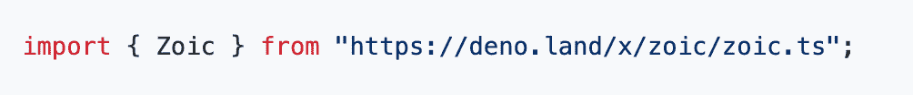
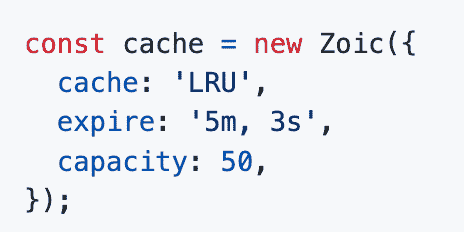
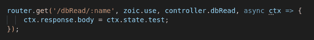
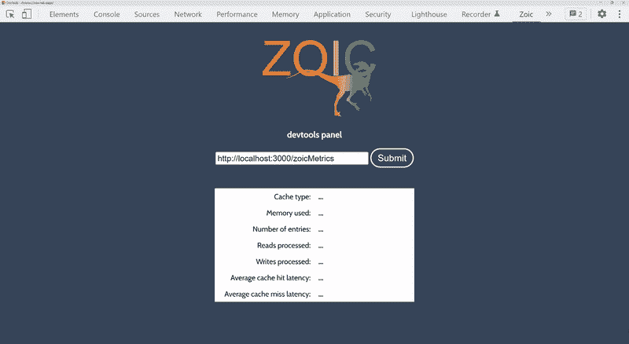
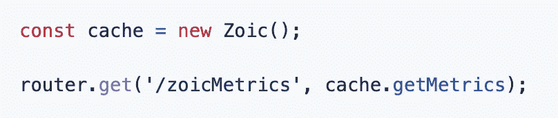

# 使用野象小姐缓存在 Deno 中进行缓存

> 原文：<https://betterprogramming.pub/caching-in-deno-using-zoic-cache-d1ea48892f23>

由[乔·陋居](https://github.com/jmborrow)、[塞莱娜·陈](https://github.com/celenachan)、[亚伦·德莱弗斯](https://github.com/AaronDreyfuss)、[汉克·杰克森](https://github.com/hankthetank27)和[贾斯珀·纳维尔](https://github.com/jnarvil3)


缓存是一项重要的技术，对于许多向外扩展的应用程序或希望向外扩展的应用程序来说是必不可少的。寻找 Deno 运行时缓存解决方案的开发人员应该看看野象小姐缓存，它集成了 Oak 中间件。在这篇文章中，我们将通过野象小姐的基础知识，并概述了一些快速和简单的步骤，以利用我们的 Deno / Oak 应用程序中的野象小姐缓存库。

野象小姐缓存是 Deno 运行时中 Oak 的一个快速、轻量级的中间件库，允许用户使用可配置的内置 LRU 驱逐策略快速设置 RESTful 服务器端 API web 缓存。野象小姐缓存库允许用户抽象出大量出现在自主开发的缓存解决方案中的样板文件，并允许他们使用流行的缓存备用设计模式快速启动缓存。或者，对于那些寻找 Redis 缓存实例的用户，野象小姐缓存通过其配置设置使其可用。让我们在典型配置中完成野象小姐缓存实例的设置。

正如我们前面提到的，野象小姐的缓存库符合中间件设计模式。因此，野象小姐专门用于缓存后端的服务器端请求。最好的部分是，它的超级容易进口野象小姐和开始！

[在这里下载](https://deno.land/x/zoic@v1.0.2)！

# **入门**

## Deno 内置的模块导入功能直观、轻量。

简单地在你的服务器脚本的顶部输入以下内容(例如。您的 server.js 或 server.ts 文件)



如果您是 Deno 运行时的新手，请注意，第一次使用野象小姐时，Deno 必须在您的系统上安装并缓存它，以便将来可以很容易地再次调用它。所有 Deno 模块都是如此。还要注意，如果 Deno 的 Oak 库还没有安装在您的机器上，那么当您使用野象小姐库时，它将作为一个依赖项安装。

导入库之后，就可以实例化缓存了。幸运的是，您有相当多的可选定制:

*   **缓存类型(默认为“LRU”)**—这可以是 LRU(最近最少使用的驱逐策略)或 Redis(请务必关注近期的新版本— LFU 支持即将推出！).
    –选择 *Redis 缓存类型*将允许您将 Redis 实例集成到缓存中，允许您利用与 Redis 部署相关的所有方法和其他好处。(*注意—如果您选择 Redis 缓存类型，请确保将您的端口号作为最终参数)
    —另一方面，选择 *LRU 缓存*类型虽然功能较少，但性能更高，因为它具有恒定的时间复杂性。
*   **到期时间(默认为无穷大)** —您可能会猜到这是什么意思。到期时间是您希望数据在被删除之前在缓存中存在的时间。较短的到期时间值可能适合具有非常动态、快速变化的响应的应用程序，因为您不希望将陈旧或过时的数据提供给前端。您可以选择以毫秒为单位输入该值，以逗号分隔的字符串表示“h”(小时)、“m”(分钟)和“s”(秒)，如下例所示。
*   **容量(默认为无穷大)——**想要限制缓存的大小？capacity 属性允许您指定缓存将容纳多少个键/值对(即响应的数量)。
*   **点击时响应(默认为真)** —需要加速？这个布尔值告诉我们的库，您是否希望通过自动向前端发送响应来提高性能，而没有机会在缓存检查后使用额外的中间件来编辑这些响应。

以下是缓存初始化的一个示例:



正在初始化您的野象小姐缓存

将野象小姐的缓存方法嵌入您的 Oak 中间件链非常简单



如何在您的 Oak 中间件链中嵌入野象小姐

# **野象小姐开发工具**

要从基于 GUI 的角度了解野象小姐缓存中间件实例中发生的事情，请使用 Chrome 网络商店中的免费开源野象小姐开发工具。



我们希望每个使用野象小姐的人都能够看到他们的应用程序的改进，所以我们制作了一个简单易用的谷歌 Chrome 开发工具，让您跟踪所有关键指标，如条目数量、处理的读/写和延迟，让您看到您的应用程序工作效率有多高。

## **如何安装和配置野象小姐缓存开发工具**

要使用我们的 Chrome 开发工具，只需从 Chrome 网上商店[这里](https://chrome.google.com/webstore/detail/zoic-dev-tools/cnoohkfilnjedjeamhmpokfgaadgkgcl)下载它。一旦你安装了它(你可能需要重启 Chrome)，在你的开发者工具中打开野象小姐。首先，通过 dev 工具面板上的输入字段，插入您的服务器地址和端点，您将在该处提供缓存指标。其次，在您的服务器路由中，创建一个与 dev 工具中指定的端点相匹配的新路由。在这个路径中添加中间件 Zoic.getMetrics(假设您已经导入了野象小姐中间件库并实例化了一个新的缓存实例)。

注意:此路由将启用 CORS。



服务器路由中的配置示例

野象小姐成熟的性能、可用性和多功能性使其成为满足您所有 Deno 缓存需求的完美选择。[这里下载](https://deno.land/x/zoic)！

如果有任何关于野象小姐的问题，请随时联系野象小姐团队。我们欢迎任何反馈！

```
[Zoic Github](https://github.com/oslabs-beta/zoic) | [Website](https://www.zoiccache.com)Joe Borrow: [Linkedin](https://www.linkedin.com/in/joe-borrow/) | [Github](https://github.com/jmborrow)Celena Chan: [Linkedin](http://www.linkedin/in/celenachan) | [Github](http://www.github.com/celenachan)Aaron Dreyfuss: [Linkedin](https://www.linkedin.com/in/aaron-dreyfuss-708b9bb4/) | [Github](https://github.com/AaronDreyfuss)Hank Jackson: [Linkedin](https://www.linkedin.com/in/hank-jackson-10345317/) | [Github](https://github.com/hankthetank27)Jasper Narvil: [Linkedin](https://www.linkedin.com/in/jaspernarvil/) | [Github](https://github.com/jnarvil3)
```