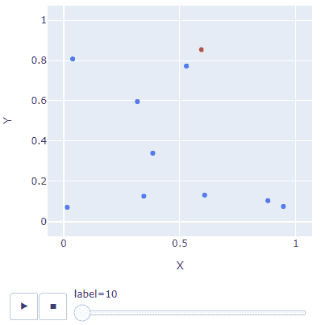
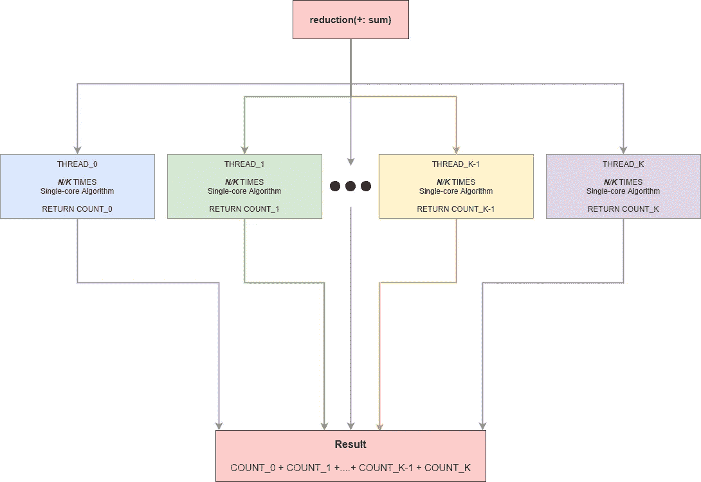
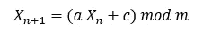
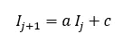
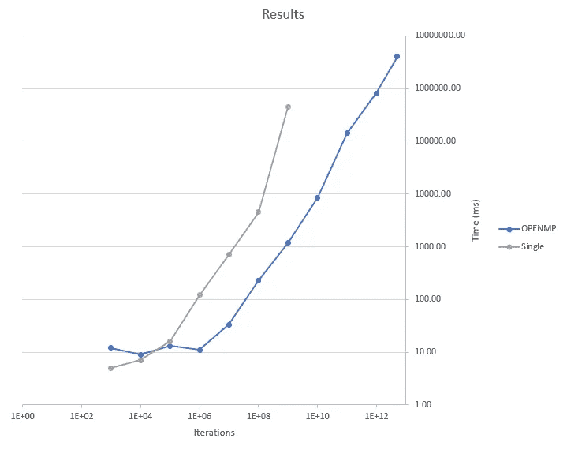
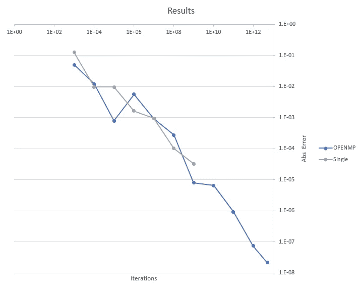

# 利用 OpenMP 和 C 并行计算蒙特卡罗方法计算圆周率

> 原文：<https://betterprogramming.pub/calculating-pi-%CF%80-with-monte-carlo-using-parallel-computing-with-openmp-and-c-2b3a357f0f78>

## 利用并行计算更高效地解决高要求问题

由[马格努斯·恩格](https://unsplash.com/@magnusengo?utm_source=medium&utm_medium=referral)在 [Unsplash](https://unsplash.com?utm_source=medium&utm_medium=referral) 上拍摄的照片

圆周率的计算是一个非常重要的计算问题，吸引了许多人试图以尽可能高的精度计算它。

有很多方法可以做到，但我们将使用蒙特卡罗来计算圆周率(π)。

我们选择蒙特卡罗方法是因为它简单，并且可以归类为“[令人尴尬的可并行化](https://www.microsoft.com/en-us/research/publication/optimization-monte-carlo-efficient-embarrassingly-parallel-likelihood-free-inference/)”，正如这些算法在文献中所描述的那样。它的并行性令人尴尬，因为它可以在没有任何数据共享的情况下分成更小的进程，这一问题会使进程变得复杂。

计算π的蒙特卡罗方法有两种变体:

*   单位圆和单位方方法
*   通过计算函数的平均值进行积分计算

我们将选择第一种方法。

这种方法背后的逻辑是我们在单位正方形内创建随机点。然后我们计算单位圆内的点的比率，并计算这些点与总数的比率。

迭代次数增加时的蒙特卡罗结果

如果你想了解更多关于单位圆技术和蒙特卡洛的知识，这篇文章是一个很好的资源。

# 履行

首先，我应用了没有并行性的算法，将这些时间作为参考基准。

算法背后的逻辑很简单。我们执行了大量的迭代，并且我们请求随机的 x 坐标值。最后，我们计算请求区域内外的点的比率。将比率乘以 4 后，我们得到圆周率(π)。

算法的简单性允许我们使用归约技术非常有效地并行化迭代部分。

更好地理解归约的图表

在并行代码中，我们只需要实现一个重要的变化。

传统的产生随机数的方法不能有效地并行工作。我们在单核版本中使用的函数`rand()`，不是线程安全的；因此，我们不能并行执行这一部分。

我们选择用[线性同余生成器](https://translate.google.com/translate?hl=en&prev=_t&sl=auto&tl=en&u=https://en.wikipedia.org/wiki/Linear_congruential_generator)算法而不是`rand()`来创建随机数。

这个公式可以表达算法:

但特别是在 C 中，如果我们将两个 32 位的长数字相乘，我们会得到乘法结果的最低有效位，即 64 位(“Numerical Recipes”作者 William H. Press，第 7 章:随机数)。

因此，我们不需要用 *mod m.* 这个公式可以表示为:

根据书上的说法，我们应该为算法选择的数字是 *a=* 1103515245 和 *c=* 12345，适合 C99。

以下代码是我们程序的更新版本，包含我们对随机数生成所做的更改以及 OpenMP 并行化所需的所有代码。

# 结果

我们在一台八核机器上执行了不同迭代次数的代码，以提高代码的速度。

## 时间

## 错误

我们观察到，对于少量迭代，单核解决方案更好，这是我们应该预料到的。程序的并行化在管理线程方面会有一些开销。随着迭代次数越来越大，这种开销就微不足道了，程序的并行化效率也高得令人难以置信。

# 结论

并行计算至关重要，因为摩尔定律即将终结，我们更加依赖多核和分布式系统来满足不断增长的计算需求，尤其是在科学计算领域。

您可以在 [GitHub](http://ilias1111/parallel-monte-carlo-pi: Calculating π with a parallel Monte Carlo implantation in C (github.com)) 上访问与文章相关的代码和一些其他信息。

我希望这篇文章对你有用。更多关于并行计算和圆周率计算的文章将很快出现。敬请期待！