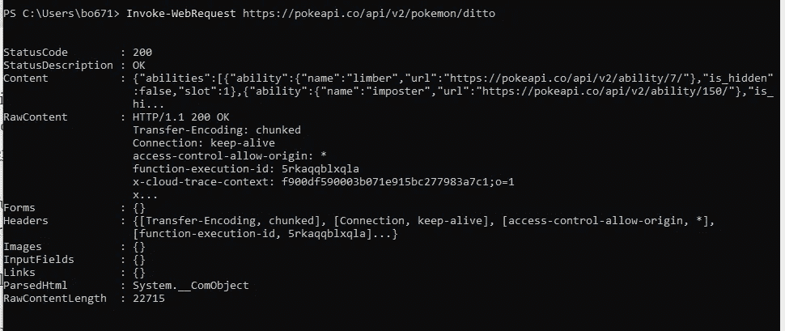
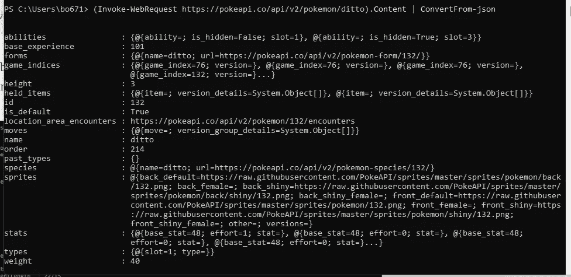
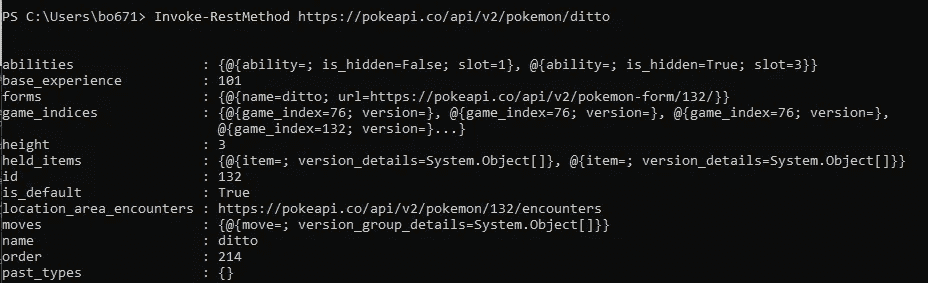
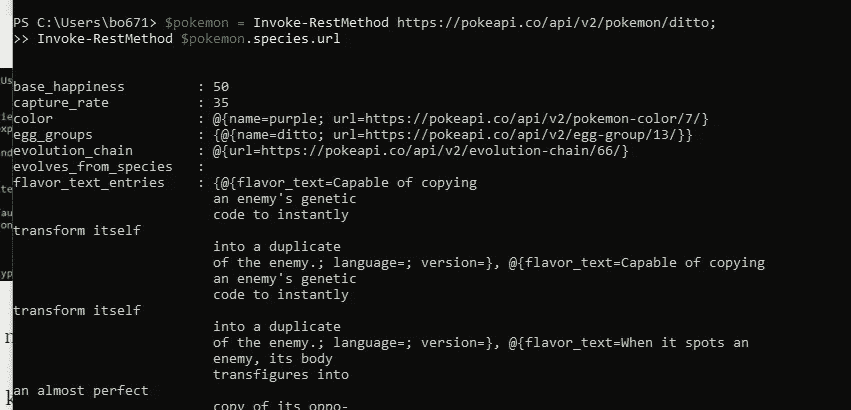

# 如何从 Powershell 调用 REST 方法

> 原文：<https://betterprogramming.pub/call-a-rest-method-from-powershell-595c3eb59056>

## 以口袋妖怪 API 为例


[照片](https://www.pexels.com/photo/high-angle-view-of-lying-down-on-grass-258330/)来自 Pexels 的 Pixabay

*免责声明:所有观点都是我自己的*

不久前，我写了一篇关于使用 Powershell 的便捷的`Invoke-WebRequest`方法并绕过证书检查的文章，但是还有另一个有用的 Powershell 方法与调用 web 方法相关:`Invoke-RestMethod`

完整的文档在这里是，但是它与`Invoke-WebRequest`非常相似，不同之处在于它默认显示的内容。

让我们看几个 PokeAPI 的例子。

当我在 PokeAPI 上运行`Invoke-WebRequest`时:

```
Invoke-WebRequest [https://pokeapi.co/api/v2/pokemon/ditto](https://pokeapi.co/api/v2/pokemon/ditto)
```

我得到了一个响应，其中包含许多关于请求的信息，但是没有多少来自请求的信息



我可以看到它嵌入在内容中，如果我不是太懒的话，我可以看到一个简单的方法把它提取出来并解析它。

```
(Invoke-WebRequest [https://pokeapi.co/api/v2/pokemon/ditto).Content](https://pokeapi.co/api/v2/pokemon/ditto).Content) | ConvertFrom-json
```



但我是一名程序员，我们天生懒惰。所以让我们用`Invoke-RestMethod`做同样的事情

```
Invoke-RestMethod [https://pokeapi.co/api/v2/pokemon/ditto](https://pokeapi.co/api/v2/pokemon/ditto)
```



现在，我可以立即解析并获得所有内容。

如果您想继续使用结果做进一步的探索，如检索口袋妖怪物种的所有细节，这种表示法很方便:

```
$pokemon = Invoke-RestMethod [https://pokeapi.co/api/v2/pokemon/ditto](https://pokeapi.co/api/v2/pokemon/ditto);
Invoke-RestMethod $pokemon.species.url;
```



现在您已经知道了——用 powershell 调用 rest 方法。powershelling 快乐！