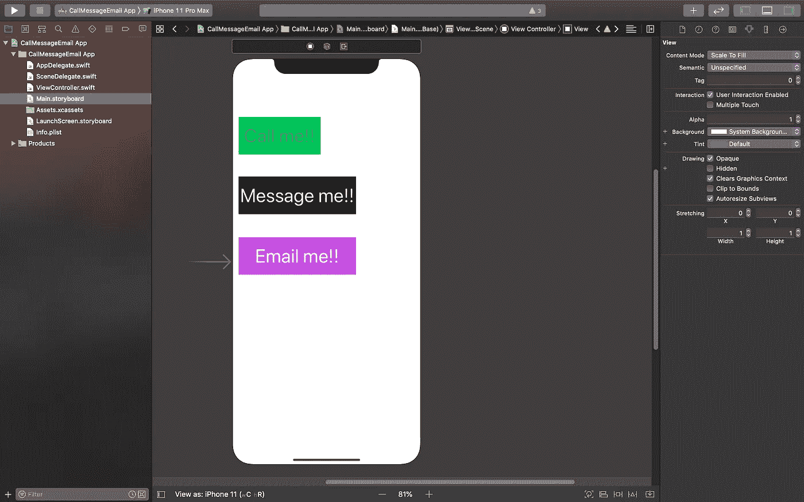
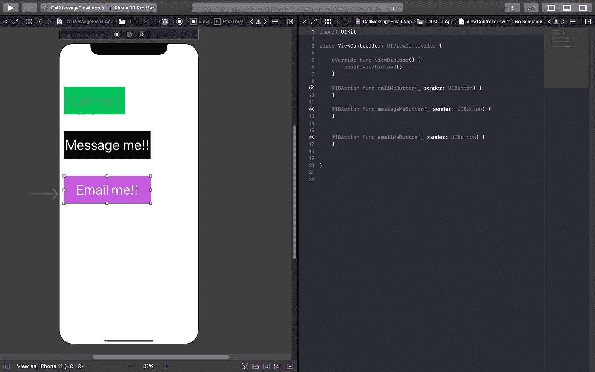
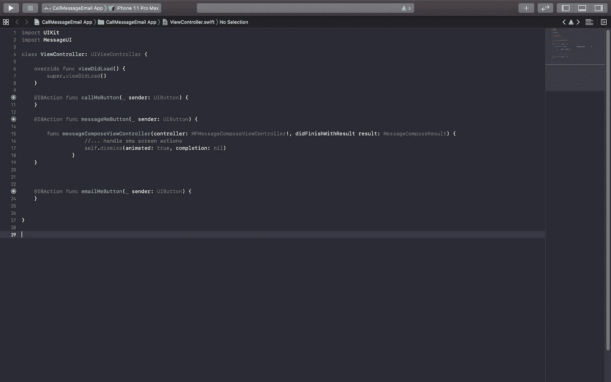
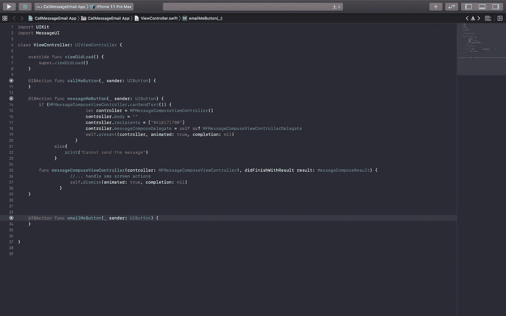
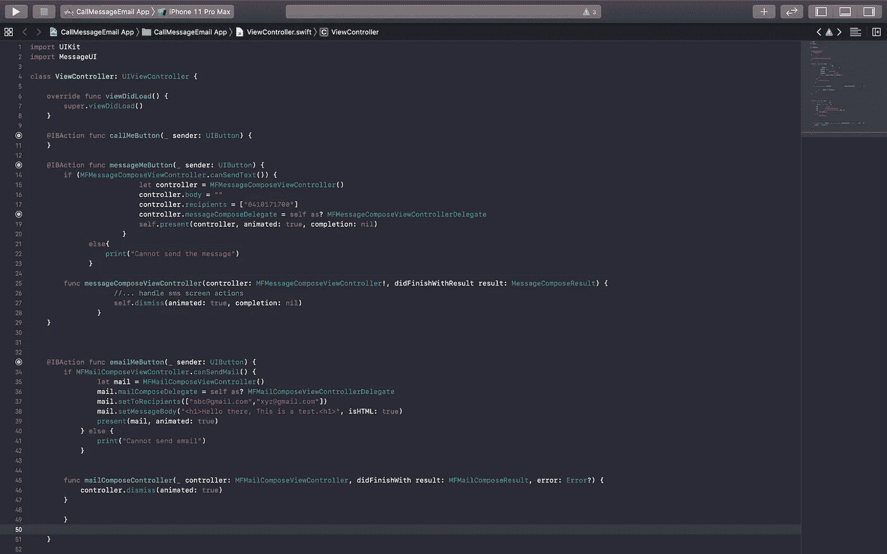
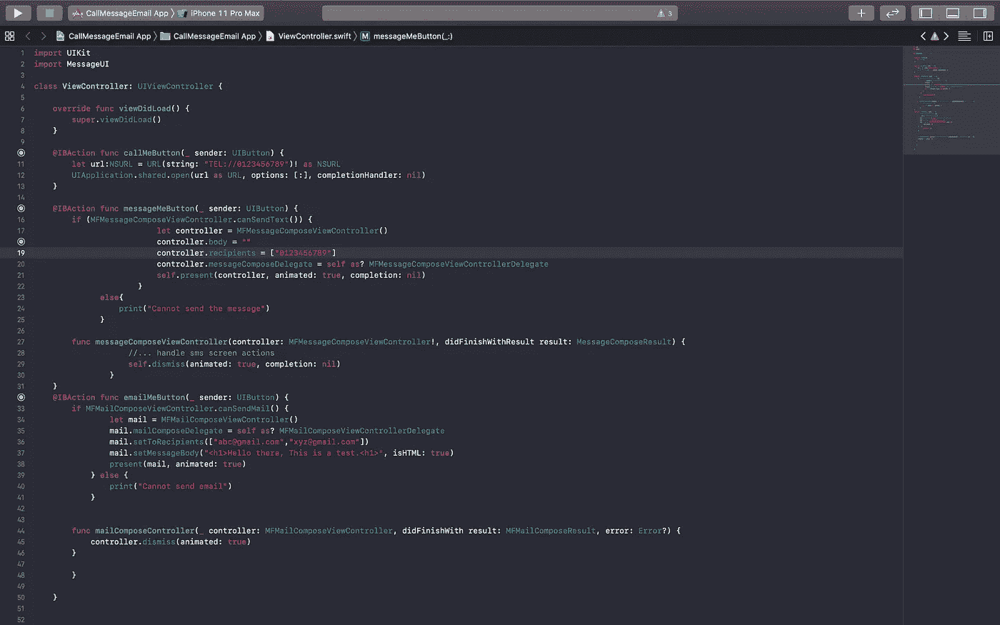

# 如何在 Swift 中打电话、发信息和发电子邮件

> 原文：<https://betterprogramming.pub/call-message-and-email-in-swift-a23df579e429>

## 在短短两行代码中


图片 src:[https://www.jobs.ie/job-talk/communication-skills/](https://www.jobs.ie/job-talk/communication-skills/)

iOS 开发者们好！今天我们将学习如何使用 Swift[打电话、发短信和发电子邮件。](https://swift.org/)

我假设您对 Swift 语法有基本的了解，并且在您的计算机上安装了 [Xcode](https://developer.apple.com/xcode/) 。我们开始吧！

# 项目设置

首先，让我们创建一个新项目，并将其命名为“CallMessageEmail App”创建新项目时，为“语言”选择“Swift”，为“UI 界面”选择“story board”——这样开发 iOS 应用更容易。

您的初始项目应该是这样的:


`*CallMessageEmail*` *App 的初始项目结构。*

现在，我们通过拖放按钮和标签来设计故事板。前往故事板，创建三个按钮。给它们贴上“打电话给我！!"，“给我发消息！!"和“给我发邮件！!"，或者其他你喜欢的。

您的设计应该基本上是这样的:



设计好初始线框后，我们必须拖入`ViewController.swift`文件。要拖动按钮，单击【控制】**T22 并拖动到`ViewController.swift`文件。在命名函数时，您可以选择任何您觉得舒服的名称。我会尽量把它们简化，即`callMeButton`、`messageMeButton`和`emailMeButton`。**

您的代码应该如下所示:



拖动按钮到 **ViewController.swift** 文件

现在，让我们运行应用程序。你可以看到按钮，但它还没有工作。我们将在下一步对每个按钮进行编码。

为了发送电子邮件或消息，我们必须导入`MessageUI`库。通过在文件顶部的`import UIKit`后键入`import MessageUI`来完成此操作。大家都知道 [UIKit](https://getuikit.com/) 是干什么用的。

发送信息和电子邮件会让生活变得更加轻松。

# 发送消息

导入`MessageUI`后，我们将首先编写发送消息的代码。看起来是这样的:

```
if (MFMessageComposeViewController.canSendText()) {let controller = MFMessageComposeViewController()controller.body = ""controller.recipients = ["1234567890"] //Here goes whom you wants to send the messagecontroller.messageComposeDelegate = self as? MFMessageComposeViewControllerDelegateself.present(controller, animated: true, completion: nil)}//This is just for testing purpose as when you run in the simulator, you cannot send the message.else{print("Cannot send the message")}func messageComposeViewController(controller:
MFMessageComposeViewController!, didFinishWithResult result: MessageComposeResult) {//Displaying the message screen with animation.self.dismiss(animated: true, completion: nil)}
```

迷茫？我会解释的。

从最后一个代码块`messageComposeViewController`开始。在这个代码块中，您将控制器定义为`MFMessageComposeViewController` ，结果定义为`MessageComposeResult`。这告诉代理用户已经完成了消息的编写。我们先写这个，因为如果我们不这样做，当你定义上面的函数时，它会显示一个错误。

到目前为止，您的代码应该如下所示:



在 messageMeButton 内添加**messageComposeViewController**函数后。

现在，我们添加我们想要包含在消息正文中的内容，以及收件人的电话号码。

代码是这样的:

```
if (MFMessageComposeViewController.canSendText()) { //Checking whether we can send the message.let controller = MFMessageComposeViewController()controller.body = ""controller.recipients = ["0410171700"]controller.messageComposeDelegate = self as? MFMessageComposeViewControllerDelegateself.present(controller, animated: true, completion: nil)}//This is just for testing because we cannot send the message from simulator.else{print("Cannot send the message")}
```

这段代码是如何运行的？首先，我们检查是否可以将消息发送给收件人。这只是为了测试。如果你喜欢，你可以跳过它。

然后，我们使用名为`controller`的变量定义消息控制器:

```
let controller = MFMessageComposeViewController()
```

在定义了控制器之后，我们定义了消息体。默认情况下，它应该为空。如果您愿意，您可以包含自动填充的正文。然而，在这个例子中我们不会这样做。

```
controller.body = "" //Defining the body of the message
```

在定义消息正文时，我们现在包括了消息接收者的电话号码。请注意，收件人的号码是一个数组，这意味着您可以一次添加多个号码。

```
controller.recipients = ["012345678","0987654321"]
```

现在，我们要将我们从控制器对象到`MFMessageComposeViewControllerDelegate` 的`messageComposeDelegate`定义为`self`。这是将代表分配给`self`。

```
controller.messageComposeDelegate = self as? MFMessageComposeViewControllerDelegate
```

当我们点击 MessageMe 按钮时，控制器将以动画和完成方式呈现在我们的视图中，如`nil`。

```
self.present(controller, animated: true, completion: nil)
```

发送消息的完整代码是:



发送消息的完整代码。

# 发送电子邮件

接下来，发邮件。首先看一下完整的代码，然后我们将检查每一部分。

```
if MFMailComposeViewController.canSendMail() {let mail = MFMailComposeViewController()mail.mailComposeDelegate = self as? MFMailComposeViewControllerDelegatemail.setToRecipients(["abc@gmail.com","xyz@gmail.com"])mail.setMessageBody("<h1>Hello there, This is a test.<h1>", isHTML: true)present(mail, animated: true)} else {print("Cannot send email")}func mailComposeController(_ controller: MFMailComposeViewController, didFinishWith result: MFMailComposeResult, error: Error?) {controller.dismiss(animated: true)}
```

就像我们发送消息一样，我们从定义`sendEmail`按钮下的`MFMailComposeViewController` 开始。代码是这样的:

```
func mailComposeController(_ controller:MFMailComposeViewController, didFinishWith result: MFMailComposeResult, error: Error?) {controller.dismiss(animated: true)}
```

和发送消息相比有一点小变化。如果您的设备没有连接到互联网，额外的代码定义了错误，这超出了本教程的范围。除此之外，它应该看起来很熟悉。

第二步是定义邮件正文和收件人。

代码类似于我们发送消息的代码。在一封电子邮件中，您可以添加多个收件人。您能看到的唯一微小的变化是，在定义了邮件正文之后，我们必须将`isHTML`定义为`true`。而且你可以在主体内部编写纯 HTML 代码，让它看起来更有吸引力，这个你可以自己试试。

现在代码看起来像这样:



完成发送电子邮件和消息。

# 打电话

最后，对我来说，最有趣的部分，是制作一个工作的呼叫按钮。

完整的代码在下面——它短小精悍，这也是我最喜欢它的原因。我用其他编程语言制作过呼叫按钮，花费的时间要长得多，但在 Swift 中，只需要两行代码。

```
let url:NSURL = URL(string: "TEL://**0123456789**")! as NSURLUIApplication.shared.open(url as URL, options: [:], completionHandler: nil)
```

第一行定义了您的电话号码的 URL 字符串。使用`url: NSURL` 是为了表示桥接到`URL`(苹果文档中定义的)的资源的位置。在`URL`字符串中，定义一个字符串`TEL://0123456789`，它看起来像一个标准的 URL。我们必须将`URL`字符串展开为`NSURL`，以便 Swift 将其视为 URL。

下面的代码是打开一个小盒子，它是一个电话号码或取消它的提示。

完整的代码如下所示:



通话、发送信息和电子邮件的完整代码

# 结论

现在，您可以给朋友打电话、发电子邮件和发信息了！

祝你愉快！并且一直保持学习 ***、*** 会在很多领域帮到你。