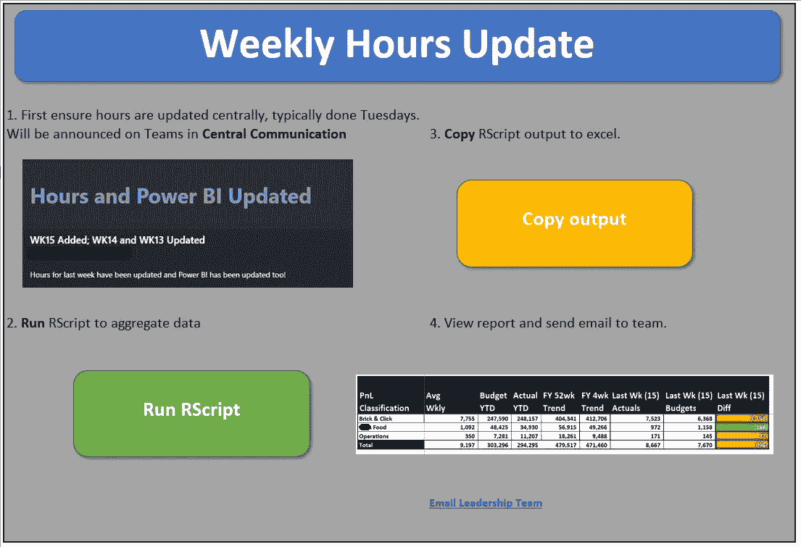
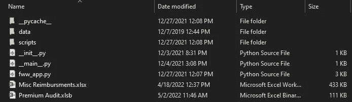
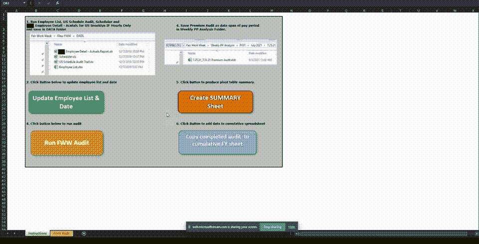

# 从 Excel 调用 Python 和 R 脚本

> 原文：<https://betterprogramming.pub/call-python-and-r-scripts-from-excel-76d1c1c6fb1a>

## 了解如何将 Python 或 R 数据处理任务集成到 excel 中


照片由 [JJ 英](https://unsplash.com/@jjying?utm_source=medium&utm_medium=referral)在 [Unsplash](https://unsplash.com?utm_source=medium&utm_medium=referral)

# 序文

我喜欢用 Python 或 r 来争论、管理和处理数据。

然而，我的雇主在 Excel 中做大多数事情。我想把我的 Python 或 R 代码集成到我的 Excel 文档中。

此外，我需要将结果直接输出到 Excel 工作簿中。

我发现我可以用最少的 Visual Basic for Applications (VBA)脚本来实现这一点，并将我的 Python 或 R 脚本重新安排到应用程序中。

如果你想用 Python 和 R 简化你的 Excel 工作流程，那么本教程就是为你准备的！

# 概观

在我的工作中，所有东西都分散在一堆不同的 Excel 表格中。有些是不同软件程序输出的(我每周都做)，有些是公司自己预处理的。

当处理这些文档时，我要么尝试自动化以前的手动过程，要么改进现有的 Excel 工作簿，该工作簿可以受益于 Python 或 r 的一些数据处理。

我发现最适合我的操作顺序如下:

*   **第一步——探索性数据分析:**探索 Jupyter 笔记本或 R Markdown 中的数据
*   **步骤 2——创建函数:**将代码分组到逻辑函数中。
*   **第三步——分离脚本:**将函数分成不同的脚本，用于代码中的每个流程。
*   **步骤 4——创建应用程序:**创建一个主脚本，从每个特定于流程的脚本中导入函数。
*   **步骤 5 —命令行应用:**通过从命令行调用确保应用正常工作。
*   **步骤 6 — VBA 运行脚本:**编写 VBA 脚本，从 Excel 调用应用程序，并确保输出直接填充到 Excel 工作簿中。
*   **第 7 步——检查再现性:**确保我或其他人可以每周重复这个过程，以提高效率和简化工作流程。



带有运行 Rscript 的宏按钮的 Excel 工作簿示例

# 探索性数据分析

EDA 是我探索数据并提出一系列问题的过程的一部分。其中一些可能是:

*每列是哪种数据类型？*

*什么是数据集维度？*

我需要在导入中合并任何列吗？

我需要删除任何列吗？

*有哪些描述性统计？*

这有助于我在开始编码之前掌握数据。我的下一步通常是勾勒出我试图实现的确切过程的简要轮廓，然后开始编码。编码完成后，就该开始组织流程了。

# 功能

一旦我完成了编码，我就可以从头到尾运行笔记本并生成可重复的结果，然后我开始将代码重构为函数。我给这些函数起了容易辨认的名字，并开始考虑它们应该属于哪个组。

# 剧本

在我模块化我的代码之后，我开始把它们分成几个脚本文件。我确保每个脚本都有一个特定于其在整个工作流中的独特过程的逻辑标题。有时我会有一个通用脚本，其中包含在整个项目中重用的函数。完成后，我将所有脚本移动到同一个目录中，这样我可以在构建主应用程序脚本时导入它们。

下面是我的一个项目目录的结构示例:

```
── FWW <- Top-level directory
├── data
│  ├── Employee List.xls
│  ├── Actuals Report.xls
│  ├── Premium Audit.xls
│  ├── Scheduler.xls
│  ├── Schedule Audit Trail.xls
├── scripts
│  ├── __init__.py
│  ├── cleaning_and_merges.py
│  ├── data_import.py
│  ├── feature_engineering.py
│  ├── format_final_df.py
├── __init__.py
├── __main__.py
├── fww_app.py
└── Premium Audit.xlsb <- Macros
```

# 应用

构建应用程序脚本对我来说是一个激动人心的时刻。主要是因为我可以在一个文件中查看我的项目的所有逻辑，而不是查看多个笔记本或脚本。通常情况下，它都可以显示在一个屏幕上。这就是给每个脚本和函数起一个有意义的名字的重要性。

我通常在每一节之前都有一个注释来解释它的目的。此外，如果我现在需要修改任何代码，我可以简单地进入该脚本，进行编辑，然后将该脚本重新导入到应用程序文件中，并重新运行。也就是说，该目录还需要进行组织，以便您可以轻松地从应用程序文件中调用脚本。



Python 项目目录，脚本在一个文件夹中，数据在另一个文件夹中，Excel 工作簿/Python 应用程序在主文件夹中。

以下是导入所有流程特定脚本的最终应用程序文件的一些示例:

我实现的项目的 Python 应用程序文件。

我最近实施的一个项目的 r 应用程序。

下一步是确保应用程序准备好从命令行执行。

# 命令行

一旦应用程序文件启动并运行，我希望能够从命令行运行它。我最不想做的事情就是打开 Visual Studio 代码或 R Studio，并在每次需要运行程序时重新运行该文件。

通常这些程序每周运行一次，因此需要高效且可重复。在这里，您可能需要将 Python 或 R 路径添加到您的环境变量中。

这篇[文章](https://www.educative.io/edpresso/how-to-add-python-to-path-variable-in-windows)可以帮助你在 Windows 上设置路径，我在 Mac 上没有遇到过这些命令的问题。一旦设置完毕，从命令行调用 Python 或 R 就可以从该特定目录中完成，如下所示:

```
python -m fww.py
Rscript hours_update_app.R
```

有时应用程序可能需要用户的输入。在这种情况下，将会生成适当的提示。一旦命令行正常工作，我就可以从 Excel 中调用程序了。

*注意:*对于基于 Python 的项目，你需要一个`__main__.py`文件。这是一个简单的文件，它导入主应用程序并执行运行命令。

__main__。py 运行 Python 应用程序

# VBA

通常，我有一个 excel 工作簿，其中我创建了一个说明选项卡，列出了流程的正确步骤。通常，我将形状作为按钮，并将宏或宏串绑定到它们上面，这将触发应用程序和 VBA 脚本。

一旦这是工作，我确保通过一个额外的简单的 VBA 脚本输出复制到正确的工作簿。我喜欢使用 VBA 来自动化繁琐的任务，如导入、调用脚本和打开/关闭笔记本，但我更喜欢用 Python 或 r 来处理数据

从 Excel 调用的 Python VBA 脚本

从 Excel 调用的 VBA 脚本

R 脚本需要更多的步骤才能工作，这篇 [StackOverflow 帖子](https://stackoverflow.com/questions/11597626/running-r-scripts-from-vba)帮助了我。

# 再现性

在这一点上，项目已经完成，我只需要确保它的可重复性。有时，这可能意味着更改 VBA 脚本的一些方面，以便其他人可以使用它，例如 Python 或 r 的可执行文件的位置。此外，定期检查我使用的报告是否仍然是相同的格式。

请看下面最终版本的 gif 图片:



从 Excel 宏触发的 Python 项目的 Gif

# 结论

就是这样！感谢您加入我的旅程，学习如何将 Python 和 R 集成到 Excel 是一次有趣的经历。有些语言更适合不同的任务，这样使用它们是有意义的。

然而，将它们整合在一起，可以最大限度地提高效率并简化您的工作流程。