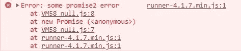
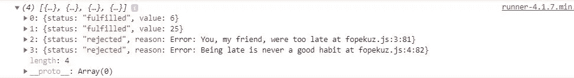

# JavaScript 中的回调与承诺

> 原文：<https://betterprogramming.pub/callbacks-vs-promises-in-javascript-1f074e93a3b5>

## 这种区别可能会令人困惑，让我们来澄清一下


罗伯特·鲁杰罗在 [Unsplash](https://unsplash.com/s/photos/confusion?utm_source=unsplash&utm_medium=referral&utm_content=creditCopyText) 上的照片

如果你是 JavaScript 新手，并且很难理解承诺是如何工作的，希望这篇文章能帮助你更清楚地理解它们。

也就是说，这篇文章是针对那些对承诺有点不确定的人。

这篇文章不会讨论如何使用 [async/await](https://javascript.info/async-await) 来执行承诺(尽管它们在功能上是一样的——只是 async/await 在大多数情况下更符合语法)。

# 什么

承诺实际上已经过时了一段时间，甚至在 JavaScript 出现之前。比如 promises 变成原生之前实现这个模式的两个库是 [Q](https://github.com/kriskowal/q) 和 [when](https://github.com/cujojs/when) 。

那么什么是承诺呢？承诺是 JavaScript 对象，[表示异步操作](https://developer.mozilla.org/en-US/docs/Web/JavaScript/Reference/Global_Objects/Promise)的最终完成或失败。您可以通过使用回调方法或使用承诺执行异步操作来获得结果。但是两者之间有一些细微的区别。

# 回访和承诺的主要区别

两者之间的一个关键区别是，当使用回调方法时，我们通常只是将回调传递给一个函数，该函数在完成后被调用，以获得结果。然而，在 promises 中，您在返回的 promise 对象上附加回调。

回访:

承诺:

# 许诺对象

我们刚刚提到了 promise 对象，这很好，因为它们是 JavaScript 中构成承诺的核心。

所以问题是*为什么*我们需要 JavaScript 中的承诺？

为了更好地回答这个问题，我们必须问为什么使用回调方法对于大多数 JavaScript 开发人员来说还不够。

# 回调地狱

使用回调方法的一个常见问题是，当我们最终不得不一次执行多个异步操作时，我们很容易以所谓的 [*回调地狱*](https://stackoverflow.com/questions/4234619/how-to-avoid-long-nesting-of-asynchronous-functions-in-node-js) *，*结束，这可能会成为一场噩梦，因为它会导致难以管理和难以阅读的代码。换句话说，这是每个开发人员最糟糕的噩梦。

这里有一个例子:

您可以在代码片段中直观地看到一些笨拙的形状正在形成。仅仅从三个异步 API 调用开始，回调地狱就开始了与通常的自顶向下相反的下沉。

有了承诺，这不再是一个问题，因为我们可以通过链接`.then`方法将代码保存在第一个处理程序的根:

在回调代码片段中，如果我们嵌套得再深一些，事情就会变得很糟糕，很难管理。

# 回调地狱出现的问题

只要看看我们之前代表这个回调地狱的代码片段，我们就可以得出从中出现的一系列危险问题，这些问题足以证明承诺是对语言的一个很好的补充:

## 阅读变得越来越困难

代码开始向两个方向移动(从上到下，然后从左到右)

## 管理变得越来越困难

*   当代码被嵌套得更深时，还不清楚发生了什么
*   我们必须始终确保不会意外地声明与外部作用域中已经声明的变量同名的变量(这被称为 [*隐藏*](https://stackoverflow.com/questions/11901427/an-example-of-variable-shadowing-in-javascript) )
*   我们必须考虑三个不同地点的三个不同的错误
*   我们甚至不得不重命名每个错误，以确保我们不会掩盖它上面的错误。如果我们最终在这一系列操作中做了额外的请求，我们必须找到额外的变量名，它们不会与上面的作用域中的错误冲突。

如果我们仔细观察这些例子，我们会注意到这些问题中的大部分都是通过能够用`.then`链接承诺来解决的，我们接下来会谈到这一点。

# 承诺链

当我们需要执行一系列异步任务时，承诺链变得非常有用。每个被链接的任务只能在前一个任务完成后开始，由链中的`.then`控制。

这些`.then`块是在内部设置的，因此它们允许回调函数返回一个承诺，该承诺随后被应用到链中的每个`.then`。

除了来自`.catch`区块的拒绝承诺之外，你从`.then`返回的任何东西最终都变成了已解决的承诺。

这里有一个简短的例子:

# 承诺方法

JavaScript 中的 promise 构造函数定义了几个静态方法，可用于从 promise 中检索一个或多个结果:

## 承诺。所有

当您想要累积一批异步操作并最终以数组的形式接收它们的每个值时，满足这个目标的 promise 方法之一是`Promise.all`。

`Promise.all`当所有操作都成功结束时，收集操作结果。这类似于`Promise.allSettled` ——只是在这里，如果这些操作中至少有一个以失败告终，那么 promise 会出错拒绝。这最终会在承诺链的`.catch`块中结束。

承诺拒绝可能发生在任何时候——从操作开始到结束。如果拒绝发生在所有结果完成之前，那么发生的情况是那些没有完成的结果将终止中止，并且永远不会完成。换句话说，这是一个孤注一掷的交易。

这里有一个简单的代码示例，其中的`Promise.all`方法使用了承诺`getFrogs`和`getLizards`。在将结果存储到本地存储之前，它在`.then`处理程序中以数组的形式检索结果:

## 承诺.比赛

每当 iterable 中的一个承诺用该承诺的值或原因解析或拒绝时，该方法返回一个履行或拒绝的承诺。

下面是`promise1`和`promise2`以及`Promise.race`方法之间的一个简单例子:

这将产生以下结果:



返回值最终是承诺拒绝，因为另一个承诺延迟了 200 毫秒。

## 承诺。都解决了

`Promise.allSettled`方法最终有点类似于`Promise.all`共享一个相似的目标，除了当一个承诺失败时，`Promise.allSettled`不是立即拒绝一个错误，而是返回一个承诺，该承诺最终总是在所有给定的承诺已经解决或拒绝之后解决，将结果累积到一个数组中，其中每个项目表示它们的承诺操作的结果。

这意味着您将总是以数组数据类型结束。下面是一个实际例子:



## 承诺。任何

`Promise.any`是添加到`Promise`建造商的提案，目前处于 TC39 流程的[阶段 3。](https://github.com/tc39/proposal-promise-any)

`Promise.any`被提议做的是接受一个可重复的承诺，并试图返回一个从第一个被履行或被拒绝的给定承诺开始履行的承诺，如果所有给定的承诺都被拒绝[(来源](https://github.com/tc39/proposal-promise-any))。

这意味着，如果有一个操作消耗了 15 个承诺，其中 14 个失败了，而一个被解决了，那么`Promise.any`的结果就成为解决的承诺的值:

点击阅读更多相关信息[。](https://github.com/tc39/proposal-promise-any)

# 成功/错误处理

很高兴知道可以使用这些变体来处理成功或失败的承诺操作:

## 变体 1:

```
add(5, 5).then(
  function success(result) {
    return result
  },
  function error(error) {
    console.error(error)
  },
)
```

## 变体 2:

```
add(5, 5)
  .then(function success(result) {
    return result
  })
  .catch(function(error) {
    console.error(error)
  })
```

然而，这两个例子并不完全相同。在变体 2 中，如果我们试图在 resolve 处理程序中抛出一个错误，那么我们将能够在`.catch`块中检索捕获到的错误:

```
add(5, 5)
  .then(function success(result) {
    throw new Error("You aren't getting passed me")
  })
  .catch(function(error) {
    *// The error ends up here*
  })
```

然而，在变体 1 中，如果我们试图在 resolve 处理程序中抛出一个错误，我们将无法捕获这个错误:

# 结论

本文到此结束。我希望你发现这是有价值的。以后多多关照！