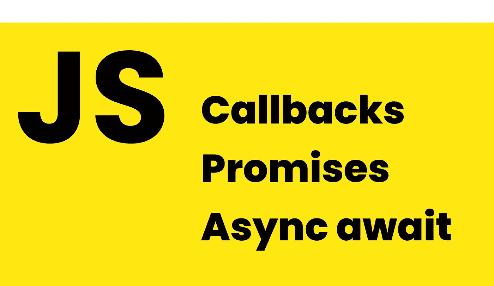
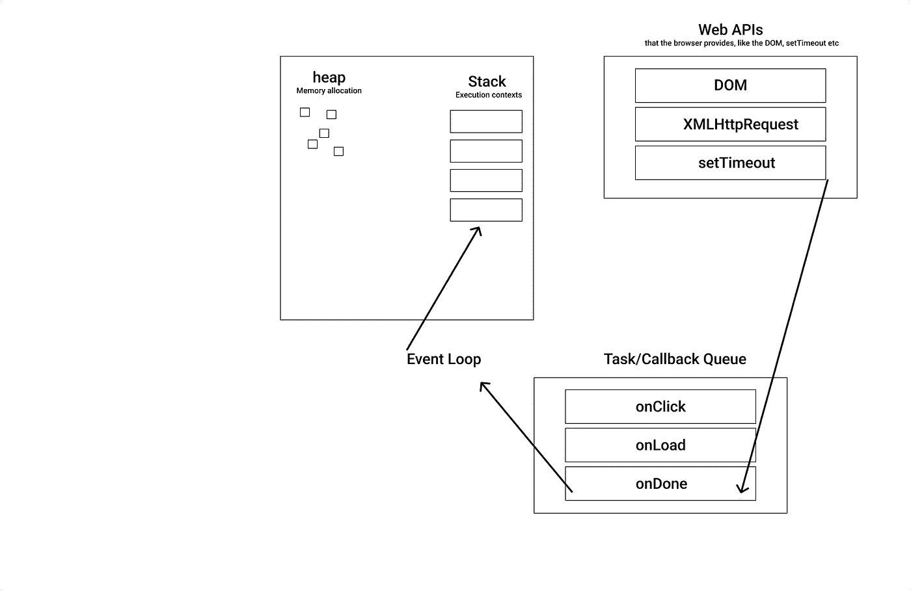

# 回调 vs .承诺 vs .异步 Await:逐步指南

> 原文：<https://betterprogramming.pub/callbacks-vs-promises-vs-async-await-a-step-by-step-guide-f93d13447604>

## 引擎盖下也有点。



我发现这令人困惑，我想你可能也是，比如回调 vs 承诺 vs 异步，用什么呢？这到底是什么？每一个是如何工作的？它是如何在引擎盖下工作的？这就是我想在这个帖子里一劳永逸地解释的。

# 复试

如果我们应该 100%正确地知道回调是什么，那么回调就是我们传递给另一个接受另一个函数作为参数的函数。并且我们传入的函数可以在将来的任何时候被我们传入的函数调用。然后它被称为`higher order function`，接受一个函数作为参数。

这是一个回调:

```
function someFunctionAcceptingCallback(number, callback){
return callback(number + 10)
}
function divide(answer) {
return answer / 2}someFunctionAcceptingCallback(5, divide) // 7.5 if we console.log it
```

另一个很好的例子是 javascript 中的`addEventListener`。

```
document.getElementById('addUser').addEventListener('click', function() {// Do something})
```

所以这里发生的是，`addEventListener`允许我们等待执行，直到稍后的某个特定时刻，在这种情况下，当点击`addUser`按钮时，只有这时我们的`callback`函数才会被执行。这是一个异步事件。

但是它是如何工作的呢？..Javascript 是单线程的，这意味着它不能同时执行多个代码，javascript 有一个`call stack`，它从上到下一次运行一个任务。

所以当我们添加我们的`addEventListener`时，我们并不真正调用 javascript 本地方法，我们调用 WEB API 中的方法。我们可以把 WEB API 想象成另一个线程。

所以 WEB API `addEventListener`是一个 DOM 事件，它等待我们的按钮被点击，然后当它被点击时，它将我们传递的`callback`函数作为参数，并将其推送到一个叫做`task queue/callback queue`的东西，然后一个叫做`event loop`的东西拾取回调函数并将其推送到`call stack`并执行，但只有当回调函数是`task queue/callback queue`中的第一个函数时。我做了一个直观的例子来说明它是如何工作的:



使用回调函数的一个完美例子是什么？..你猜对了，网络请求。

我们想要做的是发出一个网络请求，在我们得到服务器的响应后，我们的回调函数被调用。

但是由于 javascript 是单线程的，所以在 ec6 中引入 promises 之前，无法在 javascript 中实现这一点。

如果我们在不使用任何 WEB API 的情况下调用网络请求，会发生什么，我们的代码会被阻塞，在我们的网络请求完成之前,`call stack`不会执行任何代码。这被称为代码阻塞，如果我们的代码是同步的并且需要很长时间来执行，那么我们的网页将被冻结，没有 javascript 代码将被执行，因为我们直接在调用堆栈上调用网络请求，它阻塞了其余的 javascript 代码的执行。

所以我们解决这个问题的方法是利用另一个叫做`XMLHttpRequest`的 WEB API。

`XMLHttpRequest`是一个 WEB API，我们传入我们的回调函数，一旦`XMLHttpRequest`完成，它就把它推给`task queue/callback queue`,`event loop`会拾取它，并把它推给`call stack`让它执行我们的回调函数。

这里有一个例子:

没事吧。我们可以通过使用 WEB API 使网络请求异步，并传递回调函数，一旦我们从网络请求得到响应，它就应该执行这些函数。

*军规*

## 回调地狱

如果我们想按顺序发出网络请求，那么第一个请求，然后第二个请求，依此类推，就会变得非常混乱，让我来演示一下:

它很难阅读，因为大脑习惯于按顺序思考，它容易出错，而且可能变得更糟，我们还需要检查每个请求中的错误，所以最终的代码会更长，可读性更差，因此更容易出错，更难维护。

这是怎么解决的？有一些简单的方法可以让它变得更好，也有很多库可以用来逃离回调地狱，让代码变得更好。

现在让我们来谈谈承诺，它们能做什么以及如何工作。

# 承诺

那什么是承诺呢？

在 promises 被引入原生 javascript 之前，我们需要使用其他方法和库来处理异步编程，根本没有办法使用普通的原生 javascript。

当承诺被引入时，对 javascript 开发人员来说这是一件大事，现在你可以轻松地编写异步网络请求，避免回调地狱。

之前我们讨论过`XMLHttpRequest`是一个 WEB API，因为 javascript 是单线程的，为了避免代码阻塞，我们必须将我们的异步函数传递给`call stack`以外的其他东西。

但是承诺不使用任何`callback queue`，那么如果是这样的话，承诺用什么来进行异步呢？

## 微队列

这是在 ec6 中引入的，基本上，它就像`micro queue`一样，但对于承诺，它有一点不同。`micro queue`的优先级高于`callback queue`，因此，例如，如果我们运行以下代码:

然后，即使我们的`setTimeout`将在 0 秒后直接运行回调，并且承诺也设置为这样做，这是即时的，承诺将首先运行其回调，因为它使用了`micro queue`，并且其优先级高于`setTimout` WEB API 方法正在使用的`callback queue`。

让我们深入研究一下承诺，承诺有 3 种状态，`pending` `fulfilled` `rejected.`

`pending`表示承诺尚未被解决或拒绝，在 API 请求的上下文中，当我们发出请求而服务器没有发回任何响应时，承诺将处于待定状态。

`fulfilled`表示承诺已经解决，在 API 请求的上下文中，当我们得到成功的响应时，承诺将会解决。

`rejected`表示我们的承诺已被拒绝，在 API 请求的上下文中，当我们得到 404 响应时，承诺将被拒绝，我们可以`catch`错误。

例如，我们可以创建一个超时为 3 秒的新承诺，3 秒过后，我们可以解析该承诺。这意味着我们可以在用纯本地 JavaScript 完成一些事情之后再做一些事情，而不需要使用异步执行的库。这适用于任何执行，我们不知道什么时候会得到响应。

在承诺被解决后，我们可以做`.then()`并且我们在`.then()`中拥有的任何东西都只会在承诺被解决时被执行。为了演示这一点，让我们做一个承诺，该承诺在 3 秒钟后被解析，并向 resolve 传递一个字符串:

我们也可以在承诺中包含一个`fetch`:

`Fetch`也是基于承诺的，所以当我们在`fetch`上调用`.then()`时，我们真正做的是等待，直到服务器解析承诺/返回响应。

# 链接

除了回调地狱，我们可以用不同的方式链接承诺，例如，如果我们想在第一个请求解决后再提出另一个请求，我们可以这样做:

这里我取了一个 todo，然后我们将响应转换为 JSON，然后我们解析它，然后我们对`myPromise`执行`.then()`，这将是承诺的解析值。然后我们用我们的 JSON 数据调用一个函数`doSomething()`，然后我们记录我们完成了。

## 承诺。所有

承诺有一个叫做`Promise.all`的东西，它允许我们等待任意数量的承诺被解析，然后执行一个代码块。这可能非常非常有用，例如，如果我们需要调用一组请求并等待所有请求完成，那么我们可以用几行代码来完成，如下所示:

# 异步等待

所以基本上，如果我们可以编写看起来连续但实际上完全基于承诺的代码会怎么样呢？正如我们看到的承诺，在它解决后，我们需要打电话给`.then()`，它并不像我们希望的那样是连续的。

这就是 async-await 的意义所在。

Async await 是一种编写异步代码的新方法，基本上是为了简化我们如何编写链式承诺而创建的。

Async await 是非阻塞的，就像我们期望的那样，因为它是异步的，每个 async-await 都返回一个带有其已解决状态的承诺。

对于承诺链，我们是这样做的:

编写同步异步代码的最佳方式如下所示:

这是 async-await 背后的思想。

所以编写 async-await 的正确方法是这样的:

我们不需要做`fetchData().then(resolvedData)...`，我们只需要做`const data = await fetchData()`，而`data`将保存解析的数据，直到`fetchData()`解析了它的承诺，下一行才会执行。

需要记住的一点是，当我们有一个异步函数时，这基本上是一个承诺，事实上，整个函数就是一个承诺。我们做的和异步函数解析承诺时一样，所以我们能做的是`asyncFunction.then()`在函数解析了它的承诺后执行代码，这发生在我们所有的`awaits`都解析了并且我们从函数返回之后。

因此，在我们的`asyncFunc()`中会发生的是，首先它会发出`fetchData()`请求，然后等待，直到服务器解析出承诺。然后当它解析时，它将调用`fetchUserData()`请求，并等待直到承诺从服务器解析。然后，它才会更新`userState`。

如果我们想调用这个函数，并等待它完成所有这些步骤，我们只需做`asyncFunc().then()`，就像我们对我们的承诺所做的一样，因为 async 是一个承诺，当我们从函数返回一些东西时，它基本上与我们解析一个承诺相同。

# 结论

现在，我没有提到所有的内容，实际上，有很多内容我没有提到，比如如何捕捉错误、优化技术等等。但我认为这会让你对这三者之间的区别有一个基本的了解，它们是如何工作的，你如何使用它们。

你可能也会喜欢:

[](https://medium.com/@anton.franzen/ec6-magic-you-wish-you-knew-8494da448866) [## 你希望知道的魔法

### 一些简洁的 ec6 技巧可以加快编码速度

medium.com](https://medium.com/@anton.franzen/ec6-magic-you-wish-you-knew-8494da448866) [](/boost-the-seo-of-your-websites-with-next-js-2ea29f5ae67) [## 用 Next.js 提升你网站的搜索引擎优化

### 如何添加关键字、元标签等

better 编程. pub](/boost-the-seo-of-your-websites-with-next-js-2ea29f5ae67) [](https://medium.com/mlearning-ai/machine-learning-engineering-is-hard-985ff23cb21f) [## 机器学习工程很难

### 人们让这看起来很容易，但实际上很难…

medium.com](https://medium.com/mlearning-ai/machine-learning-engineering-is-hard-985ff23cb21f) 

嘿，我叫安东👋，我是来自瑞典的自由职业前端开发人员。

任何前端工作或者偏远岗位随时联系我。