# 数据隐私库可以有 API 吗？是啊！

> 原文：<https://betterprogramming.pub/can-data-privacy-vaults-have-apis-yes-3a62a2fae7ad>

## 如果您处理敏感数据，使用数据隐私库是保护数据而不牺牲数据效用的一个好方法

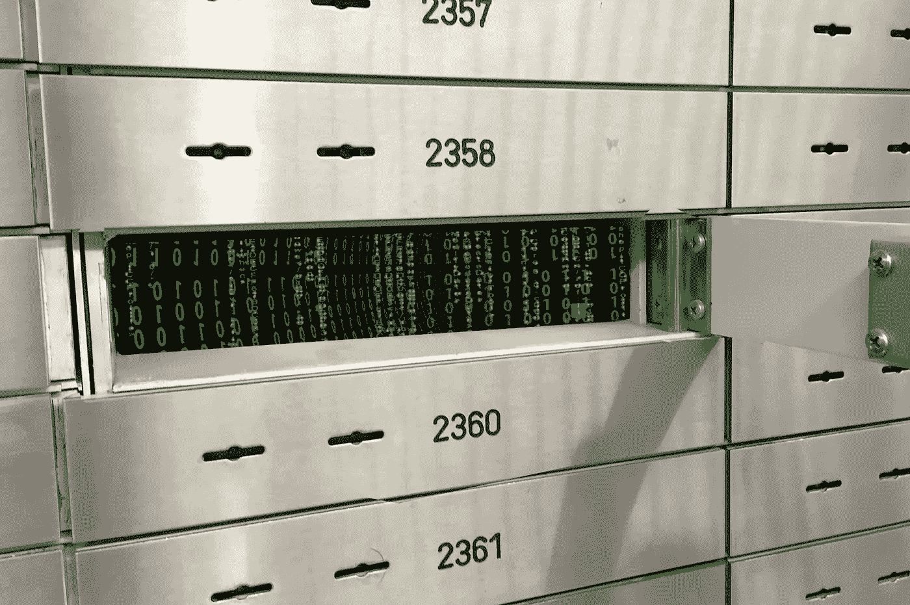

在我职业生涯的早期，我们整个开发团队自愿帮助报告团队验证他们服务的一些主要更新。我们中没有人对暂停当前的优先事项感到兴奋，但我们都意识到这是正确的事情。

在我运行我的第一个报告后，似乎连接到应用程序的数据可能是生产数据的副本。通过运行基于我自己的工作相关费用的报告，我能够很快验证这个假设。

这一发现让我意识到，侵犯消费者隐私的行为出乎意料地发生了，这可能为真实数据泄露到组织外部铺平了道路，因为它存在于一个访问更加开放且不受严密监控的环境中。

我知道报告团队不应该复制生产数据，但我也记得他们承受着提供成功解决方案的巨大压力。显然，创建测试数据或混淆个人身份信息(PII)所需的时间没有包括在最初的项目计划中。

几年后，我仍然看到一些公司的问题，以及他们使用敏感数据作为“测试数据”这让我想知道像谷歌、苹果和网飞这样的科技巨头是如何处理敏感数据的。

# 数据保密库的价值

报告团队选择的更大问题是，他们用于测试的敏感数据很容易复制到另一个数据源上。虽然我浏览报告系统的时间让我大开眼界，但这一判断失误可能会导致更糟糕的后果。

需要遵守有关个人身份信息(PII)、支付卡信息(PCI)和医疗记录的法规的公司已经熟悉了有关敏感数据的隔离、加密和利用的指导原则和标准。根据我的经验，这些实现主要集中在数据库层。

数据保密库的概念不仅仅是一个数据库。通过对静态信息进行加密来保护数据，并通过允许对加密数据进行某些操作的加密技术来保持数据的可用性。所有这些都被打包成基于云的服务产品。

Data Privacy Vault 服务提供商提供以下优势:

*   安全—隐私已经作为服务设计的一部分进行处理
*   隔离—每个客户都在自己的空间工作，出入受限
*   存储—高可用性、任务关键型，具有类似 SQL 的访问能力
*   管理—精细的访问控制列表和策略
*   使用—数据只能以保护隐私的方式使用

为了理解这种方法是如何工作的，让我们关注一个常见的用例。

# 一个示例用例

去年，我和妻子建了我们的新家，这对我们俩来说都是一次新的经历。从我们签署新建筑合同的那天起，到我们在交易结束时收到钥匙，需要将近 11 个月的时间。大多数时候，我们的个人信息掌握在多个实体手中，这些实体正在让我们梦想中的家成为现实。

对于抵押贷款公司，可能有三个类别(或角色)可以访问我们的个人信息。为简单起见，我们可以假设角色如下:

*   客户代表:该角色可以添加和编辑单个记录，并对所有敏感数据拥有完全访问权限。
*   抵押贷款分析师:该角色可以查看所有信息，但敏感数据被屏蔽或隐藏。
*   报告系统:此角色可以查看信息，但根本看不到密码列。

现在，让我们看看数据隐私保险库的实施如何为这家抵押贷款公司服务。

# 了解 Skyflow

我最近开始关注一家名为 [Skyflow](https://www.skyflow.com/) 的公司，因为他们提供了一个隐私 API，这是他们数据隐私保险服务的网关。事实上，他们最近在 B 轮融资中获得了 4500 万美元，这也激起了我对他们 API 的兴趣。

Skyflow 成立于 2019 年，他们的使命是通过简单优雅的 API 提供数据隐私保险库，因此每个客户都可以拥有最佳的数据隐私。

下图简单展示了 Skyflow 如何与应用程序和服务相集成:

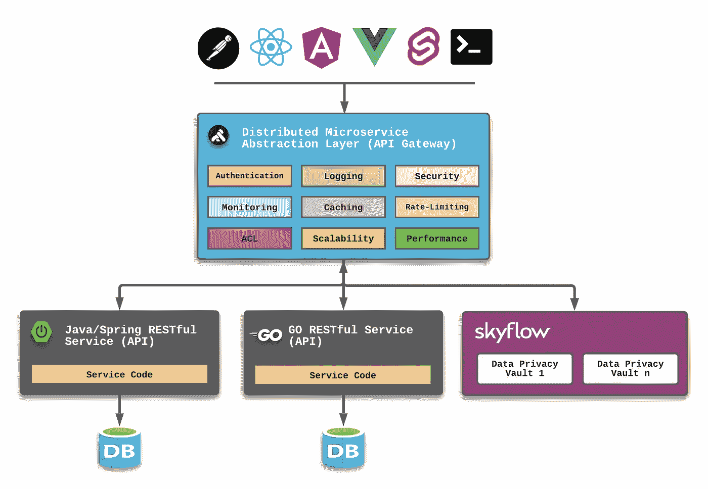

根据设计，Skyflow 成为客户可以利用的另一个服务层资源。当需要保护数据时，客户端或消费者直接与 Skyflow RESTful APIs 进行交互。

当向 Skyflow 平台提交新数据时，新记录的不同令牌将返回给消费者，然后可以包含在对其他 RESTful APIs 的链接请求中，以提供服务之间的链接。

其他服务层应用程序和服务通常使用目的驱动的服务帐户直接对 Skyflow 进行 API 调用，如上文提到的报告系统角色。因为帐户与角色相关联，所以总是会返回适当级别的数据。

> 隐私保险库提示—最好、最安全的设计是尽可能早地对敏感信息进行令牌化，尽可能晚地进行去令牌化。

# 试用 Skyflow

使用抵押贷款公司的用例，我决定通过启动以下 URL 来测试 Skyflow:

https://www.skyflow.com/try-skyflow

在填写了一些基本信息后，我收到了一封帮助我免费开始使用 Skyflow 的电子邮件。一注册就到了 Skyflow Studio UI。

# 创建自定义保管库

我需要做的第一件事是为抵押贷款公司的数据隐私保险库创建一个新的保险库。我使用了 Skyflow 用户界面中的创建保险库|从头开始选项。

我将新的 vault 命名为`MortgageCompany`,并将默认的表名改为 customers。

接下来，我定义了一个新的模式来管理以下属性:

*   社会保险号(SSN)
*   密码(密码)

Skyflow 包括常见的 PII 元素(称为 Skyflow 数据类型)，这是我决定用于 SSN 的元素。

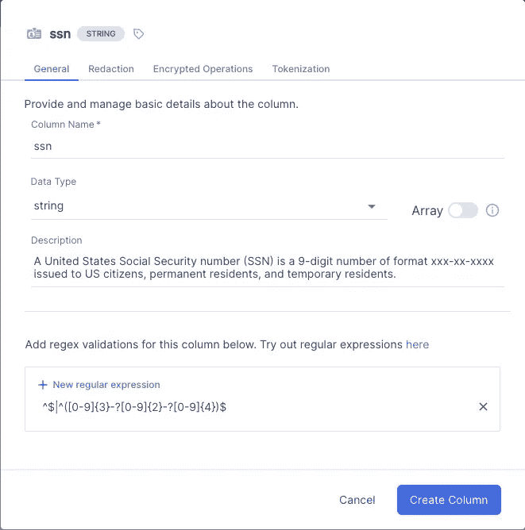

对于 Passcode 属性，我选择了基本的 string 数据类型。

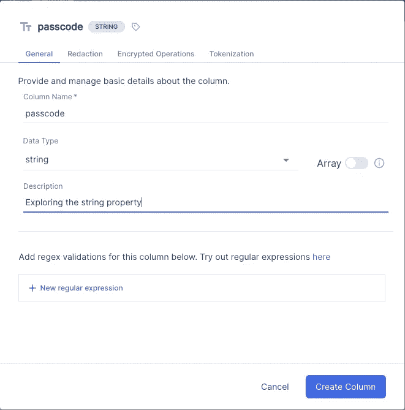

设置了这两个属性后，我单击了 Create Vault 按钮以完成该过程。

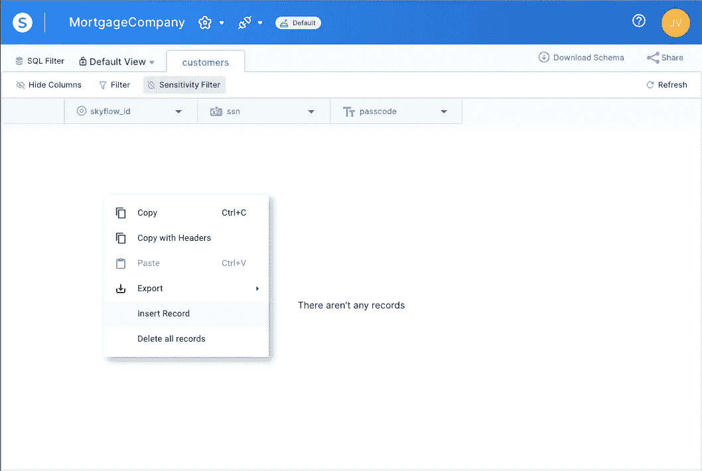

我使用 Insert Record 选项向这个新的 customers 表中添加了五个新条目:

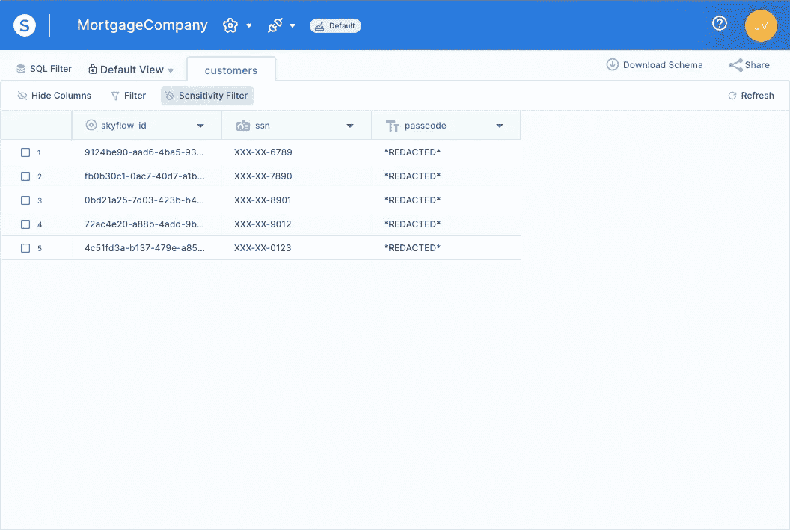

`skyflow_id`列代表访问存储在 Skyflow 内`MortgageCompany`保险库的`customers`中的数据的独特密钥。此键将被添加到链接到此数据的数据存储中的相应记录中。

例如，关系数据库中的`PEOPLE`表将不再包含`SSN`和`PASSCODE` 列，而是将`SKYFLOW_ID`存储为`PEOPLE`表中每条记录到 Skyflow 的桥梁。

# 配置 IAM

我导航到 Skyflow Studio UI 的设置|保险库屏幕，并建立了上面提到的三个角色:

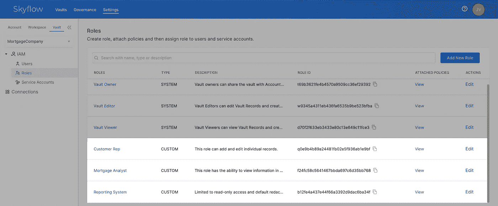

这些角色包括以下策略:

```
Customer Rep:
ALLOW ALL ON customers.* WITH REDACTION=PLAIN_TEXT

Mortgage Analyst:
ALLOW READ ON customers.* WITH REDACTION = DEFAULT

Reporting System:
ALLOW READ ON customers.skyflow_id WITH REDACTION = DEFAULTALLOW READ ON customers.ssn WITH REDACTION = DEFAULT
```

从那里，我可以在`MortgageCompany`库创建`Users`和`Service Accounts`，并授予他们在团队中的最佳角色。

我没有创建多个帐户，而是访问了 Skyflow Studio UI 中的设置|帐户屏幕，向我的 Gmail 帐户发送了邀请，然后为名为 John J Vester 的新用户分配了 Interop 用户的 IAM 角色。

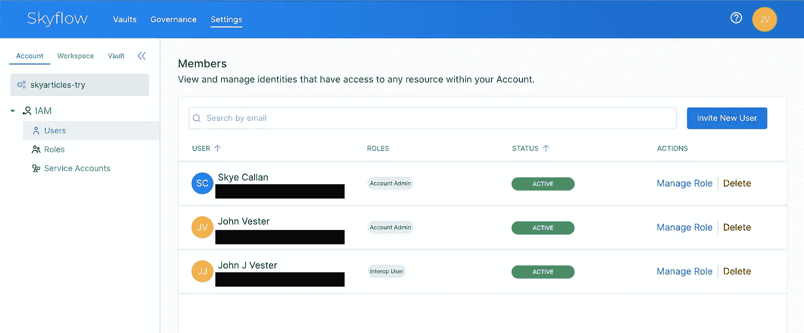

激活我的第二个帐户后，我可以导航到 Skyflow Studio UI 中的设置|保管库屏幕，并使用共享保管库按钮授予 John J Vester 客户代表角色的访问权限。

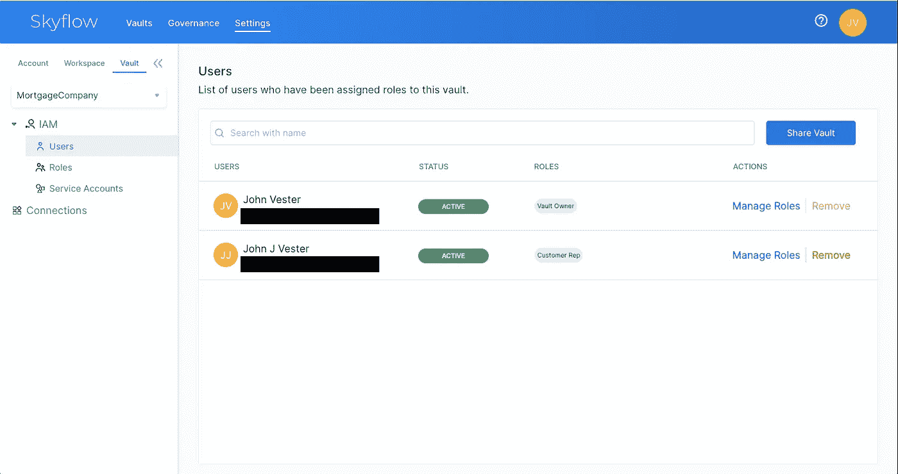

接下来，我可以使用 John J Vester 帐户通过基本的 cURL 命令对 Skyflow 进行 RESTful API 调用。

# Skyflow 正在运行

为了与 Skyflow RESTful APIs 进行交互，我们需要创建一个不记名令牌。在使用 John J Vester 帐户登录到 Skyflow Studio UI 时，我单击了右上角的我的用户图标，并选择了生成 API 不记名令牌:

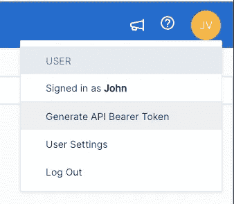

接下来，我生成了一个短期令牌来通过他们的 RESTful APIs 访问 Skyflow:


使用我的不记名令牌，以下 cURL 可以作为客户代表直接从 Skyflow 检索数据:

```
curl --location --request GET 'https://ebfc9bee4242.vault.skyflowapis.com/v1/vaults/ya45533150084aa08e474c982adc7dd7/customers' \--header 'Authorization: Bearer ey … Dnt-w'
```

收到 200 (OK) HTTP 响应，以及以下有效负载数据:

```
{
   "records":[
      {
         "fields":{
            "passcode":"CDEF",
            "skyflow_id":"0bd21a25-7d03-423b-b4da-699cdfbc2742",
            "ssn":"345-67-8901"
         }
      },
      {
         "fields":{
            "passcode":"EFGH",
            "skyflow_id":"4c51fd3a-b137-479e-a85e-7931f6497e4c",
            "ssn":"567-89-0123"
         }
      },
      {
         "fields":{
            "passcode":"DEFG",
            "skyflow_id":"72ac4e20-a88b-4add-9baa-56f9ae5c10d8",
            "ssn":"456-78-9012"
         }
      },
      {
         "fields":{
            "passcode":"ABCD",
            "skyflow_id":"9124be90-aad6-4ba5-93e8-61c8d247f577",
            "ssn":"123-45-6789"
         }
      },
      {
         "fields":{
            "passcode":"BCDE",
            "skyflow_id":"fb0b30c1-0ac7-40d7-a1b8-1be9c81ea89b",
            "ssn":"234-56-7890"
         }
      }
   ]
}
```

如您所见，客户代表角色有权查看密码和 SSN 列的纯文本值。

接下来，我访问了 Skyflow Studio UI 中的设置|保险库|用户屏幕，并将 John J Vester 的角色更改为抵押贷款分析师。

我重新运行了相同的 cURL 命令，但这次敏感数据被屏蔽或部分编辑:

```
{
   "records":[
      {
         "fields":{
            "passcode":"*REDACTED*",
            "skyflow_id":"0bd21a25-7d03-423b-b4da-699cdfbc2742",
            "ssn":"XXX-XX-8901"
         }
      },
      {
         "fields":{
            "passcode":"*REDACTED*",
            "skyflow_id":"4c51fd3a-b137-479e-a85e-7931f6497e4c",
            "ssn":"XXX-XX-0123"
         }
      },
      {
         "fields":{
            "passcode":"*REDACTED*",
            "skyflow_id":"72ac4e20-a88b-4add-9baa-56f9ae5c10d8",
            "ssn":"XXX-XX-9012"
         }
      },
      {
         "fields":{
            "passcode":"*REDACTED*",
            "skyflow_id":"9124be90-aad6-4ba5-93e8-61c8d247f577",
            "ssn":"XXX-XX-6789"
         }
      },
      {
         "fields":{
            "passcode":"*REDACTED*",
            "skyflow_id":"fb0b30c1-0ac7-40d7-a1b8-1be9c81ea89b",
            "ssn":"XXX-XX-7890"
         }
      }
   ]
}
```

Skyflow 平台立即对金库设置的更改采取行动，并将结果限制在抵押代表角色。

最后，我访问了 Skyflow Studio UI 中的设置|保险库|用户屏幕，并将 John J Vester 的角色更改为报告系统角色。

由于报告系统角色无权访问密码列，cURL 更新如下，将结果限制为仅显示 skyflow_id 和编辑的 SSN 值:

```
curl --location --request GET 'https://ebfc9bee4242.vault.skyflowapis.com/v1/vaults/ya45533150084aa08e474c982adc7dd7/customers?fields=skyflow_id&fields=ssn' \
--header 'Authorization: Bearer ey ...Dnt-w'
```

不出所料，只返回了屏蔽的 SSN 值:

```
{
   "records":[
      {
         "fields":{
            "skyflow_id":"0bd21a25-7d03-423b-b4da-699cdfbc2742",
            "ssn":"XXX-XX-8901"
         }
      },
      {
         "fields":{
            "skyflow_id":"4c51fd3a-b137-479e-a85e-7931f6497e4c",
            "ssn":"XXX-XX-0123"
         }
      },
      {
         "fields":{
            "skyflow_id":"72ac4e20-a88b-4add-9baa-56f9ae5c10d8",
            "ssn":"XXX-XX-9012"
         }
      },
      {
         "fields":{
            "skyflow_id":"9124be90-aad6-4ba5-93e8-61c8d247f577",
            "ssn":"XXX-XX-6789"
         }
      },
      {
         "fields":{
            "skyflow_id":"fb0b30c1-0ac7-40d7-a1b8-1be9c81ea89b",
            "ssn":"XXX-XX-7890"
         }
      }
   ]
}
```

当然，这仅仅是一个简单的例子，给出了 Data Privacy Vault API 可以为受保护的数据提供的好处的高级概述。

Skyflow 还为您的保险库提供了一个预配置了 RESTFul APIs 的 Postman 集合，可在插件图标菜单中找到:

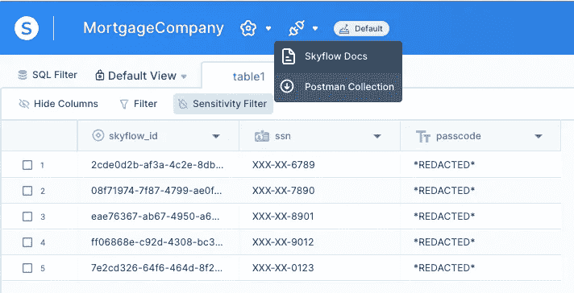

一旦导入到 Postman 中，保险库查询将如下所示:

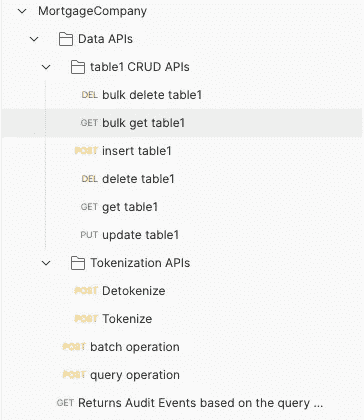

# 结论

Skyflow 提出了这样一个问题，“如果隐私有一个 API 会怎么样？”并通过一个成熟的平台提供该 API，该平台允许任何规模的客户通过一组访问权限适当的角色来保护他们的敏感数据。

在用例示例中，我展示了使用 Skyflow 创建数据隐私保险库的速度有多快，因此您可以轻松地与任何现有的应用程序和服务集成。这与数据库驱动的方法形成了鲜明的对比，后者通常涉及一系列手动驱动的任务。

从去年开始，我一直努力按照下面的使命宣言生活，我觉得它可以适用于任何 IT 专业人士:

*“将您的时间集中在提供扩展您知识产权价值的特性/功能上。将框架、产品和服务用于其他一切。”*

*—j·维斯特*

Skyflow 当然坚持我的个人使命声明，使功能和服务团队开发人员能够轻松利用 [Skyflow 数据隐私库](https://www.skyflow.com/)和附带的 API，以便他们能够专注于实现新的目标。

如果您的应用环境要求符合 PCI、PII、PHI、GDPR 或 HIPAA 标准，并且您正在使用手动或传统流程管理敏感信息，那么现在可能是考虑将 Skyflow 添加到您的短期 API 采用路线图中的时候了。

祝你今天过得愉快！