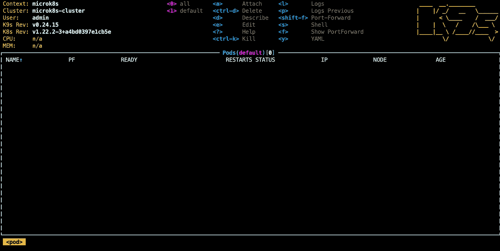
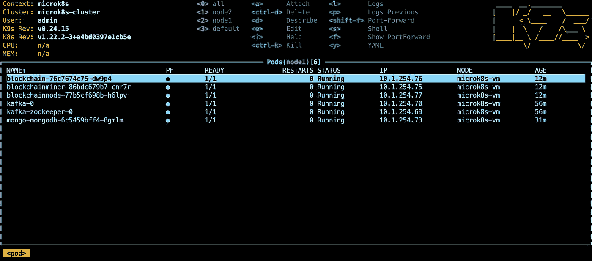

# 没有 Docker 桌面，开发生命还能存在吗？

> 原文：<https://betterprogramming.pub/can-development-life-exist-without-docker-desktop-93791a3dc977>

## macOS 上没有 Docker 桌面的 Java 微服务


图片由来自 [Pixabay](https://pixabay.com/?utm_source=link-attribution&utm_medium=referral&utm_campaign=image&utm_content=835340) 的 [Pashminu Mansukhani](https://pixabay.com/users/1137303-1137303/?utm_source=link-attribution&utm_medium=referral&utm_campaign=image&utm_content=835340) 拍摄

如果你现在还没听说， [Docker Desktop](https://www.docker.com/products/docker-desktop) 将对员工超过 250 人或收入超过 1000 万美元的公司收取订阅费。这并不是一笔很大的费用，如果你的公司已经在使用 Docker Hub 私有库，我相信你已经被覆盖了。但是它确实提出了一个问题，我们能在开发计算机上没有 Docker 桌面吗？我相信答案是肯定的，我将演示如何实现。

Docker 有两个不同的方面需要替换:构建映像和运行映像。对于构建图像，有许多非 Docker 解决方案，但我将选择 [Google Jib](https://github.com/GoogleContainerTools/jib) 。运行图片，我准备用 [MicroK8s](https://microk8s.io/) 。这两种解决方案都可以与大多数 Java 微服务一起工作，只需稍作修改。

为了演示这些解决方案需要什么，我将把我的[区块链微服务](https://github.com/rkamradt/blockchain)从 Docker Compose 转换为基于 MicroK8s 的 Kubernetes。这些服务已经使用了 Google Jib，就像我的大多数 Java 服务一样，但是我将详细说明您需要做些什么来切换您的服务。请阅读我关于[区块链微服务](/how-to-mine-the-blockchain-in-java-9647de36a8fc)的文章，了解更多有关代码的信息。

构建 Docker 映像的一个技巧是，如果需要进行任何特定于平台的操作，那么构建需要在 VM 内部进行。这就是 Java 的“一次编写，随处运行”方面派上用场的地方，大多数构建都不需要特定于平台的操作。所以 Jib 在一个基本的 JRE 映像上增加了三层；依赖 jar、构建中的类文件和构建中的资源文件。这样，如果你只改变一个资源文件，它只需要重建一个小层。只有当你改变你的依赖关系时，它才需要构建所有的三层。

要使用 Jib，您只需将 Maven 插件添加到所有生成图像的项目的`pom.xml`文件中。您不需要一个`Dockerfile`,因为构建映像的指令对于所有 Java 应用程序都非常相似。唯一的区别是找到在映像启动时运行的主类，以及它是如何启动的。Jib 在寻找唯一的主类方面做得很好，但是如果你有不止一个主类或者你的主类在一个依赖的 jar 中，它就需要帮助了。这个简单的例子不需要任何配置，并且对于 Java Spring-Boot 服务来说是现成的:

```
<build>
    <plugins>
        <plugin>
            <groupId>com.google.cloud.tools</groupId>
            <artifactId>jib-maven-plugin</artifactId>
            <version>3.1.4</version>
        </plugin>
    </plugins>
</build>
```

这将使用`adoptopenjdk:11-jre`作为基础创建一个图像，并用 Maven 工件 ID 命名。一个问题是，它需要推送到一个存储库，因为它没有 Docker 来本地存储图像。这可能会消耗一些时间，将数据推送到远程存储库，但是您可以通过运行本地容器存储库来减轻这种情况。我还没有做到这一点，所以你必须找出如何设置它。

因为我在撰写本文时删除了 Docker Desktop，所以我面临的一个问题是，配置文件使用凭证助手将 docker hub 用户名和密码存储在 MacOS 钥匙串中。所以我给我的`.docker/config.json`添加了一个 auth 值，这是我的`username:password`对于 DockerHub 的 base 64 编码(与基本认证相同):

```
{
  "auths" : {
    "[https://index.docker.io/v1/](https://index.docker.io/v1/)" : {
       "auth": "<your username password here>"
    }
  }
}
```

有了这个改变，我能够用简单的命令构建所有的图像:

```
mvn install jib:build
```

所有这一切都没有安装 Docker 桌面。在`pom.xml`中只有几行额外的代码，我们去掉了`Dockerfile`(和不再需要的弹簧启动 maven 插件)。

## 安装 MicroK8s

MicroK8s 可以使用 [Brew](https://brew.sh/) 安装。这些命令对我有用:

```
brew install ubuntu/microk8s/microk8s
microk8s install
```

Brew MicroK8s 安装程序必须在我的 Mac 上安装 [Multipass](https://multipass.run/) ，以便在必要时创建虚拟机。`microk8s install`命令看起来是启动一个 Ubuntu VM 并在其上安装 MicroK8s，然后在 Mac 上安装一个`microk8s`命令来代理它。您可以通过炮轰新虚拟机来确认这一点:

```
multipass shell microk8s-vm
...
microk8s
...
exit
```

安装 MicroK8s 后，我们需要使用以下命令安装几个插件:`dns`、`storage`和`helm3`:

```
microk8s enable dns
microk8s enable helm3
microk8s enable storage
```

最后，我们需要添加`kubectl`和`helm` CLI，加上我们将要安装的使生活变得更容易的东西，奇妙的 Kubernetes 实用程序 [k9s](https://github.com/derailed/k9s) 。以下是安装这些 CLI 的方法:

```
brew install kubectl
brew install helm
brew install k9s
```

然后为指向新集群的`kubectl`创建配置文件(注意，如果您已经有了一个`~/.kube/config`文件，您应该备份它并将其与 microk8s 创建的文件合并)

```
mkdir ~/.kube
microk8s config > ~/.kube/config
```

通过运行`k9s`进行测试:



Ctrl-C 退出。现在，您应该准备好开始创建部署了。

## 安装外部服务

在安装我们的服务之前，我们需要安装几个外部服务: [Kafka](https://kafka.apache.org/) 和 [MongoDB](https://www.mongodb.com/) 。Bitnami 通常为这些类型的服务提供了非常好的导航图，可以帮助你进行开发。由于 Kafka 和 MongoDB 是有状态的，您可以考虑在生产环境中在 Kubernetes 之外运行它们。但是我们谈论的是一个开发环境。在本地 Kubernetes 中运行这些服务是有意义的，这样多个开发人员就不会互相踩着填满共享 Kafka 队列或将无效数据放入数据库。

我面对区块链服务的一个问题是，我想证明节点到节点的通信。这意味着我需要为每个服务创建多个通过某种方式消除歧义的服务。最初，我有两个 docker-compose 文件。在这个实例中，我将创建两个单独的名称空间来分隔节点。名称空间几乎创建了一个虚拟集群，任何跨名称空间的通信都必须明确定义。让我们用这些命令创建`node1`和`node2`名称空间:

```
kubectl create namespace node1
kubectl create namespace node2
```

通过 Bitnami Helm 图表安装 MongoDB 的说明可以在[这个链接](https://github.com/bitnami/charts/tree/master/bitnami/mongodb)找到。卡夫卡的说明可以在[这个链接](https://github.com/bitnami/charts/tree/master/bitnami/kafka)找到。我是这样做的:

```
helm repo add bitnami [https://charts.bitnami.com/bitnami](https://charts.bitnami.com/bitnami)
helm install mongo bitnami/mongodb -n node1
helm install mongo bitnami/mongodb -n node2
helm install kafka bitnami/kafka -n node1
helm install kafka bitnami/kafka -n node2
```

MongoDB 安装将在每个名称空间中创建一个名为`mongo-mongodb`的秘密。

## 安装我们的服务

因为以前我们的服务是由 Docker Compose 启动的，所以我们可以用 [Kompose](https://kompose.io/) 实用程序来转换它们。我从清理掉所有来自`docker-compose.yaml`的外部服务开始。然后我把主机名改成了 Kubernetes 内部的 DSN 名，`kafka`和`mongo-mongodb`。我在本地安装了`kompose` CLI，并使用以下命令运行它:

```
curl -L https://github.com/kubernetes/kompose/releases/download/v1.22.0/kompose-darwin-amd64 -o kompose
chmod +x kompose
./kompose convert -c
```

这创建了运行所有三个服务所需的所有图表。它创建了一个名为`docker-compose`的目录，不过我把它改成了`.helm/blocknode`。接下来我要做的就是让它从 MongoDB helm 图表在三个部署文件中创建的秘密中获取 MongoDB 密码，如下所示:

```
spec:
  containers:
  - env:
    - name: MONGO_HOST
      value: mongo-mongodb
    - name: MONGO_PASS
      valueFrom:
        secretKeyRef:
          name: mongo-mongodb
          key: mongodb-root-password
```

现在我们可以安装新的舵图了:

```
helm install blocknode .helm/blocknode -n node1
```

运行`k9s`以确保一切正常运行。这是一张图片:



到目前为止，一切顺利！现在对`node2`做同样的事情。

为了测试一切，我将进行一些端口转发。随着`k9s`这变得容易，只需突出显示您想要端口转发的服务并按下 Shift-f。我将区块链、区块链矿工和区块链节点设置为 8080、8081 和 8082。现在你可以用 Postman 或 curl 运行服务来测试它。

```
curl --location --request GET 'http://localhost:8081/user' \
--header 'Authorization: Basic YWRtaW46YWRtaW4=' \
--header 'Content-Type: application/json' \
--data-raw '{ "name": "name2"}'
```

因此，概括地说，我们在没有 Docker 或 Docker Desktop(这很方便，因为它允许您在 Docker 容器内为 CI/CD 构建映像)帮助的情况下构建了所有映像，我们通过公开可用的舵图部署了外部应用程序，并将我们的`docker-compose.yaml`转换为部署我们所有服务的新舵图。全部来自我们的开发人员笔记本电脑。从 IDE 调试变得轻而易举；我们所要做的就是将所有的依赖项进行端口转发，并调整配置以从这些转发的端口中读取数据。

要卸载所有服务，只需使用`helm uninstall`命令:

```
helm uninstall mongo -n node1
helm uninstall kafka -n node1
helm uninstall blockchain -n node1
helm uninstall blockchainminer -n node1
helm uninstall blockchainnode -n node1
...repeat for node2
```

感谢您阅读这篇长篇大论的文章，我希望您能从中吸取一些有用的知识，并将其应用到您的日常开发生活中。这篇文章的所有代码可以在这里找到。