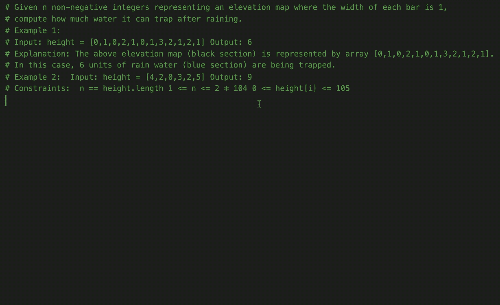
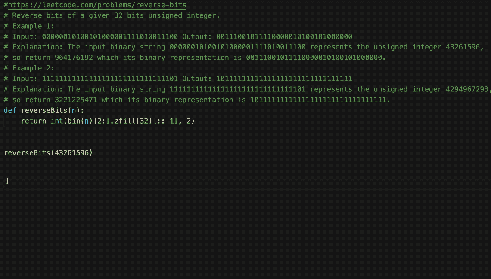
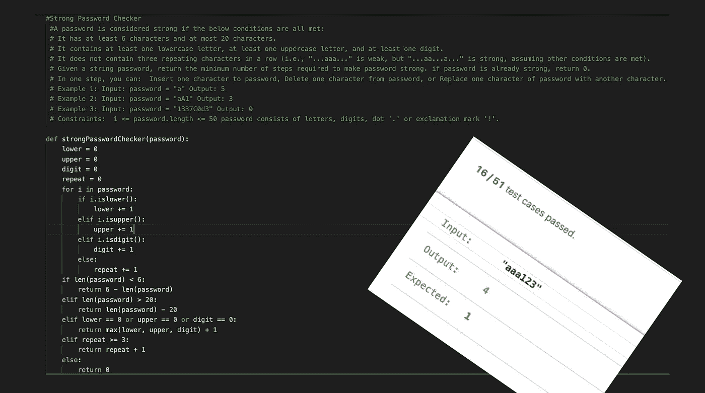

# GitHub Copilot 能解决 LeetCode 问题吗？

> 原文：<https://betterprogramming.pub/can-github-copilot-solve-leetcode-problems-f1c6f78c24cc>

## 更重要的是，它能提供可靠的解决方案吗？

作者提供的所有图片和 gif

Github Copilot 是 OpenAI 与微软一起开发的人工智能配对编程工具，是去年的一个主要话题。

它会危及编程工作还是仅仅消除进入的障碍？它能写安全代码吗？它是学习新编程语言的可靠工具吗？它会扫描本地机器上的代码库并向其他用户提供建议吗？随着开发人员开始离开等待名单，围绕新工具的神秘也随之而来。

幸运的是，我很快就获得了使用 GitHub Copilot 的许可——但我把它搁置了太久。最近，我有机会使用这个工具，我的第一印象是:它远非完美，但对于琐碎的任务却非常有用。

不过，我得承认，最初由副驾驶监督我的工作项目确实让我感到有些力不从心。我可以信任它来完成本模块吗？它会按照我想要的方式编写代码吗？还是我要花更多的时间去重构臃肿的代码建议？我应该只在需要堆栈溢出时才使用它吗？太多的问题闪过我的脑海。

第一次使用 Copilot 感觉就像被迫与一个过于热情的新开发人员一起工作，他希望完成任务——有时没有想清楚。像初级开发人员一样，当 Copilot 突然冒出一些随机的建议时，它也会变得有点烦人。我觉得接受在我们的工作流程中加入人工智能助手的想法需要一段时间和一点心态的改变。在那之前，我肯定不会让 Copilot 飞我的生产代码库。

所以，暂时让我们在 LeetCode 的几个流行的编程问题上测试一下 Copilot。LeetCode 是一个受欢迎的平台，用于练习编程问题以磨练技能——特别是对于编码面试。

让我们看看我们的 AI 伙伴在 Visual Studio 代码中解决 LeetCode 问题时的表现(如果你还没有，下载 GitHub Copilot 的 VS 代码[扩展](https://marketplace.visualstudio.com/items?itemName=GitHub.copilot))。

# 使用 Python 解析 LeetCode 问题描述

首先，Copilot 需要一些上下文来开始建议代码。上下文可以是几行代码，也可以是对你要实现的目标的注释描述。

因为我们的目标是将 LeetCode 问题反馈给 Copilot，所以有两种方法可以做到这一点:

*   为 LeetCode 安装 VS 代码扩展，并将问题描述作为注释复制粘贴到代码中。
*   使用 Python 脚本解析 LeetCode 问题

为了让我们自己编写一些代码，让我们采用第二种选择。受[这篇 StackOverflow 帖子](https://stackoverflow.com/questions/56608480/parsing-leetcode-question-content-with-requests-and-beautifulsoup/56608803#56608803)的启发，下面是使用`BeautifulSoup`解析问题语句的 LeetCode 请求的代码:

为了简单起见，我们在控制台中打印了结果。但是，您可以通过将数据保存在文件中(比如 CSV)来更进一步。

# 在 LeetCode 问题上运行 Copilot

现在，Copilot 在评论中提供了上下文，应该可以快速轻松地生成解决方案。

下面是我们的人工智能工具在第一次 LeetCode 挑战中的表现:

由于大多数 LeetCode 问题已经被全球各地的开发人员很好地记录在 GitHub 上，所以很难解读我们的 Copilot 是否聪明，因为它只是从其训练数据集返回结果，显然会按预期工作。

然而，Copilot 生成整个功能的速度确实是一个启示。这肯定会节省我们复制粘贴 StackOverflow 解决方案所花费的时间，并为我们处理具有挑战性的任务提供带宽。

再深入一点，我发现 Copilot 精通整个 LeetCode 解决方案库。看起来，我们根本不需要解析 LeetCode 问题，因为 Copilot 只需知道 URL 就可以自动生成问题陈述:

注意:依靠 GitHub Copilot 来自动完成基于 URL 的 LeetCode 问题陈述可能不是一个好主意，因为它可能会根据 Hackerrank 等其他平台的训练数据来建议问题陈述。

# 等等……Copilot 对所有 LeetCode 解决方案都不准确

我用 Copilot 随机测试了其他几个 LeetCode 问题，尽管它在大多数情况下都给出了正确的答案，但在中间还是有一些错误的答案——特别是在更高级的问题集上。

就像 Github Copilot 在`[strong-password-checker](https://leetcode.com/problems/strong-password-checker/)` LeetCode 问题上偏离主题一样:

16/51 通过的测试用例在编码面试中没有帮助

还有一种情况，问题语句需要合并两个链表，Copilot 提出了一个合并数组的解决方案——*感叹*。

总之，GitHub Copilot 在从自然语言查询生成算法代码方面做得非常出色。这是迄今为止最好的人工智能代码建议工具，当事情进展顺利时，它真的会让你大吃一惊。

但是，正如我们所看到的，它有时是不可靠的——这意味着作为开发人员，必须不断地监控和检查生成的代码。