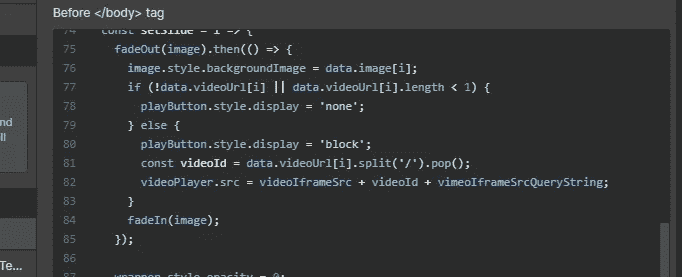

# 我可以使用 Webflow 作为工具来构建我的 Web 应用程序吗？

> 原文：<https://betterprogramming.pub/can-i-use-webflow-as-a-tool-to-build-my-web-app-59f41e99dc34>

## 简单的答案是肯定的，这是可能的。复杂的答案是肯定的，但是你可能不想

Webflow 代码编辑器

作为一名设计师、企业主或任何其他非编码人员， [Webflow](https://webflow.com/) 是一个构建静态营销网站的强大工具。然而，如果你使用 Webflow 足够长的时间，你可能会发现自己希望它能让你超越建立*仅仅是*一个网站。

在现实世界中，我们经常需要*网络应用*而不是*网站*。我们可能希望创建具有会员区、向客户提供个性化内容的能力或其他超出 Webflow 能力的功能的数字产品。

我花了几年时间使用 Webflow 来构建各种网站和 web 应用程序。在这段时间里，我发现自己在回答客户和其他开发人员关于 Webflow 作为“合适的”开发工具的可行性的同样问题。

本文根据我的实际经验，使用 Webflow 作为前端框架，使用其 CMS 作为数据库来展示我的发现，并允许您对下一个项目做出明智的决策。

# 1.Webflow 如何作为构建 Web 应用的前端工具？

TL；大卫:你可以破解它，让它工作。但是这很烦人，没有伸缩性，最终，你几乎总是会更好地使用为工作而制造的工具。如果你正在构建一个“真正的”应用，使用一个“真正的”框架。

Webflow 生成的网站只是静态资产。不像 Wordpress，你不能访问任何服务器端代码。这意味着要使用 Webflow 作为前端框架，您最终需要编写大量的 JavaScript(或者 [jQuery](https://jquery.com/) ，如果那是您的事情的话)。

你看，你能与你的站点交互的唯一方式是使用脚本直接操作 DOM(Webflow 允许你添加到你的站点)。这不同于现代的前端框架方法，后者使用虚拟的 DOM，将我们从实际的 HTML 元素中抽象出来。

我前段时间制作了一个[视频系列](https://www.youtube.com/watch?v=30AIpEnsEaQ&list=PL4TuDUnZkkhzSwfbFj6EJjxim6218ORc0)，展示了使用 [Firebase](https://firebase.google.com/) 在 Webflow 站点上设置用户认证。这里教授的原则可以应用到比视频中显示的更远的地方——以这种方式构建 web 应用程序是完全可能的。

然而，对于任何严肃的 app，我都不相信 Webflow 是合适的工具。原因如下。

## 1.1 Webflow 没有分支的概念

TL；DR:在“适当的”应用程序中，作为一条规则，你永远不会直接在你的活源代码上工作。当使用 Webflow 作为前端框架时，没有可行的方法可以不直接在您的实时站点上工作。

“真正的”应用程序拥有存储在存储库中的源代码(例如 GitHub)。这种源代码通常有不同的分支，允许开发人员管理版本控制。

通常，“主”分支将包含运行应用程序的当前实时版本的源代码。开发人员通常会在其他“开发”分支或子分支中工作，在那里他们会构建新的特性或进行更新。

然后对这些进行测试，并传送到主分支。这个过程确保未经测试的更改不会破坏一个正在运行的应用程序。

Webflow 没有分支的概念。这使得使用它作为前端框架有风险，因为所有的更改都必须直接在站点的实时版本上进行。

您可以通过复制您的 Webflow 站点来创建版本，在一定程度上解决这个问题，但这很麻烦，而且成本很高，因为您经常需要购买新的托管计划(Webflow 不允许您将付费托管从一个站点转移到另一个站点)。

## 1.2 您必须直接操作 DOM，这依赖于 Webflow 设计器中设置的标识符

TL；DR:对于与前端元素交互的脚本，它们需要标识符来引用它们。这些是在 Webflow designer 中设置的，很容易被意外破坏，进而破坏您的应用程序。

为了与 Webflow 生成的 HTML 元素进行交互，您将需要标识符来引用。

Webflow 允许您在脚本中使用`document.getElementById('id')`引用的元素上设置 HTML IDs。

您也可以使用类名选择器，但是无论是哪种情况，设计人员在 Webflow 中工作时都很容易不小心忽略它们。这将破坏你的脚本对元素的引用，进而破坏你的应用程序。

另一种选择是使用数据属性选择器。Webflow 允许您设置这些，这样更安全，因为不太可能有人会意外删除它们。

但它仍然不是刀枪不入的——事实上，任何访问 Webflow designer 的人都可能意外地、非常容易地破坏您的应用程序，这是一个主要问题。

## 1.3 无法正确测试您的前端

TL；DR:在“适当的”应用程序中，您可以测试前端组件，并确保它们在不同的状态下(例如，页面加载、页面完成加载)看起来都是应该的。在 Webflow 中，你不能。

随着应用程序的增长，您可能希望自动化您的测试工作流。使用 Webflow 作为前端工具使这变得非常困难，因为您无法访问您的前端组件。此外，您不能将属性传递给组件。

当然，用大量脚本和一个无头浏览器来破解一个解决方案是可能的。这在某种程度上是可行的，但是它不干净，而且扩展性不好。

## 1.4 您不能在前端直接获取 CMS 数据

TL；DR:您的应用程序将会加载缓慢，除非您构建更复杂的解决方案来将您的 Webflow CMS 数据同步到某个具有更多功能的地方。

过滤和查询数据是大多数 web 应用程序的一项要求。

因此，让我们想象一下这样一种情况，在 Webflow CMS 集合中有 200 名员工。在您的网站页面上，您希望显示这些成员，并允许网站用户按类别进行搜索或过滤，以显示相关的员工。

目前，Webflow 允许您将 CMS 集合放在页面上，并仅在 designer 或 CMS editor 视图中过滤其内容。当网站页面加载时，您的用户不能执行任何过滤。无论你在发布网站前设置了什么过滤选项，他们都会被卡住。

所以，如果你想让你的用户直接在页面上过滤或搜索，你必须定制代码。

为此，您可以在页面上加载所有 200 个 CMS 项目，然后使用自定义 CSS 和 JS 来构建您的自定义过滤和搜索功能。

但是，如果每个项目都有一张图片，你想一次加载 200 张图片吗？当然，您可以设置延迟加载和其他解决方法，但是事情很快就会变得一团糟。

另一种选择是在用户进行过滤或搜索查询时实时加载 CMS 数据。

这里的问题是你不能直接从前端做到这一点。您将需要构建您自己的后端，您的前端向其发出请求，然后连接到 Webflow CMS API 以获取数据，然后将数据返回到前端。

这种方法很慢，而且 Webflow CMS API 也有自己的问题(下一节将会谈到)。

如果 Webflow 站点中的数据位于 Webflow CMS 中，则很难对该数据进行动态过滤或查询。

根据我的经验，唯一可行的选择是将网站数据保存在其他地方，比如更好的 CMS(例如 [Contentful](https://www.contentful.com/) )，或者前端可以直接连接的更快的数据库(例如 Firebase Firestore)。

然而，这产生了另一组问题，因为通常，客户端特别希望使用 Webflow CMS，这意味着您需要在 Webflow CMS 和您的其他数据库之间设置复制，这本身增加了更多的复杂性。

# 2.Webflow CMS 如何为 Web 应用程序堆叠数据库？

TL；大卫:不太好。

如上所述，您的前端不能直接查询 Webflow CMS。这意味着您必须构建自己的后端来处理与 CMS API 的通信(因此需要更多的时间和成本)，这本身就有几个问题。

## 2.1 Webflow CMS API 还有很多需要改进的地方

TL；DR:当您通过 Webflow CMS API 与 CMS 数据交互时，您可能会遇到一些令人沮丧的限制。

Webflow 在 2016 年推出了它的 CMS API，从那以后它似乎很少受到喜爱。他们唯一的[官方客户端库](https://github.com/webflow/js-webflow-api)有几个公开的问题，Webflow 几乎没有回应。

我得出的结论是，开发者体验不是 Webflow 的重点——这是可以理解的，因为设计师是他们的主要受众。

也就是说，为了客观报道的利益，这里是我发现的最大的问题；

*   不支持通过字符串查询 CMS 数据。
*   不支持按属性或字段查询 CMS 数据。
*   API 最多返回 100 项，您需要编写自己的分页逻辑。
*   API 速率限制相对较低，这意味着您需要尽早构建回退和重试机制。
*   您只能管理 CMS 项目的数据，不能更改 CMS 项目字段本身或改变集合。
*   Webflow JavaScript 库仍然不支持补丁操作。
*   延迟高于其他解决方案(我看到 Contentful 为 15 毫秒，Firebase Firestore 为 42 毫秒，Webflow 为 240 毫秒！)

# 3.有没有一个解决方案可以让设计人员使用 Webflow，但对开发人员仍然有意义？

我认为有——这是一个让工具做它们擅长的事情的例子。对于 Webflow 的预期目的来说，它是无与伦比的。作为一个建立静态营销网站的工具，这是完全有意义的。

但是，尽管推动 Webflow 作为 web 应用程序的前端框架是可能的，但它有太多的缺点，因此(几乎在所有情况下)都不推荐。

你的开发者会有一个令人沮丧的体验，你的应用程序根本无法扩展。如果你正在构建一个“真正的”应用，使用一个“真正的”前端框架。

让 Webflow 爱好者和开发者都满意的解决方案是将一个“真正的”应用程序与 Webflow 结合起来。

你没有理由不能使用 Webflow 来构建网站的营销部分，然后将你的应用程序直接呈现在 Webflow 页面上。

这种方法意味着微小的网站更改不需要通过昂贵的开发团队，但您的应用程序可以使用健壮的框架和流程来构建。

# 4.那么，使用 Webflow 作为工具来构建 Web 应用程序有意义吗？

尽管存在上述问题，但在一些有限的特定情况下，我认为它是有意义的；

*   提供一个 JavaScript/jQuery 的学习机会，而不用直接花太多时间在 HTML 或 CSS 上。
*   为一个具有真实世界功能的应用程序构建一个原型，而不会产生完整开发项目的成本。
*   构建一个功能非常有限且无意扩展的应用程序(想象一个内部业务应用程序)。

对于其他的一切，我不这么认为。