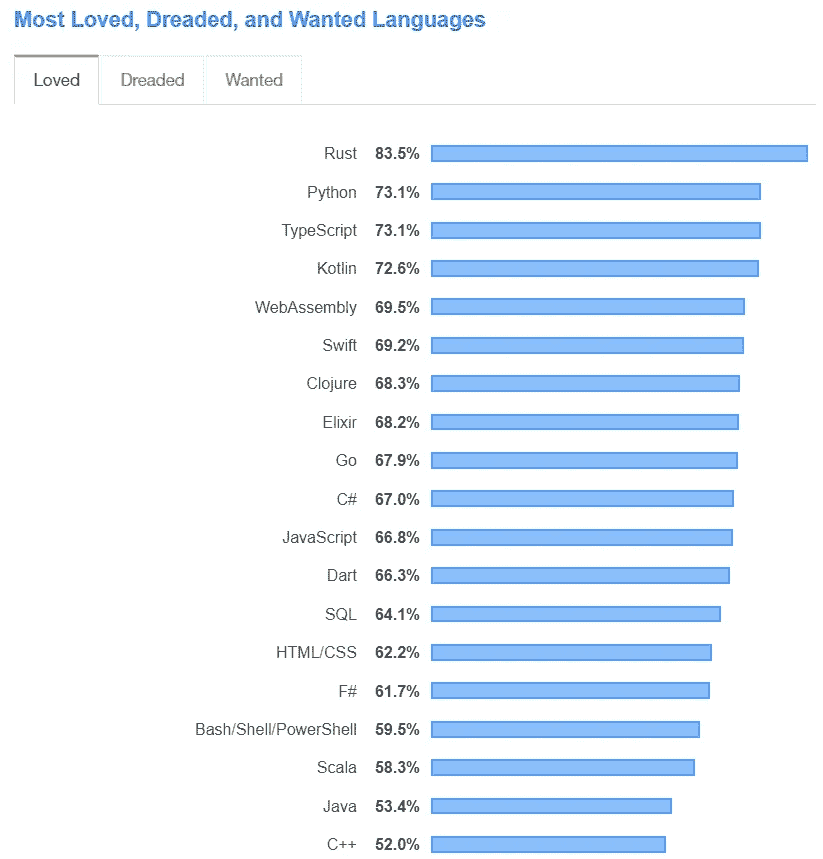

# JavaScript 能赶走 Dart 和 Blazor 吗？

> 原文：<https://betterprogramming.pub/can-javascript-keep-away-dart-and-blazor-e39b52834349>

## JavaScript 未来做的怎么样？

马库斯·斯皮斯克在 [Unsplash](https://unsplash.com?utm_source=medium&utm_medium=referral) 上的照片。

很长一段时间以来，JavaScript 一直是单页面应用程序的首选，每个 JavaScript 爱好者都希望它将来也能保持领先地位。但是最近微软的 [Blazor](https://dotnet.microsoft.com/apps/aspnet/web-apps/blazor) 和谷歌的 [Dart](https://dart.dev/) 的发展似乎威胁到了 JavaScript 的王国。这些框架分别在 2017 年和 2011 年左右首次推出，但直到最近它们才在发展中国家产生真正的影响。

因此，本文的主要目的是调查 Blazor 和 Dart 背后的宣传，并将它们与 JavaScript 进行比较，看它们是否能击败 JavaScript。

# Dart 是什么？

Dart 最初是由 Google 在 2011 年左右作为其内部 web、移动和服务器开发语言引入的，该语言几乎仅限于 Google 本身。但就在谷歌 I/O 2018 上推出 Flutter 之后，Dart 开始迅速攀升。

Dart 是一种客户端优化语言，其编译源代码的方式与许多其他编程语言(如 c)类似。重要的区别在于，Dart 包含其自己的名为 pub 的包管理器，同时还具有 Dart VM 附带的独立 SDK。

# Dart 为什么会流行？

在我看来，Flutter 是 Dart 炒作背后的主要原因。自从 Google 为跨平台移动开发引入 Flutter 以来，移动开发人员变得非常热衷于尝试 Flutter——他们不得不开始与 Dart 合作。尽管与 JavaScript 相比，Dart 是相当新的，但是具有良好的 OOP 和 Java 知识的开发人员能够很快掌握基本概念和语法，Dart 社区开始迅速发展。

此外，Dart 能够提前和及时编译代码，这意味着在您开发的同时，您的代码会在后台同时编译和执行。

除此之外，Dart 还提供了许多有趣的功能，我们可以指出这些功能的优势和长处:

*   Dart 支持面向对象的开发。
*   写得好的文档容易学习。
*   Dart 的运行没有任何硬件或架构要求。
*   它可以用于移动应用程序、web 应用程序、桌面应用程序、脚本任务和服务器端/客户端工作。
*   单线程编程语言。
*   开发中没有编译时间。
*   Dart 有一个丰富的生态系统，有各种各样的支持工具，如 pub、analyzer、test、dev_compiler、服务器端 VM 等。
*   跨平台支持。

您也可以在[文档](https://dart.dev/)中找到更多关于 Dart 的详细信息。

# Dart 与 JavaScript

将 Dart 与 JavaScript 进行比较要比将 JavaScript 与 Blazor 进行比较容易得多，因为 Dart 现在已经站稳了脚跟。

如果我们考虑这两者的受欢迎程度，我们可以明确地说 JavaScript 更受欢迎，因为它已经存在很长时间了，开发人员几乎在任何事情上都使用 JavaScript。但另一方面，Dart 正在获得动力，并以越来越快的速度吸引开发人员。

如果我们考虑 2019 年的[栈溢出调查，我们可以看到，在最受喜爱的语言方面，JavaScript 和 Dart 都处于同一水平。](https://insights.stackoverflow.com/survey/2019#most-loved-dreaded-and-wanted)

来源:[堆栈溢出](https://insights.stackoverflow.com/survey/2019#most-loved-dreaded-and-wanted)

此外，当涉及到学习曲线和易用性时，我们看不出这两者之间有什么区别。JavaScript 和 Dart 在开始时可能会有点混乱，但是一旦你习惯了，使用它们就像在公园散步一样容易。

同样，我们可以比较这两者在速度、商业用途、平台支持、编辑器支持等许多方面的差异。但我们看不出这两者有多大区别。两者可能各有一点好处。例如，JavaScript 可以在前端和后端使用，而 Dart 不支持后端开发。就 Dart 而言，它得到了谷歌的支持。

总的来说，我能说的是，我们不能谈论支持一种技术，因为它们都包含自己的一套价值观，不能被其他人超越。JavaScript 在很长一段时间内一直处于领先地位，并且在未来也将保持这一地位。然而，随着时间的推移，Dart 也将获得其地位。作为开发人员，选择最适合我们的解决方案是我们的职责。

# 布拉索是什么？

Blazor (Browser+Razor)是微软推出的一个新的 web 开发框架，它允许你使用 C#和 Razor 语法以及 HTML 和 CSS 开发基于浏览器的应用程序。

如果您以前使用过 Razor 视图，您应该熟悉将 HTML 视图呈现给浏览器的过程。我们必须在服务器端运行 Razor 视图，以便在浏览器中显示它们。但是随着 Blazor 的引入，Razor 视图现在也可以在客户端执行了。Blazor 不需要在客户端浏览器上安装任何额外的插件或库。WebAssembly 负责所有这些事情，作为开发人员，我们可以开始使用 C#开发客户端和服务器端，让我们使用 Blazor 的生活更加轻松。

# Blazor 为什么会流行？

虽然 Blazor 首次推出已经有一段时间了，但它在相当长的一段时间内都没有引起人们的注意。但是随着 WebAssembly 的引入，Blazor 的排名显著上升，将它与 JS 和其他主要框架进行比较的讨论在开发界引起了更大的反响。

正如本文的主题所暗示的，JavsScript 在很长一段时间内一直处于前端开发的顶端。因为。NET 开发人员来说，这是一件非常头疼的事情，因为他们需要从头开始学习 JavaScript 或 TypeScript 来开发前端。

但随着 Blazor 的推出，C#可以用于开发应用程序的服务器端和客户端，这一直是 Blazor 的主要卖点。所以，如果你是一个. NET 开发者，你再也不用担心学习客户端开发的 JavaScript 了。

除此之外，Blazor 还有许多特性/优势:

*   Blazer 不需要浏览器插件。
*   启用完整。NET 调试。
*   它使用最新的网络浏览器功能。
*   构建可组合用户界面的模型。
*   浏览器兼容性(即使是旧版本)。
*   依赖注入是可用的。
*   可以在客户机和服务器之间共享代码。
*   Blazor 应用程序可以离线工作。
*   Blazor 被预编译成一种中间语言。
*   适用于高性能应用。

# Blazor vs. JavaScript

在现阶段比较 Blazor 和 JavaScript 似乎不太公平，但这种比较是每个人都在寻找的。所以我决定将 Blazor 的特性与 Angular、React 和 Vue 等一些领先的 JavaScript 框架进行比较。

许多 JavaScript 框架，包括前面提到的那些，已经存在了很长一段时间，并且已经获得了人们的信任，可以在大量的应用程序中使用。如果我们考虑 React、Angular 或 Vue，它们背后有巨大的社区，这些框架已经证明了自己。

另一方面，Blazor 仍然是游戏的新手，还没有获得开发者的信任。但我们不能说它是全新的，因为 Blazor 几乎与。NET 开发，使用 Razor 视图和 C#作为语言。此外，虽然是新的，但 Blazor 仍然提供了一些高级功能，如内置的路由、验证和表单处理支持，在客户端和服务器端共享组件，使用 NuGet 包，部署为静态文件等。

但是就 Blazor 的普遍情况和特性而言，我不认为它包含任何吸引 JavaScript 开发者的重要特性。但是如果你是一个. Net 开发者或者擅长 C#，Blazor 绝对是你的一个好选择。

# 结论

对这个话题的简单回答是 JavaScript 就可以了。JavaScript 将在很长一段时间内保持领先地位。但是 Dart 和 Blazor 都有很大的潜力成为 JavaScript 的顶级竞争者，同时提供自己的特性，可以作为套件在不同的解决方案中使用。

还有，我相信这个话题不能局限于我在这篇文章中总结的内容。我邀请大家在评论区分享你们的想法。感谢您的阅读。