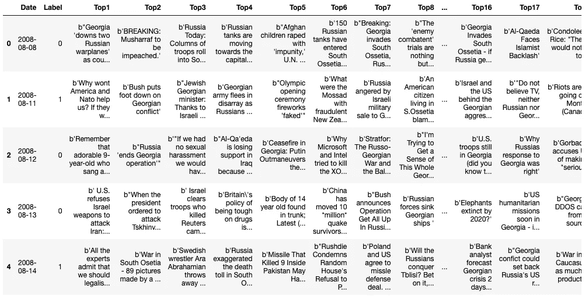
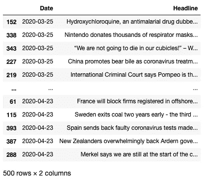
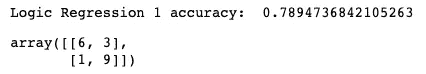

# Reddit 能预测股市吗？

> 原文：<https://betterprogramming.pub/can-reddit-predict-the-stock-market-cb6cd1302e9f>

## 使用 Reddit 新闻情绪和逻辑回归在 Python 中建模价格方向


照片由 [Robert Bye](https://unsplash.com/@robertbye?utm_source=unsplash&utm_medium=referral&utm_content=creditCopyText) 在 [Unsplash](https://unsplash.com/s/photos/wall-street?utm_source=unsplash&utm_medium=referral&utm_content=creditCopyText) 上拍摄

*编者按:本文仅用于教育或娱乐目的，不以任何方式作为理财建议。*

作为技术分析的坚定信徒，我对新闻情绪能在多大程度上预测股市持怀疑态度。然而，随着新冠肺炎局势的发展，我发现我的指标并不总是反映真实的趋势——换句话说，市场并不像在“正常”市场条件下那样符合某些模式。

所以我决定亲自去看看:

今天的新闻真的能预测明天市场的走向吗？如果有，达到什么程度？

在尝试了许多模型、web 抓取和各种新闻 API 之后，有一种方法似乎特别有前途…


照片由 [Kon Karampelas](https://unsplash.com/@konkarampelas?utm_source=medium&utm_medium=referral) 在 [Unsplash](https://unsplash.com?utm_source=medium&utm_medium=referral) 上拍摄

本文将探索用 Python 预测股票价格方向的逻辑回归方法。更具体地说，我们将使用 Reddit 世界新闻[的头条新闻](https://www.reddit.com/r/worldnews/top/)来预测道琼斯指数在下一个交易日收盘时是上涨还是下跌。

# 步骤 1:导入库

让我们从导入一些库开始。

*   **熊猫**–用于数据存储和分析
*   **praw**–Reddit API 的 Python 包装器(参见[文档](https://praw.readthedocs.io/en/latest/))
*   **datetime，pytz**–用于过滤数据时间范围和时区之间的转换
*   **sk learn**——机器学习库；对于逻辑回归和文本特征提取

```
import pandas as pdimport requests
import praw

from sklearn.feature_extraction.text import TfidfVectorizer
from sklearn.linear_model import LogisticRegression
from sklearn.metrics import accuracy_score, confusion_matrixfrom datetime import datetime, timedelta
import pytz
```

# 步骤 2:准备训练集

为了训练数据，我们将使用 Kaggle 数据集“联合新闻 DJIA”。csv”，由 [Aaron7sun](https://www.kaggle.com/aaron7sun) 提供。该数据集包含世界新闻子编辑( [/r/worldnews](https://www.reddit.com/r/worldnews?hl) )的历史头条，以及对应的道琼斯工业平均指数(DJIA)每日回报的二进制标签。

数据范围从 2008 年 6 月 8 日到 2016 年 7 月 1 日。第一列是文章的发表日期，接下来是退货标签(1 =正/零退货，0 =负退货)，然后是当天由 Reddit 用户投票选出的前 25 个标题。

一旦数据下载完毕，我们将使用 **read_csv()** 方法**将其导入到熊猫数据帧中。**

```
# Load the training dataset
data = pd.read_csv("stocknews/Combined_News_DJIA.csv")
data.head()
```



2008 年 6 月 8 日至 2016 年 7 月 1 日，前 25 大头条和道琼斯回报标签

接下来，我们将把每个日期的标题连接成一个字符串。然后，我们将使用 **TfidfVectorizer** 将文本转换为特征向量，这将形成模型的输入。

```
# Merge daily headlines for training set
headlines_train = []
for ind, row in data.iterrows():
    headlines_train.append(" ".join(str(x) for x in row[2:]))
```

## 文本特征提取:参数

我们要排除无意义的词，如“the”、“a”、“to”等。因此，我们将设置“ngram_range=(2，2)”以便只允许两个单词的短语作为特征向量。此外，我们希望避免很少出现的短语，因此我们将设置“min_df =0.03”来过滤频率大于 3%的短语。最后，我们将通过设置“max_features=100000”来防止特性数量失控。

```
# Extract features from training set headlines
vectorizer = TfidfVectorizer(min_df=0.03, max_features=100000, ngram_range=(2,2))# Get X_train and y_train
X_train = vectorizer.fit_transform(headlines_train)# Get y_train
y_train = data['Label']
```

# 步骤 3:准备测试集

现在，在测试台上。我们的测试集将是动态的，它根据前一天的新闻标题检查我们对 DJIA 回归后三十天的预测。

整理标题数据最简单的方法是通过 API。设置过程需要两分钟，只需创建一个免费的 Reddit 帐户并请求一个即时 API 密钥。我们还将使用 PRAW (Python Reddit API 包装器)来获取世界新闻数据。有关说明，请前往[https://www . story bench . org/how-to-scrape-Reddit-with-python/](https://www.storybench.org/how-to-scrape-reddit-with-python/)。

注意，通过 API 获得的文章创建日期被格式化为 UTC 日期。由于我们关注道琼斯回报，我们需要将日期转换为纽约时间，这样可以确保我们的预测只使用开市前的新闻。这就是 **pytz** 和 **datetime** 库派上用场的地方。

正如我们对测试集所做的那样，我们将把每个日期的每日标题合并成一个字符串。然后我们将创建一个新的列表， **unique_dates** ，它包含删除了重复项的文章日期。



测试集标题，从 2020 年 3 月 25 日到 2020 年 4 月 23 日

在我们为测试集创建二进制标签之前，我们需要获得过去 30 天的每日道琼斯回报。最好的方法是从[雅虎财经](https://finance.yahoo.com/quote/%5EDJI/history?p=%5EDJI)下载历史价格数据。这很容易通过调整 URL 中的日期范围参数并将 CSV 文件读入 DataFrame 来完成——参考我的文章[用 Python 构建技术分析图表](https://medium.com/analytics-vidhya/building-a-technical-analysis-chart-with-python-17107b78b297)了解如何做的更多解释。

存储了 DJIA 价格数据后，我们可以使用调整后的收盘价计算每日回报。

```
# Calculate returns
dj["Returns"] = dj["Adj Close"]/dj["Adj Close"].shift(1) - 1
dj.dropna(inplace=True)
```

对于第二天返回的标题，我们将把标题字符串添加到列表 X_test 中。这说明了所有周末和公共假日没有交易发生。如果指数向上或横向移动，我们将设置 y = 1，如果指数向下移动，设置 y = 0。

与训练集一样，我们将使用**矢量器**将文本转换成我们的特征向量集，并将这个变量设置为 X_test。

# 第五步:拟合模型并进行预测

好了，剩下要做的就是拟合模型并进行一些预测。

## 逻辑回归:参数

我们将使用机器学习库 sklearn 来拟合训练集的逻辑回归模型。该惩罚为模型增加了一个正则化项，减少了系数过度拟合的可能性。默认的惩罚是 L2(套索回归)，它(简单地说)鼓励系数权重趋向于零。然而，我的实验表明，该模型在 L1 惩罚(岭回归)下表现更好，这促使非重要特征的权重为零，从而引入了“内置”特征选择。这在特征集很大时特别有效，因为它有助于缩小最重要特征的范围。

您可以将“saga”或“liblinear”与 L1 罚函数结合使用，尽管“saga”针对较大的数据集进行了优化。随意使用不同的设置，并且[阅读](https://scikit-learn.org/stable/modules/generated/sklearn.linear_model.LogisticRegression.html)sklearn 中可用的惩罚和解算器之间的差异。

```
# Fit logistic regression model
model = LogisticRegression(solver="saga", penalty="l1")
model = model.fit(X_train, y_train)# Get test predictions
y_pred = model.predict(X_test)
```

这是结果。

```
acc = accuracy_score(y_test, y_pred)
print('Logic Regression accuracy: ', acc)confusion_matrix(y_test, y_pred)
```



该模型正确预测了过去 19 个每日回报中的 15 个！不算太坏。

# 结论

那么，*今天的消息真的能预测明天市场的走向吗？如果有，达到什么程度？*

虽然我不太愿意根据所做的分析给出一个明确的答案，但我确信这个消息对股市的总体走向有某种影响。

在过去的两个月里，我一直在测试这个精确的模型，准确率从未低于 70%。我还尝试过在不同的时间框架内(比如几周而不是几个月)用不同的逻辑回归参数进行测试。所有数据表明，这一消息可以在很大程度上预测股市走向。

## 限制

然而，我们构建的模型有几个限制。训练集仅包含截至 2016 年 7 月 1 日的数据，但我们正在用上个月的数据测试模型。忽略这两个时期之间的数据可能会也可能不会产生重大影响——例如，如果 Reddit 的头条决定方式出现了新趋势，该怎么办？

此外，在获取上个月的头条新闻时，我们不一定每个日期得到 25 条头条新闻——据我所知，没有办法像这样过滤结果的数量。这意味着一些预测是建立在比其他预测更多的输入文本之上的，导致缺乏一致性。

现在，该模型的一个主要限制是，一旦你改变，比如构建矢量器的方式，或者形成测试集的标题数量，准确性就会波动很大。考虑到这种逻辑回归的敏感性，可以有把握地认为，这种模型不应该孤立地用于预测价格走向。

然而，它提供的信息并非完全没有意义。也许最好的办法是将模型与其他指标或交易规则结合起来使用。

这又提出了一系列问题:

*在全球危机时期，市场表现不那么“理性”，新闻情绪的权重应该更高吗？反过来，这是否暗示技术指标不太可靠？*

我想时间会证明一切。

# 附录

孙，J. (2016 年 8 月)。股票市场预测每日新闻，第 1 版。从 https://www.kaggle.com/aaron7sun/stocknews 的[检索到【您检索此数据的日期】。](https://www.kaggle.com/aaron7sun/stocknews)