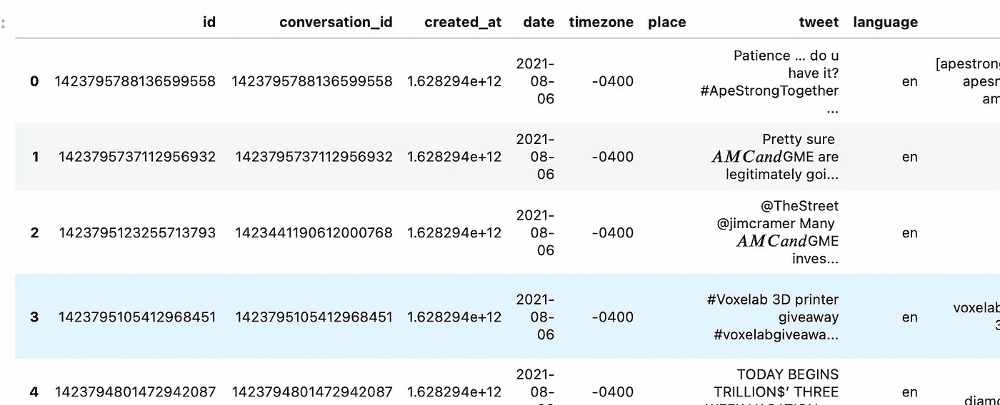
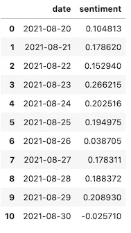
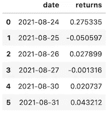
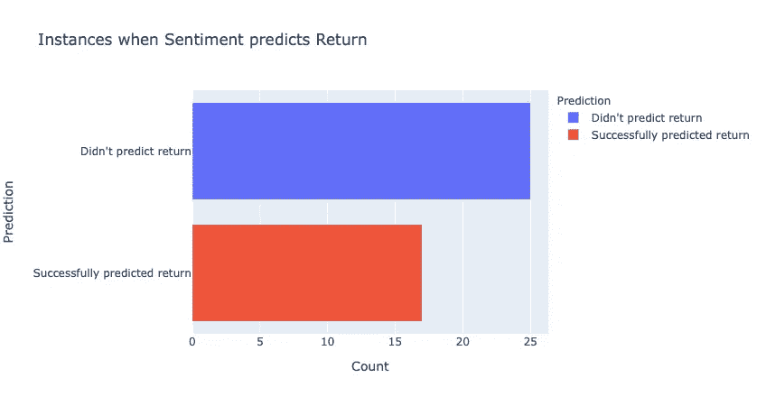
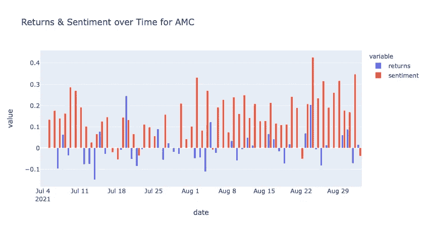

# 推文可以用 Python 预测股市收益吗？

> 原文：<https://betterprogramming.pub/can-tweets-predict-stock-market-returns-using-python-ddba669a4efc>

## 分析 Twitter 与次日股票回报的关系


由[亚历山大·沙托夫](https://unsplash.com/@alexbemore?utm_source=medium&utm_medium=referral)在 [Unsplash](https://unsplash.com?utm_source=medium&utm_medium=referral) 上拍摄的照片

二十多年前，可能没有人能预测到社交媒体会像现在这样庞大。可能也没想到它会对股市产生潜在影响。但是，正如我们今年所学到的，无论我们喜欢与否，社交媒体在股市趋势中扮演着重要角色。

你可能听说过，GameStop ( *GME* )是今年第一个也是最大的迷因股票。Reddit、Twitter 和其他社交媒体网站上的许多用户一起能够触发做空操作，导致股价在几天或几周内飙升。这个现象让我思考——*足够积极的推文活动也能带来积极的回报吗？*

为了找到答案，我们需要收集足够多的推文和价格数据，看看它们之间是否有任何关联。这项工作需要用 Python 编写一些代码来收集和可视化这些数据。最终，我们将看到 Twitter 是否真的能够预测未来的回报。

在接下来的部分中，您将看到我们如何收集推文、价格数据并将其可视化。请随意编码，并随意更改一些输入。根据这些输入，您可能会看到不同的结果。让我们开始吧…

# 获取推文

首先，我们需要一种方法来收集大量推文进行分析。我们可以通过复制和粘贴 tweets 来非常困难地做到这一点，或者我们可以通过使用 Python 库来简单地做到这一点。

Twint 是一个很棒的 Python 库，可以在没有 Twitter 账户或使用官方 API 的情况下抓取推文。它有许多配置选项，非常灵活。[如果你愿意的话，可以随意阅读 Python 的文档。这些文档会告诉你如何在你自己的系统中设置 Twint。一旦完成，我们可以继续编码方面。](https://github.com/twintproject/twint/wiki)

## 配置 Twint

```
# Library imports
import twint
import nest_asyncio
nest_asyncio.apply()
import pandas as pd
from datetime import datetime, timedelta
```

注意:你需要`nest_asyncio`来正确运行 Twint。

对于 Twint 的配置，我创建了一个包含许多不同配置选项的函数。这个函数将能够接受任何搜索词、日期，并根据给定的搜索词和日期返回有限数量的 tweets。

## 关于配置功能

有许多不同的配置选项，您可以随意尝试更多选项。不过，关于上述功能，我们仅指出一些亮点。

在这个配置中，*热门推文*被引用，因为这些推文可以很好地全面代表当天对一支股票的情绪。我们检索了英文推文，并对其进行了小写处理，以便为我们的情感分析器进行更简单的预处理，我们稍后会用到它。我们还对返回的数据帧进行了格式化，使其只包含日期，而不包含确切的时间，以便于以后对推文进行划分。

## 运行 Twint 功能

让我们运行这个函数，测试一只特定的股票。用 GME 做这个测试怎么样？

```
getTweets("$GME", "2021-08-07", 20)
```

通过运行这行代码，我们将检索 GME 在指定日期的推文。如果你注意到 GME 旁边有一个“$”符号。这在 Twitter 上被称为`cashtag`,用于识别订阅源中的股票代码。当使用 Twint 进行搜索和抓取时，Cashtags 将有助于指定我们需要的股票代码。

如果该函数成功，那么您应该会在结果中看到一个熊猫`dataframe`:



数据帧输出的示例

## 长时间运行 Twint

对于 Twint 来说，在检索推文时，主要是检索特定一天的推文。为了检索一段时间内的推文，我们需要在不同的日期运行该函数几次，并在运行过程中保存推文。

为此，创建了另一个函数，它每天在两个时间段之间运行 twint 函数:

该函数使用递归连续运行`getTweets()`函数，同时将每天的推文添加到数据帧中，直到*开始*和*结束*日期彼此相等。它还包含一个简单的 while 循环，如果当天没有找到 tweets，它将再次运行该函数。

Twint 的查询过程有一个问题，有时它不会返回给定日期的任何推文，即使推文确实存在。为了弥补这一点，创建了这个循环来运行 twint 查询几次，然后放弃并继续到第二天。

在完成这个函数时，您应该有数百条推文*(取决于设定的每日限制)*，从给定的开始日期到结束日期都包含在一个熊猫数据帧中。

# 执行情感分析

在下一步中，我们需要获得给定股票的平均每日情绪。在我们的例子中，我们需要了解 Twitter 用户每天对 GME 的感受。

这就是情感分析的用武之地。导入以下内容以使用情感分析器:

```
from nltk.sentiment.vader import SentimentIntensityAnalyzer
```

这个分析器非常适合推文。它需要很少的预处理，甚至可以在没有任何改变的情况下输入原始推文，这对我们来说是完美的。

## 情感函数

首先，创建了一个利用分析器的新函数:

这里，我们将情感分析器应用于给定 DF 中的一系列 tweets。然后分析器返回一个得分字典，如下所示:

```
{compound: 0.8316, neg: 0.0, neu: 0.254, pos: 0.746}
```

这些分数代表了每条推文的情绪。对于这个函数，它默认为`compound`分数，范围从-1 到 1。根据其他三个测量值计算出`compound`分数。

## 情感数据框架

在获得每条推文的复合得分后，我们将日期分组，并对当天的复合得分进行平均。生成的 DF 应该如下所示:



具有平均每日推文情绪的 DF 示例

如您所见，每天的平均复合分数是一个从-1 到 1 的数字。负分代表当天 Twitter 上的总体负面情绪，反之亦然。

现在我们已经有了每日推特情绪，我们可以继续为我们指定的股票代码:`GME`收集价格数据。

# 获得每日回报

这里我们需要收集一只股票的价格数据。为此，我们将使用`yfinance`库，它从 Yahoo Finance 中检索股票价格:

```
import yfinance as yf
```

接下来是收集两个日期之间的价格并获得每日百分比回报的新函数:

运行此函数后，您应该会看到一个包含每日百分比回报的结果数据框架:



每日百分比回报

该数据框显示了 GME 的每日百分比变化，8 月 31 日的最后一个数据显示增长了约 4%。

# 结合回报和情绪

现在我们有了每日百分比回报和每日情绪，我们可以将两个数据框架合并在一起:

```
# Merging the two DF
comb_df = sent_df.merge(stock_df, how='outer', sort=True)# Shifting the sentiment scores 1 day to compensate for lookahead bias
comb_df['sentiment'] = comb_df['sentiment'].shift(1)
```

合并后，我们将情感值上移 1，以补偿任何前瞻偏差。我们想看看以前的情绪值是否会影响当前的百分比回报。

## 按比例还是不按比例？

我们决定不对回报和情绪值的数据进行缩放。因为我们想显示原始值以及它们之间的比较。这是一个简单的观察，看看一个平均的正复合分数是否等同于第二天的正回报。缩放被认为是不必要的，但是，如果要做更多的工作，将来可能需要重新考虑。

# 最终功能和可视化

既然我们已经收集并整合了所有的数据，最后一步就是将它们可视化。为此，让我们使用 Python 库 Plotly 进行可视化:

```
import plotly.express as px
```

Plotly 非常适合快速创建交互式图表。它还可以很好地与 Pandas 数据框架集成。考虑到 plotly，我们创建了一个函数，它结合了所有以前的函数，并在最后将结果可视化:

运行该函数只需要 4 个参数:

*   期望的股票代码
*   开始和结束日期
*   每天返回的推文数量的限制

# 最后的结果

对于最后一个函数，让我们对一只新股票在两个月内每天大约 100 条推文进行分析:

```
# Time periods
now = datetime.now()# How far back to retrieve tweets
ago = now - timedelta(days=60)# Running the function
sentimentAndPrice(
    "AMC", 
    now.strftime("%Y-%m-%d"), 
    ago.strftime("%Y-%m-%d"), 
    numtweets=100
)
```

该函数的输出可能需要一段时间(时间越长，输出时间越长)。但是，在这个功能完成后，输出将包含两个图表。

一个图表将计算每日百分比回报反映平均复合情绪得分的实例数量:



根据上面的图表，在过去的两个月里，大多数时候，平均复合情绪得分并没有带来相应的回报。换句话说，积极的情绪导致积极的回报，反之亦然，这种情况发生的频率远远低于相反的情况。

第二张图显示了平均每日情绪得分与每日百分比回报的关系:



正如你可能看到的，情绪本身并不能预测回报。如果是的话，上面的图表会显示情绪和回报每次都指向同一边。但事实并非如此。尽管对 AMC 而言，积极情绪非常突出，但这并没有转化为持续的正回报。

# 结束语

在运行最终函数并可视化结果后，我们可以看到，对于这两只股票，情绪并不等同于各自的回报。然而，还可以做得更多。

其他股票也可以探索和研究。或者时间段可以被调整为看得更远。或许有些股票比其他股票更受情绪影响。也许甚至逆转情绪会更有效。

无论如何，这并不是探索情绪进行股票分析的终点。这个项目的结果不是绝对的，其他途径可以测试。你可以随意调整上面的代码，自己动手做。

[下一步，让我们探索如果围绕这种情绪分析建立交易策略会发生什么。在正确的参数和限制下，它能盈利吗？我们会看到……](https://medium.com/geekculture/do-twitter-opinions-lead-to-great-stock-returns-4faaff1ca3a8)

> [在这里注册成为中级会员，可以无限制地访问和支持像我这样的内容！在你的支持下，我赚了一小部分会费。谢谢！](https://marco-santos.medium.com/membership)

## Github 源代码

[](https://github.com/marcosan93/Medium-Misc-Tutorials/blob/main/Tweet-Sentiments-Stocks.ipynb) [## Medium-Misc-Tutorials/Tweet-情操-股票. ipynb 在主 Marcos an 93/Medium-Misc-Tutorials

### 一组随机的中等教程。为 Marcos an 93/Medium-Misc-Tutorials 开发做出贡献，创建一个…

github.com](https://github.com/marcosan93/Medium-Misc-Tutorials/blob/main/Tweet-Sentiments-Stocks.ipynb)