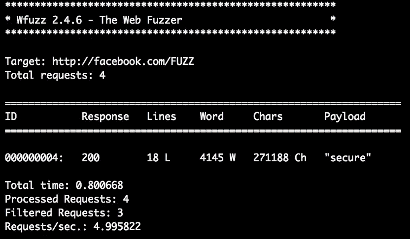
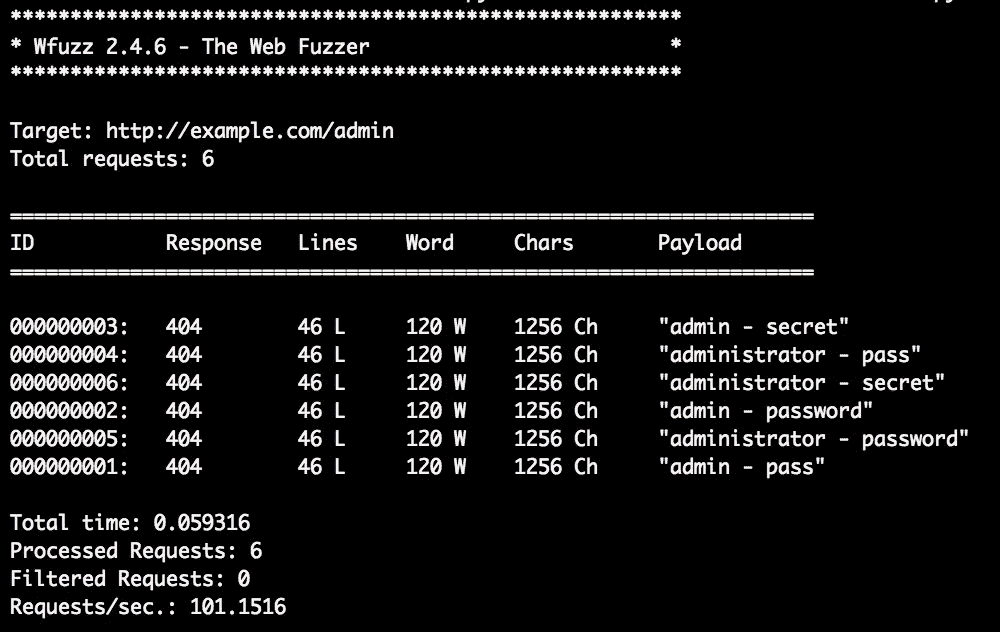
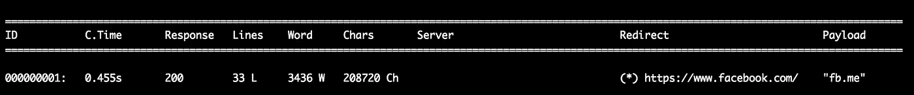

# 我们可以用 Wfuzz 自动化 Bug 奖金吗？

> 原文：<https://betterprogramming.pub/can-we-automate-earning-bug-bounties-with-wfuzz-c4e7a96810a5>

## 发现常见 web 漏洞的实用模糊测试


在 [Unsplash](https://unsplash.com?utm_source=medium&utm_medium=referral) 上由[迈克尔·泽兹奇](https://unsplash.com/@lazycreekimages?utm_source=medium&utm_medium=referral)拍摄的照片。

模糊化是一种使用自动化来查找 bug 的方法。它包括向应用程序提供大量无效和意外的数据，然后监视应用程序的异常。特别是，web 应用程序模糊化是模糊化 web 应用程序以暴露常见 web 漏洞的领域，如注入问题、XSS 等。

在之前的文章中，我已经讨论过 fuzzing 如何帮助您自动发现 XSS 和 SQL 注入。如果你还没有，请看看了解 fuzzing 的基础知识！

但是，如何有效地模糊 web 应用程序呢？你如何利用工具来实现你的目标？今天，我们将实际看看如何使用开源工具 [Wfuzz](https://wfuzz.readthedocs.io/en/latest/) 模糊最常见的 web 漏洞。

# Wfuzz 的基础知识

Wfuzz 是一个开源的 web 应用程序 fuzzer。您可以使用以下命令安装它:

```
$ pip install wfuzz
```

当提供了单词列表和端点时，Wfuzz 用单词列表中的字符串替换所有标记的位置。

[](https://github.com/xmendez/wfuzz) [## xmendez/wfuzz

### Wfuzz 的创建是为了促进 web 应用程序评估的任务，它基于一个简单的概念:it…

github.com](https://github.com/xmendez/wfuzz) 

注射点用 Wfuzz 中的字符串`FUZZ`标记。例如，这个 Wfuzz 命令将用`wordlist.txt`中的每个字符串替换 URL 中的`FUZZ`:

```
$ wfuzz -w wordlist.txt [http://example.com/**FUZZ**](http://example.com/FUZZ)These requests will be generated:
http://example.com/authorize.php
http://example.com/cron.php
http://example.com/administrator
http://example.com/secure
```

你能想到任何可以将 Wfuzz 的功能应用于 bug 奖励的场景吗？

# 路径枚举

首先，在搜索的 recon 阶段，您可以使用 Wfuzz 来枚举服务器上的文件路径。下面是一个可以用来枚举文件路径的命令示例:

```
$ wfuzz -w wordlist.txt -f output.txt --hc 404 --follow [http://example.com/**FUZZ**](http://example.com/FUZZ)
```

`-w`标志选项指定用于枚举的单词列表。在这种情况下，您应该选择一个好的路径枚举单词表，它是为您的目标使用的技术而设计的。SecLists 提供了一组您可以使用的单词列表:

[](https://github.com/danielmiessler/SecLists) [## 丹尼尔·米斯勒/塞克里斯特

### SecLists 是安全测试人员的伴侣。它是安全期间使用的多种类型列表的集合…

github.com](https://github.com/danielmiessler/SecLists) 

用于枚举和漏洞模糊化的另一个好的单词列表数据库是 FuzzDB:

[](https://github.com/fuzzdb-project/fuzzdb) [## fuzzdb-项目/fuzzdb

### 创建 FuzzDB 是为了增加通过动态…

github.com](https://github.com/fuzzdb-project/fuzzdb) 

`-f`标志指定输出文件的位置。`--hc 404`告诉 Wfuzz 排除任何状态代码为 404 的响应。使用这个过滤器，我们可以很容易地从结果列表中删除不指向有效文件或目录的 URL。`--follow`标志告诉 Wfuzz 遵循所有的 HTTP 重定向，以便我们的结果显示 URL 的实际目的地。

让我们使用一个简单的单词表来运行这个命令，看看我们能在脸书上找到什么。出于测试目的，我们将使用仅由四个单词组成的单词列表:

```
wordlist.txt has four lines:authorize.php
cron.php
administrator
secure
```

我们运行以下命令来枚举脸书上的路径:

```
wfuzz -w wordlist.txt -f output.txt --hc 404 --follow [http://facebook.com/FUZZ](http://facebook.com/FUZZ)
```

让我们看看结果吧！从左到右，Wfuzz 报告的列是 Wfuzz 请求的“请求 ID”、“HTTP 响应代码”、“行响应长度”、“字响应长度”、“字符响应长度”和“使用的有效负载”。



你可以看到结果只有一行。这是因为我们使用了响应代码过滤器来过滤掉不相关的结果！由于我们丢弃了所有的 404 响应，我们可以将注意力集中在指向实际路径的 URL 上。从结果中，我们可以看到`/secure`是脸书上的一条有效路径！

# 强力认证

在目标上找到一些有效的文件路径后，您可能会发现服务器上的一些页面受到了保护。大多数情况下，这些页面会有一个 403 响应代码。那你能做什么？

您可以尝试暴力破解页面上的身份验证！例如，有时页面使用基本身份验证方案作为访问控制。在这种情况下，您可以让 Wfuzz 通过使用`-H`标志来指定自定义头，从而模糊身份验证头。

```
$ wfuzz -w wordlist.txt -H "Authorization: Basic FUZZ" [http://example.com/admin](http://example.com/admin)
```

基本身份验证方案使用的凭据是 base64 编码的用户名-密码对字符串。例如，如果您的用户名和密码是“admin”和“password”，那么您的认证字符串将是`base64(“admin:password”)`，也就是`YWRtaW46cGFzc3dvcmQ=`。您可以使用脚本从常见的用户名-密码对生成认证密钥，然后使用 Wfuzz 将它们提供给目标的受保护页面。

另一种强力认证的方法是使用 Wfuzz 的`--basic`选项。给定用户名和密码的输入列表，该选项自动构造凭证以进行强力基本身份验证。在 Wfuzz 中，不同的注射点标有`FUZZ`、`FUZ2Z`、`FUZ3Z`等。它们将分别被传入的第一个、第二个和第三个单词列表模糊化。这里有一个命令可以用来同时模糊用户名和密码字段:

```
$ wfuzz -w usernames.txt -w passwords.txt --basic FUZZ:FUZ2Z [http://example.com/admin](http://example.com/admin)
```

`usernames.txt`包含两个用户名:“admin”和“administrator”而`passwords.txt`包含三个密码:“秘密”、“通行”和“密码”。您可以看到 Wfuzz 将为您列表中的每个用户名-密码组合发送一个请求。



使用暴力强制绕过身份验证的一些其他方法是关闭用户代理或伪造用于身份验证的自定义头。您可以通过使用 Wfuzz 暴力破解标头来完成所有这些任务！

# 测试常见的 Web 漏洞

最后，Wfuzz 可以帮助您自动测试常见的 web 漏洞。

首先，您可以使用 Wfuzz 模糊 URL 参数，并测试 IDOR 和 open redirect 之类的漏洞。您可以通过在 URL 中放置一个`FUZZ`关键字来模糊 URL 参数。例如，如果一个站点使用数字 ID 作为其聊天消息，您可以使用以下命令模糊 ID:

```
$ wfuzz -w wordlist.txt [http://example.com/view_message?message_id=FUZZ](http://example.com/view_message?message_id=FUZZ)
```

然后，通过检查响应的响应代码或内容长度来找到有效的 id，并查看是否可以访问其他人的消息。

您还可以使用不同的开放重定向负载来测试重定向参数:

```
$ wfuzz -w wordlist.txt [http://example.com?redirect=FUZZ](http://example.com?redirect=FUZZ)
```

要检查有效负载是否会导致重定向，您需要打开 Wfuzz 的 follow ( `—- follow`)和 verbose ( `-v`)选项。verbose 选项将显示在请求过程中是否发生了重定向。

```
$ wfuzz -w wordlist.txt -v [http://example.com?redirect=FUZZ](http://example.com?redirect=FUZZ)
```

例如，在这个请求中，您可以看到有效负载`fb.me`导致请求重定向到 facebook.com。看看你能否构建一个有效载荷，将用户重定向到你的网站！



您可以通过将 HTTP URL 参数或 POST 参数与通用负载列表混为一谈来测试诸如 XSS 和 SQL 注入之类的漏洞。在 Wfuzz 中，POST 主体数据由`-d`标志指定:

```
$ wfuzz -w xss.txt [http://example.com/get_user?user_id=FUZZ](http://example.com/get_user?user_id=FUZZ) (Tests for reflected XSS.)$ wfuzz -w sqli.txt -d "user_id=FUZZ" [http://example.com/get_user](http://example.com/get_user) (Tests for SQL injection.)
```

使用 Wfuzz 测试 XSS 时，创建一个脚本列表，将用户重定向到您的页面，并打开 Wfuzz 的 verbose 选项来监控任何重定向。或者，您可以使用 Wfuzz 内容过滤器来查找网页上反映的 XSS 有效负载，看看您是否成功了。`--filter`标志设置结果过滤器。一个特别有用的过滤器是`content~STRING`。它返回包含`STRING`的响应。

```
$ wfuzz -w xss.txt --filter "content~FUZZ" [http://example.com/get_user?user_id=FUZZ](http://example.com/get_user?user_id=FUZZ)
```

对于 SQL 注入漏洞，您可以使用预先制作的 SQL 注入词汇表，并监控每个有效负载的响应时间、响应代码或响应长度的异常情况。

# 关于 Wfuzz 的更多信息

Wfuzz 提供了许多更高级的选项、过滤器和定制功能。充分利用其潜力，Wfuzz 可以自动化工作流程中最繁琐的部分，并帮助您找到更多的 bug。要了解更多很酷的 Wfuzz 技巧，请阅读文档:

 [## Wfuzz:Web fuzzer—Wfuzz 2 . 1 . 4 文档

### Wfuzz 支持 Python 3。使用 Python 3 比使用 Python 2 更好(也更快)。

wfuzz.readthedocs.io](https://wfuzz.readthedocs.io/en/latest/index.html) 

感谢阅读！