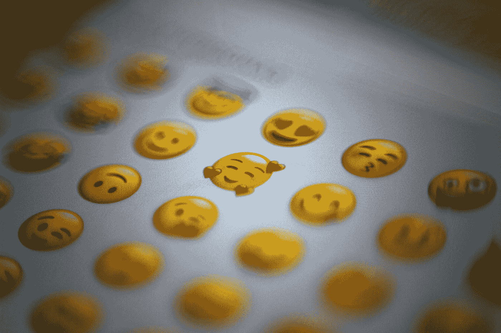

# 你能用表情符号风格在 Swift 中编码吗？

> 原文：<https://betterprogramming.pub/can-you-code-in-swift-using-emojis-style-2d187714f586>

## 表情符号驱动的开发是有用的编程范式吗？

照片由[多明戈阿尔瓦雷斯 E](https://unsplash.com/@domingoalvarze?utm_source=medium&utm_medium=referral) 在 [Unsplash](https://unsplash.com?utm_source=medium&utm_medium=referral) 上拍摄

对于那些不知道的人，现在，大多数现代编程语言都允许表情符号。`Swift`也是这种情况。

我最近花了更多的心思用这种新方法来提高我的工程技能，所以我试着用传统风格和新风格做了一个`Playground`。

这个简单的例子利用了`Strategy`模式，模拟了不同环境下的真实保存。

根据您的首选策略，您可以保存到`CoreData`、`UserPreferences`或`memory`。这里没什么特别的。

现在让我们混淆…对不起，我的意思是对*代码说*使用表情驱动风格的相同方法。

那是什么？新的表情符号驱动的发展？

[马太·亨利](https://unsplash.com/@matthewhenry?utm_source=medium&utm_medium=referral)在 [Unsplash](https://unsplash.com?utm_source=medium&utm_medium=referral) 上的照片

不管它看起来有多酷，调试这样的东西都是一场噩梦。

> 成为你想在世界上看到的改变！
> 
> 请避免使用表情符号驱动的开发！