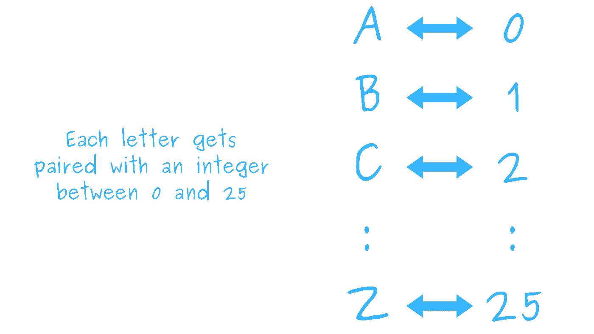
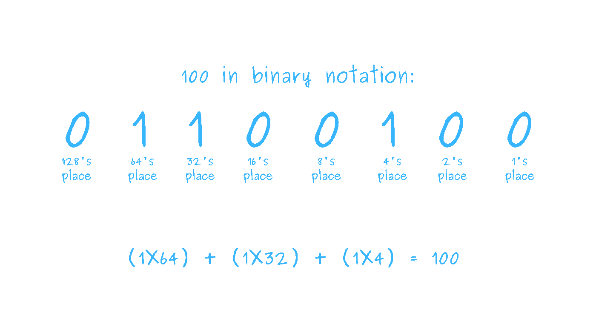
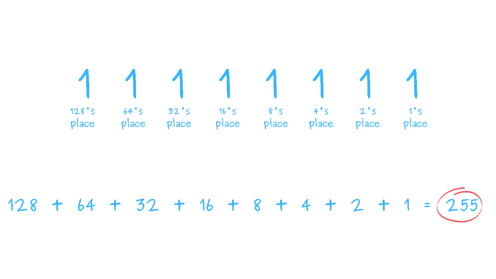

# 可以反转包含旗帜表情符号的 Python 字符串吗？

> 原文：<https://betterprogramming.pub/can-you-reverse-a-python-string-containing-a-flag-emoji-de3306b27c0e>

## 答案可能会让你吃惊

由 [Farzad Mohsenvand](https://unsplash.com/@farzadme?utm_source=medium&utm_medium=referral) 在 [Unsplash](https://unsplash.com?utm_source=medium&utm_medium=referral) 上拍摄的照片

你认为以下 Python 代码的输出是什么？

诸如此类的问题让我想立即打开 Python REPL，尝试一下代码，因为我认为我知道答案是什么，但我对这个答案不是很有信心。

以下是我第一次看到这个问题时的思路:

*   `flag`字符串包含一个字符。
*   `[::-1]`片反转`flag`串。
*   单字符字符串的反转与原字符串相同。
*   因此，`reversed_flag`必然是`”🇺🇸”`。

这是一个完全有效的论点。但是结论是真的吗？看一看:

这到底是怎么回事？

# `”🇺🇸”`真的包含单个字符吗？

当一个有效论点的结论为假时，它的前提之一*必然*也为假。让我们从头开始:

*`*flag*`*字符串包含单个字符。**

*是这样吗？你怎么知道一个字符串有多少个字符？*

*在 Python 中，可以使用内置的`len()`函数来获取字符串中的字符总数:*

*哦。*

*太奇怪了。你只能在字符串`”🇺🇸”`中*看到*一个单独的*东西*——也就是美国国旗——但是一个长度的`2`与`flag[::-1]`的结果相结合。由于`”🇺🇸”`的反义词是`”🇸🇺”`，这似乎暗示着不知何故`”🇺🇸” == “🇺 🇸”`。*

# *你怎么知道一个字符串中有哪些字符？*

*使用 Python 可以通过几种不同的方式查看字符串中的所有字符:*

*美国国旗表情符号并不是唯一包含两个字符的国旗表情符号:*

*然后是苏格兰国旗:*

*好的，*这是怎么回事？**

> ***挑战:**你能找到任何看起来像单个字符，但实际上包含两个或更多字符的非表情符号字符串吗？*

*关于这些例子令人不安的是，它们暗示你不能仅仅通过看你的屏幕来辨别字符串中的字符。*

*或者，也许更深一层，它让你质疑你对性格这个术语的理解。*

# *到底什么是角色？*

*计算机科学中的术语**人物**可能会令人困惑。它往往与单词**符号**混为一谈，公平地说，它是单词[字符的同义词，因为它在英语方言中使用](https://en.wikipedia.org/wiki/Character_(symbol))。*

*事实上，当我谷歌`character computer science`时，我得到的第一个结果是一篇 Technopedia 文章的链接，这篇文章将一个角色定义为:*

> *"[A]相当于一个字母或符号的信息显示单位."*
> 
> *——Technopedia，[“字符(Char)”](https://www.techopedia.com/definition/940/character-char)*

*这个定义似乎是错误的，特别是考虑到美国国旗的例子表明一个单一的符号可能由至少两个字符组成。*

*我得到的第二个谷歌结果是维基百科。在那篇文章中，角色的定义更加自由:*

> *"[一个]字符是一个信息单位，大致对应于一个 T11 字形 T12、字形单位或符号，例如自然语言书面形式中的字母表或音节表。"*
> 
> *—维基百科，[“字符(计算)”](https://en.wikipedia.org/wiki/Character_(computing))*

*嗯……在定义中使用“大致”这个词会让定义感觉，我应该说，*不确定*。*

*但维基百科的文章继续解释说，字符这个术语在历史上一直被用来“表示特定数量的连续位”*

*那么，一个关于一个只有一个符号的字符串如何包含两个或更多字符的问题的重要线索是:*

> *“如今，一个字符通常被认为是指 8 位(一个字节)……**所有的[符号]都可以用一个或多个 8 位代码单位来表示，这些代码单位就是 UTF-8** 。”*
> 
> *—维基百科，[“字符(计算)”](https://en.wikipedia.org/wiki/Character_(computing))*

*好吧！也许事情开始变得更有意义了。一个**字符**是*一个字节的信息*代表一个文本单元。我们在一个字符串中看到的**符号**可以由多个 8 位(1 字节) *UTF-8 码单元*组成。*

**字符*与*符号*不同。现在看来，一个符号可以由多个字符组成是合理的，就像国旗表情符号一样。*

*但是什么是 UTF 8 码单位呢？*

*在维基百科关于字符的文章中，有一个叫做*编码*的部分解释道:*

> *计算机和通信设备使用字符编码来表示字符，这种编码将每个字符分配给某种东西——通常由一系列数字表示的整数——可以存储或通过网络传输。常用编码的两个例子是 ASCII 和 Unicode 的 UTF-8 编码*
> 
> *—维基百科，[“字符(计算)”](https://en.wikipedia.org/wiki/Character_(computing))*

*还有一次提到 UTF-8！但是现在我需要知道什么是字符编码。*

# *到底什么是字符编码？*

*根据维基百科，一个**字符编码**给每个字符分配一个数字。那是什么意思？*

*不是说每个字符都可以和一个数字配对吗？所以，你可以这样做，把英文字母表中的每个大写字母和一个 0 到 25 的整数配对。*

**

*您可以使用 Python 中的元组来表示这种配对:*

*停下来问自己:*“我能创建一个像上面这样的元组列表，而不用显式地写出每一对吗？”**

*一种方法是使用 [Python 的](https://docs.python.org/3/library/functions.html#enumerate) `[enumerate()](https://docs.python.org/3/library/functions.html#enumerate)` [函数](https://docs.python.org/3/library/functions.html#enumerate)。`enumerate()`接受一个名为 *iterable* 的参数，并返回一个元组，该元组包含一个默认为 0 的计数和通过迭代 *iterable* 获得的值。*

*让我们来看看`enumerate()`的行动:*

*还有一种更简单的方法来制作所有的字母。*

*Python 的`[string](https://docs.python.org/3/library/string.html)` [模块](https://docs.python.org/3/library/string.html)有一个名为`ascii_uppercase`的变量，它指向一个包含英语字母表中所有大写字母的字符串:*

*好了，我们已经把字符和整数联系起来了。这意味着我们得到了一个字符编码！*

*但是，怎么用呢？*

*要将字符串`”PYTHON”`编码为整数序列，您需要一种方法来查找与每个字符相关的整数。但是，在元组列表中查找东西是困难的。也确实效率不高。(为什么？)*

*字典有助于查找资料。如果我们将`enumerated_letters`转换成一个字典，我们可以快速查找与一个整数相关的字母:*

*然而，要对字符串`”PYTHON”`进行编码，您需要能够查找与字符相关的整数。你需要的是`int_to_char`的反义词。*

*如何在 Python 字典中交换键和值？*

*一种方法是使用`reversed()`函数从`int_to_char`字典中反转键值对:*

*您可以编写一个[生成器表达式](https://docs.python.org/3/howto/functional.html#generator-expressions-and-list-comprehensions)来反转`int_to_char.items()`中的所有对，并使用该生成器表达式来填充一个字典:*

*你把每个字母和一个唯一的整数配对，这很好。否则，这种字典颠倒是不会起作用的。(为什么？)*

*现在您可以使用`char_to_int`字典和[列表理解](https://docs.python.org/3/howto/functional.html#generator-expressions-and-list-comprehensions)将字符串编码为整数列表:*

*您可以使用 Python 的 [string `.join()`方法](https://docs.python.org/3/library/stdtypes.html#str.join)在生成器表达式中使用`int_to_char`将整数列表转换为大写字符串:*

*但是，有一个问题。*

*您的编码不能处理包含标点符号、小写字母和空格的字符串:*

*解决这个问题的一种方法是使用包含所有小写字母、标点符号和空白字符的字符串创建编码。*

*但是，在 Python 中，几乎总是有更好的方法。Python 的`string`模块包含一个名为`printable`的变量，该变量给你一个包含一整串可打印字符的字符串:*

*如果您从头开始创建自己的字符串，您会包括所有这些字符吗？*

*现在您可以创建新的字典来编码和解码`string.printable`中的字符:*

*您可以使用这些字典来编码和解码更复杂的字符串:*

*您现在已经创建了两种不同的字符编码！而且他们*真的*不一样。看看使用两种编码解码同一个整数列表会发生什么:*

*差远了！*

*现在我们知道了一些关于字符编码的事情:*

*   *字符编码将字符与唯一的整数配对。*
*   *某些字符编码不包括其他字符编码中包含的字符。*
*   *两种不同的字符编码可以将相同的整数解码成两个不同的字符串。*

*这些和 UTF 八号有什么关系？*

# *什么是 UTF-8？*

*维基百科关于字符的文章提到了两种不同的字符编码:*

> *"常用编码的两个例子是 ASCII 和 Unicode 的 UTF-8 编码."*
> 
> *—维基百科，[“字符(计算)”](https://en.wikipedia.org/wiki/Character_(computing))*

*好的，所以 ASCII 和 UTF-8 是特定种类的字符编码。*

*根据维基百科关于 ASCII 的文章:*

> *“ASCII 是万维网上最常用的字符编码，直到 2007 年 12 月，UTF-8 编码超越了它；UTF-8 向后兼容 ASCII。”*
> 
> *—维基百科，[“ASCII”](https://en.wikipedia.org/wiki/ASCII#Use)*

*UTF 8 不仅仅是网络上占主导地位的字符编码。它也是 Linux 和 macOS 操作系统的主要字符编码，甚至是 Python 代码的[默认编码。](https://docs.python.org/3/howto/unicode.html#python-s-unicode-support)*

*事实上，您可以看到 UTF-8 如何在 Python string 对象上使用`[.encode()](https://docs.python.org/3/library/stdtypes.html#str.encode)` [方法](https://docs.python.org/3/library/stdtypes.html#str.encode)将字符编码为整数。但是`.encode()`不返回整数列表。相反，`encode()`返回一个`[bytes](https://docs.python.org/3/library/stdtypes.html#bytes-objects)` [对象](https://docs.python.org/3/library/stdtypes.html#bytes-objects):*

*Python 文档将`bytes`对象描述为“范围`0 <= x < 256`内不可变的整数序列”考虑到`encoded_string`对象显示的是字符串`“PYTHON”`中的字符而不是一堆整数，这看起来有点奇怪。*

*但是让我们接受这一点，看看我们是否能以某种方式梳理出整数。*

*Python 文档说`bytes`是一个“序列”，而 [Python 的词汇表](https://docs.python.org/3/glossary.html#term-sequence)将序列定义为“一个支持使用整数索引的高效元素访问的可迭代序列。”*

*因此，听起来您可以像索引 Python `list`对象一样索引`bytes`对象。让我们试一试:*

*啊哈！*

*当你把`encoded_string`转换成一个列表时会发生什么？*

*答对了。看起来 UTF-8 将字母`”P”`分配给整数`80`，`”Y”`分配给整数`89`，`”T”`分配给整数`84`，以此类推。*

*让我们看看当我们使用 UTF-8 编码字符串`”🇺🇸”`时会发生什么:*

*哼。你期望`”🇺🇸”`被编码成八个整数吗？*

*`”🇺🇸”`由两个字符组成，即`“🇺”`和`”🇸”`。让我们看看这些是如何编码的:*

*好吧，现在事情越来越有意义了。`“🇺”`和`”🇸”`都被编码为四个整数，对应于`“🇺”`的四个整数出现在对应于`”🇺🇸”`的整数列表的第一位，对应于`”🇸”`的四个整数出现在第二位。*

*不过，这提出了一个问题。*

# *为什么 UTF-8 将一些字符编码为四个整数，而将另一些字符编码为一个整数？*

*在 UTF 8 中，字符`“🇺”`被编码为四个整数的序列，而字符`”P”`被编码为单个整数。这是为什么呢？*

*在维基百科 UTF-8 文章的顶部有一个提示:*

> *“UTF-8 能够使用一到四个单字节(8 位)代码单元对 Unicode 中的所有 1，112，064 个有效字符代码点进行编码。具有较低数值的代码点往往出现得更频繁，使用较少的字节进行编码。*
> 
> *——维基百科，[“UTF-8”](https://en.wikipedia.org/wiki/UTF-8)*

*好的，这听起来像是 UTF-8 没有将字符编码为整数，而是作为一种叫做 Unicode 码位的东西。并且每个代码单元显然可以是一到四个字节。*

*现在我们需要回答几个问题:*

1.  *什么是字节？*
2.  *什么是 Unicode 码位？*

*byte 这个词已经出现了很多次，所以让我们给它一个合适的定义。*

*一个**位**是信息的最小单位。一个比特有两种状态，开或关，通常分别用整数`0`和`1`来表示。一个**字节**是一个八位序列。*

*您可以将字节解释为整数，方法是将它们的组成位视为用[二进制表示法](https://en.wikipedia.org/wiki/Binary_number)来表示一个数字。*

*第一次看到二进制符号时，它可能看起来很奇怪。不过，这很像你用来写数字的通常的十进制表示法。不同的是，每个数字只能是 0 或 1，数字中每一位的值都是 2 的幂，而不是 10 的幂:*

**

*因为一个字节包含八位，所以用一个字节表示的最大数是二进制的`11111111`或十进制的`255`。*

**

*每个字符使用一个字节的字符编码最多可以编码 256 个字符，因为最大 8 位整数是`255`，可能的值从`0`开始。*

*256 个字符可能足以编码英语中的所有内容。然而，它不可能处理全世界书面和电子交流中使用的所有字符和符号。*

*那你是做什么的？允许字符编码为多个字节似乎是一个合理的解决方案，这正是 UTF-8 所做的。*

*UTF-8 是 *Unicode 转换格式的首字母缩写——8 位*。又是 Unicode 这个词。*

*根据 Unicode 网站:*

> *“Unicode 为每个字符提供了一个唯一的编号，无论是什么平台、什么程序、什么语言。”*
> 
> *— Unicode 网站，[“Unicode 是什么？”](https://unicode.org/standard/WhatIsUnicode.html)*

*Unicode 是海量的。Unicode 的目标是为所有书面语言提供一个通用的表示。每个字符都被分配到一个 [**代码点**](https://en.wikipedia.org/wiki/Code_point)——一个带有一些附加组织的“整数”的花哨词——总共有 1112064 个可能的代码点。*

*不过，Unicode 码位实际上是如何编码的取决于。UTF-8 只是实现 Unicode 标准的一种字符编码。它将码位分成一至四个 8 位整数的组。*

*Unicode 还有其他编码方式。UTF-16 将 Unicode 码位分成一个或两个 16 位数字，并且是微软 Windows 使用的[默认编码。UTF-32 可以将每个 Unicode 码位编码为单个 32 位整数。](https://docs.microsoft.com/en-us/windows/win32/intl/unicode)*

*但是等等，UTF 8 使用一到四个字节将符号编码为代码点。那么，为什么🇺🇸符号用八个字节编码呢？*

*记住，两个角色组成了美国国旗表情符号:🇺和🇸.这些字符被称为区域指示符号。在 Unicode 标准中有 26 个区域指示器代表 A-Z 英文字母。它们被用来编码[ISO 3166-1 两个字母的国家代码](https://en.wikipedia.org/wiki/ISO_3166-1_alpha-2)。*

*以下是维基百科对地区指示符号的看法:*

> *“这些是在 2010 年 10 月定义的，作为 Unicode 6.0 对表情符号的支持的一部分，作为对每个国家国旗的单独字符进行编码的替代方法。虽然它们可以显示为罗马字母，但这意味着实现可以选择以其他方式显示它们，例如通过使用国旗。**[**Unicode FAQ**](https://www.unicode.org/faq/emoji_dingbats.html)**表示应该使用这种机制，国旗的符号不会被直接编码。*****
> 
> ***—维基百科，[“地区指示符号”](https://en.wikipedia.org/wiki/Regional_indicator_symbol#cite_note-3)***

***换句话说，Unicode 并不直接支持🇺🇸符号——实际上是任何国家国旗的符号。操作系统、网络浏览器和其他使用数字文本的地方，可以*选择*到*呈现*对区域指示符作为标志。***

***让我们来盘点一下到目前为止我们所知道的:***

*   ***通过字符编码，通常是 UTF-8，符号串被转换成整数序列。***
*   ***UTF-8 将一些字符编码为单个 8 位整数，而其他字符需要两个、三个或四个 8 位整数。***
*   ***一些符号，如国旗表情符号，不是直接用 Unicode 编码的。相反，它们是 Unicode 字符序列的呈现，可能被也可能不被每个平台支持。***

***那么，当你反转一个字符串时，会反转什么呢？在编码中，你是否颠倒了整数的整个序列，或者你是否颠倒了码位的顺序，或者其他什么？***

# ***你如何反转一个字符串呢？***

***你能想出一种方法用代码实验来回答这个问题，而不是试图去查找答案吗？***

***您之前已经看到，UTF-8 将字符串`”PYTHON”`编码为六个整数的序列:***

***如果对字符串`”PYTHON”`的反转进行编码会发生什么？***

***在这种情况下，列表中整数的顺序颠倒了。但是其他符号呢？***

***前面，您已经看到了`“🇺”`符号被编码为一个由四个整数组成的序列。当你对它的反转进行编码时会发生什么？***

***哼。两个列表中整数的顺序是相同的！***

***让我们试试用美国国旗反过来串:***

***整数的顺序没有颠倒！相反，代表🇺and 🇸get 的 Unicode 码位的四个整数组被交换了。每个码位中整数的顺序保持不变。***

# ***所有这些意味着什么？***

***这篇文章题目的答案是:是的！你*可以*用国旗表情符号反串。但是反转由多个码位组成的符号可能会产生令人惊讶的结果。尤其是如果您以前从未听说过字符编码和代码点之类的东西。***

***但是，像 Python 那样颠倒代码点的顺序是正确的方法吗？保持由多个码位完整表示的符号是否更有意义？答案是:看情况。至少据我所知，没有一种规范的方法来反转一个字符串。***

> *****挑战:**你将如何编写一个函数来反转一个字符串，同时保持编码为码点序列的符号不变？你能从头开始做吗？有没有用你的语言编写的软件包可以帮你做到这一点？那个包是怎么解决问题的？***

# ***为什么这些都很重要？***

***从这次调查中可以吸取一些重要的教训。***

***首先，如果您不知道使用了哪种字符编码来编码某些文本，您就不能保证解码后的文本准确地表示原始文本。***

***其次，尽管 UTF-8 被广泛采用，但仍有许多系统使用不同的字符编码。当从文件中读取文本时，请记住这一点，特别是当从不同的操作系统或跨国界共享时。要明确，并且总是指出使用哪种编码来编码或解码文本。***

***例如，Python 的`open()`函数[有一个](https://docs.python.org/3/library/functions.html#open) `[encoding](https://docs.python.org/3/library/functions.html#open)` [参数](https://docs.python.org/3/library/functions.html#open)，它指定在读取或写入文本到文件时使用的字符编码。好好利用它。***

# ***你从这里去哪里？***

***我们已经讨论了很多领域，但仍有许多问题没有得到解答。因此，写下你仍然存在的一些问题，并使用你在本文中看到的调查技术来尝试回答它们。***

> ***这篇文章的灵感来自于 Will McGugan 在 Twitter 上提出的一个问题。[看看威尔的帖子](https://twitter.com/willmcgugan/status/1484295045603897347)一大堆字符编码的疯狂。***

*****这里有一些你可能想探究的问题:*****

*   ***当您将`”🏴󠁧󠁢󠁳󠁣󠁴󠁿”`转换成一个列表时，您最终会得到一串以`”\U”`开头的字符串。这些字符串是什么，它们代表什么？***
*   ***`”🏴󠁧󠁢󠁳󠁣󠁴󠁿”`的 UTF-8 编码包含了多达 28 字节的信息。🏴󠁧󠁢󠁳󠁣󠁴󠁿和🇺🇸有什么不同？还有哪些标志被编码为 28 字节？***
*   ***有没有被编码成一个代码点的旗帜表情符号？***
*   ***当你反转🇦🇬时会发生什么？根据你对国旗表情符号的了解，你如何解释这种逆转？还有其他旗帜有类似的逆转吗？***
*   ***许多平台都支持彩色表情符号，比如竖起大拇指的表情符号，可以用不同的肤色渲染。不同颜色的相同符号是如何被编码的？***
*   ***如何检查包含表情符号的字符串是否是[回文](https://en.wikipedia.org/wiki/Palindrome)？***

***感谢阅读！保持好奇心！***

****订阅我的免费周刊* [*【好奇的代码】newslette*](https://davidamos.dev/curious-about-code-newsletter)[*r*](https://davidamos.dev/curious-about-code-newsletter)*每周五在你的收件箱里获取一剂引发好奇心的内容。****