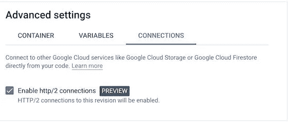

# 无法将大文件上传到部署在云运行中的服务？迁移到 http2！

> 原文：<https://betterprogramming.pub/cannot-upload-large-files-to-a-service-deployed-in-cloud-run-migrate-to-http2-16b5f1668224>

## Google Cloud Run 限制文件上传/下载，但 http2 的文件大小没有限制


照片由[西格蒙德](https://unsplash.com/@sigmund?utm_source=unsplash&utm_medium=referral&utm_content=creditCopyText)在 [Unsplash](https://unsplash.com/s/photos/upload?utm_source=unsplash&utm_medium=referral&utm_content=creditCopyText) 上拍摄

最近，我在使用部署在 Google Cloud Run 中的 API 端点上传大文件时遇到了麻烦。当我开始进一步调查时，令我惊讶的是，文件上传似乎仅限于 32 MiB，下载也是如此。


对于 HTTP/1 服务器，上传限制为 32 Mib

所以解决方案似乎很明显:迁移到 http2。除了绕过这个文件大小限制，使用 http2 协议还有另一个好处；它使信息的传递更加有效。我们将能够允许每个 TCP 连接建立多个资源线程(多路复用)，传输压缩数据并减少下载时间(头压缩)，可以发送关于最需要哪些资源的请求(资源优先级)，甚至可以在请求之前发送关键文件(服务器推送)。

好吧，那我们怎么做？取决于你如何编写你的 API。对我们来说，我们在 Python 服务中使用了`uvicorn`。截至本文撰写之时，它还不支持 http2，所以我们改用了 T1。解决方案很简单，用`hypercorn.run`替换`uvicorn.run`，只需将几个标志切换到`hypercorn`语法。

在 docker 文件中，它可能看起来像这样简单:

```
hypercorn gpt_backend.main:app — log-level debug — reload — bind 127.0.0.1:8091
```

那么，现在我们所要做的就是在云运行中部署它，它就会工作，对吗？唉，要是生活有那么简单就好了。

`hypercorn`要求`https`能够服务 http2 请求。否则，它将默认为 http1。云运行会自动终止 TLS，所以除非我们显式配置云运行来服务 http2 请求，`hypercorn`将会看到没有任何安全证书的请求并服务 http1。

我们如何做到这一点？转到您的云运行服务>创建和部署新版本，然后单击连接选项卡。选择复选框以启用 http2 连接。



在您的云运行服务上启用 http2 连接

现在，点击编辑和部署，工作就完成了？没那么快！

云运行的默认超时时间为五分钟。这项部署的服务将上传/下载大于 32 MiB 的文件，但前提是必须在五分钟内完成。

如果我们想上传更大的文件呢？我们将不得不增加我们的云运行服务的超时设置。

转到您的云运行服务>创建和部署新版本，然后单击容器选项卡。将最大文件大小的超时时间增加到 3600 秒，或者增加到适合您的使用情形的持续时间。


超时最长可达 3600 秒

这就是了。现在部署，你就可以在你的云运行服务上上传/下载大文件。然而，它仍然不是完全无限的。支持的大小将取决于超时和互联网速度。不过，还是比 32 MiB 强多了，对吧？

别忘了留下评论，获取更多有用的技巧/见解！