# iOS 15 swift ui 中的画布、颜色和混合

> 原文：<https://betterprogramming.pub/canvas-colour-and-blending-in-swiftui-with-ios-15-cbb2bf6bddc5>

## 看看新的画布视图以及新的形状、颜色和混合

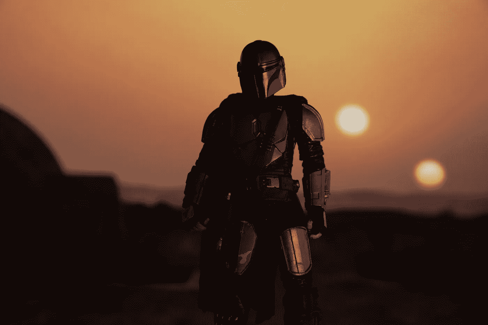

照片由[迈克尔·马莱](https://unsplash.com/@michael_marais?utm_source=unsplash&utm_medium=referral&utm_content=creditCopyText)在 [Unsplash](https://unsplash.com/s/photos/star-wars?utm_source=unsplash&utm_medium=referral&utm_content=creditCopyText) 上拍摄

在 20 世纪 70 年代中期，一个叫阿尔维·雷·史密斯三世的人共同发明了阿尔法通道的概念，并对施乐 PARC 公司的 HSV 色彩空间的创建做出了重大贡献。十年后，那个空间已经成为一个研究领域，两个人[托马斯·波特](https://en.wikipedia.org/wiki/Thomas_Porter_(Pixar))和[汤姆·达夫](https://en.wikipedia.org/wiki/Tom_Duff)做出了非常显著的贡献，他们在卢卡斯影业【星球大战名声】[一起工作，发展了波特-达夫作曲技术](https://en.wikipedia.org/wiki/Alpha_compositing)。

今天，混合颜色、改变它们的饱和度、亮度和色调是设计应用程序的一个重要方面。这不仅从吸引力/诱惑的角度来看是一个关键的方面，而且也是一个可及性的方面。

随着 SwiftUI 3.0 中 Canvas 的推出，颜色混合图像再次成为焦点。在 WWDC 关于这个主题的演讲中，我们被告知 Swift UI 中静态/标准颜色的数量增加了一倍多，因为它直接支持三种主要类型的颜色`CGColors`、`NSColor`和 UIColor。颜色是我去年夏天写的一个主题。你可以在下面阅读更多内容:

[](/colour-hue-saturation-and-brightness-24661bb809a3) [## 颜色、色调、饱和度和亮度

### 在 SwiftUI 中使用颜色

better 编程. pub](/colour-hue-saturation-and-brightness-24661bb809a3) 

但是等等。我不想过多地谈论颜色；这篇文章是关于混合的。混合使用标准模式和新的画布视图，以及一个使用 Port-Duff 模式的例子，它们有自己的混合模式。请和我一起浏览新的可用选项。

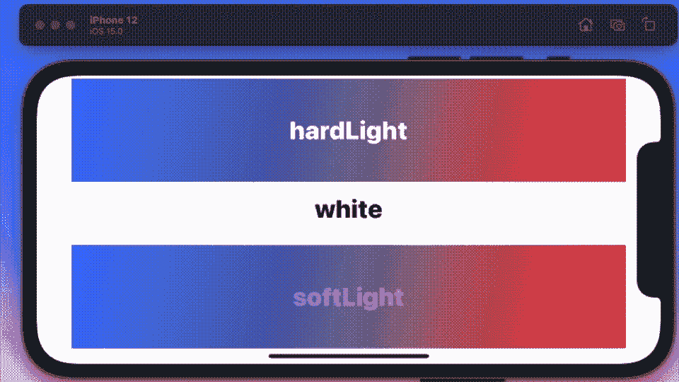

我先从两种绝对是一对的混合物开始。你现在看到的动画 GIF 是一个`TimelineView`,我在它的周围循环切换了大约 17 种文字的前景色，并把这些文字和从蓝色到红色的渐变混合在一起。下面是它运行的基本代码:

用`ContentView`如下图所示:

```
struct ContentView: View {
  var body: some View {
    BlendS()
      .foregroundColor(.white)
  }
}
```

接下来是另一对，这很有趣，因为它说明了一些组合就是不起作用。我很想给你一些规则，但不幸的是，这是一个试一试的情况。

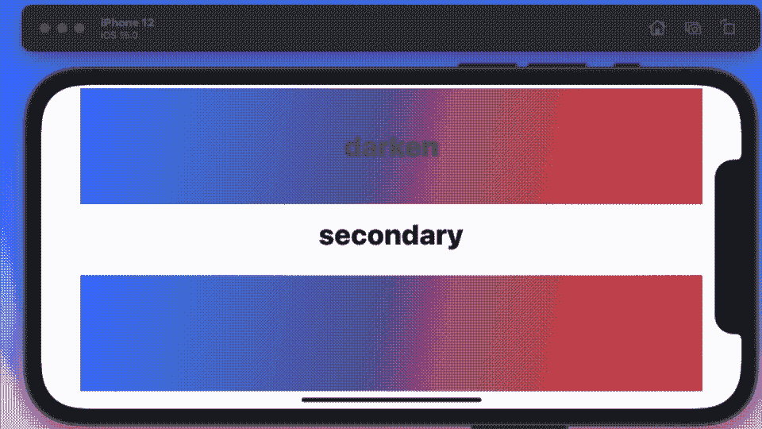

展示这一点的代码与已经展示的代码是相同的。现在一些滤镜的效果非常明显，所以我不打算用动画 gif 来展示它们，只是把它们列在这里。您得到了如下过滤器:

*   色彩
*   浸透
*   光度
*   常态

我要展示的下一对是`colorBurn`和`colorDodge`，如你所见，它们也适用于某些组合，但不适用于其他组合。


# 波特-达夫模式

现在谈谈波特-达夫混合模式，这几乎需要一篇独立的文章。这些过滤器将一些数学应用到图像的颜色，以获得完全不同的颜色和/或使重叠部分消失。

为了展示这些，我将使用带有两个圆圈的维恩图:白色背景上的橙色和蓝色圆圈。同样，我将使用`TimelineView`来循环选择选项。

但是在我向您展示结果之前，这里是生成它们的代码。注意:我最初没有使用任何过滤器，但在第二个图像上应用了过滤器来获得结果。

你可以看到下面所有的过滤器。你画的第一个圆被认为是目的地；第二是来源。

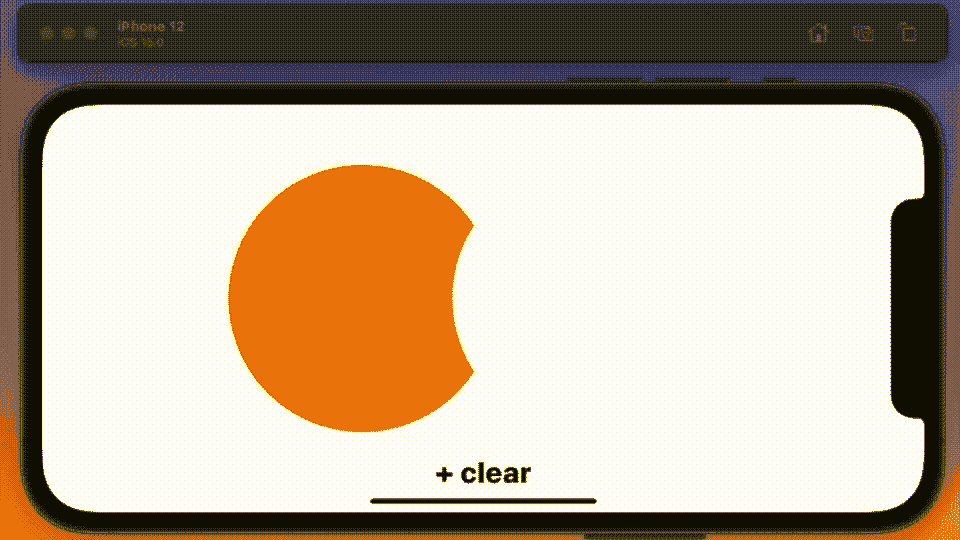

但是等等——事情没那么简单——因为你可以用同样形状的第二个滤镜来得到不同的结果。让我们再看一遍这些。

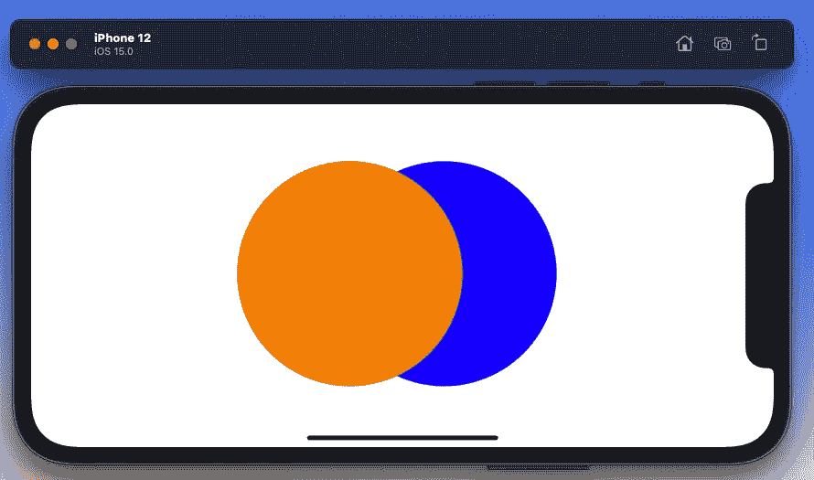

圆上没有滤镜。我们先画蓝色的。注意:如果你先画橙色，你会得到不同的结果。

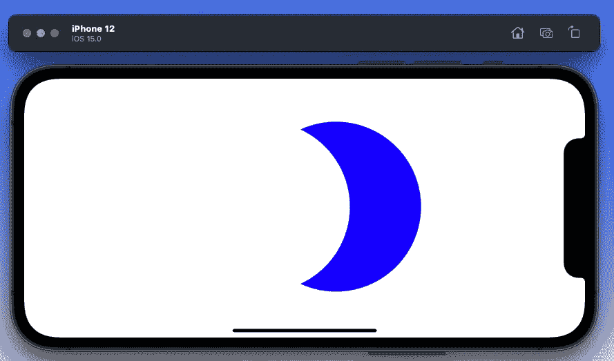

。第二个圆圈上的 destinationOut 过滤器[橙色]

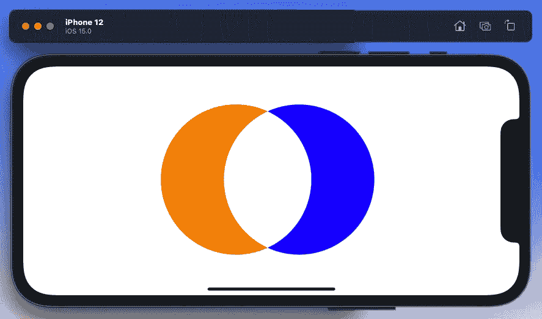

。sourceOut 或。第二个圆上的 xor 过滤器[橙色]

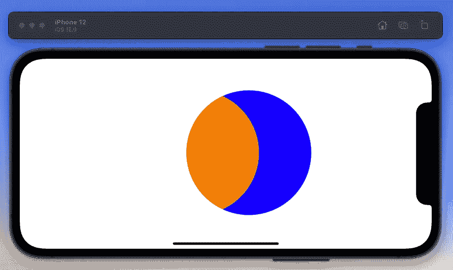

。sourceIn 或。第二个圆圈上的源顶部过滤器[橙色]


第二个圆圈上的目的地顶部过滤器[橙色]

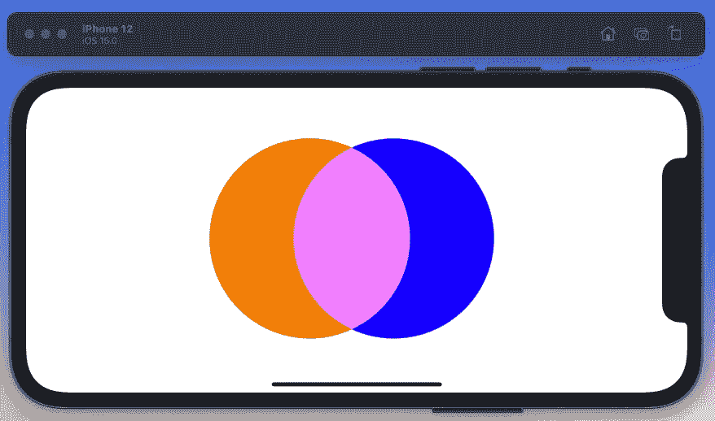

。第二个圆圈上的排除过滤器[橙色]

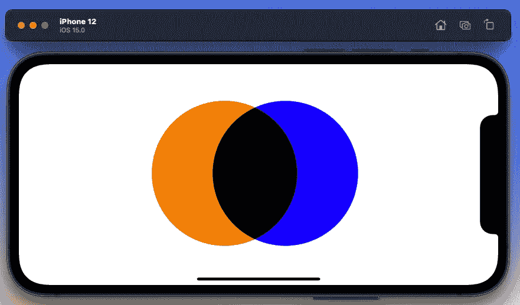

。第二个圆上的乘法滤镜[橙色]

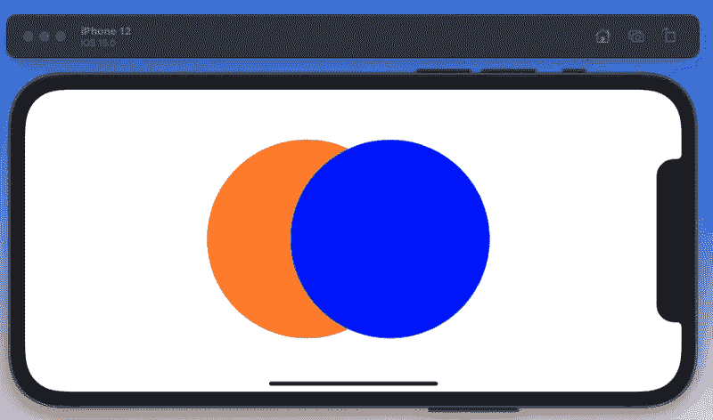

。第二个圆圈顶部的目的地[橙色]

## 不止一个过滤器

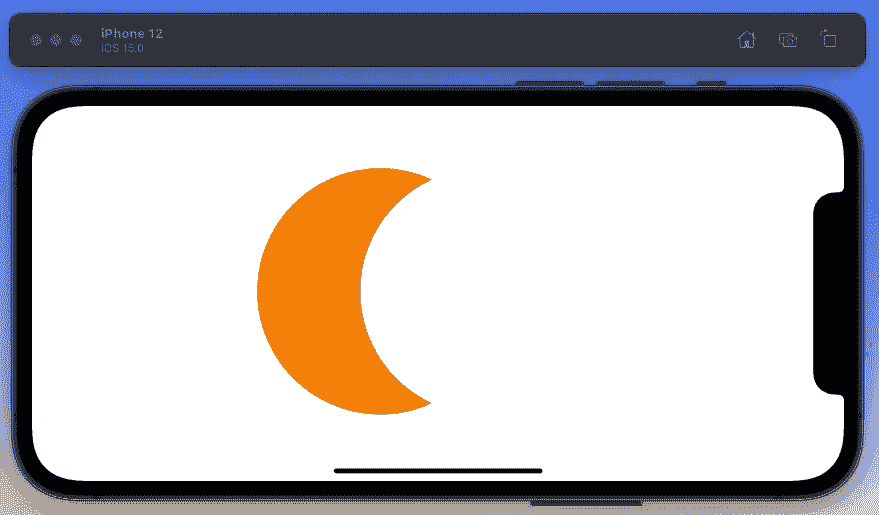

。橙色，然后第二个蓝色。清场还是。目的地输出


。橙色，然后第二个蓝色。异或运算

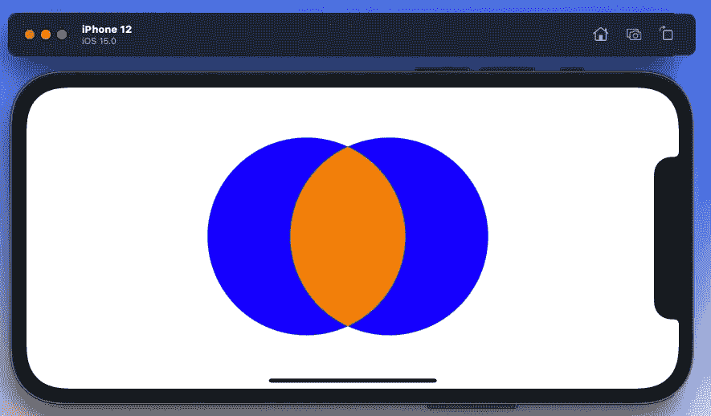

。橙色上的源顶部过滤器，然后第二个蓝色**但是**用。目的地过滤器

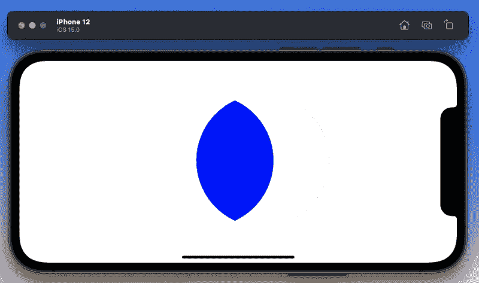

。目的地在橙色，然后第二个蓝色。外包

接下来，最有用的过滤器[组合]肯定是那些根据它们与其他部分的相互作用来帮助你删除图像部分的过滤器——所以，就像你在上面看到的蓝色形状。

现在你几乎拥有了所有你想要的东西，只有一个例外，我想请你弄清楚:你没有一只橙色的眼睛，就像上面显示的蓝色眼睛。你怎么能做这一套？

至此，我将结束这篇论文。花点时间玩玩过滤器，看看你能否回答我问的最后一个问题。

下面给出了实现这一点的代码。我已经改变了`rectA`和`rectB`，使它们在彼此的顶部对齐。

所有这些都让我想到了这篇文章的结尾。尝试一下过滤器，看看如何让它们为你服务。