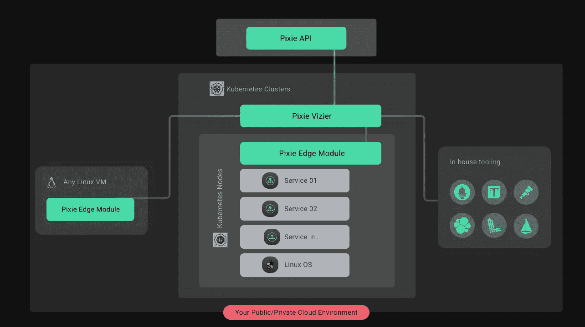
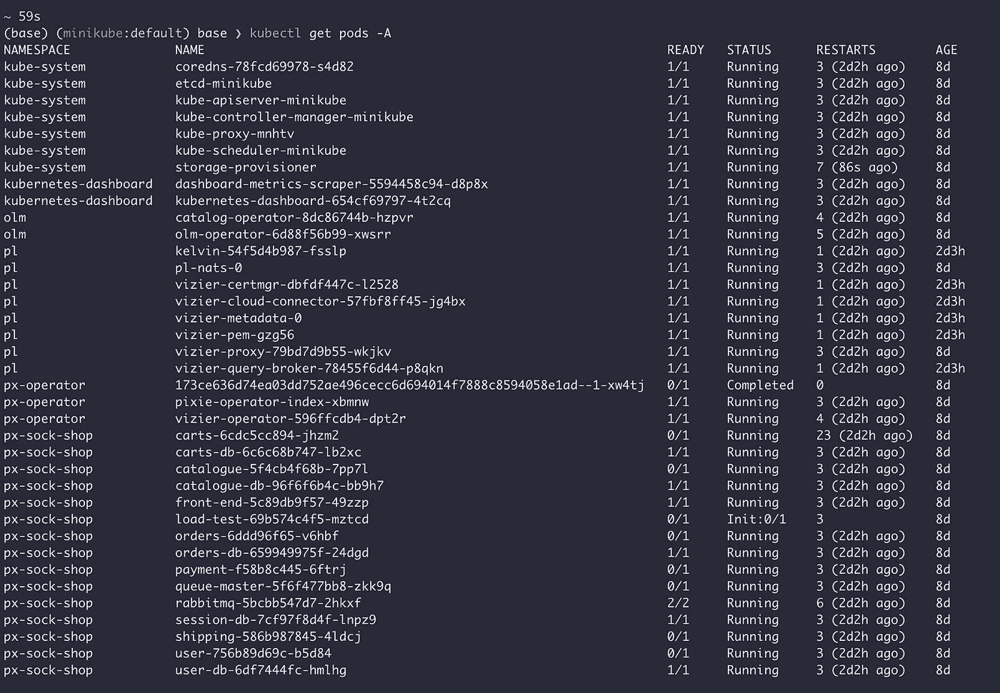
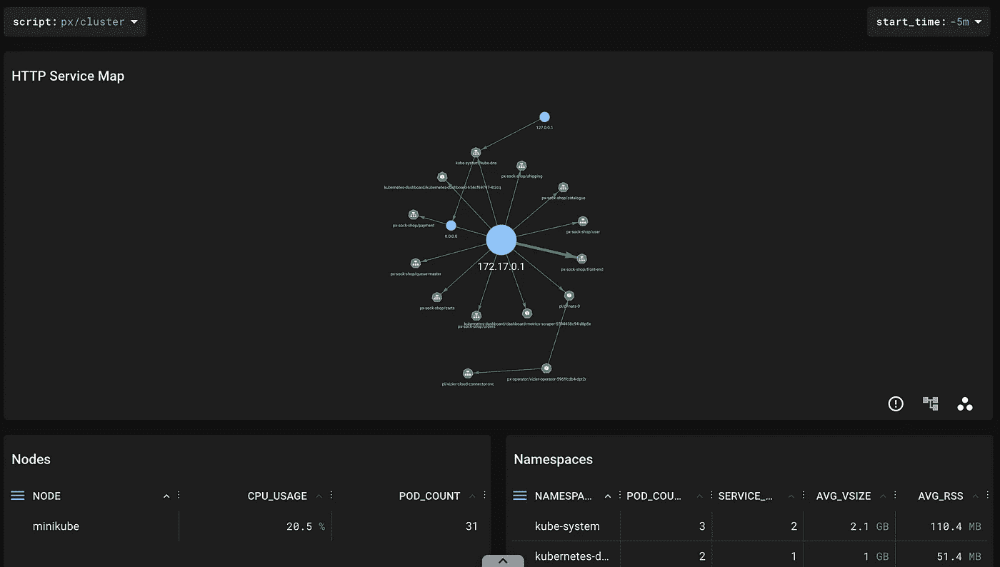
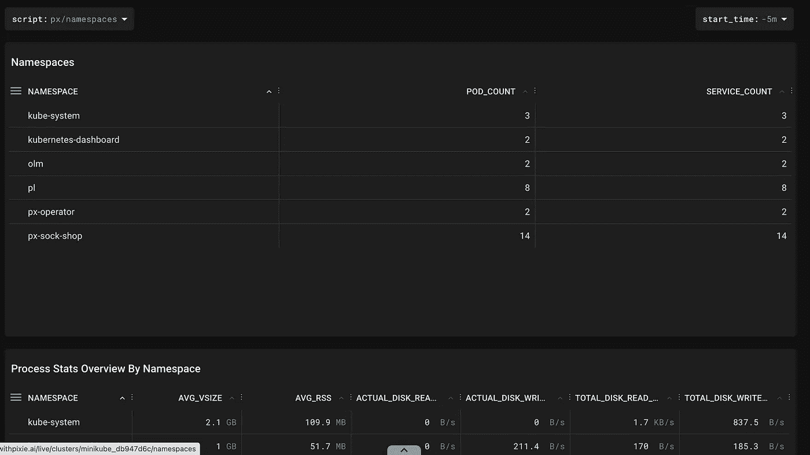
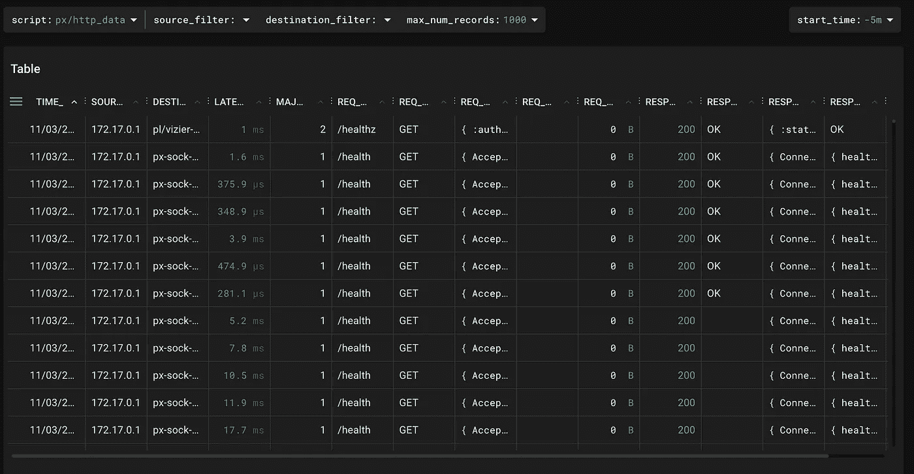

# 捕获和传输 Kubernetes 网络流量

> 原文：<https://betterprogramming.pub/capture-and-stream-kubernetes-network-traffic-9ab299974946>

## 新遗迹的最新成员，小精灵


来源: [Undraw](https://undraw.co/)

# 目标

跟踪 Kubernetes (k8s)集群上的网络流量，捕获请求-响应元组和相关元数据。将捕获的数据从群集中流出，以供进一步分析。

因为我们计划跟踪每个网络请求(OSI 第 7 层)，所以有一些考虑事项构成了我们需求的一部分。它们是:

# 考虑

*   轻量级→低内存和 CPU 占用很关键。
*   可扩展→在集群中添加和删除新节点，解决方案应相应扩展。
*   与语言和框架无关→容器可以用任意数量的语言和框架创建，这不会影响我们的跟踪。
*   快速→服务器中所有网络数据的规模将非常庞大。我们的解决方案必须能够在相当长的时间内跟踪并向我们报告数据。
*   舒适→在生产集群上部署时，用户应该感到舒适/安全/放心。
*   即插即用→降低入职时间和成本。没有代码更改来附加挂钩。

基于以上细节，我们选择了[小精灵](https://px.dev/)来完成这个任务。Pixie 是由 APM 领域的领导者之一 [New Relic](https://newrelic.com/) 构建的开源观测平台。

Pixie 是一个[云本地计算基金会](https://www.cncf.io/)项目，New Relic 使用它作为其 Kubernetes 可观测性，这一事实增加了项目的可信度。减轻了上述快速和舒适的考虑。

# Pixie 是什么？

用他们自己的话说:

> *“开源库为开发人员提供可观察性*
> 
> *自动仪表化。可脚本化。库伯内特土著。”*

对我们来说，这意味着轻松的部署、自定义数据点跟踪(如果需要)，以及对集群上的请求和响应的本地捕获。

## 那么，Pixie 是如何做到这一点的呢？它有什么特别之处？

Pixie 使用 eBPF 技术在内核级运行事件驱动脚本。绕过所有代码需求，使 Linux 内核成为其一等公民。

这使得 Pixie 与语言和框架无关，而且由于 eBPF 可以在任何运行 Linux 内核的系统上工作，Pixie 拥有广泛的安装基础。

***注意:*** *这也意味着 Pixie 不会在 Windows 服务器上运行，尽管在 Windows 服务器上运行的生产 k8s 集群的数量可能非常少。*

受支持的 Pixie 环境和集群类型的完整列表:[安装|要求](https://docs.px.dev/installing-pixie/requirements)。

[可选]关于 eBPF 技术的更多资源:

*   [什么是 eBPF，为什么它对可观察性很重要？](https://newrelic.com/blog/best-practices/what-is-ebpf)

网飞大学的 BPF 性能分析

## 但是，为什么是小精灵？它的优点是什么？

*   Pixie 的`Edge Module`部署在节点级别。因此，不管 pod 和运行的服务如何，每个节点只需要部署一个边缘模块。解决轻量级和可伸缩性问题。



k8s 集群上的 Pixie 部署。图片来自 [Pixie 的网站](https://docs.pixielabs.ai/about-pixie/what-is-pixie/#architecture)

*   Pixie 的部署和安装非常简单。一旦通过身份验证，只需要运行`px deploy`命令。地址即插即用。
*   一旦部署完毕，Pixie 就准备好报道`Network data`。不需要其他设置。
*   Pixie 提供了一个易于使用的 API(Python 和 Go 版本),用于通过互联网提取/获取/传输数据。它还支持数据的传输中 e2e 加密。

我们继续使用 Pixie，因为它解决了我们的大多数问题，同时提供了使开发更容易的附加特性。

在接下来的部分中，我们将讨论 pixie 特有的东西，例如:

*   装置
*   Pixie 跟踪哪些数据及其对集群的影响？
*   最后，使用 Pixie 的 API 将数据从集群中流出。

# 装置

安装 Pixie 非常简单，只需遵循几个步骤。Pixie 的文档:[Pixie 社区版的全面安装指南。](https://docs.px.dev/installing-pixie/install-guides/community-cloud-for-pixie/)

如果您已经有一个可用的 Kubernetes 集群，您可以跳过这一部分，直接进入 Pixie 的安装步骤。这里，我们将安装并运行一个`minikube`集群进行本地测试。

建立本地 Kubernetes 环境的步骤:

第一步:安装 [minikube](https://minikube.sigs.k8s.io/docs/start/) 。

步骤 2:增加配置的 CPU 和内存限制。这是必需的，因为我们将为请求模拟部署 Pixie 和微服务。

```
minikube config set cpus 4
minikube config set memory 8192
```

如果您已经安装并运行了`minikube`，那么您需要在您的更改生效之前执行`minikube delete`。

要检查更改是否正确发生，请运行以下命令。

```
minikube config get memory
# Output: 8192minikube config get cpus
# Output: 4
```

第三步:用`hyperkit`驱动器启动`minikube`。

```
minikube start --driver=hyperkit
```


作者图片

## **在集群上安装 Pixie 的步骤**:

步骤 Pixie 与集群交互的主要界面是它的 CLI。通过以下方式安装:

```
# Copy and run command to install the Pixie CLI.
bash -c "$(curl -fsSL [https://withpixie.ai/install.sh](https://withpixie.ai/install.sh))"
```

步骤 2: Pixie(也包括 CLI)需要一个帐户才能工作并通过集群的身份验证。要验证 Pixie CLI，请运行:

```
px auth login
```

第三步:一旦登录成功。在集群上部署 Pixie。

```
px deploy
```

这就是小精灵装置的✅。我们已经建立了一个集群，并在上面安装了 Pixie。但是，如果没有流量，我们就无法跟踪流量，所以我们部署了一个演示应用程序。[袜店织工](https://microservices-demo.github.io/)。

```
px demo deploy px-sock-shop
```

此命令完成后，要检查是否安装正确，请运行以下命令:

```
kubectl get pods -A
```



精灵+袜子店安装后的最终状态。图片作者。

仔细看，在 Init 状态下有一个`load-test-*` pod，正在模拟流量。

转到 Pixie 的 [Live UI](https://work.withpixie.ai/live) 查看它收集的所有指标:

一些示例视图:



集群级指标。图片作者。



名称空间。图片作者。

与我们最相关的:`http_data`。



HTTP 数据。图片作者。

# Pixie 跟踪哪些数据，它对集群有什么影响？

Pixie 预装了许多脚本，使各种跟踪更加容易— [关于 Pixie |数据源](https://docs.px.dev/about-pixie/data-sources/)

下面列出了有关其数据收集和对集群的影响的重要事项:

*   Pixie 将其收集的数据存储在集群节点的内存中；没有数据被发送到群集外的集中式后端。
*   Pixie 有一个[2gb 内存需求](https://docs.px.dev/installing-pixie/requirements/#memory)。安装 Pixie 后，看到内存使用暂时增加是正常的。
*   Pixie 存储多少数据？
    保留时间取决于集群中的流量水平，但通常为几个小时。Pixie 中的每个数据表(例如`http_events`)都有其最大大小。这些表收集数据，直到达到最大值，然后开始丢弃最旧的数据。
*   节点 CPU 使用率的典型性能开销在 2–5%之间，具体取决于流量的数量和类型。然而，我们正在对此进行优化，所以请注意它是否会进一步下降。

# 使用 Pixie 的 API 从集群流式传输数据

现在我们已经安装了 Pixie，它已经开始收集 HTTP 事件数据，我们的目标是将这些数据流式输出。

Pixie 提供了一个我们可以使用的 API。开始时，我们需要两个值:

*   集群 ID → [参考|管理|查找集群 ID](https://docs.px.dev/reference/admin/cluster-id/#find-the-cluster-id)
*   API 键→ [参考|管理| API 键](https://docs.px.dev/reference/admin/api-keys/#create-an-api-key)

一旦我们准备好这些值，我们就可以设置一个新的 Python 虚拟环境并在其中安装`pxapi`。

```
pip install pxapi
```

如果以上在 MacOS 上失败，请尝试:

```
GRPC_PYTHON_BUILD_SYSTEM_ZLIB=true pip install pxapi
```

脚本流`http_data`。

流 http _ 数据表

Pixie 提供了一个非常强大的 API 和框架来调试和观察部署在 Kubernetes 上的应用程序。这篇文章只是触及了 Pixie 的皮毛，以及它能为你的企业带来什么。

如需进一步阅读，请浏览:

*   [Pixie 文档](https://docs.px.dev/)、 [Pixie API](https://docs.px.dev/using-pixie/api-quick-start/) 和 [Pixie 架构](https://docs.pixielabs.ai/about-pixie/what-is-pixie/)
*   [什么是 eBPF，为什么它对可观察性很重要？](https://newrelic.com/blog/best-practices/what-is-ebpf)
*   [网飞 BPF 绩效分析](https://www.youtube.com/watch?v=16slh29iN1g)

如果您想了解问题陈述的后半部分，请告诉我:*构建一个流管道来处理大规模的网络数据*。

在那之前，保重。

```
**Want to connect?**Twitter: [https://twitter.com/piyush_daga5](https://twitter.com/piyush_daga5)
```