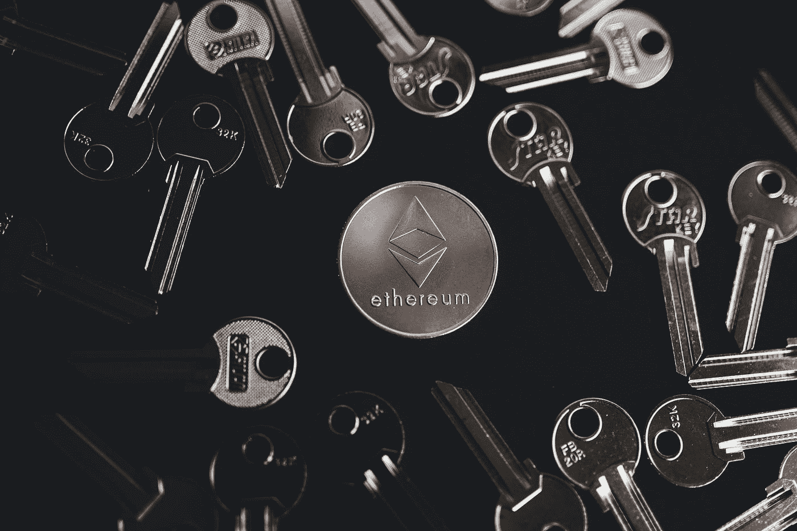
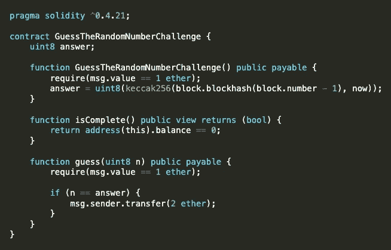
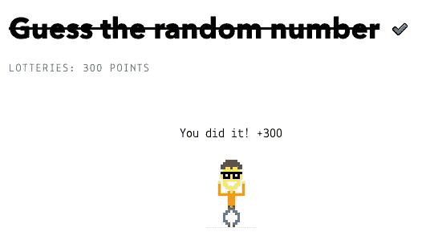

# 捕捉以太:猜测智能合约上的随机数

> 原文：<https://betterprogramming.pub/capture-the-ether-guess-the-random-number-2ebb8c9c0347>

## 送乙醚赚更多乙醚(如果答案正确)



[olieman.eth](https://unsplash.com/@moneyphotos?utm_source=medium&utm_medium=referral) 在 [Unsplash](https://unsplash.com?utm_source=medium&utm_medium=referral) 上拍摄的照片

在链上创建随机数是一项复杂的任务。事实上，有一些变通方法可以做到这一点，但一般来说，强烈建议离线完成，因为几乎每个可能用于熵的输入都是公开的和/或在某种程度上可以被操纵。

对我们来说幸运的是，这个挑战要求我们猜一个在链上创建的“随机”数字。这是怎么回事？



猜随机数挑战智能合约码

契约的第一行是一个 uint8 变量，`answer`。记住`uint8`变量包含多达 256 个可能的整数:0 到 255。

这个变量在构造函数中被分配给两个输入的`keccak256`哈希:包含我们正在部署的事务的前一个块的 block hash*(*`block.blockhash(block.number - 1)`，类型 bytes32)和我们的块被挖掘时的时间戳 *(* `now` *，类型 uint256)* 。

请记住，这个契约使用的是编译器版本`^0.4.21`，从那以后一些语法发生了变化:`block.blockhash()`现在是`blockhash()`，而`now`是`block.timestamp`。我们将在后面看到这一点。

正如我们在那一行中看到的，`keccak256`函数(一个 bytes32 固定大小的字节数组)然后被显式转换为 uint8 并赋给我们的变量。

所以，这看起来很随意，对吧？我们如何猜测一个 0 到 255 之间的数字，这个数字来自于对某个块的散列应用散列函数，以及谁知道什么时候的时间戳？！

实际上，很容易。请记住，区块链上的一切都是公开的。所以，让我们继续寻找我们需要的信息。

我们的目标在函数`guess`下，我们必须调用它并发送一个`uint8`加`1 ether`(我们已经在部署时发送了一个)，然后如果我们的`uint8`等于`answer`变量，契约将发送给我们 2 个醚，耗尽余额，因此`isComplete()`函数将返回`true`。

有多种方式与合同交互，但我决定通过另一个合同来实现。这不是最简单的方法，在这种情况下，甚至没有必要，但肯定是我们可以利用更多的方法。

这是我为解决这一挑战而编写的代码:

```
// SPDX-License-Identifier: No License
pragma solidity ^0.8.0;interface IGuessTheRandomNumberChallenge {
  function guess(uint8) external payable;
}contract GuessTheRandomNumberSolver { IGuessTheRandomNumberChallenge public _interface;
  bytes32 public previousBlockHash = 0x66bcdb5e320c9e0c04a9fdeaa15de33a4c8a040db342f4f955fa54f170dba9ce;
  uint public previousTimestamp = 1641520092; constructor(address _interfaceAddress) {
    require(_interfaceAddress != address(0), "Address can not be Zero");
    _interface = IGuessTheRandomNumberChallenge(_interfaceAddress);
  } function solve() public payable {
    uint8 answer = uint8(uint256(keccak256(abi.encodePacked(previousBlockHash, previousTimestamp))));
    _interface.guess{value: 1 ether}(answer);
  } function getBalance() public view returns(uint){
    return address(this).balance;
  } function withdraw() public {
    payable(msg.sender).transfer(address(this).balance);
  } receive() external payable {}
}
```

在编译器版本之后，你首先看到的是一个[接口](https://docs.soliditylang.org/en/v0.8.10/contracts.html#interfaces)。我们可以使用这些通过我们的代码与其他契约进行交互。它基本上是一个带有一些规则的更简单的契约:

*   它们不能从其他协定继承，但可以从其他接口继承。
*   所有声明的函数都必须是外部的。
*   它们不能声明构造函数。
*   它们不能声明状态变量。
*   它们不能声明修饰符。

因为我们只需要调用*‘guess’*函数，这是我们在接口中声明的唯一一个函数。

然后，在我们的`GuessTheRandomNumberSolver`契约中，我们将声明一个`_interface`变量，并通过我们的构造函数分配挑战的地址(在 CTE 部署它时获得的地址)。

这就是我们现在在部署的挑战中调用函数所需要的全部内容，所以让我们继续收集信息来重新创建与它一起部署的`random`号。

这些都可以在`[etherscan](https://ropsten.etherscan.io/)`中找到，我们只需要找到我们挑战的地址。

`Blockhash(block.number - 1)`:要获取此信息，请转到*内部事务*选项卡，点击同一行上的模块编号，显示*合同创建。*在我的例子中，阻塞是`#11766860` *:*


现在，我们可以看到关于该模块的许多信息，但我们需要访问上一个模块，所以请继续查找。我的情况是`#11766859`。

下面下来我们可以看到`hash` *。那是我们需要的第一条信息。*

`Block.timestamp` ***:*** 回到我们的块，你会在第二行看到*时间戳*。但是等等，这是人类可读的格式，我们需要它的格式是 [*Unix 时间戳*](https://en.wikipedia.org/wiki/Unix_time) 。那是什么？基本上就是从 1970 年 1 月 1 日开始过去的秒数。这是测量时间的标准方式。在写作的时候，这是一个 10 位数。

为了将这个*人类可读的*时间戳转换成 *Unix 时间*，我使用了一个非常方便的网站，名为`[epochconverter](https://www.epochconverter.com/)`。有了这个数字，我们终于有了最后一块拼图，我们可以打电话来解决挑战。

回到`GuessTheRandomNumberSolver`契约，让我们创建一个`solve` 函数，我们将调用它来联系我们的挑战契约。

出于可读性的目的，我还创建了两个新变量:

*   `bytes32 public previousBlockHash`
*   `uint public previousTimestamp.`

创建它们，但是给它们分配*你的*挑战值。

然后，在我们的`solve` 函数中，我们将创建`uint8 answer`变量并为其赋值:

```
uint8(uint256(keccak256(abi.encodePacked(previousBlockHash, previousTimestamp))))
```

语法和格式的变化是因为我们使用的是编译器版本`^0.8.0`，而挑战使用的是版本`^0.4.21`。

既然我们已经将答案赋给了变量，我们只需要通过接口调用挑战。这就是下一行要做的:

```
_interface.guess{value: 1 ether}(answer)
```

我假设您正在使用 remix，那么继续，通过 *Injected Web3* 环境连接您的 metamask wallet，并部署您的契约，指定您的挑战地址以分配给您的接口。

现在，用`value` 中的 *1 乙醚*输入继续并调用`guess` 功能。

我增加了几个功能:

*   `getBalance()`
*   `withdraw()`
*   `receive()`

这是因为挑战的`msg.sender`将是我们的`GuessTheRandomNumberSolver`合同，而不是我们的 EOA——所以我们需要接收 2 个以太，并能够将它们发送到我们的 EOA。



在下一篇文章中，我们将解决“猜测新数字”的挑战。