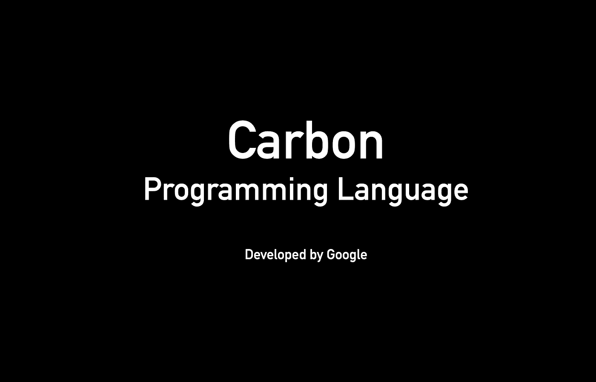
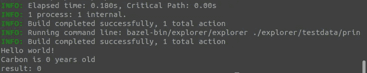
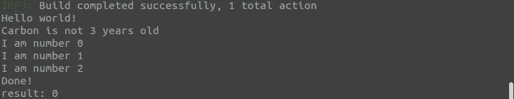

# 学习谷歌的碳编程语言——教程

> 原文：<https://betterprogramming.pub/carbon-programming-language-tutorial-6d67b4cc16ae>

## 了解开始使用的语法



作者图片

根据谷歌开发者 Chandler Carruth 的说法，Carbon 可以作为 C++的后继语言。

[文档](https://github.com/carbon-language/carbon-lang#why-build-carbon)宣称 Carbon“*是围绕与 C++的互操作性以及现有 C++代码库和开发人员*的大规模采用和迁移而设计的。

本文将提供 Carbon 编程语言的实用编码介绍，但不会讨论为什么有人可能需要它。

# 入门指南

这个入门包括两个部分:工具和语言基础。

如果你已经安装了 Carbon，可以直接跳到语言基础，否则就从工具开始。

在工具部分，我们将讨论以下内容来设置我们的环境:

1.  公司自产自用
2.  巴泽尔
3.  LLVM
4.  克隆碳语言
5.  运行浏览器

你可以在[入门](https://github.com/carbon-language/carbon-lang#getting-started)中找到相同的方法。

在这里，我将为第一次接触这种语言和工具的人添加一些上下文和简短的解释。

安装完成后，我们将继续学习语言基础部分的一些实际例子。

# 碳语言:工具


卢卡斯·桑托斯在 Unsplash 的照片

## **1。自制**

[家酿](https://brew.sh/)是一个软件包管理器，可能已经安装在你的电脑上了。运行`brew --version`来检查您是否已经拥有它。

如果不是这样，你可以[在 macOS、Linux、Windows 上安装 Homebrew](http://how-to-install-homebrew-on-mac-linux-windows) (通过 WSL)。

## **2。巴泽尔**

Bazel 是一个开源的构建和测试工具，支持多语言和多平台项目。

根据[文档](https://github.com/carbon-language/carbon-lang/blob/trunk/docs/project/contribution_tools.md#bazel-and-bazelisk)， *Bazel 是 Carbon 的标准建造系统。建议使用 Bazelisk 安装 Bazel* 。

运行以下命令来安装 Bazel:

```
brew install bazelisk
```

## **3。LLVM**

你可以把 [LLVM](https://llvm.org/) 看成一个低级虚拟机，但是“LLVM 和传统虚拟机关系不大”。LLVM 用于编译和链接 Carbon，作为其构建的一部分。

运行以下命令安装 LLVM:

```
brew install llvm
```

请注意，在 macOS(不是 Linux)上，您应该运行以下命令来[更新](https://github.com/carbon-language/carbon-lang/blob/trunk/docs/project/contribution_tools.md#clang-and-llvm) `[PATH](https://github.com/carbon-language/carbon-lang/blob/trunk/docs/project/contribution_tools.md#clang-and-llvm)`:

```
export PATH="$(brew --prefix llvm)/bin:${PATH}"
```

## 4.克隆碳语言

从适当的文件夹中运行以下命令。

他们会在本地克隆并下载 Carbon 语言代码。

```
$ git clone [https://github.com/carbon-language/carbon-lang](https://github.com/carbon-language/carbon-lang)
$ cd carbon-lang
```

## 5.运行浏览器

最后，我们准备好构建和运行浏览器。

以下代码运行 Bazel 构建工具，从而触发浏览器代码:

```
$ bazel run //explorer -- ./explorer/testdata/print/format_only.carbon
```

浏览器在指定位置运行文件中的实际代码: `./explorer/testdata/print/format_only.carbon`

扩展名`.carbon`是让解释器知道文件包含 carbon 语言所必需的。

最终，您应该得到一个如下所示的漂亮的“Hello World”。


使用 Carbon 编程语言打印“Hello World”

# 碳语言:语言基础


照片由 [Diomari Madulara](https://unsplash.com/@diomari?utm_source=medium&utm_medium=referral) 在 [Unsplash](https://unsplash.com?utm_source=medium&utm_medium=referral) 上拍摄

如果你熟悉 C、C++和类似的语言，你也会熟悉 Carbon 语法。

碳仍然是实验性的，有些事情可能会改变。[文件](https://github.com/carbon-language/carbon-lang#carbon-language--an-experimental-successor-to-c)本身声明“注意，碳还没有准备好使用”。然而，一些设计原则不太可能改变。

让我们从查看`format_only.carbon`中的代码开始

```
package ExplorerTest api;fn Main() -> i32 {
  var s: auto = "Hello world!";
  Print(s);
  return 0;
}
```

*   `package`关键字声明包。
    该文件构成默认库。
*   `fn`介绍者关键字声明函数。代码`fn Main() -> i32 {...}`声明了一个名为 Main 的函数。`Main()`的返回类型为`i32`，即整数。Main 返回零。
*   关键字`var`引入了一个变量声明。
    在上面的代码中，`s`是变量的名称，后面是冒号`:`，以及类型。`auto`用于自动推断变量类型。
*   可以使用关键字`let`来声明常量。
    虽然这可能会让来自 JavaScript 的开发人员感到困惑，但对于来自 Swift 的开发人员来说，这将会很顺利。
*   最后可以通过加两个斜线`//`来添加评论

这个简单的文件给了我们一个关于 Carbon 语法的很好的概述。

让我们添加一些其他的片段。

## 基本类型和值

在 Carbon 中，我们可以有以下原语:

*   **布尔型。**它有两个可能的值:真和假。
*   **整数。**碳考虑有符号和无符号整数。
    有符号整数可以是 i8、i16、i32、i64、i128 或 i256。无符号整数可以是 u8、u16、u32、u64、u128 和 u256。
*   **浮动。**可以使用 f16、f32、f64 和 f128。
*   **字符串。**一个字节序列。可以在字符串的开头和结尾使用双引号(")将字符串文字写在一行中。比如《榜样》。多行(或块字符串)文字以三个双引号(" ")开始和结束。可以通过在前面加上反斜杠(\)来使用转义序列。

## 函数参数和返回类型

让我们扩展代码以包含另一个函数:

```
package ExplorerTest api;// Return type is empty/void
fn AgeLogger(var age: i32) {
    Print("Carbon is {0} years old", age);
}fn Main() -> i32 {
  var s: auto = "Hello world!";
  Print(s);
  AgeLogger(0);
  return 0;
}
```

`AgeLogger`函数接受一个名为`age`的变量参数，类型为 i32。

然而，由于`AgeLogger`不返回任何东西，我们可以简单地跳过返回类型。



Carbon 编程语言中函数的返回

因此，一般来说，碳函数的语法是:

```
fn FunctionName(var param: type, ...) -> return type { ... }
```

当返回为空或 void 时，可以忽略返回类型。

## 控制流:If/Else

如果你是来自 C++或者很多其他语言，这并不是什么新鲜事。

据报道，“if 和 else 提供语句的条件执行”。

让我们将这一部分添加到示例中:

```
fn AgeLogger(var age: i32) {
  if(age == 0){
   Print("Carbon is {0} years old", age);
  } else {
   Print("Carbon is not {0} years old", age);
  }  
}
```

通过添加一些简单的控制流，语句块被有条件地执行。否则，语句块将按顺序执行。

## 控制流:While 循环

当表达式为真时，循环继续。

我将在`AgeLogger`函数中的 if/else 语句之后包含下面这段代码。

```
var x: i32 = 0;
while (not (x == 3)) {
    Print("I am number {0}", x);
    x = x + 1;
}
Print("Done!");
```

我应该提到，在我的例子中，我既不能使用`while(x < 3)`也不能使用`++x`。在这两种情况下，我都会得到一个错误，尽管在[文档](https://github.com/carbon-language/carbon-lang/tree/trunk/docs/design#while)中提出了该语法。

我当时还不明白为什么！所以，如果你想通了，可以随意把原因加到评论里让大家知道。

无论如何，结果是:



在 Carbon 中使用 While 循环

## 控制流:For 循环

根据文档，`for`语句支持基于范围的循环。所提供的示例非常普通:

```
for (var name: String in names) {
  Console.Print(name);
}
```

但是我不能让它工作:

```
var names: [String;3] = ("str1", "str2", "str3");
  for (var name: String in names) {
    Print(name);
  }
```

在尝试上面的代码时，我一直得到“语法错误，意外的 VAR”，我无法理解关键字`var`应该在那里！

不幸的是，我在任何地方都找不到一个可行的例子。

## 控制流:匹配

再说一次，如果你是从 C 或 C+来的，这将是熟悉的。

`match`根据 case 声明检查表达式的值。在下面的示例中，值 2 与 case 声明相匹配，并返回字符串“Matching two”。

```
fn TheMatcher() -> String {
  Print("I am here");
  var x: i32 = 2;
  match (x) {
    case (0) => {
      return "Matching zero";
    }
    case (1) => {
      return "Matching one";
    }
    case (2) => {
      return "Matching two";
    }
    default => {
      return "Matching none";
    }
  }
}
```

最后一个模块是可选的`default`模块。`default`块可以添加在案例声明之后，如果没有案例声明匹配，它将被执行。

在控制流的范围内，值得一提的是`break`和`continue`。简单来说:

*   `break`立即结束循环，碳“*将从循环范围*的末端开始继续。
*   `continue`立即进入下一个循环。

## 复合类型

在签出复合类型之前，我创建了一个名为`composite_types.carbon`的新文件，其中包含了从现在开始的所有代码。

下面是新代码:

```
package ExplorerTest api;fn Main() -> i32 {
  var s: auto = "Hello composite types!";
  Print(s);
  return 0;
}
```

我将把它作为一张白纸来尝试复合类型。


Jan Kahánek 在 [Unsplash](https://unsplash.com?utm_source=medium&utm_medium=referral) 上拍摄的照片

[元组](https://github.com/carbon-language/carbon-lang/tree/trunk/docs/design#tuples):元组是固定大小的值的集合，有时称为坐标，可以有不同的类型。可以通过使用它们的位置来访问值。
以下代码在打印值 ad index 和 3 之前，将元组`(0, 1, 2, "omega")`分配给`x`。

```
fn UseTuples() {
  var x: (i32, i32, i32, String) = (0, 1, 2, "omega");
  Print("At index 2: {0}", x[2]);
  Print(x[3]);
}// output: 
At index 2: 2
omega
```

[结构类型](https://github.com/carbon-language/carbon-lang/tree/trunk/docs/design#struct-types):结构类型允许通过名称来标识成员，而不是使用它们的索引或位置。

*   结构类型示例:`{.name: String, .count: i32}`
*   结构值示例:`{.name = "John", .count = 4}`

```
fn UseStruct() {
  var data: auto = {.x_var = 3, .b_var = 2, .m_slope = 7};
  var y: i32 = data.m_slope * data.x_var + data.b_var;
  Print("y: {0}", y);
}// output: 
y: 23
```

[指针类型](https://github.com/carbon-language/carbon-lang/tree/trunk/docs/design#pointer-types):和 C 和 C++中一样，指针是一个变量，存储对象的内存地址。Carbon 提供了两种指针操作:

*   解引用:给定一个指针 p，*p 给出 p 指向的值作为 l 值。
*   Address-of:给定一个 l 值 x，`&x`返回一个指向 x 的指针。Carbon 中没有空指针。

```
fn Pointers() {
  var x: i32 = 0;
  Print("Initial x: {0}", x);

  x = 10;  // changes x to 10
  Print("x is now {0}", x);

  var y: i32* = &x;  // returns pointer to x

  *y = 5;  // changes x to 5
  Print("x is now {0}", x);
  Print("y = {0}", *y);}// output:
Initial x: 0
x is now 10
x is now 5
y = 5
```

*   [**数组和切片**](https://github.com/carbon-language/carbon-lang/tree/trunk/docs/design#arrays-and-slices) :碳数组类型的通用语法是`[type, number of values]`。
    下面的代码将类型和值赋给一个包含四个整数的数组。

```
var array: [i32; 4] = (0, 1, 2, 3);// It is possible to omit the number of values 
// when the size of the array can be inferred
var array: [i32;] = (0, 1, 2, 3);// access elements using square brakets
Print(array[0]);
```

## 班级

使用类来定义数据结构是可能的。

在类名前使用`class`关键字来定义一个类。

示例类名为`Widget`，包含三个字段，在字段名称前使用`var`关键字声明。

您还需要声明每个字段的类型。

```
class Widget {
  var x: i32;
  var y: i32;
  var payload: String;
}
```

类还可以包含函数、方法、别名、常量和嵌套类。

以下示例扩展为添加一个返回两个整数字段之和的函数。

```
class Widget {
  var x: i32;
  var y: i32;
  var payload: String;

  fn Sum[me: Self]() -> i32 {
      var total: i32 = me.x + me.y;
      return total;
  }
}
```

首先，我扩展了这个类以包含一个 sum 函数。该函数将字段`x`的值与字段`y`的值相加，并返回总和。

然后，我更新了`Main()`如下:

```
fn Main() -> i32 {
  var coolWidget: Widget = {.x = 6, .y = 7, .payload = "load"};
  var total: i32 = coolWidget.Sum();
  Print("Total sum {0}" , total);
  return 0;
}// output:
Total sum 13
```

## 无商标消费品

和其他语言一样，泛型“允许用编译时参数编写像函数和类这样的碳结构”。

通常，`T`用于定义一个可以是任何类型的泛型。

官方文档提供了一个很好的例子。

首先，我们有一个`Min`函数。该函数有一个类型参数`T`，它可以是实现`Ordered`接口的任何类型。

```
fn Min[T:! Ordered](x: T, y: T) -> T {
  return if x <= y then x else y;
}
```

然后，他们给变量`a`和`b`赋值。假设两个变量都是`i32`类型，`T`被推导为`i32`。

```
var a: i32 = 1;
var b: i32 = 2;
Assert(Min(a, b) == 1);
```

同样，将字符串值赋给`a`和`b`会使`T`成为类型字符串。

```
var a: String = "abc";
var b: String = "xyz";
Assert(Min(a , b) == "abc");
```

请注意，在我的例子中，我在解析像`<=`这样的字符时遇到了问题。然而，一个更通用的测试，我们只把值传递给 print 就可以了。

```
fn TestGenerics[T:! Type](x: T) -> T {
  return x;
}// output:
i32: 0
String
```

# 结论

鉴于我遇到的几次打嗝，可以肯定地说“注意，碳还没有准备好使用”。这与[文件](https://github.com/carbon-language/carbon-lang#carbon-language--an-experimental-successor-to-c)中声明的内容一致。

尽管有这些东西，玩一玩并测试一下还是很有趣的。这是特别有趣的，因为它是新的，仍然未经探索。

希望你也有同感！

为了保持这篇文章是一个介绍，我不得不省略部分。

例如:

*   整数文字和下划线，浮点类型，`StringView`。
*   Carbon 编译器的行为取决于构建模式。Carbon 有三种构建模式:*开发、性能、硬化。* 一些编程错误将取决于构建模式。文档中对此进行了说明。
*   其他人

如果你需要这种程度的细节，我强烈推荐阅读文档中的[语言设计](https://github.com/carbon-language/carbon-lang/tree/trunk/docs/design#language-design)页面。

如果你想知道更多关于为什么 Carbon 会成为 C++在某些狭窄领域的继承者，请阅读我在 Carbon 语言背后的要点。

期待听到大家的意见！

[](https://medium.com/@lorenzozar/membership) [## 通过我的推荐链接加入 Medium-Lorenzo Zarantonello

### 如果这个有价值，直接支持我！我的文章大多是免费的。考虑成为会员以示支持…

medium.com](https://medium.com/@lorenzozar/membership)